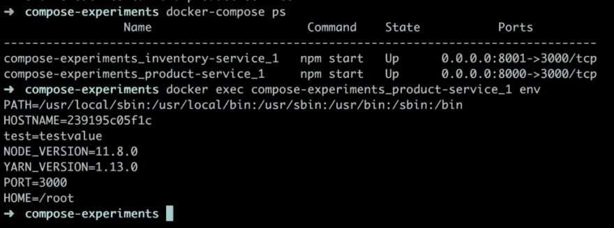
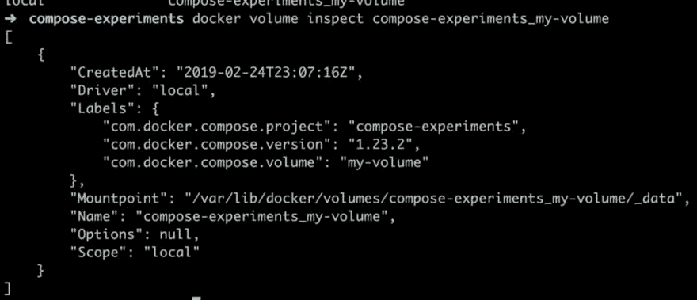
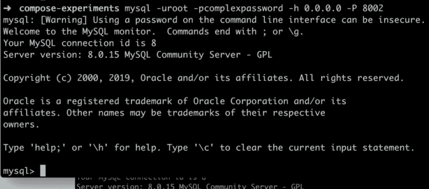

# 学习 Docker —从头开始，第五部分 Docker 构成、变量、卷、网络和数据库

> 原文：<https://dev.to/azure/dockerfrom-the-beginning-part-v-n2c>

在 [Twitter](https://twitter.com/chris_noring) 上关注我，很乐意接受您对主题或改进的建议/Chris

本文是系列文章的一部分:

*   从一开始，第一部分，这包括:为什么是 Docker，它是如何工作的，并包括一些基本概念，如图像，容器和 Docker 文件的用法。它还介绍了一些关于如何管理上述概念的基本 Docker 命令。
*   [Docker -从一开始，第二部分](https://dev.to/softchris/docker-from-the-beginning---part-ii-5g8n)，这是关于学习卷，它们是什么，它们如何为你工作，主要是它们将如何创建一个惊人的开发环境
*   从一开始，第三部分，这部分是关于理解如何在一个容器化的环境中使用数据库，在这样做的时候，我们需要学习链接和网络
*   从第四部分开始，这部分介绍了 Docker Compose，我们了解了如何管理大量的容器，以及为什么 Docker Compose 比简单的 Docker 命令更好用
*   Docker -从头开始，第五部分，我们在这里

我们将继续我们在第四部分中介绍的项目，这样我们将展示更多的 Docker Compose 特性，并从本质上构建我们的项目，以涵盖您可能需要的一切。

在这一部分，我们将涵盖:

*   环境变量，现在我们已经在前面的部分中讨论过了，所以这主要是关于我们如何在 Docker Compose 中设置它们
*   Volumes ，Volumes 也是如此，这在以前的文章中已经讨论过了，尽管我们会提到它们的用法以及如何使用 Docker Compose
*   **网络和数据库**，最后，我们将讨论数据库和网络，这部分有点复杂，但希望我们能彻底解释清楚

如果你在任何时候感到困惑，这里是本文所基于的回购:

> [https://github . com/soft Chris/docker-compose 实验](https://github.com/softchris/docker-compose-experiments)

## 资源

使用 Docker 和容器化就是将一个整体分割成多个微服务。在整个系列中，我们将学习掌握 Docker 及其所有命令。迟早您会想要将您的容器带到生产环境中。这个环境通常是云。当你觉得你已经有了足够的 Docker 经验时，看看这些链接，看看 Docker 是如何在云中使用的:

*   [云中的容器](https://docs.microsoft.com/en-gb/azure/containers/?wt.mc_id=academic-0000-chnoring)这是一个很棒的概述页面，展示了关于云中容器的其他信息
*   [在云中部署您的容器](https://docs.microsoft.com/en-gb/azure/container-instances/container-instances-tutorial-prepare-app?wt.mc_id=academic-0000-chnoring)教程展示了利用您现有的 Docker 技能并让您的服务在云中运行是多么容易
*   [创建容器注册表](https://docs.microsoft.com/en-gb/azure/container-instances/container-instances-tutorial-prepare-acr?wt.mc_id=academic-0000-chnoring)您的 Docker 映像可以在 Docker Hub 中，也可以在云中的容器注册表中。将您的图像存储在某个地方，并能够在几分钟内从该注册表创建一个服务，这不是很棒吗？

## 环境变量

在以前的文章中，我已经向您展示了我们如何指定环境变量。现在变量可以在`Dockerfile`中设置，但是我们可以明确地在命令行中设置它们，因此也可以在 Docker Compose 中设置，特别是在`docker-compose.yaml` :
中

```
// docker-compose.yaml

version: '3'
services:
 product-service:
   build:
     context: ./product-service
   ports:
     - "8000:3000"
   environment:  
     - test=testvalue 
 inventory-service:
   build:
     context: ./inventory-service
   ports:
   - "8001:3000" 
```

Enter fullscreen mode Exit fullscreen mode

上面我们通过定义 environment 后跟`-test=testvalue`来创建一个环境变量，这意味着我们用值`testvalue`创建变量 test。

我们可以通过读取产品服务目录的 app.js 文件中的 process.env.test 来轻松测试这一点。

另一种测试方法是运行 Docker compose 并查询有哪些环境变量可用，如下所示:

[](https://res.cloudinary.com/practicaldev/image/fetch/s--UbqzThm9--/c_limit%2Cf_auto%2Cfl_progressive%2Cq_auto%2Cw_880/https://cdn-images-1.medium.com/max/1024/1%2ArOSUR7zhFT4SqO2-Hx4TBw.png)

正如你在上面看到的，我们首先运行 docker-compose ps 并获取作为 docker 合成会话一部分的容器，然后我们运行`docker exec [container name] env`列出环境变量。第三种选择是运行`docker exec -it [container name] bash`并进入容器，使用 bash 回显变量值。用 Docker compose 管理环境变量有很多方法，所以看看[官方文档](https://docs.docker.com/compose/environment-variables/)，你还能做什么。

## 卷

我们已经在本系列的前一部分介绍了几卷，我们发现它们是一种很好的方式:

*   **创建一个持久空间**，这是创建日志文件或数据库输出的理想选择，一旦我们拆除并运行了我们的容器，我们希望保留这些文件或输出
*   **将我们的开发环境转变为一个卷**，这样做的好处是我们可以启动一个容器，然后更改我们的代码，并看到这些更改得到反映，而不必重新构建或拆除我们的容器，这是一个真正的时间节省器。

### 创造一个持久的空间

让我们看看如何在 Docker compose 中处理卷:

```
// docker-compose.yml

version: '3.3'
services:
 product-service:
   build:
     context: ./product-service
   ports:
     - "8000:3000"
   environment:
     - test=testvalue
 inventory-service:
   build:
     context: ./inventory-service
   ports:
     - "8001:3000"
  volumes:  
    - my-volume:/var/lib/data

volumes:  
  my-volume: 
```

Enter fullscreen mode Exit fullscreen mode

上面我们在文件的末尾用 volumes 命令创建了一个卷，在第二行我们给它命名为`my-volume`。此外，在文件的 inventory-service 部分，我们引用了刚刚创建的卷，并创建了到`/var/lib/data`的映射，它是卷中的一个目录，将在拆卸过程中被持久化。让我们看看它是否被正确映射:

[](https://res.cloudinary.com/practicaldev/image/fetch/s--RzF3NB8w--/c_limit%2Cf_auto%2Cfl_progressive%2Cq_auto%2Cw_880/https://cdn-images-1.medium.com/max/1024/1%2A4twcO-Lrvw-3B3l0bjHGoA.png)

可以看到，通过上面的命令，我们首先输入带有`docker exec`的容器，然后导航到我们的映射目录，它就在那里，很好:)。

让我们在数据目录中创建一个文件，这样我们就可以证明我们的卷映射确实有效:

> echo persist > persist.log

上面的命令创建了一个内容为 persist 的文件`persist.log`。没什么特别的，但它确实创建了一个文件，我们可以在拆除并重启我们的容器后寻找它。

现在我们可以离开集装箱了。接下来，让我们回顾一些有用的音量命令:

> ls 卷坞站

[](https://res.cloudinary.com/practicaldev/image/fetch/s--X9QxCEm_--/c_limit%2Cf_auto%2Cfl_progressive%2Cq_auto%2Cw_880/https://cdn-images-1.medium.com/max/1024/1%2AXDWyoIcwjNWcQjzCEM0FaQ.png)

上面列出了所有当前挂载的卷。我们可以看到，我们创建的卷位于 compose-experiments_my-volume。

我们可以深入了解更多细节:

> docker 卷检查撰写-实验 _ 我的卷

[](https://res.cloudinary.com/practicaldev/image/fetch/s--ZVt96GW1--/c_limit%2Cf_auto%2Cfl_progressive%2Cq_auto%2Cw_880/https://cdn-images-1.medium.com/max/1024/1%2AHXrFVqZwjwkkjTfEN3oNCQ.png)

好了，它给了我们一些关于卷的细节，比如`Mountpoint`，当我们写入容器中的卷映射目录时，文件将保存在这里。

现在让我们把集装箱放下来:

> 坞站-拨号

这意味着该卷应该还在，所以让我们用下面的代码将它们全部显示出来:

> 坞站-合成 up -d

接下来让我们进入容器，看看 persist.log 文件是否在那里:

[](https://res.cloudinary.com/practicaldev/image/fetch/s--bsrbV7wV--/c_limit%2Cf_auto%2Cfl_progressive%2Cq_auto%2Cw_880/https://cdn-images-1.medium.com/max/1024/1%2AdSGfuvU53coEhcMPhbw9oQ.png)

哦，是的，它的工作。

### 把你当前的目录变成一个卷

好的，为此我们需要添加一个新卷，我们需要指出我们计算机上的一个目录和容器中应该同步的一个位置。您的`docker-compose.yaml`文件应该如下所示:

```
// docker-compose.yaml

version: '3.3'
services:
  product-service:
    build:
      context: ./product-service
    ports:
      - "8000:3000"
    environment:
      - test=testvalue
    volumes:  
      - type: bind  
      source: ./product-service  
      target: /app  
  inventory-service:
    build:
      context: ./inventory-service
    ports:
      - "8001:3000"
    volumes:
      - my-volume:/var/lib/data

volumes:
  my-volume: 
```

Enter fullscreen mode Exit fullscreen mode

新添加的内容被添加到`product-service`中。我们可以看到，我们正在指定一个带有一个条目的 volumes 命令。让我们来分解这个条目:

*   **type: bind** ，这将创建一个所谓的 [*bind mount*](https://docs.docker.com/storage/bind-mounts/) ，一种更适合在本地目录和容器之间同步文件的卷
*   **来源**，这就是你的文件所在的地方，正如你所看到的我们指出的`./product-service`。这意味着，只要我们更改了该目录下的文件，Docker 就会发现它。
*   **目标**，这是容器中的目录，源和目标现在将同步我们在源中进行更改，目标也会发生相同的更改

## 网络和数据库

好了，这是我们打算在本文中讨论的最后一部分。让我们从数据库开始。各大厂商都有一个 Docker 镜像，像 Sql Server，Postgres，MySQL 等等。这意味着我们不需要执行构建步骤来启动和运行它们，但是我们确实需要设置环境变量之类的东西，当然还要打开端口，以便我们可以与它们进行交互。让我们看看如何将 MySQL 数据库添加到我们的解决方案中，这就是我们的`docker-compose.yml`文件。

### 添加数据库

向`docker-compose.yaml`添加一个数据库就是添加一个已经预先制作好的图像。幸运的是 MySQL 已经提供了一个现成的。要添加它，我们只需要在 services 下添加另一个条目:就像这样:

```
// docker-compose.yaml

product-db:
  image: mysql
  environment:
    - MYSQL_ROOT_PASSWORD=complexpassword
  ports:
    - 8002:3306 
```

Enter fullscreen mode Exit fullscreen mode

让我们来分解一下:

*   `product-db`是我们新服务条目的名称，我们选择这个名称
*   `image`是一个新命令，我们使用它来代替 build，我们在映像已经构建好的情况下使用它，这对大多数数据库来说都是正确的
*   大多数数据库需要设置一定数量的变量，以便能够连接到它们，如用户名、密码和潜在的数据库名称，这因数据库类型而异。在这种情况下，我们设置 MYSQL_ROOT_PASSWORD，这样我们就可以指示 MYSQL 实例 ROOT 用户的密码是什么。我们应该考虑创建一些具有不同访问级别的用户
*   端口，这暴露了将要打开的端口，因此这是我们与数据库对话的入口。通过键入`8002:3306`，我们说容器的端口`3306`应该被映射到外部端口`8002`

让我们看看能否让数据库和其他服务正常运行:

> 坞站-合成 up -d

[](https://res.cloudinary.com/practicaldev/image/fetch/s--eFdotX2S--/c_limit%2Cf_auto%2Cfl_progressive%2Cq_auto%2Cw_880/https://cdn-images-1.medium.com/max/1024/1%2ATRzocCrQzt2dzD7BowtXFw.png)

我们来验证一下:

> 坞站-复合 ps 或 ps 坞站

[](https://res.cloudinary.com/practicaldev/image/fetch/s--7CJ0kLS8--/c_limit%2Cf_auto%2Cfl_progressive%2Cq_auto%2Cw_880/https://cdn-images-1.medium.com/max/1024/1%2Amv-p4iFB2sUx3YD80FWa7w.png)

看起来，很好，我们的数据库服务`experiments_product-db_1`似乎已经启动并运行在端口`8002`上。接下来看看能否连接到数据库。下面的命令将连接我们到数据库，手指交叉；)

```
mysql -uroot -pcomplexpassword -h 0.0.0.0 -P 8002 
```

Enter fullscreen mode Exit fullscreen mode

[](https://res.cloudinary.com/practicaldev/image/fetch/s--R3ioYPFj--/c_limit%2Cf_auto%2Cfl_progressive%2Cq_66%2Cw_880/https://cdn-images-1.medium.com/max/498/1%2A2_db0xR6z_9mcYLLsi-u3w.gif)

获胜者是…

[](https://res.cloudinary.com/practicaldev/image/fetch/s--INec_ZaD--/c_limit%2Cf_auto%2Cfl_progressive%2Cq_auto%2Cw_880/https://cdn-images-1.medium.com/max/1024/1%2AddxwWglQQqg2q1v4Cnt5UA.png)

太好了，我们做到了。接下来，让我们看看是否可以更新我们的一个服务来连接到数据库。

### 连接数据库

我们可以通过三种主要方式连接到数据库:

*   使用 docker 客户端，我们已经用`mysql -uroot -pcomplexpassword -h 0.0.0.0 -P 8002`试过了
*   进入我们的容器，我们使用`docker exec -it [name of container] bash`完成这个操作，然后在容器中输入`mysql`
*   通过我们的应用程序连接，这就是我们接下来将使用 NPM 图书馆 mysql 查看的内容

我们将关注第三种选择，通过我们的应用程序连接到数据库。数据库和应用程序将存在于不同的容器中。那么我们如何让他们联系起来呢？答案是:

*   **需要在同一个网络中**，两个容器需要在同一个网络中才能相互通信
*   **数据库需要准备好**，启动数据库需要一段时间，为了让你的应用程序能够与数据库对话，你需要确保数据库已经正确启动，这是一个*有趣/有趣/痛苦的*直到我想通了，所以不要担心我得到了你，我们会成功:)
*   **创建一个连接对象**，确保我们在`app.js`中为`product-service`正确设置了连接对象

让我们从这里的第一项开始。我们如何让数据库和容器进入同一个网络？很简单，我们创建一个网络，然后将每个容器放入该网络中。让我们在`docker-compose.yaml` :
中展示这个

```
// excerpt from docker-compose.yaml

networks:
  products: 
```

Enter fullscreen mode Exit fullscreen mode

我们需要将这个网络分配给每个服务，就像这样:

```
// excerpt from docker-compose.yaml

services:
  some-service:
    networks:  
      - products 
```

Enter fullscreen mode Exit fullscreen mode

现在，对于第二个要点，我们如何知道数据库完成了初始化？我们有一个名为`depends_on`的属性，通过这个属性，我们可以指定一个容器应该等待另一个容器先启动。这意味着我们可以这样指定它:

```
// excerpt from docker-compose.yaml

services:
 some-service:
   depends_on: db
 db:
   image: mysql 
```

Enter fullscreen mode Exit fullscreen mode

太好了，这样就解决了还是？不，不，不要着急:

[](https://res.cloudinary.com/practicaldev/image/fetch/s--BthScJau--/c_limit%2Cf_auto%2Cfl_progressive%2Cq_66%2Cw_880/https://cdn-images-1.medium.com/max/575/1%2AOns95kxrJQd3lbF9XzKscg.gif)

因此，在 Docker compose 第 2 版中，曾经有一个替代方法，我们可以检查服务的健康状况，如果健康状况良好，我们可以处理以启动我们的容器。看起来是这样的:

```
depends_on:
 db:
   condition: service_healthy 
```

Enter fullscreen mode Exit fullscreen mode

这意味着我们可以等待数据库完全初始化。不过这并没有持续多久，在版本 3 中，这个选项消失了。这里是文档页，解释为什么，[控制启动和关闭顺序](https://docs.docker.com/compose/startup-order/)。它的要点是，现在由我们来确定我们的数据库何时完成并准备好连接。Docker 为此建议了几个脚本:

*   [等待时机](https://github.com/vishnubob/wait-for-it)
*   [停靠](https://github.com/jwilder/dockerize)
*   [等待](https://github.com/Eficode/wait-for)

所有这些脚本都有一个共同点，就是监听特定的`host`和`port`，当它们回复时，我们就运行我们的应用程序。那么，我们需要做些什么来实现这一目标呢？让我们从这些脚本中选择一个，即`wait-for-it`，然后列出我们需要做的事情:

*   **将这个脚本复制到您的服务容器中**
*   **给予**脚本执行权
*   **指示**docker 文件以数据库主机和端口作为参数运行脚本，然后在脚本认可后运行服务

让我们从将脚本从 GitHub 复制到我们的`product-service`目录开始，这样它现在看起来像这样:

```
/product-service
  wait-for-it.sh
  Dockerfile
  app.js
  package.json 
```

Enter fullscreen mode Exit fullscreen mode

现在让我们打开`Dockerfile`并添加以下内容:

```
// Dockerfile

FROM node:latest

WORKDIR /app

ENV PORT=3000

COPY . .

RUN npm install

EXPOSE $PORT

COPY wait-for-it.sh /wait-for-it.sh

RUN chmod +x /wait-for-it.sh 
```

Enter fullscreen mode Exit fullscreen mode

上面我们将`wait-for-it.sh`文件复制到我们的容器中，在下面一行我们给它执行权。值得注意的是我们如何从我们的`Dockerfile`中移除`ENTRYPOINT`，我们将指示容器从`docker-compose.yaml`文件开始。接下来让我们来看看所说的文件:

```
// excerpt from docker-compose.yaml

services:
 product-service:
 command: ["/wait-for-it.sh", "db:8002", "--", "npm", "start"]
 db:
 // definition of db service below 
```

Enter fullscreen mode Exit fullscreen mode

上面我们告诉它运行`wait-for-it.sh`文件，并使用`db:8002`作为参数，在它得到满意的响应后，我们可以继续运行`npm start`，这将启动我们的服务。听起来不错，会有用吗？

为了全面披露，让我们展示我们完整的`docker-compose.yaml`文件:

```
version: '3.3'
  services:
    product-service:
      depends_on:
        - "db"
      build:
        context: ./product-service
      command: ["/wait-for-it.sh", "db:8002", "--", "npm", "start"]
    ports:
      - "8000:3000"
    environment:
      - test=testvalue
      - DATABASE_PASSWORD=complexpassword
      - DATABASE_HOST=db
    volumes:
      - type: bind
      source: ./product-service
      target: /app
    networks:
      - products
   db:
     build: ./product-db
       restart: always
     environment:
       - "MYSQL_ROOT_PASSWORD=complexpassword"
       - "MYSQL_DATABASE=Products"
     ports:
       - "8002:3306"
     networks:
       - products
   inventory-service:
     build:
       context: ./inventory-service
     ports:
       - "8001:3000"
     volumes:
       - my-volume:/var/lib/data

volumes:
 my-volume:

networks:
 products: 
```

Enter fullscreen mode Exit fullscreen mode

好了，概括一下，我们在网络`products`中放置了`product-service`和`db`，下载了脚本`wait-for-it.sh`，我们告诉它在我们启动应用程序之前运行，并在此过程中监听数据库的主机和端口，一旦数据库准备好进行操作，它们就会做出响应。这意味着我们还有一步要做，我们需要调整`product-service`的`app.js`文件，所以让我们打开那个文件:

```
// app.js

const express = require('express')
const mysql = require('mysql');
const app = express()
const port = process.env.PORT || 3000;
const test = process.env.test;

let attempts = 0;

const seconds = 1000;

function connect() {
  attempts++;

  console.log('password', process.env.DATABASE_PASSWORD);
  console.log('host', process.env.DATABASE_HOST);
  console.log(`attempting to connect to DB time: ${attempts}`);

 const con = mysql.createConnection({  
   host: process.env.DATABASE_HOST,  
   user: "root",  
   password: process.env.DATABASE_PASSWORD,  
   database: 'Products'  
 });

  con.connect(function (err) {  
   if (err) {  
     console.log("Error", err);  
     setTimeout(connect, 30 * seconds);  
   } else {  
     console.log('CONNECTED!');  
   }

  });

  conn.on('error', function(err) {  
    if(err) {  
      console.log('shit happened :)');  
      connect()  
    }   
  });

}
connect();

app.get('/', (req, res) => res.send(`Hello product service, changed ${test}`))

app.listen(port, () => console.log(`Example app listening on port ${port}!`)) 
```

Enter fullscreen mode Exit fullscreen mode

从上面我们可以看到，我们已经定义了一个`connect()`方法，它通过使用一个对象作为参数调用`createConnection()`来创建一个连接。那个输入参数需要知道`host`、`user`、`password`和`database`。这似乎完全合理。我们还向`connect()`方法调用添加了一点逻辑，即我们调用`setTimeout()`，这意味着它将在 30 秒后尝试进行另一次连接。现在，因为我们使用了`wait-for-it.sh`，所以并不真正需要该功能，但是我们可以仅依靠应用程序代码来确保我们获得连接。然而，我们也打电话给`conn.on('error')`，这样做的原因是我们可能会失去连接，我们应该成为好公民，并确保我们可以恢复连接。

无论如何，我们已经尽了力，但是因为我们已经对`Dockerfile`进行了更改，所以让我们用`docker-compose build`重新构建一切，然后用:

> 坞站-合成 up

还有…

[](https://res.cloudinary.com/practicaldev/image/fetch/s--KyVCTC_s--/c_limit%2Cf_auto%2Cfl_progressive%2Cq_auto%2Cw_880/https://cdn-images-1.medium.com/max/1024/1%2A-2XpY_avDd46TWcMa8EJHg.png)

就是这样，休斯顿我们有联系，或者用我朋友巴尼的话来说:

[](https://res.cloudinary.com/practicaldev/image/fetch/s--Acud7kDU--/c_limit%2Cf_auto%2Cfl_progressive%2Cq_66%2Cw_880/https://cdn-images-1.medium.com/max/496/1%2Aa3L6-JOjwaH5f5cMjbCmtg.gif)

### 建立数据库——用结构和数据填充

好吧，也许你想知道我们构建服务数据库的方式？`docker-compose.yaml`的那部分看起来是这样的:

```
// docker-compose.yaml

db:
  build: ./product-db
  restart: always
  environment:
    - "MYSQL_ROOT_PASSWORD=complexpassword"
    - "MYSQL_DATABASE=Products"
  ports:
    - "8002:3306"
  networks:
    - products 
```

Enter fullscreen mode Exit fullscreen mode

我想请你特别注意一下建筑。我们在本文开头提到，我们可以下载现成的数据库映像。这句话仍然是正确的，但是通过为此创建我们自己的 Dockerfile，我们不仅可以指定我们想要的数据库，而且我们还可以运行命令，如创建我们的数据库结构和插入种子数据。让我们仔细看看目录`product-db` :

```
/product-db
  Dockerfile
  init.sql 
```

Enter fullscreen mode Exit fullscreen mode

好了，我们有一个`Dockerfile`，让我们先来看那个:

```
// Dockerfile

FROM mysql:5.6

ADD init.sql /docker-entrypoint-initdb.d 
```

Enter fullscreen mode Exit fullscreen mode

我们指定`init.sql`应该被复制并重命名为`docker-entrypoint-initdb.d`,这意味着它将运行发生的第一件事。太好了，`init.sql`的内容呢？

```
// init.sql

CREATE DATABASE IF NOT EXISTS Products;

# create tables here
# add seed data inserts here 
```

Enter fullscreen mode Exit fullscreen mode

正如你所看到的，它目前没有包含太多内容，但我们肯定可以扩展它，这很重要。

## 总结

我们现在已经回到了这个系列的起点，我们已经从头解释了一切。基本概念、核心命令、如何处理卷和数据库，以及如何更有效地使用 Docker Compose。当然，本系列将继续深入 Docker，但希望这将带您走上正轨。谢谢你读到这里。

* * *