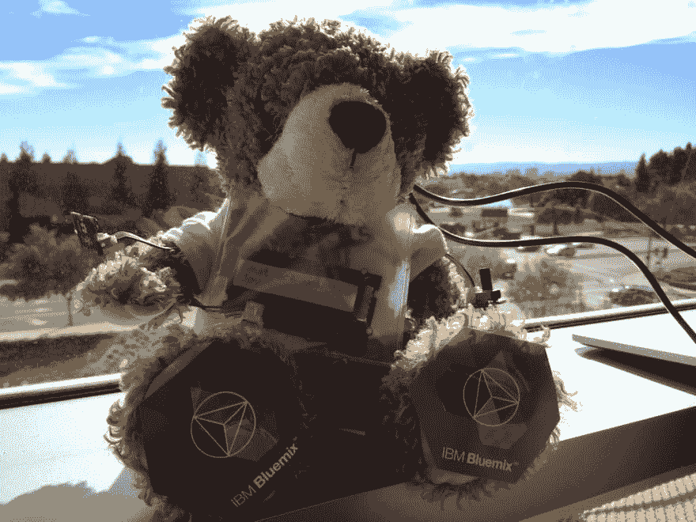

# 不要害怕分享你的项目

> 原文：<https://dev.to/jeancarl/dont-be-afraid-to-share-your-projects-15ke>

作为开发人员，我们喜欢创造东西。发现事物是如何构造的第一手资料是令人满意的，即使我们重新发明轮子，我们构建的东西是低效的、冗长的，或者在某种程度上，我们甚至不会向我们最亲密的朋友展示源代码。

这就是内部冲突发挥作用的地方。许多开发者想要展示他们的新作品，与任何人分享。这就像在小学的时候，你被选中向你的同学展示和讲述你的一些非常酷的东西。在聚光灯下受欢迎的短暂时刻，让别人了解你！

那么，为什么不有更多的开发人员将他们的项目推送到 Github，将他们的旅程记录下来，记录他们所构建的、学到的、想要告诉他人的东西，并将他们自己和他们的创作视频化，以获得不朽呢？

因为我们害怕。恐惧是一种非常普遍的情绪，社交焦虑会给许多人带来冲突，阻止他们迈出额外的一步。如果我的项目被盗，其他人而不是我成为焦点，该怎么办？如果有人评价我，告诉我我在编码方面有多糟糕怎么办？我的身份会暴露，我不会成为我想让每个人看到的精英程序员。如果我把项目建的完全错了，我就收不回来，躲在毯子下面了怎么办？

在我们今天生活的这个高度关注社交媒体的世界里，这些都是合理的担忧，可能会导致在社交排名中失去位置。但这不一定要再来一遍高中小团体。这些恐惧真的不应该成为阻止我们分享项目的限制。可能发生的最糟糕的事情是，没有人会注意到这个项目，因为它积满了灰尘。哦，好吧，你会是第一个看到它的人。把它放在网上至少能让它被发现。

自私一会儿，我想分享我发现的一些好处，分享我的项目，不关心其他人似乎如此关心的社会推广。

我过去经常参加黑客马拉松比赛，之后会[发布我的项目](http://30daysoftravel.com/2014/01/23/secondgov-at-collectives-hackdance-hackathon/)。这是一次偶然的努力，并且在我认为展示这个项目最重要的方面上确实有所不同。每篇博文都不一样，有时包括截图、演示视频、经验教训、对用户体验或问题的解释，以及我认为未来可以做出的改进。

<figure>

<figcaption>Alex the Emotion tracking Teddy Bear</figcaption>

</figure>

这些博客文章分布在我为下一个博客平台留下的一些博客中。但内容依然保留。它让我看到了几年前我在[的位置](http://jeancarlbisson.com/2015/11/20/connected-teddy-bear/)，以及我在个人和职业上是如何进步的。

几周前，我偶然发现了我在 2015 年夏天做的 30 天 15 个项目，作为学习 Angular 的练习。我点击了这些项目，想看看这些代码有多过时，有一会儿我想知道为什么会有人在近四年后阅读它。当我为我的新年计划做准备时，我应该停止这些项目吗？再一次，作为一个以自我为中心的人，我对自己在这些项目中付出的努力和当时拥有的创造力感到敬畏。

虽然我写的教程已经过时了，框架也有了很大的改进，但保留它们对我来说还是有历史价值的。从某种意义上说，我在为未来的自己留下一个时间胶囊，如果其他人愿意，欢迎他们来观看这段旅程。

是的，我确实后悔没有写下我所有的项目。我有时会想起某个项目的一些细节，这个项目过去和现在都找不到哪怕是一点点源代码。如果我能回到过去，我会写更多我的项目，这样我就可以回到今天看视频(甚至分享它)。