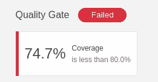

# 降兔子洞调试 Node.js 密码支持

> 原文：<https://dev.to/urma/down-the-rabbit-hole-debugging-node-js-cipher-support-47al>

**TL；DR:** 虽然大多数关于 node.js 和 OpenSSL 加密算法的文档似乎表明加密算法是由 OpenSSL 在用户领域实现的，但是您的 **Linux 内核版本**可能会影响一些特定加密算法的可用性。

最近，在测试一些利用最新加密算法的代码时，我们发现 node.js 对这些算法的支持依赖于 node.js 版本，而不是完全依赖于底层的 OpenSSL 支持。

对于 node.js 8.x，我们得到的是:

```
$ node -v
v8.16.0

$ node -e 'console.log(JSON.stringify(require("crypto").getCiphers()))'
["aes-128-cbc","aes-128-cbc-hmac-sha1","aes-128-cbc-hmac-sha256","aes-128-ccm",
"aes-128-cfb","aes-128-cfb1","aes-128-cfb8","aes-128-ctr","aes-128-ecb","aes-128-gcm",
"aes-128-ofb","aes-128-xts","aes-192-cbc","aes-192-ccm","aes-192-cfb","aes-192-cfb1",
"aes-192-cfb8","aes-192-ctr","aes-192-ecb","aes-192-gcm","aes-192-ofb","aes-256-cbc",
"aes-256-cbc-hmac-sha1","aes-256-cbc-hmac-sha256","aes-256-ccm","aes-256-cfb",
"aes-256-cfb1","aes-256-cfb8","aes-256-ctr","aes-256-ecb","aes-256-gcm","aes-256-ofb",
"aes-256-xts","aes128","aes192","aes256","bf","bf-cbc","bf-cfb","bf-ecb","bf-ofb",
"blowfish","camellia-128-cbc","camellia-128-cfb","camellia-128-cfb1",
"camellia-128-cfb8","camellia-128-ecb","camellia-128-ofb","camellia-192-cbc",
"camellia-192-cfb","camellia-192-cfb1","camellia-192-cfb8","camellia-192-ecb",
"camellia-192-ofb","camellia-256-cbc","camellia-256-cfb","camellia-256-cfb1",
"camellia-256-cfb8","camellia-256-ecb","camellia-256-ofb","camellia128","camellia192",
"camellia256","cast","cast-cbc","cast5-cbc","cast5-cfb","cast5-ecb","cast5-ofb","des",
"des-cbc","des-cfb","des-cfb1","des-cfb8","des-ecb","des-ede","des-ede-cbc","des-ede-cfb",
"des-ede-ofb","des-ede3","des-ede3-cbc","des-ede3-cfb","des-ede3-cfb1","des-ede3-cfb8",
"des-ede3-ofb","des-ofb","des3","desx","desx-cbc","id-aes128-CCM","id-aes128-GCM",
"id-aes128-wrap","id-aes192-CCM","id-aes192-GCM","id-aes192-wrap","id-aes256-CCM",
"id-aes256-GCM","id-aes256-wrap","id-smime-alg-CMS3DESwrap","idea","idea-cbc","idea-cfb",
"idea-ecb","idea-ofb","rc2","rc2-40-cbc","rc2-64-cbc","rc2-cbc","rc2-cfb","rc2-ecb",
"rc2-ofb","rc4","rc4-40","rc4-hmac-md5","seed","seed-cbc","seed-cfb","seed-ecb","seed-ofb"]

$ node -e 'console.log(require("crypto").getCiphers().length)'
119 
```

Enter fullscreen mode Exit fullscreen mode

然而，当对 node.js 10.x 运行相同的代码时，我们得到的是:

```
$ node -v
v10.16.0

$ node -e 'console.log(JSON.stringify(require("crypto").getCiphers()))'
["aes-128-cbc","aes-128-cbc-hmac-sha1","aes-128-cbc-hmac-sha256","aes-128-ccm","aes-128-cfb",
"aes-128-cfb1","aes-128-cfb8","aes-128-ctr","aes-128-ecb","aes-128-gcm","aes-128-ocb",
"aes-128-ofb","aes-128-xts","aes-192-cbc","aes-192-ccm","aes-192-cfb","aes-192-cfb1",
"aes-192-cfb8","aes-192-ctr","aes-192-ecb","aes-192-gcm","aes-192-ocb","aes-192-ofb",
"aes-256-cbc","aes-256-cbc-hmac-sha1","aes-256-cbc-hmac-sha256","aes-256-ccm","aes-256-cfb",
"aes-256-cfb1","aes-256-cfb8","aes-256-ctr","aes-256-ecb","aes-256-gcm","aes-256-ocb",
"aes-256-ofb","aes-256-xts","aes128","aes128-wrap","aes192","aes192-wrap","aes256",
"aes256-wrap","aria-128-cbc","aria-128-ccm","aria-128-cfb","aria-128-cfb1","aria-128-cfb8",
"aria-128-ctr","aria-128-ecb","aria-128-gcm","aria-128-ofb","aria-192-cbc","aria-192-ccm",
"aria-192-cfb","aria-192-cfb1","aria-192-cfb8","aria-192-ctr","aria-192-ecb","aria-192-gcm",
"aria-192-ofb","aria-256-cbc","aria-256-ccm","aria-256-cfb","aria-256-cfb1","aria-256-cfb8",
"aria-256-ctr","aria-256-ecb","aria-256-gcm","aria-256-ofb","aria128","aria192","aria256",
"bf","bf-cbc","bf-cfb","bf-ecb","bf-ofb","blowfish","camellia-128-cbc","camellia-128-cfb",
"camellia-128-cfb1","camellia-128-cfb8","camellia-128-ctr","camellia-128-ecb",
"camellia-128-ofb","camellia-192-cbc","camellia-192-cfb","camellia-192-cfb1",
"camellia-192-cfb8","camellia-192-ctr","camellia-192-ecb","camellia-192-ofb",
"camellia-256-cbc","camellia-256-cfb","camellia-256-cfb1","camellia-256-cfb8",
"camellia-256-ctr","camellia-256-ecb","camellia-256-ofb","camellia128","camellia192",
"camellia256","cast","cast-cbc","cast5-cbc","cast5-cfb","cast5-ecb","cast5-ofb","chacha20",
"chacha20-poly1305","des","des-cbc","des-cfb","des-cfb1","des-cfb8","des-ecb","des-ede",
"des-ede-cbc","des-ede-cfb","des-ede-ecb","des-ede-ofb","des-ede3","des-ede3-cbc",
"des-ede3-cfb","des-ede3-cfb1","des-ede3-cfb8","des-ede3-ecb","des-ede3-ofb","des-ofb",
"des3","des3-wrap","desx","desx-cbc","id-aes128-CCM","id-aes128-GCM","id-aes128-wrap",
"id-aes128-wrap-pad","id-aes192-CCM","id-aes192-GCM","id-aes192-wrap","id-aes192-wrap-pad",
"id-aes256-CCM","id-aes256-GCM","id-aes256-wrap","id-aes256-wrap-pad",
"id-smime-alg-CMS3DESwrap","idea","idea-cbc","idea-cfb","idea-ecb","idea-ofb","rc2",
"rc2-128","rc2-40","rc2-40-cbc","rc2-64","rc2-64-cbc","rc2-cbc","rc2-cfb","rc2-ecb",
"rc2-ofb","rc4","rc4-40","rc4-hmac-md5","seed","seed-cbc","seed-cfb","seed-ecb","seed-ofb",
"sm4","sm4-cbc","sm4-cfb","sm4-ctr","sm4-ecb","sm4-ofb"]

$ node -e 'console.log(require("crypto").getCiphers().length)'
175 
```

Enter fullscreen mode Exit fullscreen mode

因为我们在 node.js 10.x 下的本地系统中编写代码，所以我们从单元测试中获得了足够的覆盖率。然而，当我们开始在 CI 环境下运行测试时，我们遇到了一些错误。原来我们的 CI 环境没有 node.js 10.x 可用，只支持 node.js 8.x。

利用 [nodenv](https://github.com/nodenv/nodenv) 我们能够在 node.js 8.x 下运行我们的代码，并识别出上面显示的差异。我们在测试中添加了一些逻辑来跳过那些涉及 node.js 10.x 特定密码的测试。这使得我们的测试在 CI 环境中通过，但是后来的 Sonarqube 质量门强制测试覆盖现在失败了——跳过不可用的密码影响了我们的覆盖。由于没有更高版本的 node.js 用于 CI 测试，我们需要改变测试的运行方式，以确保所有代码都得到充分的测试。

# 借力 Docker

这是一个有点常见的问题——如何保持测试条件尽可能的一致，这样你就不会因为环境差异而出错。解决方案也很明显——我们决定使用 Docker 映像构建在官方的[节点](https://hub.docker.com/_/node/)基础映像之上。我们的`Dockerfile`很简单:

```
ARG base_image
FROM ${base_image}

WORKDIR /opt/my-app-path
COPY . /opt/my-app-path
RUN npm install

CMD [ "npm", "test" ] 
```

Enter fullscreen mode Exit fullscreen mode

虽然肯定还有改进的空间(比如使用非根用户、优化层缓存等等)，但它解决了我们的关键问题——我们现在可以基于 node.js 的不同版本构建不同版本的映像，方法是提供`base_image`参数，所有其他库和二进制文件在不同版本中是相同的:

```
$ docker build \
  --build-arg base_image=node:8.16.0-stretch-slim \
  -t my-app:8.16.0-stretch-slim-latest

$ docker build \
  --build-arg base_image=node:10.16.0-stretch-slim \
  -t my-app:10.16.0-stretch-slim-latest 
```

Enter fullscreen mode Exit fullscreen mode

还需要经历一些额外的跳跃——因为测试现在在 Docker 容器中执行，而不是直接在构建主机中执行，所以我们需要在运行测试时挂载一个外部路径，并以 CI 可以解析的格式生成结果。

```
$ docker run --rm \
  -v $(pwd)/test-output:/opt/my-app-path/test-output \
  my-app:8.16.0-stretch-slim-latest 
```

Enter fullscreen mode Exit fullscreen mode

我们创建了一个 shell 脚本，为所有受支持的 node 版本(8.x、10.x 和 12.x)构建测试映像，并确认 8.x 版跳过了正确的密码，但在 10.x 和 12.x 版上运行时使用正确。我们还将测试结果存储在 JSON 文件中，其中包含版本信息和测试结果，然后可以将这些信息放入 CI 工具的插件中，以便我们可以获得每个节点版本的测试结果。一切看起来都很好。

然而，在提交代码后，Sonarqube 仍然抱怨测试覆盖率，甚至在 node.js 的更高版本上也是如此。很明显，测试跳过标准在 CI 环境中的表现不尽如人意——除了特定于 node 10.x 的密码之外，其他东西并没有按预期工作。

[](https://res.cloudinary.com/practicaldev/image/fetch/s--Z_sRZsXN--/c_limit%2Cf_auto%2Cfl_progressive%2Cq_auto%2Cw_880/https://thepracticaldev.s3.amazonaws.com/i/q31qcg9ktp3zru30s7dt.png)

# 深挖

在向测试中添加一些调试代码之后，包括从 node.js 和 OpenSSL 中捕获密码列表，我们能够查明哪些算法在 CI 环境中不可用- `aes-128-cbc-hmac-sha256`和`pbkdf2`一起使用。然而，令人困惑的是，当在我们的本地系统上检查 Docker 映像中 node.js 的密码列表时，`aes-128-cbc-hmac-sha256`确实包括在内:

```
$ node -e 'console.log(JSON.stringify(require("crypto").getCiphers().filter(c => c.match(/aes-128-cbc/))))'
["aes-128-cbc","aes-128-cbc-hmac-sha1","aes-128-cbc-hmac-sha256"] 
```

Enter fullscreen mode Exit fullscreen mode

OpenSSL 也表示支持:

```
$ openssl list -cipher-algorithms | grep -i aes-128 
AES-128-CBC
AES-128-CBC-HMAC-SHA1
AES-128-CBC-HMAC-SHA256
AES-128-CFB
AES-128-CFB1
AES-128-CFB8
AES-128-CTR
AES-128-ECB
AES-128-OCB
AES-128-OFB
AES-128-XTS
aes128 => AES-128-CBC 
```

Enter fullscreen mode Exit fullscreen mode

因为 Docker 映像旨在抽象出环境问题，所以当我们在 CI 环境中运行相同的命令时，我们惊讶地得到了截然不同的结果- `aes-128-cbc-hmac-sha256`在构建代理上运行我们的测试时，确实缺少这些命令。

运行容器时，除非用户特别导出主机资源(如文件系统条目或端口)，否则 Docker 主机和容器之间唯一共享的组件是 Linux 内核。这应该不会影响密码的可用性，因为 OpenSSL 在库中的用户域代码中实现了它的所有算法...是吗？

这时，我们看到了 OpenSSL 1.1.0l 的[变更日志，其中包括以下花絮:](https://www.openssl.org/news/cl110.txt) 

```
 *) Added the AFALG engine. This is an async capable engine which is able to
     offload work to the Linux kernel. In this initial version it only supports
     AES128-CBC. The kernel must be version 4.1.0 or greater.
     [Catriona Lucey] 
```

Enter fullscreen mode Exit fullscreen mode

因此，事实证明 Linux 内核版本确实会影响密码的可用性，或者更具体地说，影响`aes-128-cbc-hmac-sha256`的可用性。也就是说，该引擎应该作为算法的*优化*实现来提供，而不是作为只有一个的**。**

目前，我们正在继续调查，以确定在 Linux 下使用 4.1.0 之前的内核时，这是否是 OpenSSL 的预期行为。