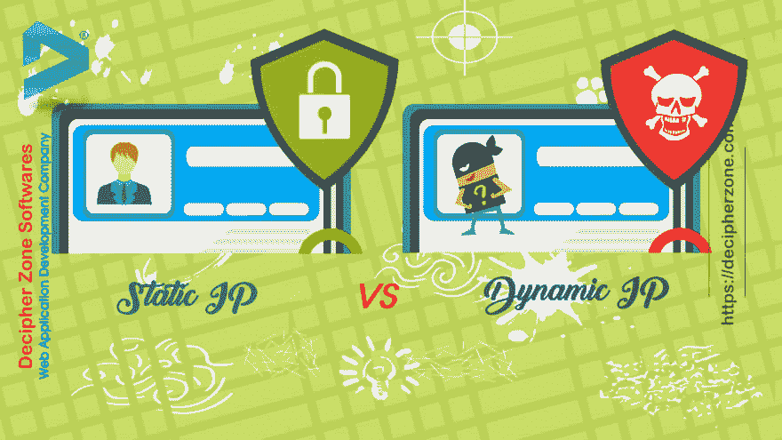

# 动态 IP 地址与静态 IP 地址:哪个最适合企业？

> 原文：<https://dev.to/decipherzonesoft/dynamic-ip-address-vs-static-ip-address-which-is-best-for-business-1mfn>

IP 地址是 ISP 和网站为您的请求提供服务所需的唯一标识号。政府当局通常会监控 IP 地址，以发现可疑的非法活动。IP 地址有两种版本，即 IPv4 和 IPv6，IPv4 是一个 32 位的十进制数字地址，由句点分隔的四个数字组成，每个数字可以是 0 到 255，而 Pv6 地址是 128 位的十六进制 IP 地址，由冒号分隔。IPv4 地址看起来像:1.160.10.240，IPv6 地址看起来像:3 FFE:1900:4545:3:200:f8ff:fe21:67cf。很明显，唯一 IPv4 标识符的数量不足以服务全球互联网用户，因此，IPv6 应运而生，但截至目前，只有少数用户可以利用 IPv6 地址。

什么是动态 IP 地址，它们是如何分配的？

动态 IP 地址是为用户随机生成的 IP 地址，这些 IP 地址默认由网络提供商分配给用户。对于企业，网络提供商提供一系列 IP 地址，例如 192.168.0.55 到 192.168.0。在此范围内，企业可以将 IP 地址分配给其员工。在限定的范围内，业务可以使用静态 IP 地址分配，也可以使用动态 IP 地址分配。对于连接到网络中的系统的动态 IP 地址分配，使用 DHCP(动态主机控制协议),其中用户必须输入一个范围并提交它，每当连接到网络的用户打开他们的系统时，该协议就运行。网络和共享设置部分包含分配静态和动态 IP 地址的选项。

阅读:[https://www . decipherzone . com/blog-detail/Dynamic-IP-address-vs . Static-IP-address-哪个最适合做生意-](https://www.decipherzone.com/blog-detail/Dynamic-IP-address-vs-Static-IP-address--Which-is-best-for-business-)