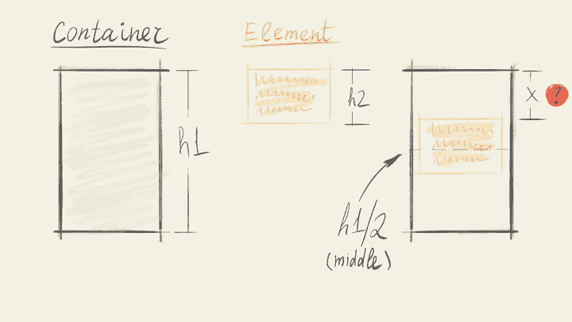
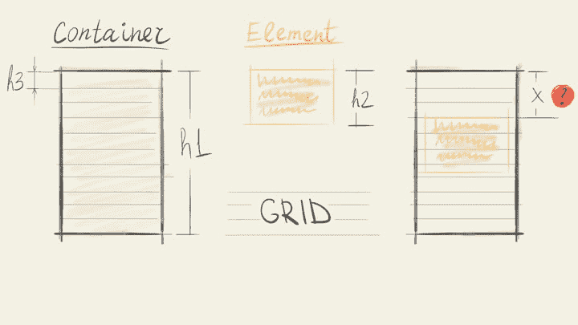
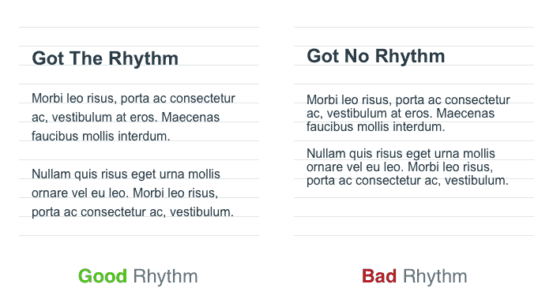
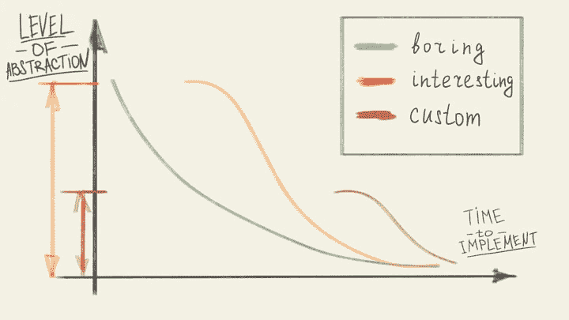
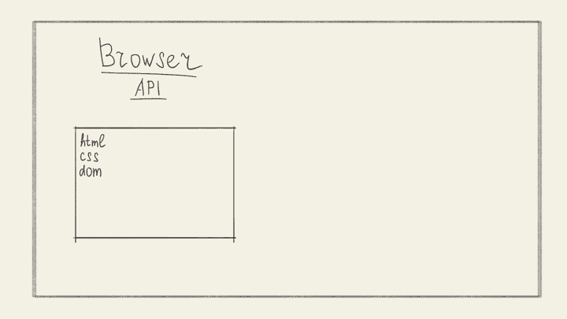
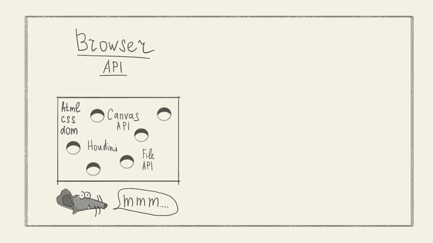
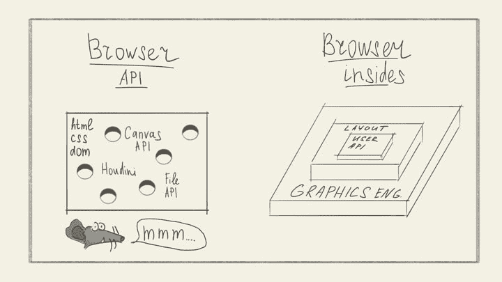
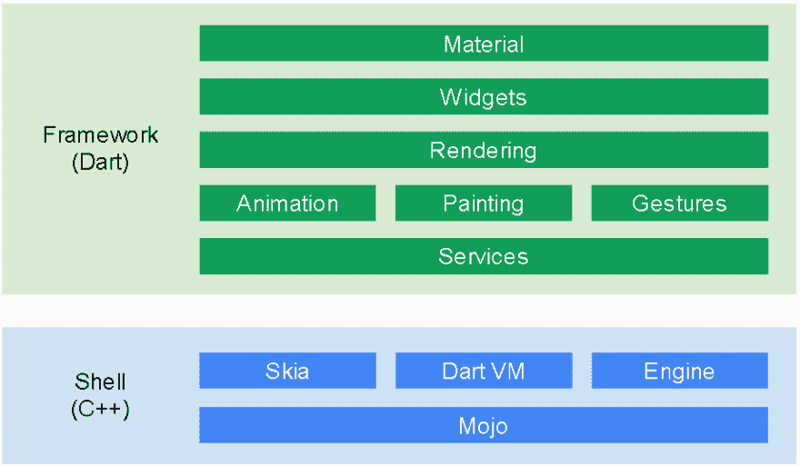

# 不可能的事情:设计优秀 API 的一种方法

> 原文：<https://dev.to/flpvsk/easily-impossible-one-approach-to-designing-a-greatapi-ice>

构建图形用户界面很难。

原因之一是糟糕的 API 设计。特别是在一组用例中，
*控制*与*工作*的不均衡。努力是使用 API 实现一个用例所花费的时间。控制是我们发送给 API 的命令可以有多细粒度。

这个平衡问题不是 GUI 特有的，而是 API
设计中的一个普遍问题。这篇文章是我试图用前端开发的例子来理解控制和努力之间的动态关系。

## 失落的几何艺术

这里有一个谜题。假设我们有两个矩形。一个比另一个更高更宽。我们希望将较小的矩形放置在较大的矩形内并垂直居中。

较大矩形的高度为`h1`。小一号的高度是`h2`。我们如何求解`x`，其中`x`是一个矩形相对于另一个矩形的垂直偏移？

[](https://res.cloudinary.com/practicaldev/image/fetch/s--6404qwip--/c_limit%2Cf_auto%2Cfl_progressive%2Cq_auto%2Cw_880/https://thepracticaldev.s3.amazonaws.com/i/qh5mm1hzsw01jsz7fz8l.png)

如果你想尝试一下，这里有几个选择:

```
1\. x = h1 / 2
2\. x = (h1 - h2) / 2
3\. x = (h1 + h2) / 2 
```

[见答案](https://gist.github.com/flpvsk/92e99d5400ffb27e671c531d2129c424)

你看，这只是一行数学——电子表格的老的不性感的编程语言。

如果我们把这个问题从表单领域转移到 HTML 文档领域，它仍然是可以解决的。这一次是用 CSS——浏览器新的很酷的样式语言。

```
.container {
  display: flex;
  align-items: center;
} 
```

### 略难的谜题

让我们把它变得难一点。现在我们想把小矩形的上边和一个网格联系起来。其余都一样。我们仍然将较小的框放在较大的框的中心，只是这次将`x`的值四舍五入到最近的网格行。

网格行的高度是`h3`。

[](https://res.cloudinary.com/practicaldev/image/fetch/s--FFnS-puv--/c_limit%2Cf_auto%2Cfl_progressive%2Cq_auto%2Cw_880/https://thepracticaldev.s3.amazonaws.com/i/jf21ojhnoks1741t333m.png)

以下是选项:

```
1\. x = h3 * round((h1 - h2) / (2 * h3))
2\. x = h3 * (h1 - h2) / 2
3\. x = h3 * floor((h1 + h2) / 2) 
```

[见答案](https://gist.github.com/flpvsk/e33a78a67a06ccbd9f80498140acd79d)

这次的解决方案更复杂，但它仍然是数学，仍然只有一行。我们如何用 CSS 做到这一点？用 iOS 自动布局？安卓布局？

可悲的是，没有办法。

### 谁有节奏？

这些谜题的灵感来自 GUI 的真实使用案例。最后一个是[垂直节奏的模型，](https://zellwk.com/blog/why-vertical-rhythms/)一个来自印刷术的概念。

[](https://res.cloudinary.com/practicaldev/image/fetch/s--iLc7KIb9--/c_limit%2Cf_auto%2Cfl_progressive%2Cq_auto%2Cw_880/https://thepracticaldev.s3.amazonaws.com/i/xgjl0jqy3jlvsv65uy1g.png)

为什么执行起来这么难？毕竟，我们只是在屏幕上排列像素。像素是正方形。正方形是我们应该能够轻松操作的几何形状。但是我们不能。

### 一个像素不是一个像素

问题是屏幕上的一个像素是由系统中的其他东西来表示的。它是一个 DOM 元素，一个视图，一个对象。它是一千种不同的东西。一个像素*实际上是什么*对开发者是隐藏的。

[](https://res.cloudinary.com/practicaldev/image/fetch/s--T14-tODD--/c_limit%2Cf_auto%2Cfl_progressive%2Cq_auto%2Cw_880/https://thepracticaldev.s3.amazonaws.com/i/rvi0gkafoxdjxn61s2ef.png)

在浏览器的情况下，这会导致各种不便:

*   我们仅限于浏览器厂商认为常见的用例；
*   我们不能为布局或绘制阶段的渲染编写测试；
*   测试任何与用户界面相关的东西都需要脱离浏览器。这就像乘坐私人飞机去杂货店购物一样。

## 错误的权衡

我在文章的开头说过，这里的核心问题是:

> 在一组用例中，控制与努力之间的平衡不佳。

让我们来解释一下这句话。

API 的用例集是开发人员可能想要实现的所有东西。浏览器供应商给了我们制作图形用户界面的能力。我们可能想要构建的任何接口都包含在用例集中。这是一大套。

努力是使用 API 实现一个用例所花费的时间。花费的时间越多(对于已经知道 API 如何工作的人来说)就越难使用。

我所说的“控制”是指我们发送给 API 的命令可以有多细粒度。在图形 API 中，控制的级别可以不同，从改变组件的属性到改变形状的属性，再到操纵像素。

我们所拥有的控制力通常是由我们所使用的抽象层次决定的。抽象程度越低，越接近硬件，我们就越有控制力。

[](https://res.cloudinary.com/practicaldev/image/fetch/s--ZrjDkCvN--/c_limit%2Cf_auto%2Cfl_progressive%2Cq_auto%2Cw_880/https://thepracticaldev.s3.amazonaws.com/i/zwwyi71ivawu2qnf76i8.png)

努力和控制这两个参数似乎是直接冲突的。我们控制得越多，我们要做的工作就越多。那是真的，但是它不是全部事实。

当我们通过用例集时，工作/控制关系会发生变化。使用高级浏览器 API，在屏幕上显示一段文本很容易做到。随着我们使用更低层次的抽象，这变得越来越困难。想象一下，编写一个着色器来绘制给定字体的字符。😱

现在让我们记住文章开头的网格的例子。一些用例对于高层抽象来说是不可能的。除非 API 供应商认为这样的用例足够普遍，否则我们无法实现它。同时，使用 OpenGL 这样的高控制低级 API 也不难做到。

我们正在慢慢接近 API 设计的主题。当我们面临这些权衡时，作为系统设计师，我们有什么选择？一个显而易见的选择是优先考虑等式的一部分。

## [t1 # usetheplatform](#usetheplatform)

历史上，浏览器供应商优先考虑最小化一组常见用例的工作量。浏览器在桌面屏幕上显示带有文本和图像的文档时表现不错。

[](https://res.cloudinary.com/practicaldev/image/fetch/s--QmX-Qk2O--/c_limit%2Cf_auto%2Cfl_progressive%2Cq_auto%2Cw_880/https://thepracticaldev.s3.amazonaws.com/i/6zqmrkfkq4ghj2fuiit8.png)

当出版商和开发商开始要求更多时，问题就出现了。支持多种平台，不同的屏幕分辨率和密度。构建应用程序、游戏和其他交互式媒体。这一切都需要给制造商更多的机会，更多的控制权。

[](https://res.cloudinary.com/practicaldev/image/fetch/s--VaZjWvBU--/c_limit%2Cf_auto%2Cfl_progressive%2Cq_auto%2Cw_880/https://thepracticaldev.s3.amazonaws.com/i/rxmh7rd4jwrvemdw5imo.png)

导致了我们今天的处境。有一个普通情况下的平面 API，上面钻了一堆“洞”来访问浏览器所具有的低级功能(已经有一段时间了)。

这就是为什么我们可以在 HTML 画布上绘制任意形状，但我们不能让这些形状成为 DOM、CSSOM 或 AOM(可访问性对象模型)的一部分。

我们可以使用不同的布局模型，如 flexbox 或 grid。但是我们没有办法对布局阶段的结果进行单元测试。

我们可以在某种程度上控制浏览器在缓存中存储什么，但是我们不能在代码中保存、检索和操作文件内容。在某种程度上，由于文件 API，我们将能够做到这一点。但它将是一个独立的构造，与缓存、服务工作者、应用程序缓存和其他 API 无关。即使所有这些*都有相同的基础。*

[](https://res.cloudinary.com/practicaldev/image/fetch/s--2xKbtQ06--/c_limit%2Cf_auto%2Cfl_progressive%2Cq_auto%2Cw_880/https://thepracticaldev.s3.amazonaws.com/i/agq3fkvb3v3nx3fm1peh.png)

## 敬酒不吃吃罚酒

区分努力和控制的优先顺序是解决这个冲突的一个方法。还有一个办法。更难的方法。

作为 API 的设计者，我们可以决定在层中公开它。以提供对低级和高级原语的访问。棘手的部分是以这样一种方式来做，即开发人员可以乱搞低级别的 API，而结果不会被系统的其余部分“排除”。

颤振是这种方法的一个很好的例子。Flutter 是 Google 做的跨平台移动开发平台。

[](https://res.cloudinary.com/practicaldev/image/fetch/s--6cR7_Zs---/c_limit%2Cf_auto%2Cfl_progressive%2Cq_auto%2Cw_880/https://thepracticaldev.s3.amazonaws.com/i/lf1zxlrff6t9mfc2ymyd.png)

由于 Flutter API 的分层结构，我们能够:

*   制作一个负责布局其子级的小部件；
*   在不启动模拟器的情况下，对我们的定制布局小部件*进行单元测试；*
*   使用自定义绘制方法制作一个小部件。例如，我们可以制作一个自定义形状、有趣的阴影或着色效果的按钮；
*   这个自定义小部件在它接受的手势、可访问性和其他属性方面仍然是一个按钮；
*   我们也可以对油漆操作进行单元测试。同样，只需在 Dart VM 中运行代码，不需要仿真器。

回到本文开头的网格示例。下面是垂直居中其子部件的代码，将它们绑定到一个网格:

```
Offset getPositionForChild(
  Size containerSize,
  Size childSize
) {
  final h1 = containerSize.height;
  final h2 = childSize.height;
  final h3 = rowHeight;
  final rowsCount = ((h1 - h2) / (2 * h3)).round();
  return Offset(0, rowsCount * h3);
} 
```

正如你所看到的，Flutter 中的代码看起来非常类似于我们使用数学得出的结果:`x = h3 * round((h1 - h2) / (2 * h3)).`这是在正确的抽象层次上工作的另一个好处:我们表达意图的方式是直接的。

这是 Flutter 中的应用程序的样子:[https://youtu.be/WjhTkdHvcPQ](https://youtu.be/WjhTkdHvcPQ)

## 关闭思绪

这些努力与冲突、分层与扁平化的原则帮助我解决了工作中一些反复出现的问题。这是一个有用的视角。

有时，我们会陷入“钻取”扁平的高级 API 来提取隐藏在下面的功能。这表明我们可能需要改变我们的方法。请记住，有一个更大的用例集，我们可以用一个更低级的 API 来支持它。逐一提取每个用例会导致臃肿的设计和作为 API 设计者的*更多的工作*。

* * *

这篇文章最初发表在我的博客上。

如果你想了解更多关于 GUI 开发的不同方法，请查看这段代码播客。

这篇文章是基于我做的一个 API 设计演讲。你可以在这里找到那次演讲的视频。