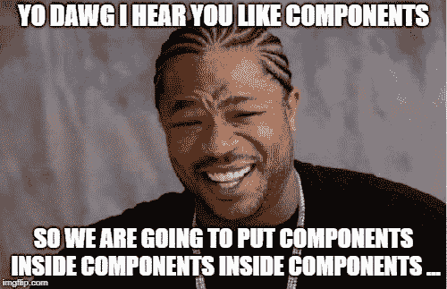

# 具有 hyperHTML-3、组件和状态的简单应用程序

> 原文：<https://dev.to/pinguxx/easy-apps-with-hyperhtml-3-1m3l>

## Moar 关于组件和简单状态管理

西班牙文版

第 3 部分作者

## [伊凡](/pinguxx)

[standard geek](/pinguxx)

[pinguxx](https://twitter.com/pinguxx)[pinguxx](https://github.com/pinguxx)

## [保罗·汤普森](/paritho)

[lover of dogs and javascript. and coffee. and writing.](/paritho)

[帕里托](https://github.com/paritho)

1.  [介绍，焊线/绑定](https://dev.to/pinguxx/easy-apps-with-hyperhtml-1-31cc)
2.  [事件和组件](https://dev.to/pinguxx/easy-apps-with-hyperhtml-2-hbi)
3.  **关于组件和简单状态管理的 Moar】**
4.  [电线类型和自定义定义(意图)](https://dev.to/pinguxx/easy-apps-with-hyperhtml-4-38k3)
5.  [用 hyper 定制元素](https://dev.to/pinguxx/easy-apps-with-hyperhtml-5-13hc)
6.  [定制我的定制元素](https://dev.to/pinguxx/easy-apps-with-hyperhtml-6-1e73)
7.  [测试！](https://dev.to/pinguxx/easy-apps-with-hyperhtml-7-5b9g)
8.  [异步加载、占位符和带超链接的提前输入](https://dev.to/pinguxx/easy-apps-with-hyperhtml-8-async-loading-5d96)
9.  [搬运路线](https://dev.to/pinguxx/easy-apps-with-hyperhtml-9-routing-59k0)
10.  [第三方库](https://dev.to/pinguxx/easy-apps-with-hyperhtml-10-3rd-party-libraries-2n7b)

在 [part 2](https://dev.to/pinguxx/easy-apps-with-hyperhtml-2-hbi) 中，我们使用 hyper Components 创建了一个可以排序的表格。在添加到表中之前，让我们回顾一下之前编写的代码。

[https://stackblitz.com/edit/basics-table-5?embed=1&&](https://stackblitz.com/edit/basics-table-5?embed=1&&)

### 表组件

你有没有注意到有些代码我们可以重用？如果我们重构我们的代码，我们可以使用其他表的部分，维护这些部分会更容易，而不是每次更改都更新整个表。这些部分非常适合这样的重构:

*   主表定义
*   标题(行和列)
*   正文(行和列)
*   页脚…嗯，我们还没有页脚，但我们会添加一个只是为了好玩

让我们看看如何改变这些部分，使其更易于维护和重用。

#### 表

首先，让我们创建一个 Table.js 文件，并将大部分代码移到那里。我们不需要在这个文件中使用 bind()，而是导出我们的表。

[https://stackblitz.com/edit/basics-table-5-1?embed=1&&file=Table.js](https://stackblitz.com/edit/basics-table-5-1?embed=1&&file=Table.js)

接下来，让我们更新 index.js 来导入我们的表。这是我们使用 bind()函数的地方。回想一下，bind()在 document.body 这样的现有 domNodes 上工作，还要注意我们是如何将信息传递到表中的:通过构造函数中的一个对象。

[https://stackblitz.com/edit/basics-table-5-1?embed=1&&file=index.js](https://stackblitz.com/edit/basics-table-5-1?embed=1&&file=index.js)

* * *

#### 表头

我们的 Header 类也会扩展 Component。

让我们首先将表中的`<thead>`元素移动到 render()，使它看起来像这样: