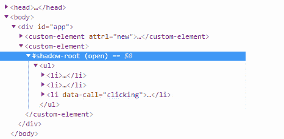

# 具有 hyperHTML-5、自定义元素的简单应用程序

> 原文：<https://dev.to/pinguxx/easy-apps-with-hyperhtml-5-13hc>

西班牙文版

第 5 部分作者

[](/pinguxx)

## [伊凡](/pinguxx)

[standard geek](/pinguxx)

[pinguxx](https://twitter.com/pinguxx)[pinguxx](https://github.com/pinguxx)

[](/paritho)

## [保罗·汤普森](/paritho)

[lover of dogs and javascript. and coffee. and writing.](/paritho)

[帕里托](https://github.com/paritho)

1.  [介绍，焊线/绑定](https://dev.to/pinguxx/easy-apps-with-hyperhtml-1-31cc)
2.  [事件和组件](https://dev.to/pinguxx/easy-apps-with-hyperhtml-2-hbi)
3.  [关于组件和简单状态管理的 Moar】](https://dev.to/pinguxx/easy-apps-with-hyperhtml-3-1m3l)
4.  [电线类型和自定义定义(意图)](https://dev.to/pinguxx/easy-apps-with-hyperhtml-4-38k3)
5.  **用 hyper 定制元素**
6.  [定制我的定制元素](https://dev.to/pinguxx/easy-apps-with-hyperhtml-6-1e73)
7.  [测试！](https://dev.to/pinguxx/easy-apps-with-hyperhtml-7-5b9g)
8.  [异步加载、占位符和带超链接的提前输入](https://dev.to/pinguxx/easy-apps-with-hyperhtml-8-async-loading-5d96)
9.  [搬运路线](https://dev.to/pinguxx/easy-apps-with-hyperhtml-9-routing-59k0)
10.  [第三方库](https://dev.to/pinguxx/easy-apps-with-hyperhtml-10-3rd-party-libraries-2n7b)

[](https://res.cloudinary.com/practicaldev/image/fetch/s--Ml_ytykL--/c_limit%2Cf_auto%2Cfl_progressive%2Cq_auto%2Cw_880/https://thepracticaldev.s3.amazonaws.com/i/rgz0njhgpaofeptcv3ra.jpeg)

### 我自己的标签

如果您开发网页或应用程序已经有一段时间了，那么您很有可能见过定制组件或 HTML 标记，尤其是如果您使用的是较新的 JavaScript 框架。无论名称如何，这些组件通常都有一个相似的目标:将功能和逻辑封装到可重用的代码块中。经过社区的大量讨论和开发，我们终于把这些想法放到了 [Web Components](https://developer.mozilla.org/en-US/docs/Web/Web_Components) 的框架下。

> Web Components 是一套不同的技术，允许您创建可重用的自定义元素(将它们的功能封装在代码的其余部分之外)，并在您的 Web 应用程序中使用它们。— MDN

为了实现这一点，规范提出了以下技术:

1.  **定制元素**:一组 JavaScript APIs，让您定义元素的逻辑。您可以创建一个类似 open()的函数，然后从元素 document . query selector(' custom-dialog ')中调用该函数。打开()。
2.  Shadow Dom :利用 Shadow Dom，您可以在自定义元素中使用其他 HTML 元素，甚至其他自定义元素！启用了阴影 DOM 的自定义元素中的任何代码都将被单独呈现和样式化。这可能是一个 bug，也可能是一个特性，这取决于您的用例。
3.  **HTML 模板**:两个标签`<template>`和`<slot>`让你在定制元素中编写 HTML，但是在你激活它们之前，它们不会被渲染或显示。`<template>`和`<slot>`还可以重复用于其他事情。

不是每一个都可以在所有浏览器中使用，某些方面比其他方面更难填充，但我们正在接近。

现在我们将集中在自定义元素的基础上，但是最后我们将向您展示如何使用 shadow DOM。我们还将看到 hyperHTML 可以创建高效的模板。我们将能够用 hyperHTML 做`<template>`能做的一切，除了对`<slot>`的本地使用。

#### <自定义元素 awesome="true" >

要开始制作定制元素，我们需要三样东西:

1.  支持自定义元素的浏览器或聚合填充。我们推荐使用[文档-注册-元素](https://github.com/WebReflection/document-register-element)。这种聚合填充物已经被 amp 等项目用于生产一段时间了。或者，谷歌也有一个值得一试的 polyfill。
2.  扩展 HTMLElement 对象的类。这个类将包含我们元素的所有逻辑。我们也可以从普通的 HTML 元素扩展而来。
3.  最后，我们需要“定义”元素。这就是我们如何在浏览器中注册我们的元素，并给它一个名字。

在上面的 2 中，我们提到有两种方法来扩展你的定制元素类，要么通过扩展 HTMLElement，要么像 span 一样的内置 HTML 标签。当我们扩展 HTMLElement 时，我们的自定义元素将是自治的。然而，扩展内置有点争议，虽然规范描述了如何做，但并不是所有的浏览器都支持。我们将看到如何做到这两者，但对于我们在这个博客中的用例，我们只打算从 HTMLElement 扩展。

废话少说，给我看看代码！

[https://stackblitz.com/edit/intermediate-ce-01?embed=1&&](https://stackblitz.com/edit/intermediate-ce-01?embed=1&&)

(这在 index.html 中是一件很小很大的事情，因为 Stackblitz 正在自动编译我们的代码，所以我们需要包含 es5 适配器)

让我们仔细分析一下代码:

首先我们命名我们的类并扩展 HTMLElement。这将是一个自治元素。然后，我们有一个函数叫做`connectedCallback()`。在浏览器将自定义元素附加到文档后，将调用`connectedCallback()`。稍后，我们将更多地讨论定制元素的生命周期。在`connectedCallback()`中，我们只是向自定义元素添加文本。

在第 9 行，我们定义了元素名。无论您选择什么名称，都必须包含连字符。在我们的例子中，为了在 HTML 中使用这个元素，我们将使用标签`<custom-element></custom-element>`。define 函数还接受第二个参数，它是描述元素的类。

在内部，浏览器保存了我们定义的所有自定义元素的注册表。我们可以用 [CustomElementRegistry](https://developer.mozilla.org/en-US/docs/Web/API/CustomElementRegistry) 做的事情之一就是等待元素被定义。然而，我们可以做很多其他的事情。所以一定要看一下文件。

[](https://res.cloudinary.com/practicaldev/image/fetch/s--hsXMZu-D--/c_limit%2Cf_auto%2Cfl_progressive%2Cq_auto%2Cw_880/https://cdn-images-1.medium.com/max/325/1%2AUf6yUZuRXXKeYHFL8jabYg.jpeg)

只是为了好玩，让我们看看如何扩展一个内置的:

[https://stackblitz.com/edit/intermediate-ce-02?embed=1&&](https://stackblitz.com/edit/intermediate-ce-02?embed=1&&)

#### 生命周期

除此之外，我们还可以使用其他的生命周期挂钩。让我们看看他们是怎么做的:

*   **connectedCallback** :当你的元素连接到文档 DOM 时调用。
*   **disconnectedCallback** :当你的元素从 DOM 中分离时调用。您将能够在这个函数中对断开做出反应。
*   **adoptedCallback** :当你将元素移动到一个新页面时被调用。
*   **attributeChangedCallback** :每当您正在监视的属性发生变化时，就会调用这个函数。并非定制元素的每个属性都会被自动监控。要选择哪些属性，您必须添加另一个函数:

```
static get observedAttributes() {return ['attr1', 'attr2']; } 
```

让我们在自定义元素中看看这些函数的运行情况:

[https://stackblitz.com/edit/intermediate-ce-03?embed=1&&](https://stackblitz.com/edit/intermediate-ce-03?embed=1&&)

这太酷了！我们很快就会拥有一种强大的新元素。但是模板化呢？有了 hyperHTML，我们可以在元素中呈现我们想要的任何东西，然后用 hyperHTML :D 的所有功能来定制元素

[](https://res.cloudinary.com/practicaldev/image/fetch/s--1aDUeGWJ--/c_limit%2Cf_auto%2Cfl_progressive%2Cq_66%2Cw_880/https://cdn-images-1.medium.com/max/220/1%2AoQV46mV2KLACQJMUNZ6WjA.gif)

让我们做一些改变。当然，我们首先需要加载 hyperHTML。然后，我们将使用`this.html = bind(this);`绑定到当前元素。我们还需要一个`render()`函数，负责呈现模板。最后，我们需要更新我们的`attributeChangedCallback()`,将新的属性值更改为实际的属性:

[https://stackblitz.com/edit/intermediate-ce-04?embed=1&&](https://stackblitz.com/edit/intermediate-ce-04?embed=1&&)

### 输入超 html-元素

关于定制元素还有很多东西要学，但幸运的是，大师 Andrea Giammarchi 创建了另一个实用程序，它抽象了许多定制元素 API。它被称为[超 HTML 元素](https://github.com/WebReflection/hyperHTML-element)。

这是一个可以代替 HTMLElement 进行扩展的类，它提供了一些新的函数和属性。

#### 功能

*   除了常规的`observedAttributes`，我们现在还有`booleanAttributes`。这是我们想要放置不需要实际值的属性的地方。例如，`<custom-element required>`。“Required”要么存在，要么不存在，因此它是一个很好的布尔属性候选对象。
*   `observedAttributes`和`booleanAttributes`都将为观察到的每个属性定义 getters 和 setters。这意味着我们不再需要在 attributeChangedCallback 内部做`this[name] = newValue`。
*   `created`。这是一个新的回调函数，将在`connectedCallback`或`attributeChangedCallback`之前调用
*   `defaultState()`。无论何时使用 this.state，`defaultState()`函数都会返回一个对象，这个对象会变成默认状态。
*   `setState`。更新状态对象(不需要定义`defaultState`来使用`setState`)。`setState`包括一个小奖励:它会为你调用`render()`，所以当你改变它的状态时，你的元素会自动更新！
*   `render()`。这个函数应该返回您想要在自定义元素中显示的 HTML。
*   事件处理程序。在您的模板中，我们现在可以将“this”传递给我们的事件处理程序:`<div onclick=${this}></div>`。如果我们在元素中定义了一个`onclick`函数，它将会在适当的上下文中被调用。您还可以使用 data-call 来调用任何函数:`data-call=onAnyEvent onclick=${this}…`在本例中，当用户单击时`onAnyEvent`将被调用。更酷的是，自定义事件超级容易:`onMyCustomEvent=${this}`和你定义一个`onMyCustomEvent(e)`函数，完成！
*   `define()`。这个静态方法只是一个助手。你不用`customElements.define`而是用这个`MyElement.define('my-element')`
*   所有的超 HTML 函数，`bind`，`component`和`wire`。我们唯一没有得到的超函数是 define for intents，因为我们已经用它注册了元素。要定义意图，您将使用`HyperHTMLElement.intent(…)`。我们在这篇博客的另一篇[第 4 部分](https://dev.to/pinguxx/easy-apps-with-hyperhtml-4-38k3)中看到了意图，所以如果需要的话，一定要重温一下。

细心的读者会注意到这些函数中的一些在`hyper.Component`中使用。希望你现在已经熟悉其中的一些了，:D

#### 属性

*   `this.html`。在上面的例子中，我们在`constructor`中做了`this.html = bind(this);`。有了 hyperHTML-elemet，我们现在可以直接使用`this.html`。
*   状态。State 是一个对象，它保存了元素的…呃…状态。默认情况下它是空的，或者它将保存由`defaultState`返回的任何对象，如果你已经定义了那个函数的话。
*   如前所述，`observedAttributes`和`booleanAttributes`中的每个属性都有它的 getter 和 setter，所以你可以使用`this.attr`，值将反映属性。例如，`<my-element parent="your mom"/>`，使用`this.parent`会给你一个值，“你妈妈”

太棒了。让我们更新之前的元素，以使用所有这些新特性:

[https://stackblitz.com/edit/intermediate-ce-05?embed=1&&](https://stackblitz.com/edit/intermediate-ce-05?embed=1&&)

[](https://res.cloudinary.com/practicaldev/image/fetch/s--GlH4LjPX--/c_limit%2Cf_auto%2Cfl_progressive%2Cq_66%2Cw_880/https://cdn-images-1.medium.com/max/500/1%2ATTLxQoccKUZvMDwsgPJO1A.gif)

暗影 DOM 呢？…哦，是的，非常简单:

[https://stackblitz.com/edit/intermediate-ce-06?embed=1&&](https://stackblitz.com/edit/intermediate-ce-06?embed=1&&)

检查第 8 行`this.attachShadow({mode: ‘open’});`，如果你检查这个元素，你会看到阴影 DOM 在那里！

[](https://res.cloudinary.com/practicaldev/image/fetch/s--cAViewuY--/c_limit%2Cf_auto%2Cfl_progressive%2Cq_auto%2Cw_880/https://cdn-images-1.medium.com/max/466/1%2AVtc8-XOraDyHOO5Ar741Rg.png)

关于定制元素和 web 组件，还有很多需要学习的地方。在下一部分中，我们将编写一些自定义逻辑，并将我们的表从第 4 部分的[更新为自定义元素。一如既往，欢迎反馈！](https://dev.to/pinguxx/easy-apps-with-hyperhtml-4-38k3)

* * *