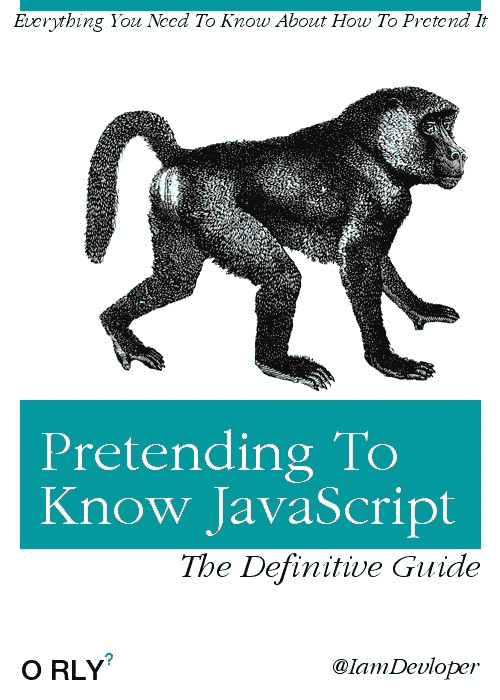
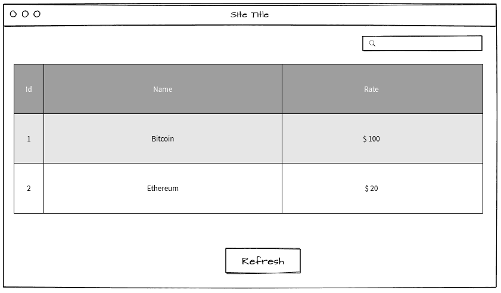

# 使用 hyperHTML-8 的简单应用，异步加载

> 原文：<https://dev.to/pinguxx/easy-apps-with-hyperhtml-8-async-loading-5d96>

第八部分作者

[](/pinguxx)

## [伊凡](/pinguxx)

[standard geek](/pinguxx)

[pinguxx](https://twitter.com/pinguxx)[pinguxx](https://github.com/pinguxx)

[](/paritho)

## [保罗·汤普森](/paritho)

[lover of dogs and javascript. and coffee. and writing.](/paritho)

[帕里托](https://github.com/paritho)

1.  [介绍，焊线/绑定](https://dev.to/pinguxx/easy-apps-with-hyperhtml-1-31cc)
2.  [事件和组件](https://dev.to/pinguxx/easy-apps-with-hyperhtml-2-hbi)
3.  [关于组件和简单状态管理的 Moar】](https://dev.to/pinguxx/easy-apps-with-hyperhtml-3-1m3l)
4.  [电线类型和自定义定义(意图)](https://dev.to/pinguxx/easy-apps-with-hyperhtml-4-38k3)
5.  [用 hyper 定制元素](https://dev.to/pinguxx/easy-apps-with-hyperhtml-5-5hdl-temp-slug-7285698)
6.  [定制我的定制元素](https://dev.to/pinguxx/easy-apps-with-hyperhtml-6-h5b-temp-slug-4579110)
7.  [测试！](https://dev.to/pinguxx/easy-apps-with-hyperhtml-7-12g4-temp-slug-5472234)
8.  **异步加载、占位符和带超链接的提前输入**
9.  [搬运路线](https://dev.to/pinguxx/easy-apps-with-hyperhtml-9-routing-59k0)
10.  [第三方库](https://dev.to/pinguxx/easy-apps-with-hyperhtml-10-3rd-party-libraries-2n7b)

[](https://res.cloudinary.com/practicaldev/image/fetch/s--mtD018rQ--/c_limit%2Cf_auto%2Cfl_progressive%2Cq_auto%2Cw_880/https://thepracticaldev.s3.amazonaws.com/i/74dtvrfqzhxmc11lp60r.jpeg)

有几个我们日常处理的常见问题，什么时候刷牙，放在柜台上 3 天的比萨饼是否仍然是好的，以及如何在看不到正在发生的事情时向用户显示正在发生的事情。在一个由数据驱动的世界里，我们经常想要过滤数据，只看到我们想要的。我们不能帮助你刷牙或养成饮食习惯，但是我们可以在其他问题上做些事情。

如果您一直在学习本教程，那么您已经知道结合定制元素的 hyperHTML 有多么强大。我们将能够在显示占位符信息的同时异步加载数据，并创建一个可以过滤我们收到的日期的 typeahead。

所以我们来搭建一个解决这些问题的小 app。在这一部分，我们将展示排名前 10 位的加密硬币以及向另一种货币的转换。我们将使用 [cryptocompare](https://min-api.cryptocompare.com/) api，你可以在这里阅读文档[。如果你不愿意，你不需要学习完整的 API，跟着做就行了。](https://min-api.cryptocompare.com/documentation)

这是我们将要建造的:

[](https://res.cloudinary.com/practicaldev/image/fetch/s--UpI1NpZx--/c_limit%2Cf_auto%2Cfl_progressive%2Cq_auto%2Cw_880/https://cdn-images-1.medium.com/max/841/1%2AWLVWpg61DmIgZrYFL2NRCQ.png)

右上角的过滤器选择要显示的比率。

前 10 个硬币和比率表。

按钮刷新前 10 名。

让我们重用一些来自第 6 部分的代码。回想一下，在第 6 部分中，我们用一些随机数据和一些意图制作了一个表格。我们将在这张桌子上建造。

[https://stackblitz.com/edit/intermediate-ce-13?embed=1&&](https://stackblitz.com/edit/intermediate-ce-13?embed=1&&)

### 提前键入

Typeaheads 是复杂的元素。对于我们当前的项目，我们将使用简化的字体。通常我们需要更多的代码来完成这个元素，但是现在，一个简化的版本就可以了。每当用户聚焦于下拉列表时，列表就会出现，您输入并过滤列表，单击其中一个选项，您就会选择该选项，此时我们会触发更改事件。

请务必仔细阅读这段代码，因为我们不会在这里深入讨论它。

[https://stackblitz.com/edit/advanced-app-01?embed=1&&](https://stackblitz.com/edit/advanced-app-01?embed=1&&)

关于 typeahead 代码的注释:

*   我们为选项定义了一个 get/set，以允许用户传递选项。我们用一个内部变量来存储它们。如果我们想在代码中设置选项，这有助于避免循环。
*   我们使用引导类进行造型。下拉菜单-右将确保我们的类型的下拉菜单在屏幕上可见。
*   open()和 close()函数将设置状态，这样当我们下一次渲染时，我们的 typeahead 将获得适当的 CSS 类来显示或隐藏。记住，每次我们调用 setState hyperHTML 都会重新呈现我们的元素。
*   我们将呈现元素内部的输入。对于定制元素来说，这是非常常见的事情——将本地元素包装在我们的元素中。通过这样做，就好像我们用额外的特性扩展了原生元素。
*   我们不使用([或需要！](https://viperhtml.js.org/hyperhtml/documentation/#essentials-7))部分属性。这就是为什么我们需要将类包装在${}中。
*   我们映射找到的任何选项，并为每个选项返回一个连线()。返回电线()很重要；否则，hyperHTML 将无法附加 DOM 节点。
*   事件让我们监听输入和打开下拉菜单的点击，以及点击主体来关闭它。

在使用 typeahead 之前，我们需要将其导入 index.js

```
// index.js
import "./Typeahead.js";

const input = document.querySelector("hyper-input"); 
```

并将自定义元素放入 HTML: