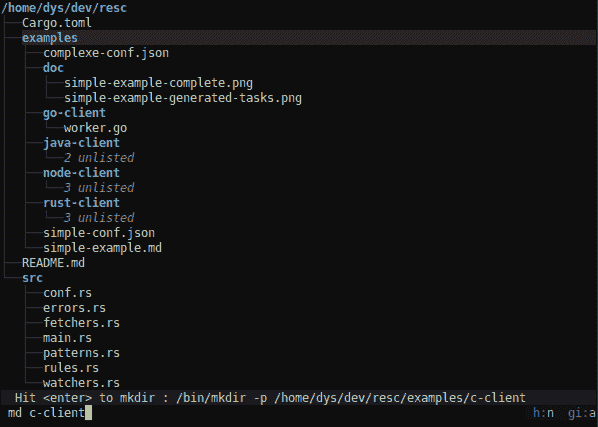
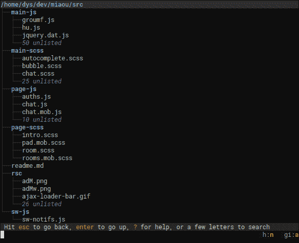

# 用 Broot 0.7 编辑你的文件层次

> 原文：<https://dev.to/dystroy/edit-your-file-hierarchy-with-broot-07-33fh>

我刚刚发布了新版本的 Broot。

以前的版本关注于查看和导航文件层次结构，但是我注意到，就像其他一些测试人员一样，编辑它也非常方便。

当你创建、移动、删除、复制你的文件或目录时，你通常是在不知情的情况下完成的，这意味着你会先做一些 ls(或 br ),然后再做一些。

在新版本的 broot 中，当你输入命令时，你会看到文件的层次结构，并且它会立即更新。树视图从只读变为读写。

标准文件命令是内置的，你不需要添加它们，但是[动词配置语法](https://dystroy.org/broot/documentation/configuration/#verbs)允许你以同样的方式定义你自己的命令，并且你可以在执行之前预览扩展的命令。

已经有很多我可以在此基础上构建的特性，我也计划这么做，但是我得到的测试人员、想法、故事越多，我就越开心！

## [【CANopen】](https://github.com/Canop)/[【brookt】](https://github.com/Canop/broot)

### 查看和导航目录树的新方法:https://dystroy.org/broot

<article class="markdown-body entry-content p-5" itemprop="text">

# 根

[T11】](https://miaou.dystroy.org/3490?broot)

导航目录的更好方法

# 目录

*   [安装](https://raw.githubusercontent.com/Canop/broot/master/#installation)
*   [特色展柜](https://raw.githubusercontent.com/Canop/broot/master/#feature-showcase)
    *   [获得一个目录的概览，即使是一个很大的目录](https://raw.githubusercontent.com/Canop/broot/master/#get-an-overview-of-a-directory-even-a-big-one)
    *   [找到一个目录然后`cd`到它](https://raw.githubusercontent.com/Canop/broot/master/#find-a-directory-then-cd-to-it)
    *   [在您搜索时，永远不要忘记文件的层次结构](https://raw.githubusercontent.com/Canop/broot/master/#never-lose-track-of-file-hierarchy-while-you-search)
    *   [处理您的文件](https://raw.githubusercontent.com/Canop/broot/master/#manipulate-your-files)
    *   [对文件应用标准或个人快捷方式](https://raw.githubusercontent.com/Canop/broot/master/#apply-a-standard-or-personal-shortcut-to-a-file)
    *   [替换`ls`(及其克隆)](https://raw.githubusercontent.com/Canop/broot/master/#replace-ls-and-its-clones)
    *   [查看什么占用空间](https://raw.githubusercontent.com/Canop/broot/master/#see-what-takes-space)
    *   [检查 git 状态](https://raw.githubusercontent.com/Canop/broot/master/#check-git-statuses)
*   [延伸阅读](https://raw.githubusercontent.com/Canop/broot/master/#further-reading)

## 装置

完整的安装文档可以在这里找到[。](https://dystroy.org/broot/documentation/installation/)

## 特色展示

### 获得一个目录的概览，即使是一个大目录

注意到未列出的了吗？

这使得它在旧的`tree`命令会产生多页输出的情况下也是可用的。

对文件进行适当的处理，将不需要的文件放在一边(不过你可以忽略它们，参见[文档](https://dystroy.org/broot/documentation/usage/#gitignore))。

### 找到一个目录然后`cd`到它

这样，您可以用最少的击键次数导航到一个目录，即使…

</article>

[View on GitHub](https://github.com/Canop/broot)