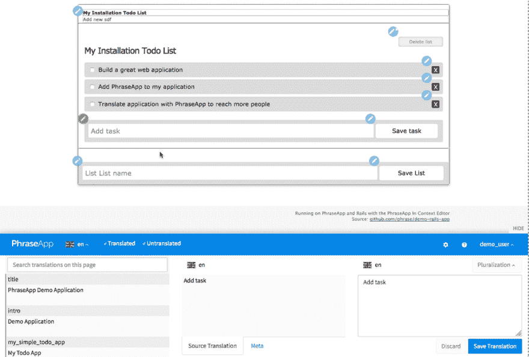

# 在浏览器中编辑网络翻译

> 原文：<https://dev.to/omaiboroda/editing-web-translations-right-in-your-browser-1nhp>

有时候 GIF 代替 1000 个单词:

[](https://res.cloudinary.com/practicaldev/image/fetch/s--isWAVQtS--/c_limit%2Cf_auto%2Cfl_progressive%2Cq_66%2Cw_880/https://i.imgur.com/PPDZrBn.gif)

<figcaption>looks interesting, right?</figcaption>

[演示](https://demo.phraseapp.com/)

有了这些，你就让你的翻译 100%理解了翻译的内容。

该特征通常被称为`In-Context Editor`(例如在[中定位](https://docs.locize.com/more/incontext-editor)或[短语应用](https://help.phraseapp.com/translate-website-and-app-content/use-in-context-editor-to-translate/translate-directly-on-your-website))。

值得一提的是，你需要订阅 PhraseApp Pro。为此，我们还使用`lingui-js`作为翻译库。

## 如何启用

你只需要

1.  将 PhraseApp 上下文编辑器片段添加到您的页面
2.  将消息格式化为正确的格式。

如果你在 Javascript 世界，我已经写了一个 [lingui-phraseapp](https://www.npmjs.com/package/lingui-phraseapp) ，它帮助你做这两个步骤，所以你的集成可能看起来很像

```
import { initializePhraseAppEditor, initializePhraseAppEditor } from "lingui-phraseapp";
import catalog from './locales/de/messages.js';

const configInContextEditor = {
  projectId: REACT_APP_PHRASEAPP_PROJECT_ID,
  autoLowercase: false,
  prefix: "--__",
  suffix: "__--",
  phraseEnabled: !!localStorage.getItem("inContextEditor");
};

...
<!-- Add snippet -->
initializePhraseAppEditor(configInContextEditor);

<!-- Format messages -->
const catalogFormatted = configInContextEditor.phraseEnabled
  ? transformCatalog(catalog, configInContextEditor)
  : catalog;

const i18n = setupI18n({ catalogs: { de: catalogFormatted });
... 
```

从上面可以看到，启用编辑器在 LocalStorage 中设置`inContextEditor: true`。之后，用户名和密码的模式将会出现。

还有其他流行的翻译库 [react-intl-phraseapp](https://github.com/phrase/react-intl-phraseapp) 、 [react-i18next-phraseapp](https://github.com/phrase/react-i18next-phraseapp) 的实现，尽管集成本身非常简单明了。

## 最重要的问题

现在是真正重要的事情:

> 这能带来价值吗？

我们正在工作的翻译说她想要它 2 年了，尽管我们还没有开始积极的翻译阶段。除非你每天都使用它，否则你无法确定。

我会给这个功能一个更新，敬请期待！