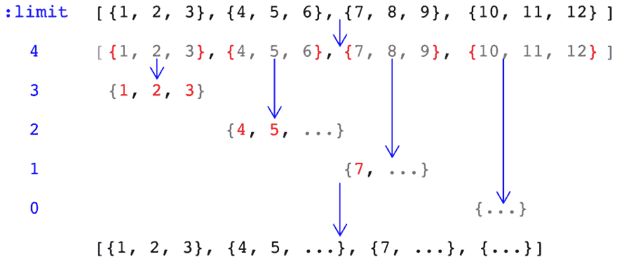

# 关于 Elixir: inspect/2 函数

> 原文：<https://dev.to/gumi/elixir-inspect2-14f2>

本文以“[inspect 调查的](https://qiita.com/melpon/items/dede48ad3bbc8c4ff443)”为基础进行了修改，整理了文章。

对很多 Elixir 的开发者来说，[`inspect/2`](https://hexdocs.pm/elixir/Kernel.html#inspect/2)是“无论什么 term 都能成为字符串的方便函数”的认识吧。 那当然是肯定的。 但是，进一步调查后，会发现很深奥。

# 输出格式

`inspect/2`在默认情况下只是转换为字符串。 但是，它有丰富的选项。 [在文档](https://hexdocs.pm/elixir/Kernel.html#inspect/2)中，关于选项虽然参照了[`Inspect.Opts`](https://hexdocs.pm/elixir/Inspect.Opts.html)，但并不详细。 关于可能有用的选项，本文还补充了文档中没有记载的地方。 因为不是穷举的，所以请通过文档确认选项一览。

## `:limit`

确定在元组、位字符串、地图、列表和其他整个集合中显示的元素数。 字符串和字符列表请使用后述的`:printable_limit`。 默认值为 50 个。 给予`:infinity`则不受限制，全部显示。

```
# 要素数３個までしか表示しない
iex> inspect [1, 2, 3, 4, 5], limit: 3
"[1, 2, 3, ...]" 
```

Enter fullscreen mode Exit fullscreen mode

在`inspect/2`中输出的要素中途隐藏在`...`中无法调试的情况下，可以通过`:infinity`进行确认。 但是，日志量激增可能会导致动作变慢，请注意。

另外，`:limit`不是单纯的要素数的指定。 每次显示要素时，`:limit`逐次减少，达到 0 以下时递归执行不显示的逻辑。 例如，以下示例是嵌套数据。 可知用`limit: 4`表示 6 个要素<sup id="fnref1">[1](#fn1)</sup> 。

```
iex> inspect [{1, 2, 3}, {4, 5, 6}, {7, 8, 9}, {10, 11, 12}], limit: 4
"[{1, 2, 3}, {4, 5, ...}, {7, ...}, {...}]" 
```

Enter fullscreen mode Exit fullscreen mode

## `:printable_limit`

确定显示字符串和字符列表的代码点数<sup id="fnref2">[2](#fn2)</sup> 。 默认值为 4096 个字符。 给予`:infinity`则不受限制，全部显示。 使用`:infinity`时的注意事项与上述`:limit`相同。

```
iex(3)> inspect ["123456789", "あいうえおかきく"], printable_limit: 5
"[\"12345\" <> ..., \"あいうえお\" <> ...]" 
```

Enter fullscreen mode Exit fullscreen mode

如果将上述两个选项合并使用，则会输出所有的 term，所以记住一下会很方便吧。 但是，使用时请注意日志的量。

```
def dump(value) do
  inspect value, limit: :infinity, printable_limit: :infinity
end 
```

Enter fullscreen mode Exit fullscreen mode

## `:width`

指定要输出的宽度，默认值为 80 个字符。 但是，`inspect/2`函数只在`:pretty`为`true`时有效。 相反，在`IO.inspect/2`函数的情况下，总是忽略`:pretty`。 如果给出`:infinity`，就不用在意横向宽度来表示。

因此，如果使用`IO.inspect/2`使其与`IO.puts "#{inspect value}"`显示相同，最好像`IO.inspect value, width: :infinity`那样指定`:infinity`。

另外，确定 0 时，按每个要素换行。

```
# inspect で :pretty を指定しない場合、:width は無視される
iex> inspect [1, 2, 3], width: 0              
"[1, 2, 3]"

# pretty: true にすると width: 0 が有効になる
iex> inspect [1, 2, 3], pretty: true, width: 0
"[1,\n 2,\n 3]"

# IO.inspect は pretty オプションを無視して常に pretty print する
iex> IO.inspect [1, 2, 3], pretty: false, width: 0
[1,
 2,
 3]
[1, 2, 3] 
```

Enter fullscreen mode Exit fullscreen mode

## `:binaries`

确定如何处理传入的二进制文件。 字符串也只是二进制文件，所以`inspect/2`看这个选项决定如何显示。 值有以下 3 个。

*   `:as_strings`:作为字符串输出，无法显示的字节被转义。
*   `:as_binaries`:以位语法输出。
*   `:infer`(默认) :`String.printable?/2`为`true`时作为字符串输出，其他情况下作为位语法输出。

```
iex> inspect("olá")
"\"olá\""
iex> inspect("olá" <> <<0>>)
"<<111, 108, 195, 161, 0>>"
iex> inspect("olá" <> <<0>>, binaries: :as_strings)
"\"olá\\0\""
iex> inspect("olá", binaries: :as_binaries)
"<<111, 108, 195, 161>>" 
```

Enter fullscreen mode Exit fullscreen mode

## `:charlists`

规定如何处理传入的列表。 字符列表也只是一个列表，所以`inspect/2`根据这个选项决定如何显示。 值有以下 3 个。

*   `:as_charlists`:列表全部作为字符列表输出。
*   `:as_lists`:全部作为列表输出。
*   `:infer`(默认) :`Inspect.List.printable?/2`为`true`时作为文字列表输出，其他情况下作为列表输出。

从实现的角度来看，除了字母、空白字符(换行符、空格和制表符)之外，例如，如果包含日语，它似乎会显示为列表。 [可以说是与 Erlang 相似的举动](https://qiita.com/melpon/items/ff11acc6a64268f78a90#%E6%96%87%E5%AD%97%E5%88%97%E3%81%AF%E3%82%B3%E3%83%BC%E3%83%89%E3%83%9D%E3%82%A4%E3%83%B3%E3%83%88%E3%81%AB%E3%81%AA%E3%82%8B)。

```
iex> inspect('bar')
"'bar'"
iex> inspect('barバー')
"[98, 97, 114, 12496, 12540]"
iex> inspect('barバー', charlists: :as_charlists)
"'barバー'"
iex> inspect('bar', charlists: :as_lists)
"[98, 97, 114]" 
```

Enter fullscreen mode Exit fullscreen mode

## `:syntax_colors`

输出字符串的颜色由关键字列表决定。 键是类型，是值使用的颜色。 类型中标准包含`:number`、`:atom`、`:regex`、`:tuple`、`:map`、`:list`、and `:reset`。

以下代码将 atom 设为`:cyan`，映射为`:magenta`，将数值设为`:black`，然后将背景颜色输出为`:light_blue_background`。

```
iex> inspect %{x: 10, y: 20}, syntax_colors: [atom: :cyan, map: :magenta, number: [:black, :light_blue_background]]
"\e[35m%{\e[0m\e[36mx:\e[0m \e[30m\e[104m10\e[0m\e[35m,\e[0m \e[36my:\e[0m \e[30m\e[104m20\e[0m\e[35m}\e[0m" 
```

Enter fullscreen mode Exit fullscreen mode

颜色的转义码为[ANSI](https://en.wikipedia.org/wiki/ANSI_escape_code) 。 如果输出到与 ANSI 转义代码相对应的控制台，则会以指定的颜色显示。

[](https://res.cloudinary.com/practicaldev/image/fetch/s--fItB11By--/c_limit%2Cf_auto%2Cfl_progressive%2Cq_auto%2Cw_880/https://thepracticaldev.s3.amazonaws.com/i/thk9g6rs7h3cc12hqmbl.png)

可以给`:syntax_colors`任意的阿童木作为钥匙。 但是，只使用标准的键。 其他密钥在自行扩展时可用。

该值可以是[`IO.ANSI`](https://hexdocs.pm/elixir/IO.ANSI.html)中定义的颜色的函数名称(原子)、任意字符串或它们的列表(可以嵌套)。

# `Inspect`关于协议

制作结构体时，通过调用`inspect/2`的默认显示如下。 也可以使用上述选项，例如`:width`。 此时，请注意加上`pretty: true`。

```
defmodule MyStruct do
  defstruct [:x, :y]
end 
```

Enter fullscreen mode Exit fullscreen mode

```
iex> IO.puts(inspect %MyStruct{x: 10, y: 20})
%MyStruct{x: 10, y: 20}
:ok
iex> IO.puts(inspect %MyStruct{x: 10, y: 20}, pretty: true, width: 0)
%MyStruct{
  x: 10,
  y: 20
}
:ok 
```

Enter fullscreen mode Exit fullscreen mode

想定制这个显示的时候，必须安装[`Inspect`](https://hexdocs.pm/elixir/Inspect.html)协议。

## `Inspect`安装协议

[`inspect/2`](https://hexdocs.pm/elixir/Inspect.html#inspect/2)在第 1 自变量中接收结构体。 如果用输出字符串表示该值，则可以实现自己的格式。

```
defimpl Inspect, for: MyStruct do
  def inspect(term, _opts) do
    "(#{term.x}, #{term.y})"
  end
end 
```

Enter fullscreen mode Exit fullscreen mode

```
iex> IO.puts(inspect %MyStruct{x: 10, y: 20})
(10, 20)
:ok 
```

Enter fullscreen mode Exit fullscreen mode

## 适当加入换行

`Inspect`即使在用协议实现的独自格式中使用`:width`选项，宽度也不会直接缩小。 可以换行的值的分隔，作为信息必须包含在`inspect/2`的返回值中。

```
iex(2)> IO.puts(inspect %MyStruct{x: 10, y: 20}, pretty: true, width: 0)
(10, 20)
:ok 
```

Enter fullscreen mode Exit fullscreen mode

因此，用于添加分隔符和嵌套等元信息并返回的是[`Inspect.Algebra`](https://hexdocs.pm/elixir/Inspect.Algebra.html)。 为了对`:width`和`:limit`等选项进行恰当的显示，使用[`Inspect.Algebra.container_doc/6`](https://hexdocs.pm/elixir/Inspect.Algebra.html#container_doc/6)。

```
defimpl Inspect, for: MyStruct do
  # def inspect(term, _opts) do
  def inspect(term, opts) do
    # "(#{term.x}, #{term.y})"
    Inspect.Algebra.container_doc("(", [term.x, term.y], ")", opts, &Inspect.inspect/2)
  end
end 
```

Enter fullscreen mode Exit fullscreen mode

```
iex> IO.puts(inspect %MyStruct{x: 10, y: 20})
(10, 20)

# :widthを小さくする
iex> IO.puts(inspect %MyStruct{x: 10, y: 20}, pretty: true, width: 0)
(10,
 20)

# 構造体をネストする
iex> IO.puts(inspect %MyStruct{x: 10, y: %MyStruct{x: 100, y: 200}}, pretty: true, width: 0)
(
  10,
  (100,
   200)
)

# :limitを定める
iex> IO.puts(inspect %MyStruct{x: 10, y: %MyStruct{x: 100, y: 200}}, pretty: true, width: 0, limit: 2)
(
  10,
  (...)
) 
```

Enter fullscreen mode Exit fullscreen mode

根据宽度适当地换行，而且嵌套时也正确地添加了行头的空白。

## 上色

[也可以用`Inspect.Algebra.color/3`](https://hexdocs.pm/elixir/Inspect.Algebra.html#color/3)上色。 传递给第 2 参数的颜色键(`:my_struct`)在调用`inspect/2`时独自设定并传递。

```
defimpl Inspect, for: MyStruct do
  def inspect(term, opts) do
    Inspect.Algebra.container_doc(
      Inspect.Algebra.color("(", :my_struct, opts),
      [term.x, term.y],
      Inspect.Algebra.color(")", :my_struct, opts),
      opts,
      &Inspect.inspect/2)
  end
end 
```

Enter fullscreen mode Exit fullscreen mode

以下代码将`:syntax_colors`选项中的颜色键`:my_struct`作为[`:red_background`](https://hexdocs.pm/elixir/IO.ANSI.html#red_background/0)传递给`inspect/2`。

```
iex(2)> inspect %MyStruct{x: 10, y: 20}, syntax_colors: [my_struct: :red_background]
"\e[41m(\e[0m10, 20\e[41m)\e[0m" 
```

Enter fullscreen mode Exit fullscreen mode

输出到控制台后，会以指定的颜色显示。

[](https://res.cloudinary.com/practicaldev/image/fetch/s--aLbb7NCe--/c_limit%2Cf_auto%2Cfl_progressive%2Cq_auto%2Cw_880/https://thepracticaldev.s3.amazonaws.com/i/fm8bpoe2ayrebll6k2tn.png)

# [关于](#-raw-ioinspect2-endraw-%E9%96%A2%E6%95%B0%E3%81%AB%E3%81%A4%E3%81%84%E3%81%A6)`IO.inspect/2`函数

正如在“输出格式”的“: width”中提到的那样，`IO.puts(inspect value)`和`IO.inspect value`不是相同的输出。 [`IO.inspect/2`](https://hexdocs.pm/elixir/IO.html#inspect/2)函数的不同之处在于以下几点。

*   `:pretty`忽略选项。
    *   总是 pretty print。
*   `:label`可以使用选项。
    *   显示为“my_label: value”。
*   返回给定的值。
    *   在流水线的中途可以很容易地确认值。

在文档的`IO.inspect/2`一项中，作为“[Examples](https://hexdocs.pm/elixir/IO.html#inspect/2-examples) ”之一，介绍了以下代码。

```
iex> [1, 2, 3] |> IO.inspect(label: "before") |> Enum.map(&(&1 * 2)) |> IO.inspect(label: "after") |> Enum.sum
before: [1, 2, 3]
after: [2, 4, 6]
12 
```

Enter fullscreen mode Exit fullscreen mode

* * *

1.  每次显示要素时`:limit`一个接一个地减少，达到 0 以下时不显示，递归处理的结果如下图所示。 想详细了解逻辑的人请参考[`Inspect.Algebra.container_doc/6`](https://hexdocs.pm/elixir/Inspect.Algebra.html#container_doc/6)的[安装](https://github.com/elixir-lang/elixir/blob/v1.8.0/lib/elixir/lib/inspect/algebra.ex#L347-L396)。 [](https://res.cloudinary.com/practicaldev/image/fetch/s--VYe-4VfJ--/c_limit%2Cf_auto%2Cfl_progressive%2Cq_auto%2Cw_880/https://thepracticaldev.s3.amazonaws.com/i/lehrhc4kxv9if1sjl8ky.png)

2.  文档的[`Inspect.Opts`](https://hexdocs.pm/elixir/Inspect.Opts.html)中说明了字节数( " number of bytes " )。 但是，从[代码](https://github.com/elixir-lang/elixir/blob/v1.8.0/lib/elixir/lib/code/identifier.ex#L240-L246)来看，好像在计算代码点。 但是，代码点也不是确切的表示形式，因为即使是作为 UTF-8 无效的字符串也会试图转义和显示。