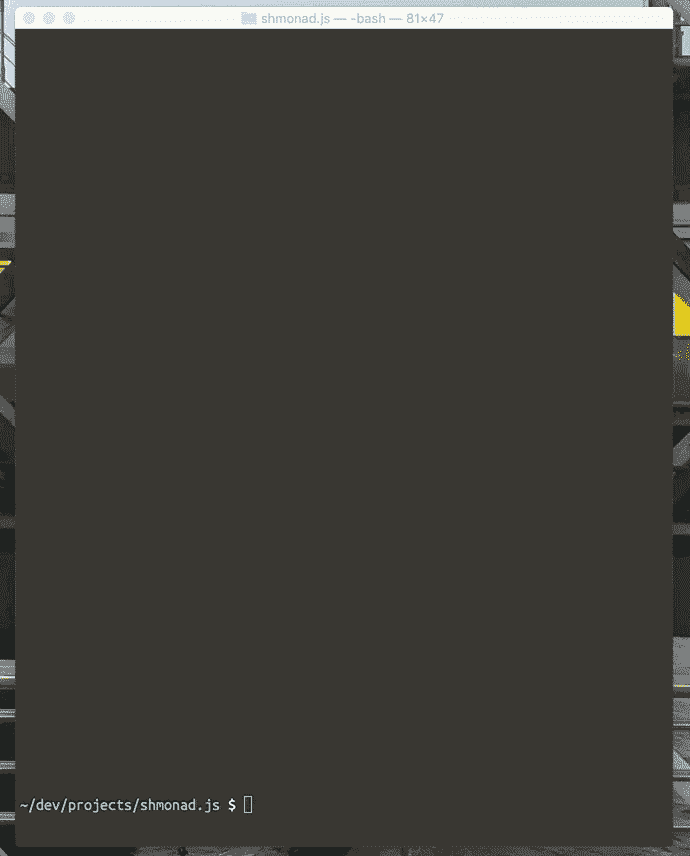

# 在 JavaScript 中模拟 Xmonad

> 原文：<https://dev.to/luke/emulating-xmonad-in-javascript--2cmf>

我最大的困扰之一是以我在键盘上打字的速度发展。有时情况变得如此糟糕，以至于我的前任经理建议在看板板上为我的开发环境优化再增加一栏！

你可能已经看过[我写的另一篇文章](https://dev.to/luke/macos-window-management-without-xmonad-2agk),关于我如何处理在 macOS 中组织我的终端的痛苦。在工作中使用 xmonad 两年多了，我再高兴不过了——它简单、快捷，尽管只使用一台显示器，但我感觉不受限制。Xmonad 确实支持多显示器，但是我发现在显示器之间切换非常慢，尤其是对于增加的光标动作。

无论如何，我想解释一下我最近在家改造 dev env 的项目。这是一次尝试，无论我在家还是在工作，都使用相同的环境。我敢肯定，许多人都面临着类似的困境，Mac 最适合家用，当然 linux 最适合工作(除了那些努力开发必须在 macOS 或 Windows 或其他专有软件环境下开发的程序的人)。

为此，下面是我迄今为止的进展。这张 GIF 展示了 shmonad.js(重命名为 TBC)与用户进行一些非常基本的交互。

在 GIF 中，你可以看到几个盒子被拉进了终端。这不是很多，但最终这将是一个完全成熟的网格组织的终端复用器，我绝对会把它放在 GitHub 上，供那些有兴趣运行它的人使用。

从长远来看，我想象一个基于插件的系统，允许更多的功能，但我们不要走在游戏的前面。

这是如何工作的？

## 终端控制序列

不久前，终端是一种物理设备，配有一个键盘、一个屏幕，仅此而已。在浮动窗口和光标出现之前，这是计算机交互的唯一方式。

1978 年， [VT100 视频终端](https://en.wikipedia.org/wiki/VT100)由数字设备公司推出，是首批支持 [ANSI 转义码](https://en.wikipedia.org/wiki/ANSI_escape_code)的终端之一。

如果您在终端环境中没有听说过转义码或转义序列，那么公平地说，作为最终用户，您在日常终端使用中几乎不会遇到它们。本质上，这些控制序列允许通过程序的输出来控制终端本身。这些控制序列允许程序控制，例如，发送到标准输出的文本的颜色或光标在终端内的当前位置。

当时，每个终端都装有不同的控制序列，因此使用控制序列的程序要么只与某些终端兼容，要么被迫使用诸如 [Termcap](https://en.wikipedia.org/wiki/Termcap) 之类的库，以便保持可移植性。

ANSI 转义码是作为所有终端都可以使用的标准提出的，使得终端接口的可移植性更加简单。由此产生的标准于 1976 年被采用为 [ECMA-48](https://www.ecma-international.org/publications/standards/Ecma-048.htm) (你可能会从 ECMAScript 或 ECMA-262 中认出 ECMA，其中 JavaScript 是一个众所周知的实现)。

不管怎样，历史课结束了。这些控制序列是什么，它们是如何体现的？

你遇到他们的次数可能比你想象的要多。

以非常流行的 shell 程序 Bash 为例。Bash 是一个广泛使用的 shell 程序，它允许用户以相当直观的方式运行命令、构建脚本和查看程序输出。一个常见的误解是 Bash 是一个*终端*。这实际上是错误的，Bash 是一个 *shell* 程序，通常在终端中运行。

例如，我在下面的堆栈中写这篇文章:

*   精力
*   (巴什)
*   终端. app
*   ...
*   马科斯

所以在我的例子中，Bash(一个 shell)碰巧运行在 Terminal.app(即...终端)。

当我输入这些单词时，它们出现在 Vim 中，这在我的终端上显示了一个文本编辑器 GUI。它通过向我的终端发送控制序列(通过 Bash)来做到这一点。Bash 目前没有做任何事情，但是如果我点击`<CTRL-Z>`，Bash 实际上会通过暂停 Vim 来中断它，并让我再次直接访问 Bash。

当您在 Bash 中运行命令时，您可能不会想太多，但是 Bash(和其他 shell 程序)也使用控制序列来提供一些功能，包括彩色文本、制表符结束、历史选择、当您到达历史末尾时听到的恼人的“叮”声或“哔”声，或者当您按 tab 键时没有什么要完成的，等等！

# 鳍

我希望这能让你更好地理解我的新项目所依赖的基础。

今天就到此为止吧，我将很快发布另一个关于我正在编写的终端多路复用器的内部工作的更新。

感谢阅读。留言评论！下次见！