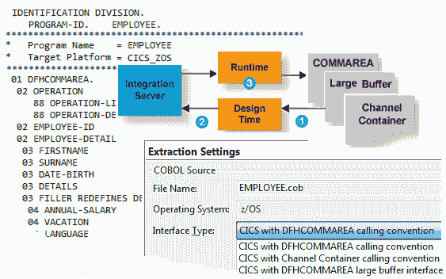
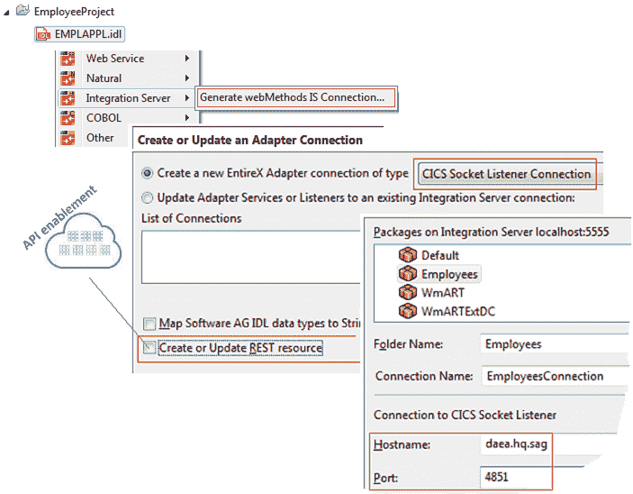
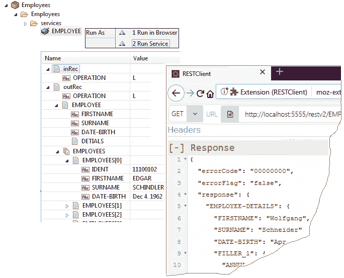
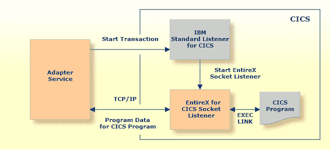
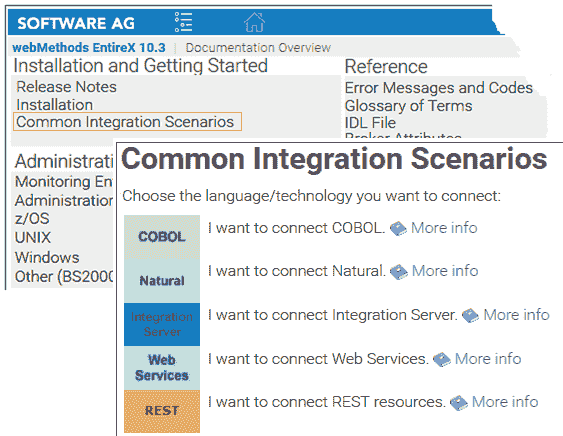

# EntireX for CICS Socket Listener——以最小的大型机占用空间集成

> 原文：<https://dev.to/techcommunity/entirex-for-cics-socket-listener-integration-with-minimal-mainframe-footprint-594c>

# webMethods EntireX

使用 EntireX 从 webMethods Integration Server (IS)调用 COBOL 很容易。阅读 EntireX 如何帮助您作为 IT 专业人员只需点击几下鼠标就可以将他们联系起来。

_ Adabas & Natural 产品管理总监 Jürgen Lind 和软件公司 EntireX 开发部高级软件专家 Bernhard Fricke

## 场景

多年来，您一直使用 CICS 来运行业务关键型和任务关键型应用程序。它们由一个独立组织单位中的一个小团队操作。

如今，新的市场需要被关注，你正在用 REST 这样的新技术开发新的应用程序。这些新应用程序需要能够使用您的核心 COBOL CICS 应用程序，而不是在您的公司多年来投入大量投资后，以高成本重新发明它们。

如何连接这些不兼容的技术？您如何将大型机上的操作保持在最低限度以降低成本？

EntireX 肯定能有所帮助，让整合这些技术变得容易。使用 EntireX，您基本上可以分三个阶段开发场景，如图 1 所示:1 提取 COBOL server 的服务器接口 2 生成 IS 服务和 IS 连接 3 测试 IS 服务到 EntireX for CICS Socket Listener。

## 提取 COBOL 服务器接口 1

 

_ **图 1:** 用于 CICS 监听器场景的 COBOL 服务器的 API 提取 _

在 Software AG Designer 中，切换到 EntireX 透视图，选择 COBOL 服务器 EMPLOYEE，调用 COBOL 的 IDL 提取器，并选择 COBOL CICS 服务器的接口类型(图 1 ),就像对任何提取一样。通过接口类型(见图 1 ),你告诉提取器 COBOL 程序如何访问它的参数——所以这是一个重要的标准。EntireX for CICS Socket Listener 支持所有 CICS 接口类型:有 32K 限制的传统 DFHCOMMAREA、通道容器和大缓冲区。

如果这是你第一次使用 EntireX 的 COBOL 场景，请参考**“如何从 webMethods Integration Server 调用 COBOL”，** TECHniques，2017 年 4 月(第 2 期)。对于导致用户定义映射的高级提取，请参见* *“如何从 web methods Integration Server-the modern way 塑造对 COBOL 的调用”，** TECHniques，2018 年 1 月(第 1 期)。

## 生成 IS 服务和 IS 连接 2

切换到 EntireX 透视图。在软件 AG IDL 文件的上下文菜单中，选择集成服务器>生成 webMethods IS Connection 选择单选按钮“创建一个新的 EntireX 适配器连接”,并在下拉框中选择 CICS 套接字侦听器连接；对于 API 启用检查“创建或更新 REST 资源”当然，您必须指定运行 CICS 的主机名和 CICS 套接字侦听器的端口。按完成(图 2)。就是这样。

 

_ **图 2:** 生成 webMethods 集成服务器服务和连接 _

## 测试是为 CICS 套接字侦听器 3 的 EntireX 服务

为了测试生成的适配器服务，使用 service development 透视图，就像您对每个其他 IS 服务测试所做的那样。在生成的 IS 服务的上下文菜单中，选择运行方式>运行服务。对于 API 启用(您在 IS 服务和 IS 连接生成期间创建了一个 REST 资源——参见上面的 2 ),从任何 REST 客户机调用 COBOL 服务器(图 3)。

 

_ **图 3:** 从 webMethods 集成服务器或 REST 客户端调用 COBOL 服务器 _

## 架构图

 

_ **图 4:** 调用 CICS Socket Listener 的 EntireX 的 webMethods 适配器服务架构图

EntireX for CICS Socket Listener 包含 z/OS 或 z/VSE 上的一个远程连接器，用于调用 CICS 大型机程序。CICS 的实现基于 IBM 标准 CICS 监听器。使用这个监听器，您可以通过 TCP/IP 启动 CICS 事务。启动的事务采用 TCP/IP 连接，并继续与适配器服务通信，为 CICS 程序交换程序数据(图 4)。

## 与用于 CICS 的 RPC 服务器的比较

在下表中，CICS 套接字侦听器的 EntireX 与 CICS 的 RPC 服务器进行了比较:

|  | CICS 套接字侦听器的完整 X | CICS 的 RPC 服务器 |
| --- | --- | --- |
| 大型机的 CPU 时间 | 最小的 | 媒介 |
| 大型机的占地面积 | 最小的 | 大的 |
| 零大型机配置 | ✔ | -好的 |
| 通过命令中心管理 | ✔ | -好的 |
| 通道容器 | ✔ | ∞不在 z/VSE 上) |
| 大缓冲器 | ✔ | ✔ |
| DFHCOMMAREA | ✔ | ✔ |
| 脱离主机处理 | ✔ | -好的 |

## 用于 CICS 套接字监听器的 RPC 服务器

为了从 webMethods 以外的环境中以最小的内存占用访问 CICS，请使用 RPC Server for CICS Socket Listener。典型的架构由 RPC 客户端、EntireX 代理、用于 CICS 套接字侦听器的 EntireX RPC 服务器和 CICS 内的套接字侦听器组成。CICS 套接字侦听器的 EntireX RPC 服务器一方面充当 RPC 服务器，另一方面充当与 CICS 套接字侦听器通信的客户端。

 

_ **图 5:** 用于 CICS 套接字监听器的 RPC 服务器的架构图

## 可用性

| 平台 | 有效性 |
| --- | --- |
| z/OS | 2018 年 10 月采用 EntireX 10.3 |
| z/VSE | 计划于 2019 年 10 月作为 z/VSE 上的 EntireX 9.6 的修复程序 |

## EntireX 文档

有关 COBOL、REST 和其他场景(包括 CICS 套接字侦听器的提取、端点生成和 EntireX)的详细信息，请参考 EntireX 文档中的常见集成场景:

 

_ **图 6:** EntireX 文档 _

## 如此概括...

EntireX for CICS Socket Listener 允许您从 webMethods Integration Server 或直接从 REST 客户端调用 CICS DFHCOMMAREA、CICS 通道容器和 CICS 大型缓冲区程序，使用最少的大型机内存。CICS 的 EntireX RPC 服务器的用户可以将工作负载从 CICS 转移到其他环境，比如 Linux。这一点，加上其零大型机管理功能，有助于降低您的大型机成本。

一旦安装完毕，EntireX for CICS Socket Listener 无需进一步维护。因此，如果 CICS(或您的大型机)由不同的组织管理，包括第三方公司，这是非常理想的。

EntireX for CICS 套接字侦听器支持 z/VSE 中的 CICS 通道容器场景。

## 术语表

**CICS **–IBM 的大型机事务容器

**DFHCOMMAREA **–CICS 程序使用的经典参数区，数据长度限制为 32K 字节

* *CICS 通道和容器**–CICS 程序访问参数的现代方式；对数据长度没有限制

* *CICS 大缓冲区**–与 CICS 程序交换超过 32K 数据的 EntireX 专用方法

* *用户定义的映射**–高级提取以形成对 Natural 或 COBOL 的调用

**CVM **–用户自定义映射产生的客户端服务器映射文件

**IDL **–界面描述语言

* *是** - webMethods 集成服务器

## 相关文章

1.  **[大型机集成变得简单](http://techcommunity.softwareag.com/techniques-blog/-/blogs/webmethods-entirex)，**技术，2016 年 4 月(第二期)。
2.  **[如何从 COBOL 中调用 webMethods Integration Server 大型机出站，](http://techcommunity.softwareag.com/web/guest/techniques-blog/-/blogs/how-to-call-webmethods-integration-server-from-cobol-mainframe-outbound)**技术，2016 年 4 月(第四期)。
3.  **“[如何从 webMethods 集成服务器](http://techcommunity.softwareag.com/techniques-blog/-/blogs/webmethods-entir-2)调用 COBOL，”**技术，2017 年 4 月(第二期)。
4.  **" [如何从 webMethods Integration Server 塑造对 COBOL 的调用——现代方式，](http://techcommunity.softwareag.com/techniques-blog/-/blogs/how-to-shape-a-call-to-cobol-from-webmethods-integration-server-the-modern-way)"**TECHniques 2018 年 1 月(第 1 期)。
5.  **“[如何从集成服务器](http://techcommunity.softwareag.com/web/guest/techniques-blog/-/blogs/how-to-call-cobol-on-ibm-i-as-400-from-integration-server)调用 IBM i (AS/400)上的 COBOL，”**技术，2018 年 4 月(第三期)。
6.  **" [将您的大型机资产发布为 REST 资源](http://techcommunity.softwareag.com/techniques-blog/-/blogs/publish-your-mainframe-assets-as-rest-resources)，"**技术 2018 年 4 月(第四期)。