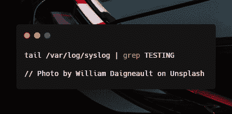
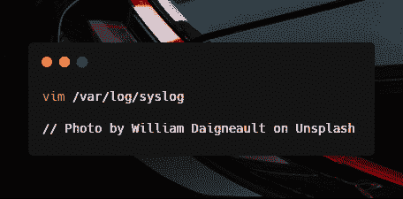
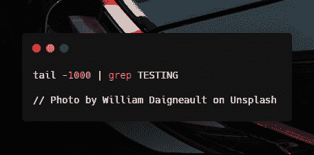

# 有没有因为树木而错过了森林？

> 原文：<https://dev.to/david_j_eddy/ever-miss-the-forest-for-the-trees-3jnk>

几天前，当我在一个自动化项目中工作时，我发现自己在 Linux 日志子系统中记录进度。这已经足够好了，因为它给了我一个中央位置来转储消息，而不必安装另一个系统依赖项。这也为每个人在调试问题时提供了一个查看的地方。“日志怎么说”是当事情不按预期运行时我对自己说的第一句话。但是当日志不再说...有发现吗？

所以我一路开着卡车，一切都很好。完成一个又一个任务。然后我的信任日志读取命令停止工作。

<figure> 

<figcaption>有用的小命令我年前捡的。</figcaption>

</figure>

我想还行。没问题，于是我开始了故障排除过程。可能应用程序没有安装？不，它是。或许证件过期了？不，他们很好。CLI 身份验证有效。好了，我回滚了几个提交，然后 **boom** 消息又回来了。是时候把它分解成原子部分了。所以在接下来的一个小时里，我一次提交一个，看看问题第一次出现在哪里。(这是使用 Git 等分的好时机，但是我没有:(。)

一个接一个的提交，检查进程。每次都使用下面的方法来检查系统日志。

<figure> 

<figcaption>我的确知道如何退出 Vim :D.</figcaption>

</figure>

从两小时前一直到当前提交；一切都像预期的那样工作。此时，我已经达到了两个小时“我被卡住了”的极限，所以我联系了一位同事，要求进行一次橡皮鸭会议。他们同意了，过来和我坐在一起。

我解释了最终目标是什么，我是如何制定解决方案的，问题的开始，我尝试了什么，并展示了当前状态。`Vim`查看日志有效，但是`tail ... | grep...`查看日志...AARRGRGG！我一说出这句话，就知道问题出在哪里了。

**尾**只打印最后的 **10 行到标准输出**。所以 grep 只有 10 行代码。随着我的进程长度的增加，日志消息超过了 10 行。为了证实这一点，我试着:

<figure> 

<figcaption>齐终端截图工具</figcaption>

</figure>

果然，消息就在那里。字体我想这只是其中一件事。

你呢？每一次深入某件事你都忽略了明显的事实？