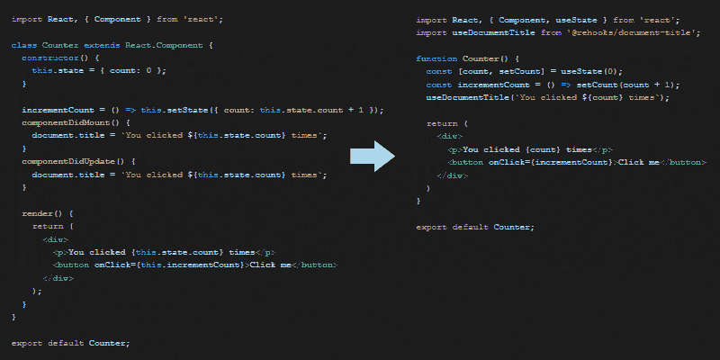

# 创建自定义 React 挂钩所需的一切

> 原文：<https://dev.to/progresstelerik/everything-you-need-to-create-a-custom-react-hook-47kl>

让我们学习如何创建一个自定义的 React 钩子，以及使用钩子时必须记住的所有规则。

钩子只是函数！任何函数都可以成为钩子。React 团队已经发布了很多关于如何使用基本和高级钩子的信息，他们也有关于如何自己创建定制钩子的很好的信息。我已经报道这个话题好几个月了，现在我想把我所知道的关于他们的一切集中到一个话题上。创建您自己的定制挂钩，您可以轻松地与他人分享，并可以作为您决定创建的任何其他定制挂钩的模板或灵感。我觉得 [ReactJS](https://reactjs.org) 网站上的文档已经详尽地介绍了这个主题，但我担心的是缺少一个非常简单的例子，我相信这个例子会让你真正明白这个想法。

在这篇博文中，我采取了一种迂回的方式来解释这个例子。这是因为我希望您为创建自定义挂钩做好准备。虽然它们非常类似于创建一个基本函数，但是在开始自己创建定制钩子之前，您需要了解更多的信息。如果你还没有读完 hooks，我已经提供了一些必读资料以及我写的一些关于这个主题的文章。在我们进入定制钩子之前，浏览这些文章可能更容易。我建议首先理解 React Hooks API，然后弄清楚如何创建自己的钩子，我将在本文末尾简单介绍。

### ReactJS.org 文档

[React Conf 重述](https://reactjs.org/blog/2018/11/13/react-conf-recap.html)

[React v16.8:带钩子的那个](https://reactjs.org/blog/2019/02/06/react-v16.8.0.html)

[引入钩子](https://reactjs.org/docs/hooks-intro.html)

[API 参考](https://reactjs.org/docs/react-api.html#hooks)

### 我的基本挂钩文章

[状态和效果的基本反应挂钩](https://dev.to/progresstelerik/how-to-use-basic-react-hooks-for-state-and-effects-4bld)

[上下文的基本反应挂钩](https://dev.to/progresstelerik/how-to-use-basic-react-hooks-for-context-45pp-temp-slug-9116858)

[减速器的基本反应挂钩](https://dev.to/progresstelerik/how-to-use-basic-react-hooks-for-reducers-4nfo-temp-slug-1109404)

## 让我们重温一下基本的钩子

如果您觉得自己对基本钩子有足够的了解，可以直接跳到创建定制钩子。

我不打算再讨论所有的基本钩子，我认为我们只需要回顾其中的一个:钩子。我在阅读 ReactJS.org 的[文档](https://reactjs.org/docs)时了解到有两种使用`useEffect`的方法。不清理可以用[，清理](https://reactjs.org/docs/hooks-effect.html#effects-without-cleanup)可以用[。这些术语是我希望任何一个正在使用 hooks 的人都知道的，或者花几分钟时间通过我刚才提供的链接来理解。](https://reactjs.org/docs/hooks-effect.html#effects-with-cleanup)

有了类，在钩子可用之前，副作用被放在许多生命周期方法中的一个中，如:`componentDidMount`或`componentDidUpdate`。如果我们在这两种方法中使用了重复的代码(对安装和更新执行相同的效果),我们现在可以在一个功能组件中做这些事情，而且我们只需要一个钩子就可以做到。没错，我说的就是`useEffect`。

`useEffect`告诉 React 我们的组件需要在组件渲染后做一些事情。它在第一次渲染和每次更新后运行。在我以前的文章中，我只讨论了没有清理的副作用，所以我们需要从今天开始学习，理解如何允许一个功能组件有清理的副作用。我认为，为了理解如何创建我们自己的钩子，我们需要完全理解`useEffect`,因为它不仅是钩子的一个典型例子，而且我们稍后将在我们的定制钩子中使用它。

就像我说的，有些效果不需要清理，它们很简单，比如我们已经学过的，比如更新文档标题。

```
useEffect(() => {
  document.title = `You clicked ${count} times`;
}); 
```

如果您确实需要运行清理，您可以从`useEffect`返回一个函数。这是可选的，但是允许你在你的效果之后和任何新的效果运行之前运行一些代码。在效果清理过程中，您订阅的内容可能需要取消订阅。React 将在卸载时执行这种清理。

```
useEffect(() => {
  console.log("Subscribe to Something);
  return function cleanup() {
    console.log("Unsubscribe to Something);
  };
}); 
```

上面的效果将在每个渲染上运行不止一次。在运行下一个渲染的效果之前，React 会清除上一个渲染的效果，这一点需要注意。关于为什么钩子会在每次更新时运行的解释，请查看 ReactJS 文档。但是请记住，如果这种行为会导致性能问题，可以选择不使用。

我们还可以通过使用可选参数跳过效果来优化性能。例如，也许我们不想运行订阅/取消订阅效果，除非某些 id 已经更改。看看下面的例子来理解如何做到这一点，这相当简单！

```
useEffect(() => {
  console.log("Subscribe to Something);
  return () => {
    console.log("Unsubscribe to Something);
  };
}, [props.something.id]); // only if something.id changes 
```

我还想提一下，如果您的`useEffect`中有不相关的逻辑，您应该尝试将不相关的代码重构到它自己的`useEffect`中。您想打多少个`useEffect`电话都可以。例如，上面的两个`useEffect`调用可能在同一个功能组件中。这是允许的。

钩子允许基于代码在做什么而不是它在哪个生命周期方法中来分割代码。当我们只有类和生命周期方法时，这就产生了一系列的问题。现在，使用多个`useEffect`方法，React 可以按照指定的顺序应用每个效果。这对于在应用程序中组织代码有很大的好处。

## 使用钩子的明显好处

作为开发人员，钩子对我们有很多好处，它们将更好地改变我们编写组件的方式。它们已经帮助我们写出更清晰、更简洁的代码——就像我们进行了代码节食，我们瘦了很多，我们看起来更好，感觉更好。它突出了我们的下颌线，让我们感觉脚趾更轻。这是一个真正对我们有用的改变。看看 React Hooks 为别人做过什么就知道了！

[](https://res.cloudinary.com/practicaldev/image/fetch/s--ZpGWzdKN--/c_limit%2Cf_auto%2Cfl_progressive%2Cq_auto%2Cw_880/https://d585tldpucybw.cloudfront.net/sfimages/default-source/default-album/transformation.png%3Fsfvrsn%3De8caf499_1)

玩笑归玩笑，Hooks 确实能减肥。它减少并使我们的代码更易读、简洁和清晰。为了演示，让我们来看看我们的规范“文档标题效果”的类版本，并看看我们过去如何编写类似这样的内容与使用 npm 安装的钩子做同样事情的例子之间的区别。

下面的并排显示了组件如何减轻了一点重量。在这个简单的例子中，我们不仅节省了大约五行代码，而且可读性和可测试性也随着大多数钩子转换而提高。此外，我们可能会在代码中遇到许多情况，我们有机会做出这样的更改，因此它可能会对单个代码库产生重大影响。这一变化给我们带来了很多积极的好处。下面的代码可以在 StackBlitz 演示中看到:之前的[和](https://stackblitz.com/edit/react-state-hook-04?file=Counter.js)之后的

[](https://d585tldpucybw.cloudfront.net/sfimages/default-source/default-album/beforeandafter.gif?sfvrsn=8a30f722_1)

在我们创建自己的定制钩子之前，我想再谈一件事。我想复习一下使用钩子的五条规则。这些是 React 团队传递给我们的，因此了解它们非常重要，有助于防止您创建错误的代码。它将帮助我们认识到什么代码需要进入钩子，什么代码不需要。

## 挂钩五大法则

在我们创建自己的钩子之前，让我们回顾一下我们必须始终遵循的一些主要规则。

1.  不要从循环、条件或嵌套函数中调用钩子
2.  钩子应该位于组件的顶层
3.  仅调用 React 功能组件的挂钩
4.  永远不要从常规函数中调用钩子
5.  钩子可以调用其他钩子

如果你愿意，你可以用一个 [ES Lint 插件](https://reactjs.org/docs/hooks-rules.html#eslint-plugin)在你的团队中执行这些规则。在同一页上[也有很好的解释](https://reactjs.org/docs/hooks-rules.html#explanation)为什么需要这些规则。请随意阅读，大约五分钟。

## 创建一个你自己的定制钩子

我真的很喜欢最近由 [Adam Rackis](https://twitter.com/AdamRackis) 在推特上发布的一些东西:[钩子释放出的构图水平远远高于我们见过的任何东西](https://twitter.com/AdamRackis/status/1095408337498316805)关于钩子，我想让你了解的是，我们所看到的所有关于类的巨大变化，以及我们有如此多的组合选择，现在这些都可以在钩子中得到。这意味着，现在当谈到 React 中功能组件的组成时，我们的手不会被束缚。对于 React 开发者来说，这是一个巨大的进步。

定制钩子是名称以`use`开头的 JavaScript 函数，它可以调用其他钩子。所以自定义钩子仅仅是一个普通的函数。通过在开头添加单词`use`,它让我们知道这个特殊函数遵循我们在上一节中陈述的钩子规则。

我浏览了上面所有的信息，因为我真的希望你能够理解何时、何地以及如何使用钩子。现在，我们将在本文中做最后一件事。我们将采用我所知道的我们已经知道的最简单的逻辑，并创建我能想到的最简单的定制钩子。

如果你还记得，我们有一个如何使用`useEffect`钩子更新文档标题的例子。嗯，这似乎是我们可能想要在几个页面上或在应用程序的几个不同功能组件中做的事情。当某种类型的信息改变时，我们希望用某种类型的字符串更新文档标题。此外，我们不想在每个功能组件中重复这个逻辑。我们首先将这段代码提取到同一页面上的一个本地钩子中，然后看看如何将同一个钩子导入到许多组件中并放在一起。很简单，对吧？

所以我们知道钩子可以调用钩子。如果这是真的，那么我们的自定义钩子也可以调用 React 核心基本钩子之一，比如`useEffect`。你明白我的意思了吗？让我们来看一个再次更新文档标题的功能组件。下面的代码也可以在[这个 StackBlitz 的例子](https://stackblitz.com/edit/react-state-hook-05?file=Counter.js)中看到。

```
import React, { Component, useState, useEffect } from 'react';

function Counter() {
  const [count, setCount] = useState(0);
  const incrementCount = () => setCount(count + 1);
  useEffect(() => {
    document.title = `You clicked ${count} times`
  });

  return (
    <div>
      <p>You clicked {count} times</p>
      <button onClick={incrementCount}>Click me</button>
    </div>
  )
}

export default Counter; 
```

所以我们在这里要做的是创建一个自定义的钩子，我们将一段文本传递给它，钩子为我们更新文档标题。让我们首先来看看创建这个定制钩子所需的代码:

```
const useDocumentTitle = (title) => {
  useEffect(() => {
    document.title = title;
  }, [title])
} 
```

从上面你可以看到，我们真正需要这个钩子作为参数的是一串文本，我们称之为`title`。在钩子内部，我们调用 React Core 的基本`useEffect`钩子，只要标题改变就设置标题。`useEffect`的第二个参数将为我们执行检查，只有当它的本地州与我们传入的州不同时才更新标题。你的意思是，创建一个自定义钩子就像创建一个函数一样简单？是的，它的核心就是这么简单，而且这个函数可以引用任何其他的钩子。该死的...创建自定义挂钩比我们想象的要容易！

让我们回顾一下我们的整体功能组件现在是什么样子。你会看到我把旧的对`useEffect`的调用注释掉了，上面是我们如何使用自定义钩子来代替它。这可以在[更新的 StackBlitz 演示中查看](https://stackblitz.com/edit/react-custom-hook?file=Counter.js) :

```
import React, { Component, useState, useEffect } from 'react';

const useDocumentTitle = title => {
  useEffect(() => {
    document.title = title;
  }, [title])
}

function Counter() {
  const [count, setCount] = useState(0);
  const incrementCount = () => setCount(count + 1);
  useDocumentTitle(`You clicked ${count} times`);
  // useEffect(() => {
  // document.title = `You clicked ${count} times`
  // });

  return (
    <div>
      <p>You clicked {count} times</p>
      <button onClick={incrementCount}>Click me</button>
    </div>
  )
}

export default Counter; 
```

让我们再清理一下，看看如果这个钩子是由某个 npm 包提供的，而不是复制粘贴在我们文件的顶部，我们会如何使用它。我将展示下面的代码以及到一个[更新的 StackBlitz 演示](https://stackblitz.com/edit/react-custom-hook?file=Counter.js)的链接。

```
import React, { Component, useState } from 'react';
import useDocumentTitle from '@rehooks/document-title';

function Counter() {
  const [count, setCount] = useState(0);
  const incrementCount = () => setCount(count + 1);
  useDocumentTitle(`You clicked ${count} times`);

  return (
    <div>
      <p>You clicked {count} times</p>
      <button onClick={incrementCount}>Click me</button>
    </div>
  )
}

export default Counter; 
```

这太棒了，但是我还想让你注意到，我现在不必在我的功能组件中导入`useEffect`，因为我从 npm 包中导入的钩子已经处理好了。因此，如果我不需要在我的功能组件中使用`useEffect`，因为`useDocumentTitle`钩子已经为我做了，我可以省略那个导入。我希望这说明了创建自定义 React 钩子的基本知识，并且即使是这样一个简单的例子也能让你看到它的强大之处。

这里是两个 StackBlitz 的例子，如果你想把它们分开来玩的话！

1.  [从现有代码中提取一个自定义钩子](https://stackblitz.com/edit/react-custom-hook?file=Counter.js)
2.  [从 NPM 或共置文件导入一个钩子](https://stackblitz.com/edit/react-custom-hook-npm?file=Counter.js)

非常感谢 [Amit Solanki](https://github.com/iamsolankiamit) 将这个[文档标题 Hook](https://github.com/rehooks/document-title) 作为一个 npm 包提供，也非常感谢 [Adam Rackis](https://twitter.com/AdamRackis) 在一条精彩的推文中对 Hooks 做出了如此深刻的展望，激发了我写这个主题。开发者社区已经接受了钩子，当一个框架的新特性第一次发布时，不能总是这样说。我还想感谢 React 团队在这些特性上花费的时间，确保他们从社区中获得充分的反馈，并采取逐步采用的策略来推出这一令人惊叹的革命性产品！

这个演示是我能想到的说明如何创建一个 React 钩子的最简单的例子，我想不出更好的第一个钩子来介绍给你，以便让你考虑创建你自己的定制钩子！要发现更多可以复制并粘贴到代码或 npm 安装中的 React 挂钩，最简单的方法是访问以下 GitHub 相关链接:

[复制粘贴流行 React 挂钩](https://reacthooks.surge.sh/)

[牛逼 React 挂钩](https://github.com/rehooks/awesome-react-hooks)

[收藏 React 挂钩](https://github.com/nikgraf/react-hooks)