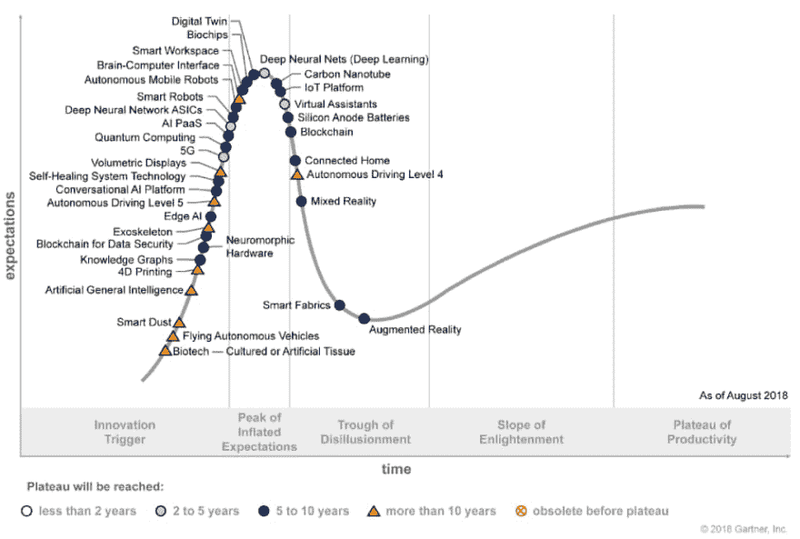
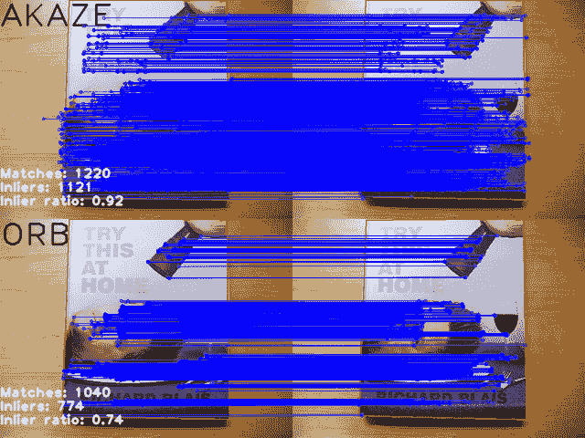
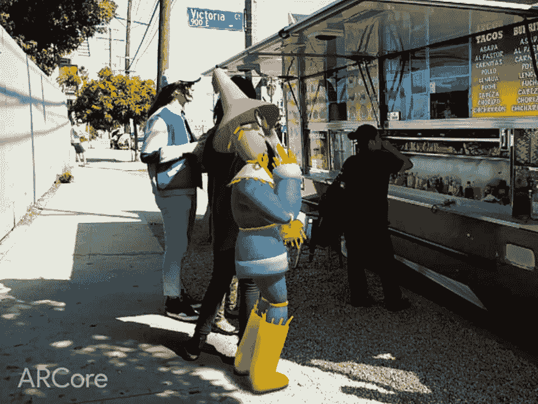
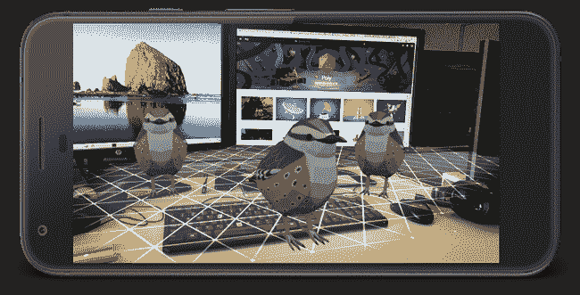

# 从移动开发者的角度看增强现实的发展📱

> 原文：<https://dev.to/mikeborodin/evolution-of-augmented-reality-as-seen-by-a-mobile-dev-11nf>

新事物的惊人之处...
我想每个人在某个时候都有过这种感觉。
当我大约 6 年前开始学习编程时，我从前端的东西开始——只是普通的 HTML 和 CSS。我创建的第一个东西是一个疯狂的网页，充满了圆形图像和:悬停不透明效果。今天当我读它的时候，它听起来很傻，但是那一次感觉真的很棒。几年后，同样的感觉和随机决定的结合让我走到了现在的位置。

在这里，我将分享一些我在过去几年中观察到的增强现实的发展。这篇文章是为初学者准备的。

 
来源:【www.smartinsights.com】T4

炒作周期。

炒作周期是一种技术从概念到成熟和广泛采用所经历的生命周期阶段的图形表示。在这里，我们看到 AR 目前显示在幻灭低谷的底部

> “随着实验和实施的失败，人们的兴趣减弱了。这项技术的生产者要么出局，要么失败。只有生存下来的供应商改进他们的产品，让早期用户满意，投资才会继续。”

事实上，一款名为 Pokemon Go 的热门应用程序在 2016 年 7 月 6 日震撼了我们的大脑，但对我个人来说，它从长远来看是失败的。对我来说，观察世界如何接受 AR 很有趣，因为在那一刻，我已经在尝试在这个领域做一些事情。

### 👓OpenCV

我第一次看到 opencv AR 的实际应用是一个简单的 python 脚本，它将一幅图像覆盖在一本书的封面上。经过一些研究后，我决定在 Android 上做同样的事情，所以我安装了 NDK，并用 C++重写了所有东西。OpenCV 是一个非常强大的通用工具，它提供了一个 onDrawFrame()方法，由你来处理每一帧。
所以我尝试应用不同的算法，比如 SURF、SIFT、ORB、KAZE、AKAZE 和其他算法来帮助我找到目标图像和帧位图之间的匹配。
当然，你必须编写 OpenGL 代码，才能在屏幕上显示一个多边形🙃。
由于某种原因，Android 和 PC 上的同一个库有不同的性能。在移动设备上要慢得多。

 
来源:opencv.org

### 💪AR 框架的竞争

在与 OpenCV 斗争了一段时间后，我发现了 Vuforia、ARToolkit、Wikitude 等移动 AR SDKs。有很多文章对所有这些 SDK 进行了比较，所以我不打算详细介绍。

我首先尝试了 Vuforia，它在跟踪和性能方面明显更好，但它也有一些限制，没有互联网连接就无法工作，并且不允许在运行时创建 *ImageTargets* 。同样，你必须用纯 OpenGL 渲染一切。
所以我寻找替代品，先尝试 EasyAR，然后换成 Kudan。它比 Vuforia 对开发者更友好，并且提供了一个简单的渲染引擎来满足我的需求。我考虑过 Wikitude，它有很多特性，但当时它没有为独立开发者提供一个好的定价方案。

 
来源:vuforia.com

### ⚽ ARKit & ARCore:更大的玩家

首先是 iOS，他们设法推出了苹果的 AR 平台 ARKit。
后来推出了 ARCore。
它们都提供平面检测、照明和一些 2d 图像跟踪。
它们都有一个高级内容呈现框架，SceneKit 和 SceneForm。
(这很好，因为你不需要在 opengl 中手动绘制一切)。
另一个很酷的功能是 GLTF 支持。
ArCore 在某些方面仍然落后于 ARKit。(例如图像跟踪)
ArCore 仍然支持不多的设备，而 ArKit 几乎可以在苹果最近的所有移动设备上运行。

那些拥有自己的移动 AR SDKs 的公司都发生了什么？我认为这里唯一的方法不是竞争而是融合。我看到他们中很少有人(Vuforia 和 Wikitude)在设备支持的情况下使用 ArKit / ArCore，而在设备不支持的情况下使用他们自己的实现。这就是他们如何在不输掉游戏的同时发挥自己的特色。

 
来源:【www.imore.com】T4

总结一下，现在我们作为开发人员有了最强大的 AR 工具，比以往任何时候都更容易开始并将您的想法付诸实践。

感谢阅读！😉

 
来源:developers.google.com

请随意分享:

你是怎么来到 AR 开发的？你认为这项技术的前景如何？你喜欢看这样的帖子吗？