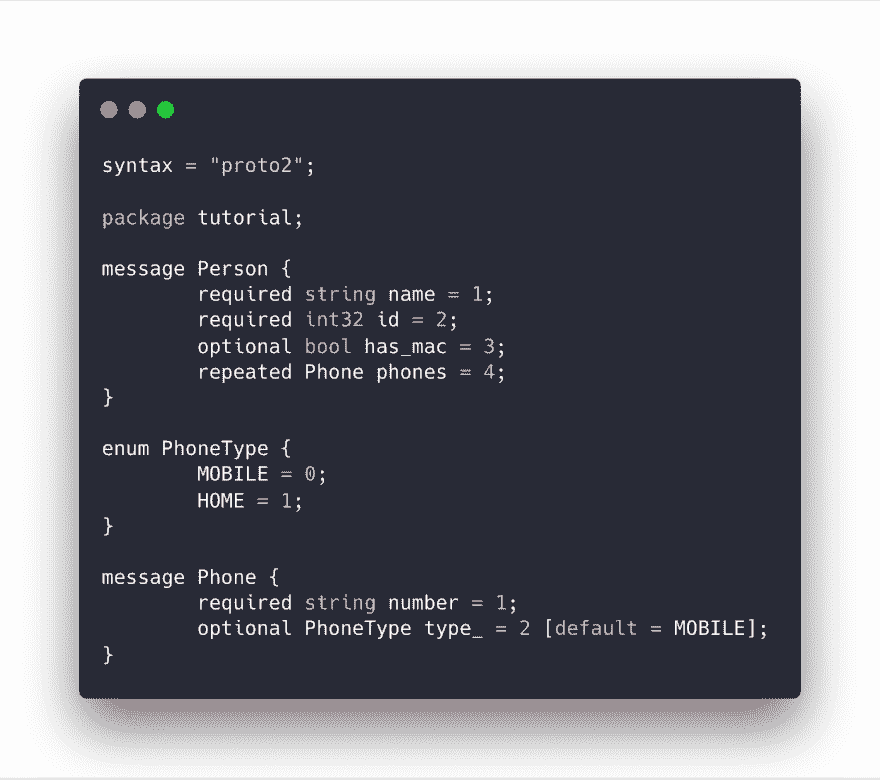

# 用 Python 探索 Google Protobuffers

> 原文：<https://dev.to/chen/exploring-google-protobuffers-with-python-1gmd>

你正在做一个新项目，仍然在高层次的设计中。你写下需求:*我要解决什么？*
你把它搞清楚，略述主要事项。你考虑你将使用什么工具(哪种编程语言，或技术)。
在深入编码之前，您还需要执行几个步骤。

这是一个新项目的快速启动。你现在需要考虑数据的**结构(类、接口等)。)**

这个阶段你要考虑的一件事就是*序列化*。你如何保存你的数据，是保存到本地文件系统还是保存在网络上？(你还不能仅仅通过网络发送对象:)

> 协议缓冲区是序列化结构化数据的一种方法。它在开发程序以通过线路相互通信或存储数据时非常有用。(维基百科)

在本文中，我将探索它是什么以及如何在 Python 中使用它。

# 什么事

Google 的[文档](https://developers.google.com/protocol-buffers/docs/overview)对 protobuffers 的定义是:

> 协议缓冲区是一种灵活、高效、自动化的结构化数据序列化机制——比如 XML，但是更小、更快、更简单。一旦定义了数据的结构化方式，就可以使用专门生成的源代码，使用各种语言轻松地将结构化数据写入各种数据流或从中读取。您甚至可以更新您的数据结构，而不会破坏针对“旧”格式编译的已部署程序。

**TL；博士**

> 您在*中定义您的“消息”(数据结构)。proto* 文件，并获得在用不同语言编写的不同服务之间交换数据的能力。它比 JSON/XML 更小，更快。维护起来也容易很多。

# 如何使用

使用 protobuffers 的第一步是为数据定义*结构。*
protobuffers 的结构是*消息*，其中每个消息都是一个小的信息逻辑记录，包含一系列名-值对，称为字段。

接下来，使用 protobuffers 编译器(**protocol**)生成所需语言的源代码(来自*)。proto* 文件)。
这些为数据提供了访问器，以及将数据结构序列化/解析为**二进制格式**的方法。

让我们看一个例子。我将使用 Python 解释器来*检查*由 protobuffers 创建的 Python 对象。
另外，我展示了一个如何编译相同的*的例子。proto*Go 源代码。

[](https://res.cloudinary.com/practicaldev/image/fetch/s--OtnmSfVe--/c_limit%2Cf_auto%2Cfl_progressive%2Cq_auto%2Cw_880/https://thepracticaldev.s3.amazonaws.com/i/a11udlcyzda92ng0b2g1.jpeg)

## 准备

在我们开始之前，你需要在你的操作系统上安装 [Google Protobuffers](https://github.com/protocolbuffers/protobuf) 。以下是对 **Mac OS** 的说明，你可以在文档中找到对其他 OS 的说明:

1.  下载[包](https://github.com/protocolbuffers/protobuf/releases) &解压 tar.gz 文件
2.  cd 放入目录并运行`./autogen.sh && ./configure && make`
    1.  如果编译失败，用 brew 安装所需的依赖项:`brew install autoconf && brew install automake && brew install libtool`
3.  步骤 2 成功后，运行以下命令:
    1.  进行检查
    2.  sudo make 安装
    3.  哪个协议和协议版本

最后一步验证*协议*已经安装并位于您的*路径*中，然后打印其版本。

我们还需要 Python 和 Go 的相关插件，这样我们就可以用这些语言编译输出源代码文件。

*   对于 Python: `pip3 install protobuf`
*   对于 Golang:
    *   验证是否设置了 GOPATH，以及 GOPATH/bin 是否在 PATH env 变量中
    *   `go get -u github.com/golang/protobuf/protoc-gen-go`

*。我要使用的 proto* 文件很简单，代码片段如下。然后，我要让源代码为 Python 所用，并退出它。
这是我的数据结构；我们来探索一下。

[](https://res.cloudinary.com/practicaldev/image/fetch/s--uwWyVLgZ--/c_limit%2Cf_auto%2Cfl_progressive%2Cq_auto%2Cw_880/https://thepracticaldev.s3.amazonaws.com/i/idlsvmd0pobwqu0qhz0v.png)

该文件是自解释的，你可以在谷歌 Protobuff 文档中阅读更多关于它的结构。
让我们看看如何使用它。

要生成一个 Python 文件，你需要执行`protoc -I=$SRC_DIR --python_out=$DST_DIR $SRC_DIR/Person.proto`
它生成一个我们将要使用的名为`Person_pb2.py`的文件。该文件相当大，所以我不会把它放在这里，但我鼓励您亲自尝试一下
并检查该文件。(以上*。proto* 文件生成 **165 行**的 python 代码！)

# 探索

给我看看代码！

```
Python 3.7.0 (default, Sep 16 2018, 19:30:42)
[Clang 9.1.0 (clang-902.0.39.2)] on darwin
Type "help", "copyright", "credits" or "license" for more information.
>>>
>>> import Person_pb2
>>> p = Person_pb2.Person()

# The imported model contains a class defined by our message
# Let's inspect what attributes are there on the object,
# Using the DESCRIPTOR of our object. 
>>> p.DESCRIPTOR.fields_by_name.keys()
['name', 'id', 'has_mac', 'phones']
>>> p.name
''
>>> p.name = 'Gnosis'
>>> p.id = 4
>>> p.phones
[]

# Let's add phone elements to the list (the repeated type) 
>>> pho = p.phones.add()
>>> pho.number = '1800-500-501'
>>> pho.type_ = Person_pb2.MOBILE
>>> pho
number: "1800-500-501"
type_: MOBILE

>>> p
name: "Gnosis"
phones {
  number: "1800-500-501"
  type_: MOBILE
}

# You can also create Phone objects without adding them to person 
>>> phone = Person_pb2.Phone()
>>> phone.DESCRIPTOR.fields_by_name.keys()
['number', 'type_']

>>> phone.number = '1800-500-500'
>>> phone.type_ = Person_pb2.MOBILE
>>> phone
number: "1800-500-500"
type_: MOBILE

# Which we can later add it to our object using extend 
>>> p.phones.extend([phone])
>>> p
..
phones {
  number: "1800-500-501"
  type_: MOBILE
}
phones {
  number: "1800-500-500"
  type_: MOBILE
}

# We can check if certain field is defined on our object 
>>> p.HasField('name')
True

# Okay, let's see how we serialize this object 
>>> p.SerializeToString()
Traceback (most recent call last):
  File "<stdin>", line 1, in <module>
google.protobuf.message.EncodeError: Message tutorial.Person is missing required fields: id

# Ooops, we didn't set a required field. This causes serialization operation to fail. >>> p.id = 4
>>> p.SerializeToString()
b'\n\x06Gnosis\x10\x04"\x10\n\x0c1800-500-500\x10\x00"\x10\n\x0c1800-500-500\x10\x00"\x10\n\x0c1800-500-500\x10\x00'
>>>
>>> b = p.SerializeToString()
>>> b
b'\n\x06Gnosis\x10\x04"\x10\n\x0c1800-500-500\x10\x00"\x10\n\x0c1800-500-500\x10\x00"\x10\n\x0c1800-500-500\x10\x00'
>>> type(b)
<class 'bytes'>  # We can save this binary to disk or send it on the wire to another service.  # Then we simply load it with a new object.  # We create a new object and use ParseFromString method to load it's data

>>> new_p = Person_pb2.Person()
>>> new_p.ParseFromString(b)
64
>>> new_p
name: "Gnosis"
id: 4
phones {
  number: "1800-500-500"
  type_: MOBILE
}
phones {
  number: "1800-500-500"
  type_: MOBILE
}
phones {
  number: "1800-500-500"
  type_: MOBILE
} 
```

你感觉到了。每个*消息*变成一个*类*，一个*重复*字段定义一个*列表*。
必需和可选*的区别在于，如果*必需*字段没有初始化，那么当你*序列化*对象时，会有一个
提示性异常。对于可选的*字段，这种情况不会发生。

我用的是同一个*。proto* 文件生成我在 **Go** 中的源代码。
为了生成 Go 代码，您执行`protoc -I=. --go_out=. ./Person.proto` ( **199** 行代码)

您将需要 golang protobuf 插件，并在。原型文件

# 什么时候以及为什么要使用它

Protobufs 并不适合每个人或每个项目。它有一些开销，你需要学习和维护另一种语言。您还需要在每次对数据结构进行更改时编译代码。

protobufs 的最佳用例是当有两个(或更多)服务需要通信时。如果服务是用不同的语言编写的，这是 protobufs 的另一个优势。因为服务(计算机)不需要人类可读的数据；他们用二进制位(*二进制位*)工作得更快。

*想象一个场景:*两个开发团队需要在他们之间共享数据(他们使用不同的编程语言，比如 Python 和 Go)。每个团队都需要定义他们自己的数据结构，为了两个应用程序能够很好地通信，他们需要相同的数据结构。
通常，当你处于开发过程的设计阶段时，这没什么大不了的。更难的部分是保持这些数据结构的发展，并让每个人都参与进来。

有了 protobuf，我们有了一个更好的解决方案。

您在一个*中定义您的数据。原型*文件**一次**，在一个单独的共享项目中。
每个团队**使用**项目生成他们编程语言的源代码。
当你需要添加更多的字段到数据中时，你可以在数据源中扩展它们*。proto* 文件和**重新编译**它们。
然后，提醒其他团队他们需要**重新编译**，并对他们的源代码进行必要的更新。

protobuf 的另一个很酷的特性是向后兼容性支持。即使其他团队使用旧版本，服务也不会中断。它只是不支持新数据。那不是很神奇吗？我们免费获得向后兼容性。

## 优点

*   定义你的数据结构**一次**,然后用你需要的任何编码语言(支持的)生成源代码
*   它更易于维护，在*中只管理你的数据结构的一个源代码。原型*
*   它比 JSON / XML 的大小更有效(与字符串相比，它是二进制的)
*   快速序列化
*   类型安全
*   向后兼容性

## 弊端

*   更小的社区，缺乏知识。您可以通过 JSON 或 XML 找到更多的文档、示例和博客文章
*   它不是人类可读的

# 结论

当您坐下来设计应用程序的需求时，您会考虑摆在桌面上的选项的利弊。考虑到利弊，我认为我们可以得出这样的结论:当一个人或一个浏览器是数据的消费者时，使用 JSON 可能更好，因为它是现成的人类可读的，从而节省我们的时间。不需要解组数据。
**但是**，如果你有两个*服务*需要在它们之间进行通信，protobuf 有这么多的优势，你至少应该考虑把它作为一个解决方案。

我强烈建议你自己试试 protobuf。他们比我在这里提到的有更多的优势。这更多的是如何发布，*探索由 *protobuf* 生成的*数据。

*更多信息参考资料*

1.  [如何分配给重复字段(SO)](https://stackoverflow.com/questions/23726335/how-to-assign-to-repeated-field)
2.  [谷歌的文档](https://developers.google.com/protocol-buffers/docs/overview)