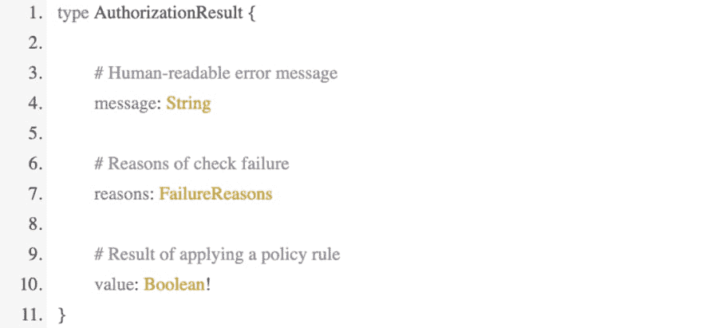
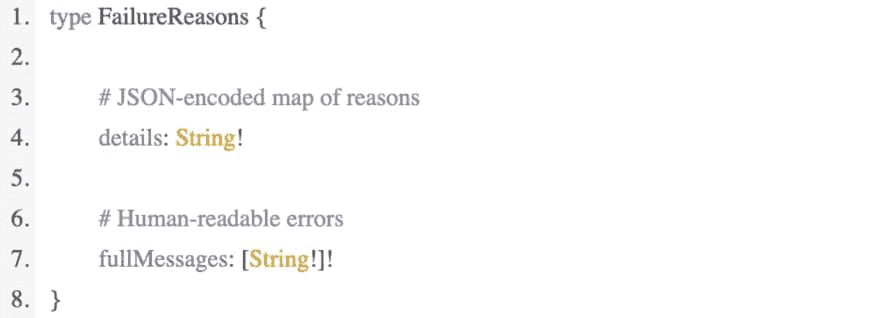

# 使用操作策略公开 GraphQL APIs 中的权限

> 原文：<https://dev.to/evilmartians/exposing-permissions-in-graphql-apis-with-action-policy-1mfh>

今天，我正在“庆祝”我使用 GraphQL 生产 Rails 应用的周年纪念日——1 年了，充满了尝试和错误、失败和成功、 *wtf* -s 和[成功](https://dev.to/evilmartians/active-storage-meets-graphql-direct-uploads-3n38)。

[](https://res.cloudinary.com/practicaldev/image/fetch/s--DDokdZg1--/c_limit%2Cf_auto%2Cfl_progressive%2Cq_auto%2Cw_880/https://thepracticaldev.s3.amazonaws.com/i/ec54litfkgkgpw527q8i.png)

作为一个开源迷，我特别喜欢使用 GraphQL:这是一项相当年轻的技术，因此有很多机会做出贡献(至少在 Ruby world 中)和进行实验。

现在我正在展示一个这样的实验的结果——[`action_policy-graphql`gem](https://github.com/palkan/action_policy-graphql),它将 [GraphQL Ruby](https://graphql-ruby.org) 和[动作策略](https://actionpolicy.evilmartians.io/)授权库粘合在一起。

## 等等，行动方针，是 ist das*？

**“这是什么”德语(写这篇文章的时候，我正在听拉姆斯坦的歌🎸)*

大约在我开始使用 GraphQL 的同时，我向世界展示了一个新的 Ruby 授权库， [Action Policy](https://actionpolicy.evilmartians.io/) (在 RailsConf 2018 上的[)。](https://www.youtube.com/watch?v=NVwx0DARDis)

行动策略是从我过去几年从事的多个项目中提取出来的。它在意识形态上类似于[权威人士](https://github.com/varvet/pundit)(最初是在它的基础上构建的)，但提供了一系列开箱即用的附加功能(并且在内部有一个非常不同的架构*)。*

这些特性之一是能够提供关于*为什么*授权检查失败的附加上下文-[**失败原因**](https://actionpolicy.evilmartians.io/#/reasons) 跟踪。

这个特性在很长一段时间里都是一匹黑马，我们很少使用它(主要是为了调试目的)，直到我们开始与 GraphQL 合作——那就是丑小鸭变成美丽天鹅的时候。

> 要了解更多关于行动政策及其特点的信息，请查看我今年早些时候在 [Seattle.rb](http://www.seattlerb.org) 发表的最新演讲的幻灯片:【https://speakerdeck.com/palkan/seattle-dot-rb-2019-a-denial】T2。

## 授权& GraphQL

> *授权*是给予某人做某事的官方许可的行为(不要与[认证](https://en.wikipedia.org/wiki/Authentication)混淆)。

每当我们在代码中“询问”时，“允许用户这样做吗？”我们执行授权行为。

在处理 GraphQL 时，这个问题可以分成更具体的问题:

*   是否允许用户与对象(特定类型或图中的特定节点)进行交互？
*   是否允许用户执行此突变或订阅此订阅？

另一个相关的方面是*数据范围*:根据用户的权限过滤集合，而不是检查每一项。

`graphql` gem 提供了基本的[授权支持](https://graphql-ruby.org/authorization/authorization.html)(通过`#authorized?`钩子)和[范围支持](https://graphql-ruby.org/authorization/scoping.html)(通过`#scope_items`钩子):它在开始时可能足够好，但是由于样板文件的数量而不能很好地扩展。

这就是我开始开发 [`action_policy-graphql` gem](https://github.com/palkan/action_policy-graphql) 的原因——为字段授权和作用域提供更好的 API(类似于你在 [GraphQL Pro](https://graphql.pro) 中看到的用于`pundit`和`cancancan`的 API)。现在我们这样描述我们的 API:

```
# field authorization example (`authorize: true`)
field :home, Home, null: false, authorize: true do
  argument :id, ID, required: true
end

# data scoping using policies (`authorized_scope: true`)
field :events, EventType.connection_type, null: false, authorized_scope: true 
```

这个实现在内部使用了 [*字段扩展*](https://graphql-ruby.org/type_definitions/field_extensions.html) ，这比在`#authorized?`和`#scope_items`钩子上构建更加灵活。

问题似乎得到了解决:使用 API 中策略类中定义的授权和作用域规则来检查权限和引发异常变得毫不费力(*“访问被拒绝！”*)。尽管后一种方式——引发异常——并不是通知用户缺少权限的最佳方式。

如何防止这些异常， ***告诉*前端客户端，哪些动作是允许的，哪些是不允许的**？

## 让客户了解自己的权利

[将当前用户的权限](https://github.com/palkan/action_policy/issues/69)信息*下推*到客户端(前端/移动应用)的问题并不新鲜；它在 GraphQL 诞生前几年就存在了。

这个问题可以转化为下面的问题:*如何让客户端知道哪些动作是允许给用户的(并显示/隐藏特定的按钮/链接/控件)*？

怎么解决？

例如，您可以尝试只传递*授权模型*(角色、权限集)并在客户端实现(即复制)授权规则。这样的重复最容易搬起石头砸自己的脚。

> **你应该依靠单一来源的*授权*真相**。

这个真实的单一来源通常是一个**服务器**(因为那是您自己执行授权检查的地方)。

因此，我们需要将策略规则转换成客户端兼容的格式——例如，JSON 对象。

将用户所有可能的授权规则转储到一个 JSON 对象中似乎不是一个好主意，尤其是当我们有几十个策略类时。希望 GraphQL 的优势之一是**能够只请求你需要的数据**(并避免*过度提取*)。

因此，我们从向 GraphQL 类型添加`canDoSmth`布尔字段的简单想法开始:

```
class EventType < Types::BaseType
  # include Action Policy helpers (`authorize!`, `allowed_to?`)
  include ActionPolicy::Behaviour

  field :can_destroy, Boolean, null: false

  def can_destroy
    # checks the EventPolicy#destroy? rule for the object
    allowed_to?(:destroy?, object, context: {user: context[:current_user]})
  end
end 
```

现在，客户端可以*询问*服务器是否允许删除事件:

```
query  {  event(id:  $id)  {  canDestroy  # true | false  }  } 
```

我们还添加了一个*宏*来定义授权字段，以减少样板文件:

```
class EventType < Types::BaseType
  include ActionPolicy::Behaviour

  expose_authorization_rules :destroy?, :edit?, :rsvp?
end 
```

“我们到了吗？”。没有。

## 客户端需要更多的上下文

事实证明，在大多数情况下，知道动作是否被允许(`true`或`false`)是不够的:我们还需要向用户显示一个通知(或者回答问题“为什么？”).在某些情况下，根据我们不允许此操作的原因，此消息会有所不同。

考虑一个检查用户是否被允许回复事件的规则的简化示例:

```
def rsvp?
  allowed_to?(:show?) &&  # => User should have an access to this event
  rsvp_open? &&           # => RSVP should be open
  seats_available?        # => There must be seats left
end 
```

我们对最后两个检查最感兴趣(因为如果用户无权访问事件，它就不应该请求 RSVP 的许可)。

当 RSVP 关闭时，我们要显示*“RSVP 已经为此事件关闭”*消息；当没有更多的座位时-*“此活动已售完。”*

我们如何从我们的政策中获得这些信息？使用 [*失败原因*](https://actionpolicy.evilmartians.io/#/reasons) 功能！

为此，我们需要改变一下我们的规则:

```
def rsvp?
  allowed_to?(:show?) &&
  # wrapping method call into a `check?` method
  # tracks the failure of this check (i.e. when it returns false) 
  check?(:rsvp_open?) &&
  check?(:seats_available?)
end 
```

现在我们可以从授权检查结果中检索附加的上下文:

```
policy = EventPolicy.new(record: event, user: user)
# first, apply the rule
policy.apply(:rsvp?)
# now we can access the result object and its reasons
# for example, details hash contains the checks names grouped
# by a policy
policy.result.reasons.details #=> {event: [:rsvp_open?]} or {event: [:seats_available?]} 
```

等等？细节哈希？标识符？我们需要人类可读的信息！

好的。这里来了行动方针和 [i18n 整合](https://actionpolicy.evilmartians.io/#/i18n)。

让我们将消息添加到语言环境文件:

```
en:
  action_policy:
    policy:
      event:
        rsvp?: "You  cannot  RSVP  to  this  event"
        rsvp_opened?: "RSVP  has  been  closed  for  this  event"
        seats_available?: "This  event  is  sold  out" 
```

要访问本地化的消息，可以对结果对象使用`#full_messages`方法:

```
policy.result.reasons.full_messages #=> ["RSVP has been closed for this event"]

# to access the top-level (rule) message
policy.result.message #=> "You cannot RSVP to this event" 
```

现在回到 GraphQL，增强我们的`expose_authorization_rules`宏，用`AuthorizationResult`类型定义一个字段:

[](https://res.cloudinary.com/practicaldev/image/fetch/s--X3JsRclp--/c_limit%2Cf_auto%2Cfl_progressive%2Cq_auto%2Cw_880/https://thepracticaldev.s3.amazonaws.com/i/9x5317vavmbuwv77077u.png)

其中包含一个`FailureReasons`类型的`reasons`字段:

[](https://res.cloudinary.com/practicaldev/image/fetch/s--LMVmBI5W--/c_limit%2Cf_auto%2Cfl_progressive%2Cq_auto%2Cw_880/https://thepracticaldev.s3.amazonaws.com/i/fdyjh0zica8h9ynxtzgs.png)

从客户端的角度来看，看起来是这样的:

```
query  {  event(id:  $id)  {  canDestroy  {  value  # true | false  message  # top-level message  reasons  {  details  # JSON-encoded failure details  fullMessages  # human-readable messages  }  }  }  } 
```

这种方法的优点是什么？

*   您有一个获取授权信息的标准化 API
*   您有一个处理授权的抽象层(策略类)
*   向模式中添加授权规则很简单(而且，由于动作策略[可测试性](https://actionpolicy.evilmartians.io/#/testing)，测试也很简单)。

以及使用 [`action_policy-graphql`宝石](https://github.com/palkan/action_policy-graphql)时免费获得的所有功能！

* * *

阅读更多关于 https://evilmartians.com/chronicles 的文章！