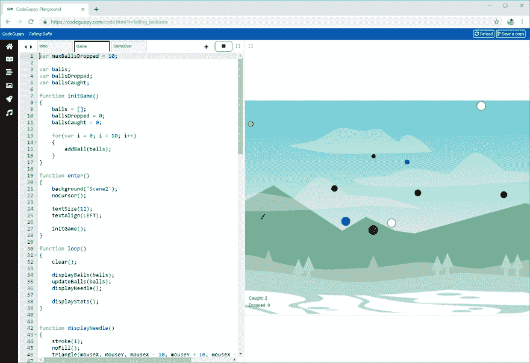

# 坠落的气球

> 原文：<https://dev.to/codeguppy/falling-balloons-3jo>

# [T1】简介](#intro)

降落气球是一项技能游戏。你需要在下落的气球落地前迅速击破它们。

在实施这个迷你游戏时，您将学习一些重要的概念，例如:

*   如何创建多场景游戏
*   如何更新和显示几个移动的对象

# 需要什么？

要运行本文中的代码，您不需要在本地计算机上安装任何东西。

只需从[codeguppy.com/code.html](https://codeguppy.com/code.html)打开在线 JavaScript playground，在集成编辑器中复制并粘贴以下代码。

准备就绪后，按“播放”按钮运行代码。

[](https://res.cloudinary.com/practicaldev/image/fetch/s--sioD-dAv--/c_limit%2Cf_auto%2Cfl_progressive%2Cq_auto%2Cw_880/https://thepracticaldev.s3.amazonaws.com/i/ix7s0es8uzsghzgx55bb.png)

# 源代码

> 这个节目包含多个场景。请在单独的代码页中复制并粘贴每个场景。确保场景的名称如下所示。

## 场景:简介

```
var startGame = false;

function enter()
{
    background('Scene1');
    cursor(ARROW);    
}

function loop()
{
    clear();
    drawIntroScreen();        
}

function mouseClicked()
{
    if (startGame)
    {
        showScene( "Game" );
    }
}

function drawIntroScreen()
{
    var ballX = width / 2;
    var ballY = height / 2;
    var ballSize = height / 2;

    stroke(1);
    fill("yellow");
    ellipse( ballX, ballY, ballSize );

    noStroke();
    fill("black");

    textSize(24);
    textAlign(CENTER);
    text("Catch\nthe\nfalling balls", width / 2, height / 2 - 30);

    if ( Math.floor(frameCount / 30) % 2 === 0 ) 
    {
        textSize(12);
        text("Click the ball to start the game...", width / 2, height - 20);
    }

    if ( dist( mouseX, mouseY, ballX, ballY ) < ballSize / 2  )
    {
        noFill();
        stroke(1);
        ellipse( ballX, ballY, ballSize + 10 );
        startGame = true;
    }
} 
```

## 场景:游戏

```
var maxBallsDropped = 10;

var balls;
var ballsDropped;
var ballsCaught;

function initGame()
{
    balls = [];
    ballsDropped = 0;
    ballsCaught = 0;

    for(var i = 0; i < 10; i++)
    {
        addBall(balls);
    }
}

function enter()
{
    background('Scene2');
    noCursor();

    textSize(12);
    textAlign(LEFT);

    initGame();
}

function loop()
{
    clear();

    displayBalls(balls);
    updateBalls(balls);
    displayNeedle();

    displayStats();
}

function displayNeedle()
{
    stroke(1);
    noFill();
    triangle(mouseX, mouseY, mouseX - 10, mouseY + 10, mouseX - 8, mouseY + 15);
}

function displayGlobalBalls()
{
    displayBalls(balls);
}

function catchBall(ball)
{
    if ( ballsDropped < maxBallsDropped )
    {
        ballsCaught++;
        initBall(ball);
    }
}

function displayBalls(arBalls)
{
    for(var i = 0; i < arBalls.length; i++)
    {
        displayBall( arBalls[i] );
    }
}

function displayBall(ball)
{
    fill(ball.color);
    stroke(1);
    ellipse(ball.x, ball.y, ball.size);

    if ( dist( mouseX, mouseY, ball.x, ball.y ) < ball.size / 2 )
    {
        noFill();
        ellipse(ball.x, ball.y, ball.size + 5);

        catchBall(ball);
    }
}

function displayStats()
{
    fill("black");
    noStroke();
    text( "Caught: " + ballsCaught, 10, height - 40);
    text( "Dropped: " + ballsDropped, 10, height - 20);
}

function updateBalls(arBalls)
{
    for(var i = 0; i < arBalls.length; i++)
    {
        updateBall( arBalls[i] );
    }
}

function updateBall(ball)
{
    ball.y += ball.size / 20 + ballsCaught / 100;

    // test if hits the ground
    if ( ball.y > height )
    {
        ballsDropped++;

        if ( ballsDropped >= maxBallsDropped )
        {
            showScene( "GameOver", ballsCaught );
        }

        // reinit the ball
        initBall(ball);
    }
}

function addBall(arBalls)
{
    var ball = { x : 0, y : 0, color : "", size: 10 };
    initBall(ball);

    arBalls.push(ball);
}

function initBall(ball)
{
    ball.x = random(10, width - 10);
    ball.y = 10;
    ball.color = random(["white", "yellow", "green", "blue", "red"]);
    ball.size = random(10, 30);
} 
```

## 场景:游戏结束

```
function enter()
{
    background('Scene');
    cursor(ARROW);
}

function loop()
{
    clear();

    fill("black");
    noStroke();
    textSize( map( sin(frameCount * 0.1), 0, 1, 24, 32) );
    textAlign(CENTER);
    text("GAME OVER", width / 2, height / 2);

    textSize(12);
    text("Score: " + PublicVars.Arguments, width / 2, height / 2 + 20);

    text("Click mouse button to restart game...", width / 2, height - 20);
}

function mouseClicked()
{
    showScene( "Intro" );
} 
```

# 反馈

如果你喜欢这篇文章，请在 Twitter 上关注 [@codeguppy](https://twitter.com/codeguppy) 和/或访问 codeguppy.com[获得更多教程和项目。](https://codeguppy.com)

另外，如果你想用详细的说明来扩展这篇文章，解释如何一步一步地构建程序，请在评论中留下反馈。