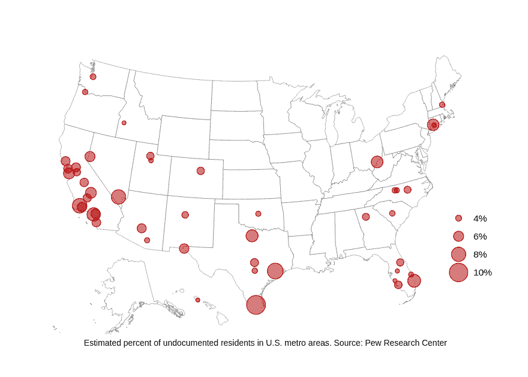

# 用 R 构建的快速静态地图

> 原文：<https://dev.to/hrbrmstr/fast-static-maps-built-with-r-7lf>

[卢克·威特](https://github.com/lukewhyte)在《走向数据科学》上发表了一篇[文章](https://towardsdatascience.com/fast-static-d3-maps-built-with-turf-js-and-the-command-line-5b7c72b7e775)(抱歉使用了中间链接),展示了如何使用命令行工作流，包括`curl`、`node`以及各种 D3 库和 javascript 源文件来构建一系列 SVG 静态地图。它写得很好，你应该读一读，特别是因为他提供了代码和数据。

我们可以在 R 中借助几个软件包并通过使用免费的地理编码服务来完成所有这些工作，这也将允许我们在地图上放置更多的数据，尽管由于它返回夏威夷位置的奇怪值而需要一些额外的工作。

```
library(albersusa) # git.sr.ht/~hrbrmstr/albersusa | git[la|hu]b/hrbrmstr/albersusa
library(rgeocodio) # git.sr.ht/~hrbrmstr/rgeocodio | git[la|hu]b/hrbrmstr/rgeocodio
library(tidyverse)

# the data url from the original blog
fil <- "https://query.data.world/s/awyahzfiikyoqi5ygpvauqslwmqltr"

read_csv(fil, col_types = "cd") %>% 
  select(area=1, pct=2) %>% 
  mutate(pct = pct/100) -> xdf # make percents proper percents

gc <- gio_batch_geocode(xdf$area) 
```

Enter fullscreen mode Exit fullscreen mode

地理编码的结果是具有与该结果相关联的各种置信度的数据帧。我们将为每一个选择最上面的一个，然后修正它返回的错误的夏威夷经度:

```
map2_df(gc$query, gc$response_results, ~{
  out <- .y[1,,]
  out$area <- .x
  out
}) %>% 
  filter(!is.na(location.lat)) %>% 
  select(area, state = address_components.state, lat=location.lat, lon=location.lng) %>% 
  mutate(
    lat = ifelse(grepl("Honolu", area), 21.3069, lat),
    lon = ifelse(grepl("Honolu", area), -157.8583, lon)
  ) %>% 
  left_join(xdf) %>% 
  as_tibble() -> area_pct

area_pct
## # A tibble: 47 x 5
## area state lat lon pct
## <chr> <chr> <dbl> <dbl> <dbl>
## 1 McAllen-Edinburg-Mission, TX TX 26.2 -98.1 0.102
## 2 Houston-The Woodlands-Sugar Land, TX TX 29.6 -95.8 0.087
## 3 Santa Maria-Santa Barbara, CA CA 34.4 -120\. 0.081
## 4 Las Vegas-Henderson-Paradise, NV NV 36.1 -115\. 0.08 
## 5 Los Angeles-Long Beach-Anaheim, CA CA 33.9 -118\. 0.075
## 6 Miami-Fort Lauderdale-West Palm Beach, FL FL 26.6 -80.1 0.073
## 7 Dallas-Fort Worth-Arlington, TX TX 33.3 -98.4 0.069
## 8 Washington-Arlington-Alexandria, DC-VA-MD-… WV 39.2 -81.7 0.068
## 9 Bridgeport-Stamford-Norwalk, CT CT 41.3 -73.1 0.067
## 10 San Jose-Sunnyvale-Santa Clara, CA CA 37.4 -122\. 0.065
## # … with 37 more rows 
```

Enter fullscreen mode Exit fullscreen mode

软件包提供了阿拉斯加&夏威夷的基本地图，被省略成一幅合成的美国地图。因此，我们需要忽略阿拉斯加的任何点&夏威夷:

```
us <- usa_composite()
us_map <- fortify(us, region="name")

hi <- select(filter(area_pct, state == "HI"), lon, lat)
(hi <- points_elided(hi))
area_pct[area_pct$state == "HI", c("lon", "lat")] <- hi 
```

Enter fullscreen mode Exit fullscreen mode

然后，就是用`ggplot2` :
的问题了

```
ggplot() +
  geom_map(
    data = us@data, map=us_map,
    aes(map_id=name), 
    fill = "white", color = "#2b2b2b", size = 0.1
  ) +
  geom_point(
    data = area_pct, aes(lon, lat, size = pct), 
    fill = alpha("#b30000", 1/2), color = "#b30000", shape=21
  ) +
  ggalt::coord_proj(us_laea_proj) +
  scale_y_continuous(expand=c(0, 3)) +
  scale_radius(
    name = NULL, label = scales::percent_format(1)
  ) +
  labs(x = "Estimated percent of undocumented residents in U.S. metro areas. Source: Pew Research Center") +
  theme_minimal() +
  theme(axis.text = element_blank()) +
  theme(axis.title.x = element_text(hjust=0.5, size = 8)) +
  theme(axis.title.y = element_blank()) +
  theme(panel.grid = element_blank()) +
  theme(legend.position = c(0.9, 0.3)) -> gg

ggsave(filename = "map.svg", device = "svg", plot = gg, height = 5, width = 7) 
```

Enter fullscreen mode Exit fullscreen mode

与帖子的特色图片(必须是位图…grrr)不同，生成的 SVG 如下:

[](https://res.cloudinary.com/practicaldev/image/fetch/s--zy7do-Y---/c_limit%2Cf_auto%2Cfl_progressive%2Cq_auto%2Cw_880/https://rud.is/dl/fast-static.svg)

### 鳍

在你最舒服和最有能力的地方工作绝对没有错，Luke 绝对能非常好地运用命令行和 javascript。这种在 R 中做事情的替代方式可能会帮助其他数据记者，他们更适应 R 或者想要增加他们的 R 知识，复制并扩展 Luke 的过程。

如果您在 R 甚至 Python 中有其他方法，请在评论中添加一个指向您的博客的链接，这样那些既不熟悉 R 也不熟悉命令行的人就可以看到更多生成这类内容的方法。