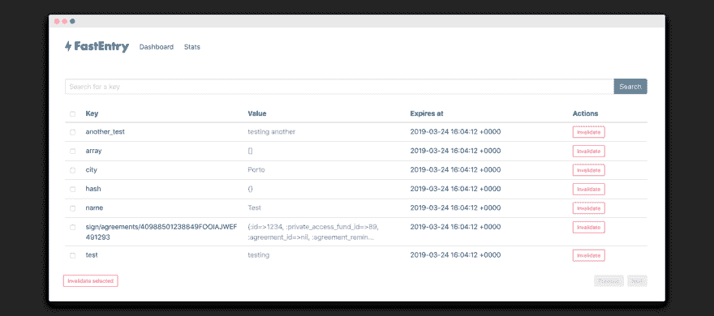
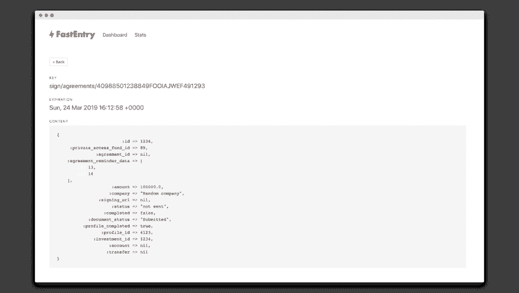

# FastEntry - Rails 缓存管理

> 原文：<https://dev.to/alvesjtiago/fastentry-5ecd>

> 计算机科学只有两个硬东西:缓存失效和事物命名。菲尔·卡尔顿

我最近在做一个 Rails 项目，这个项目使用了很多缓存资源:键、视图、json 等等。
由于这些信息分散在使用 [`Rails.cache`](https://guides.rubyonrails.org/caching_with_rails.html) 的整个代码库中，了解缓存了什么、使用了哪些键以及如何快速管理这些信息变得越来越困难。

受 [Sidekiq 的](https://github.com/mperham/sidekiq) web 界面的启发，我一直在构建一个名为 [FastEntry](https://github.com/alvesjtiago/fastentry) 的开源 gem，以便在开发和生产中轻松管理缓存信息。

以下是当前功能的列表:

*   列出所有缓存的条目(分页)
*   检查带有格式化内容的单个条目
*   通过关键字搜索特定条目
*   一次使一个或多个密钥无效
*   统计条目集的数量

[T6】](https://res.cloudinary.com/practicaldev/image/fetch/s--gCG3Q0PI--/c_limit%2Cf_auto%2Cfl_progressive%2Cq_auto%2Cw_880/http://blog.tiagoalves.me/assets/fastentry/inspect.png)

未来，我计划增加:

*   缓存组
*   编辑失效时间
*   访问缓存信息的 API
*   更多统计数据(例如，今天过期的条目数量、内存使用情况等)

FastEntry 是开源的，可以在[https://github.com/alvesjtiago/fastentry](https://github.com/alvesjtiago/fastentry)获得。

如果您正在构建一个 Rails 应用程序，并希望轻松管理缓存，请尝试一下，并通过 [@alvesjtiago](https://twitter.com/alvesjtiago) 或直接通过项目的存储库问题让我知道您的想法。

⚡️