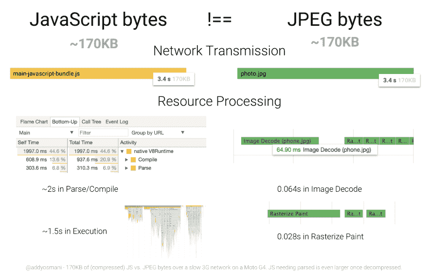
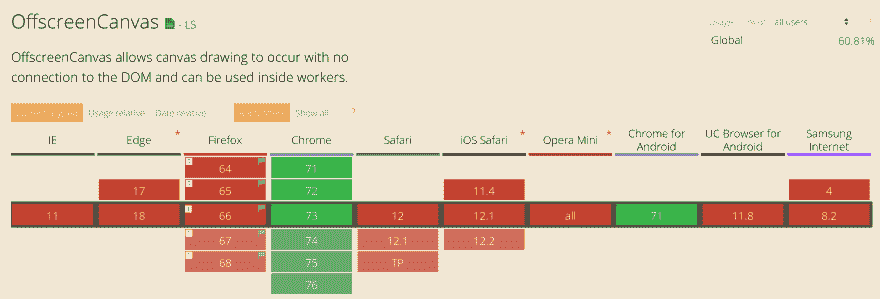
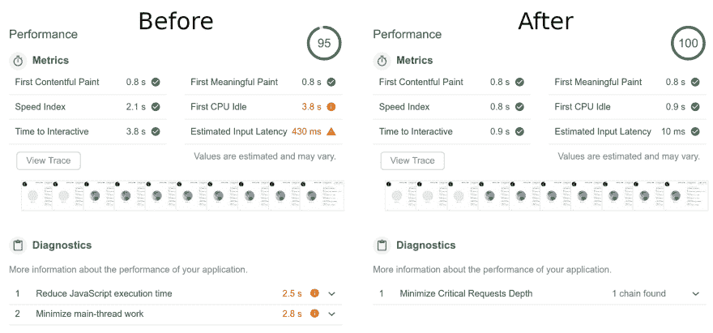

# 更快的 WebGL/Three.js 3D 图形与屏幕外画布和 Web Workers

> 原文：<https://dev.to/evilmartians/faster-webgl-three-js-3d-graphics-with-offscreencanvas-and-web-workers-43he>

**翻译:** [俄语](https://habr.com/ru/post/446682/)

了解如何在使用 [Three.js](https://threejs.org/) 库创建复杂场景时，通过使用`OffscreenCanvas`将渲染从主线程转移到 Web worker 来提高 WebGL 性能。您的 3D 在低端设备上会呈现得更好，平均性能也会提高。

在我[在我的](https://twitter.com/sitnikcode/status/1098238272768217088)[个人网站](https://sitnik.ru/)上添加了一个地球的 3D WebGL 模型后，我发现我在[谷歌灯塔](https://developers.google.com/web/tools/lighthouse/)上立刻损失了 5%。

在本文中，我将向您展示如何在不牺牲跨浏览器兼容性的情况下赢回性能，我为此编写了一个微型库。

## 问题

使用 Three.js 可以轻松创建复杂的 WebGL 场景。不幸的是，这是有代价的。Three.js 会给你的 js 包增加大约 563 KB(由于它的架构，它不是真正的树摇动的)。

你可能会说普通的背景图片也有 500 KB。但是每一千字节的 JavaScript 比一千字节的图像数据对网站整体性能的影响更大。如果你的目标是一个快速的网站，延迟和带宽不是唯一要考虑的事情:考虑 CPU 在处理你的内容上花费多少时间也很重要。在低端设备上，处理资源比下载资源花费更多的时间。

[](https://res.cloudinary.com/practicaldev/image/fetch/s--t8Vc0_EN--/c_limit%2Cf_auto%2Cfl_progressive%2Cq_auto%2Cw_880/https://thepracticaldev.s3.amazonaws.com/i/xs4kuxe0hat7b31lqg2z.png) 

<figure>

<figcaption>3.5 秒处理 170 KB 的 JS，0.1 秒处理 170 KB 的 JPEG。[阿迪奥斯马尼](https://developers.google.com/web/fundamentals/performance/optimizing-content-efficiency/javascript-startup-optimization/)</figcaption>

</figure>

当浏览器处理 500KB 的 Three.js 代码时，你的网页将被有效地冻结，因为执行 JavaScript 占用了主线程。在场景被完全渲染之前，你的用户将不能与页面交互。

## 网络工作者和屏幕外画布

Web Workers 是在 JS 执行期间避免页面冻结的解决方案。这是一种将一些 JavaScript 代码转移到独立线程的方法。

可惜多线程编程很辛苦。更简单地说，Web 工作者没有访问 DOM 的权限。只有主 JavaScript 线程拥有这种访问权限。然而，Three.js 需要访问位于 DOM 中的`<canvas>`节点。

[`OffscreenCanvas`](https://developer.mozilla.org/en-US/docs/Web/API/OffscreenCanvas) 就是解决这个问题的办法。它允许您将画布访问转移到 Web Worker。它仍然是线程安全的，因为一旦选择了这种变通方法，主线程就不能访问`<canvas>`。

听起来我们已经基本了解了，但问题是:屏幕外画布 API 仅受谷歌 Chrome 支持。

[](https://res.cloudinary.com/practicaldev/image/fetch/s--5M5i3AGl--/c_limit%2Cf_auto%2Cfl_progressive%2Cq_auto%2Cw_880/https://thepracticaldev.s3.amazonaws.com/i/o2nqcjv8cwvc76rgrh8q.png)

<figure>

<figcaption>2019 年 4 月支持屏外画布的浏览器根据[我能使用](https://caniuse.com/#feat=offscreencanvas)</figcaption>

</figure>

然而，即使面对我们的主要敌人，跨浏览器问题，我们也不应该害怕。让我们使用渐进式增强:我们将提高 Chrome 和未来浏览器的性能。其他浏览器将在主 JavaScript 线程中以旧的方式运行 Three.js。

我们需要想出一种方法来为两种不同的环境编写一个文件，记住许多 DOM APIs 在 Web Worker 内部是不工作的。

## 解

为了隐藏所有的漏洞并保持代码可读，我创建了一个小小的 **[屏幕外画布](https://github.com/ai/offscreen-canvas)** JS 库(只有 400 字节)。下面的例子将依赖于它，但是我也将解释它是如何工作的。

首先，将`offscreen-canvas` npm 包添加到您的项目:

```
npm install offscreen-canvas 
```

Enter fullscreen mode Exit fullscreen mode

我们需要为网络工作者提供一个单独的 JS 文件。让我们在 webpack 或 package 的配置中创建一个单独的 JS 包。

```
 entry: {
    'app': './src/app.js',
+   'webgl-worker': './src/webgl-worker.js'
  } 
```

Enter fullscreen mode Exit fullscreen mode

Bundlers 将在生产中为 bundle 的文件名添加一个缓存破坏者。为了在我们的主 JS 文件中使用这个名称，让我们添加一个 [preload](https://3perf.com/blog/link-rels/) 标签。确切的代码将取决于您生成 HTML 的方式。

```
 <link type="preload" as="script" href="./webgl-worker.js">
  </head> 
```

Enter fullscreen mode Exit fullscreen mode

现在，我们应该在主 JS 文件中获得画布节点和一个 worker URL。

```
import createWorker from 'offscreen-canvas/create-worker'

const workerUrl = document.querySelector('[rel=preload][as=script]').href
const canvas = document.querySelector('canvas')

const worker = createWorker(canvas, workerUrl) 
```

Enter fullscreen mode Exit fullscreen mode

[`createWorker`](https://github.com/ai/offscreen-canvas/blob/master/create-worker.js) 寻找`canvas.transferControlToOffscreen`探测`OffscreenCanvas`支援。如果浏览器支持，库将作为 Web Worker 加载 JS 文件。否则，它会将 JS 文件作为常规脚本加载。

现在，让我们打开`webgl-worker.js`

```
import insideWorker from 'offscreen-canvas/inside-worker'

const worker = insideWorker(e => {
  if (e.data.canvas) {
    // Here we will initialize Three.js
  }
}) 
```

Enter fullscreen mode Exit fullscreen mode

[`insideWorker`](https://github.com/ai/offscreen-canvas/blob/master/inside-worker.js) 检查 Web Worker 中是否加载了它。根据环境的不同，它将使用不同的方式与主线程通信。

该库将对来自主线程的任何消息执行回调。来自`createWorker`的第一条消息对于我们的 worker 来说将永远是用`{ canvas, width, height }`初始化 canvas 的对象。

```
+ import {
+   WebGLRenderer, Scene, PerspectiveCamera, AmbientLight,
+   Mesh, SphereGeometry, MeshPhongMaterial
+ } from 'three'
  import insideWorker from 'offscreen-canvas/inside-worker'

+ const scene = new Scene()
+ const camera = new PerspectiveCamera(45, 1, 0.01, 1000)
+ scene.add(new AmbientLight(0x909090))
+
+ let sphere = new Mesh(
+   new SphereGeometry(0.5, 64, 64),
+   new MeshPhongMaterial()
+ )
+ scene.add(sphere)
+
+ let renderer
+ function render () {
+   renderer.render(scene, camera)
+ } 
  const worker = insideWorker(e => {
    if (e.data.canvas) {
+     // canvas in Web Worker will not have size, we will set it manually to avoid errors from Three.js
+     if (!canvas.style) canvas.style = { width, height }
+     renderer = new WebGLRenderer({ canvas, antialias: true })
+     renderer.setPixelRatio(pixelRatio)
+     renderer.setSize(width, height)
+
+     render()
    }
  }) 
```

Enter fullscreen mode Exit fullscreen mode

在创建场景的初始状态时，我们可以从 Three.js 中找到一些错误消息。例如，没有`document.createElement`来加载 SVG 纹理。对于 Web Worker 和常规脚本环境，我们需要不同的加载器。我们可以通过`worker.isWorker`属性:
来检测环境

```
 renderer.setPixelRatio(pixelRatio)
      renderer.setSize(width, height)

+     const loader = worker.isWorker ? new ImageBitmapLoader() : new ImageLoader()
+     loader.load('/texture.png', mapImage => {
+       sphere.material.map = new CanvasTexture(mapImage)
+       render()
+     }) 
      render() 
```

Enter fullscreen mode Exit fullscreen mode

我们渲染了场景的初始状态。但是大多数 WebGL 场景都需要对用户动作做出反应。可能是用鼠标旋转相机。或者在调整窗口大小时更新`canvas`。不幸的是，Web Worker 不能访问任何 DOM 事件。我们需要监听主线程中的事件，并向 worker 发送消息:

```
 import createWorker from 'offscreen-canvas/create-worker'

  const workerUrl = document.querySelector('[rel=preload][as=script]').href
  const canvas = document.querySelector('canvas')

  const worker = createWorker(canvas, workerUrl)

+ window.addEventListener('resize', () => {
+   worker.post({
+     type: 'resize', width: canvas.clientWidth, height: canvas.clientHeight
+   })
+ }) 
```

Enter fullscreen mode Exit fullscreen mode

```
 const worker = insideWorker(e => {
    if (e.data.canvas) {
      if (!canvas.style) canvas.style = { width, height }
      renderer = new WebGLRenderer({ canvas, antialias: true })
      renderer.setPixelRatio(pixelRatio)
      renderer.setSize(width, height)

      const loader = worker.isWorker ? new ImageBitmapLoader() : new ImageLoader()
      loader.load('/texture.png', mapImage => {
        sphere.material.map = new CanvasTexture(mapImage)
        render()
      })

      render()
-   } +   } else if (e.data.type === 'resize') {
+     renderer.setSize(width, height)
+     render()
+   }
  }) 
```

Enter fullscreen mode Exit fullscreen mode

## 结果

使用`OffscreenCanvas`，我在 Chrome 中修复了个人网站的 UI 冻结，并在 Google Lighthouse 上获得了满分 100 分。而我的 WebGL 场景在其他所有浏览器中依然可以工作。

可以查看结果: **[演示](https://sitnik.ru/)** 和[主线程](https://github.com/ai/sitnik.ru/blob/master/src/earth/earth.js)和[工作线程](https://github.com/ai/sitnik.ru/blob/master/src/earth/worker.js)的**源代码**。

[](https://res.cloudinary.com/practicaldev/image/fetch/s--8FyY8kLj--/c_limit%2Cf_auto%2Cfl_progressive%2Cq_auto%2Cw_880/https://thepracticaldev.s3.amazonaws.com/i/n6esc7r6qba9vip43xsy.png) 

<figure>

<figcaption>随着 off screen canvas Google light house 的性能速度从 95 提高到 100</figcaption>

</figure>