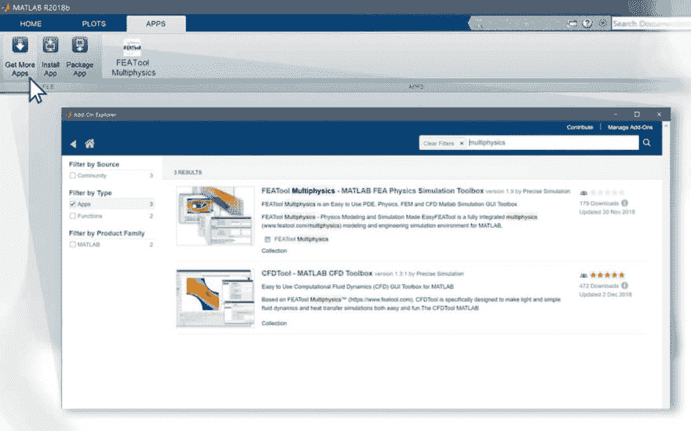
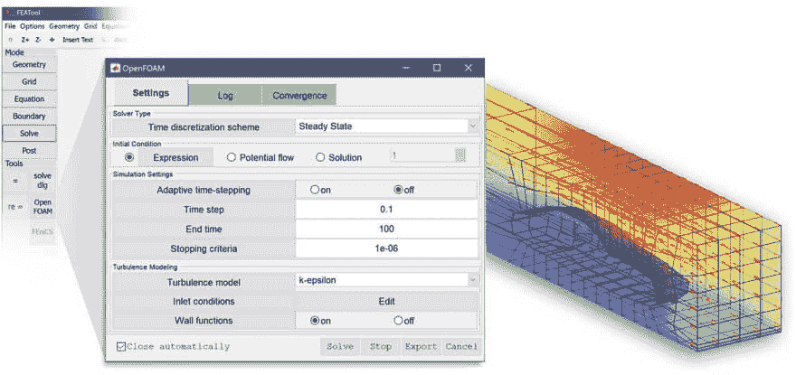
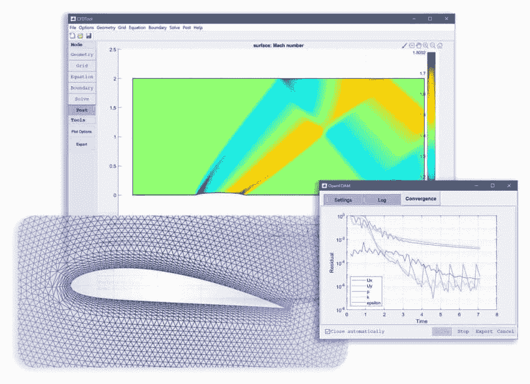

# FEATool 1.9-MATLAB 中的多物理仿真

> 原文：<https://dev.to/featool/featool-19---multi-physics-simulation-in-matlab-1egd>

[FEATool Multiphysics](https://www.featool.com)1.9 版
现已更新并发布为专用的 MATLAB 插件
和独立工具箱。FEATool 可直接从 MATLAB
附件工具栏获得，现在具有简单方便的
一键式安装和工具箱可访问性。

## 改进的 OpenFOAM GUI

随着 FEATool 1.8 的推出，
[OpenFOAM CFD 解算器界面](https://www.featool.com/doc/solver.html#openfoam)已通过以下增强功能
得到显著增强和改进

*   支持非常数和一般初始和边界
    条件表达式(非常数
    表达式自动插值到 OpenFOAM 边界案例文件，如抛物线
    流动剖面)

*   支持轴对称和旋流(自动将
    2D 网格转换为与
    轴对称 OpenFOAM 案例文件兼容的 3D 周期性楔形网格切片)

*   用 *rhoCentralFoam*
    解算器支持无粘性可压缩流

*   改进的 k-epsilon 和 k-omega 湍流建模界面，通过给定的
    湍流强度和长度尺度自动计算湍流入口数量

*   实时收敛曲线图。收敛曲线现在
    在求解过程中显示，以便更容易和更
    方便地监控求解过程

OpenFOAM CFD 解算器的 MATLAB CFD 界面允许用户在一个易于使用的完全集成的
图形用户界面(GUI)内
方便地模拟层流和完全湍流的不可压缩和
可压缩流动问题。

建模和仿真步骤可选择从
FEATool GUI 保存，并导出为可编辑的 m-file 脚本文件。这允许
进行编程建模和定制脚本，支持所有
MATLAB 工具箱和函数。

## 流动模拟的新物理模式

FEATool 1.9 具有两种新的预定义物理模式，用于流量
模拟。新的*可压缩欧拉方程*物理模式
允许用
冲击波模拟无粘性和超音速流体流动。此外，内置 CAD 工具现在还为 NACA 4 系列翼型提供了内置和预定义的机翼形状
。
此外，具有*漩涡*
效应的流动的专用轴对称物理模式现在也是可用的(模拟具有
非零方位角速度的轴对称流动)。

## 求解器改进

除了新的预定义流动方程，内置解算器
已得到显著改进，可以更好地处理更具挑战性的
流动状态。不可压缩流现在默认使用线性 P 1 FEM 元素离散化
，并使用压力
稳定 Petrov-Galerkin (PSPG)公式稳定。与之前使用的 P 2 P 1 FEM 元素相比，这种新的
方法导致更具成本效益的离散化和更快的求解时间
。此外，不可压缩流问题现在可以用无粘性*势流*解进行
初始化，以获得更好的
初始猜测和改进的解算器收敛。

此外，对于高雷诺数和对流占主导地位的
问题，采用了一种新的离散 TVD 型逆风方法，
与传统的 FEM 人工(SUPG)稳定相反，可以
消除非物理的欠冲和过冲，还可以有效地
捕捉不连续现象，如冲击。这种类型的
稳定化也改善了一般的对流扩散型
问题，例如涉及平流的热传递问题和
化学反应问题。

## 附加新功能

*   支持边界层网格划分的改进网格生成界面
*   曲线边界的更精确的参数化和网格化
*   内置的自动化教程模型和示例
*   2D 表面图的直接点评估(通过在图中单击)
*   GUI 和用户界面(UI)的改进
*   扩展到 MATLAB 2009b 的向后兼容性

请访问 [FEATool Multiphysics 1.9 发布公告](https://www.featool.com/news/2018/11/30/featool-v1p9-cfd-fluid-dynamics-in-matlab)
了解更多信息和工具箱下载。