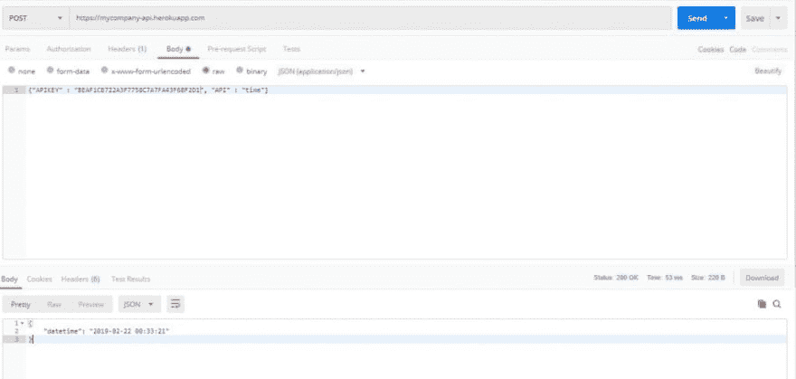

# 第一个 Heroku 应用程序:PHP 中的小 API。网络核心

> 原文：<https://dev.to/catriname/first-heroku-app-small-api-in-php-to-talk-to-net-core-4783>

最近，我很好奇为什么要为我的时间戳切换到一个时间 API，并消除应用程序对服务器上时间戳的依赖。在谷歌上我找到了一些付费服务，有些是免费的，在免费的服务中，我注意到有一个是在 Heroku 上提供的。我听说过 Heroku，但是从来没有尝试使用它的理由。这是一个绝佳的机会。

## 我如何创建一个小的“GetTime”API

首先，我在 Heroku 上创建了一个免费帐户，没什么特别的。在验证了我的电子邮件之后，我登录到我的 Heroku 仪表盘，在右上角选择了创建新应用。我把它命名为我的公司 api，然后弹出了一个应用程序。

我决定只使用普通的、遗留的 PHP 和一个简单的通过 JSON 编码的 DateTime 字符串，作为开始。没有身份验证，没有时区，如果有对站点的请求，就简单地显示出来，就像这样:

```
 header('Content-type:application/json;charset=utf-8');

    $DateTime = new DateTime();
    $currentTime = $DateTime->format("Y-m-d H:i:s");
    echo json_encode($currentTime); 
```

Enter fullscreen mode Exit fullscreen mode

我为这个全新的文件创建了一个 Git repo 并将其推出。然后，我回到 Heroku，仪表板，我的应用程序和部署。我选择 Github 作为我的部署“资源”,并选择了我刚刚创建的新 repo 以及相应的分支。

我点击手动部署，Heroku 跑到我的 GitHub repo，抓取代码，编译并发布。

失败了。

## 初学者的烦恼

我的第一个问题是 Heroku 不能确定我为我的应用程序选择了什么语言(你会认为

要添加构建器包，我回到 Heroku、Dashboard、我的应用和设置。在 builder pack 下，我为“php”添加了一个。保存设置并完成。

我回到部署，手动部署，并有一个成功的输出。耶！首款 Heroku app！

## 增加一些安全性

我想确保这个 API 正在接收和发送 JSON，所以在我点击 PHP 页面上的逻辑之前，我会让请求通过几个 IF。我还想(稍微)保护对这个 API 的请求，并监控我们对度量信息(和未来投资)的使用。由于这个小小的 API 仅仅依赖于一个 index.php 文件，我认为它可以成为未来 API 的“路由器”。这是我添加到最终 PHP 文件中的内容:

*   验证请求是否在 JSON 中
*   需要传递两个变量:
    *   一个秘密的 api“密钥”
    *   api“请求”
*   使用 switch 语句转发到所需的方法

The final, simple 1 page PHP Heroku API:

```
<?php
header('Content-type:application/json;charset=utf-8');

//Make sure that it is a POST request.
if(strcasecmp($_SERVER['REQUEST_METHOD'], 'POST') != 0){
    throw new Exception('Request method must be POST!');
}

//Make sure that the content type of the POST request has been set to application/json
$contentType = isset($_SERVER["CONTENT_TYPE"]) ? trim($_SERVER["CONTENT_TYPE"]) : '';
$contentIsJson = strpos($contentType, "application/json");

if ($contentIsJson === false){
    throw new Exception('Content type must be: application/json');
}

//Receive the RAW post data.
$content = trim(file_get_contents("php://input"));

//Attempt to decode the incoming RAW post data from JSON.
$decoded = json_decode($content, true);

$app = strtoupper($decoded['API']);
$key = $decoded['APIKEY'];

//verify user key - simple MD5 generator: http://onlinemd5.com/.  will build user management for keys if ever needed
if ( $key == "BEAF1CB722A3F7758C7A7FA43F6BF2D1" )
{   

    switch ($app) {
        case "TIME":
            $jsonString = getTime();
            $arr = array('datetime' => $jsonString);
            break;
        default:
            $arr = array('error' => "Unknown Request On API");
            break;
    }  

    echo json_encode($arr);
}

//return the current time
function getTime ()
{
    $DateTime = new DateTime();

    //by default heroku returns time in UTC - can change in dashboard, config vars, only use as needed below
    //$DateTime->modify('-6 hours');
    $currentTime = $DateTime->format("Y-m-d H:i:s");

    $jsonString = $currentTime;

    return $jsonString;
}
?> 
```

Enter fullscreen mode Exit fullscreen mode

## 验证响应

我使用 Postman 向我的 Heroku 应用程序发送了一个原始的 JSON 请求(使用了他们的默认/免费 url)。我想先确定我所有的问题都被这个新玩具解决了，然后继续前进。下面是原始请求和响应在 Postman 上的样子:

[](http://www.catrina.me/wp-content/uploads/2019/02/rawRequest.jpg)

Heroku +我的 PHP 反应很好！

## 用 C#处理请求和响应

所以下面是我如何用 C#(我用的是 dotnet Core)做了同样的请求并收到了响应:

```
public async Task<string> OurHerokuAPI()
{
    string reqUrl = "https://mycompany-api.herokuapp.com";

    using (var client = new HttpClient())
    {
        client.DefaultRequestHeaders
            .Accept
            .Add(new MediaTypeWithQualityHeaderValue("application/json"));

        try
        {

            var query = new
            {
                APIKEY = "BEAF1CB722A3F7758C7A7FA43F6BF2D1",
                API = "time"
            };

            var asJson = JsonConvert.SerializeObject(query);
            HttpResponseMessage response = await client.PostAsync(reqUrl, new StringContent(asJson, Encoding.UTF8, "application/json"));

            if (response.IsSuccessStatusCode)
            {
                var definition = new { datetime = string.Empty };
                var json = JsonConvert.DeserializeAnonymousType(response.Content.ReadAsStringAsync().Result, definition);

                time = json.datetime;

                //monitors success across various "time" api's. in case this particular one fails, there can be various backups until success flag returns true.
                success = true;
            }
        }
        catch (OperationCanceledException)
        {
            //TODO: CREATE ERROR MESSAGE SEND BACK TO EMAIL/ERROR 
        }
    }
    return time;
} 
```

Enter fullscreen mode Exit fullscreen mode

如果你看到注释，是的，我决定找点乐子，创建两个其他函数，就像上面的函数一样，我查询一些“空闲”时间 api，直到“成功”标志变为真(当然，时间被控制为相同的格式)。在 x 尝试之后，我不情愿地调用了我的最后一个函数，它获取了服务器时间戳。如前所述，我希望我的时间戳独立于服务器。所以，如果它遇到了最后一个方法，我也会给自己发一封错误邮件，告诉自己时间 API 失败了。

将来，我可以更明智地使用环境变量( [config vars](https://devcenter.heroku.com/articles/config-vars) )，而不是硬编码。也有很多清理工作要做，但这是一个非常有趣的介绍 Heroku！