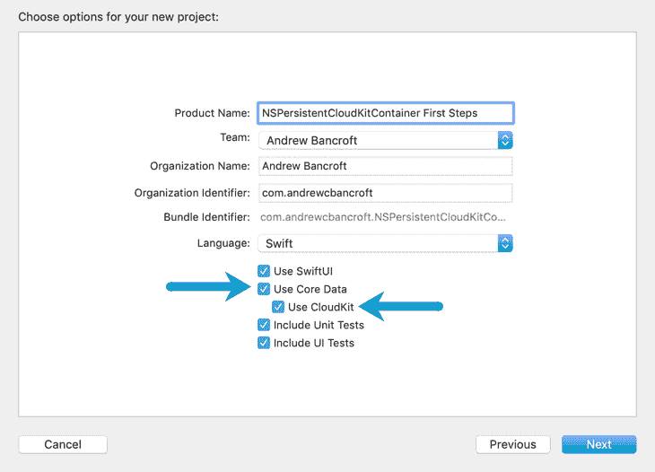
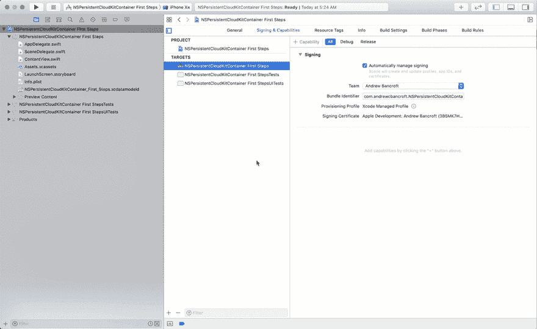
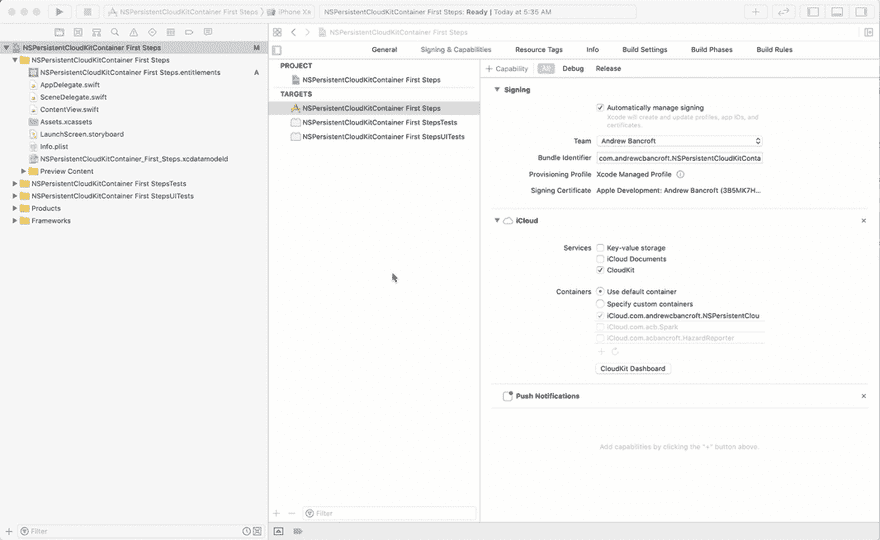

# NSPersistentCloudKitContainer 的第一印象

> 原文：<https://dev.to/andrewcbancroft/first-impressions-of-nspersistentcloudkitcontainer-2a2d>

资源

*   [使用 CloudKit 的核心数据- WWDC 2019 会议 202](https://developer.apple.com/videos/play/wwdc2019/202)
*   [来自苹果的样本项目](https://developer.apple.com/documentation/coredata/synchronizing_a_local_store_to_the_cloud)

## NSPersistentCloudKitContainer 如何帮助

我想每个人都应该问的第一个问题是，“这有什么大不了的？`NSPersistentCloudKitContainer`怎么会帮我？”

我注意到在 [WWDC 2019 届](https://developer.apple.com/videos/play/wwdc2019/202)中至少有**三个巨大的胜利**。问问你自己…

1)“我想知道如何从 CloudKit 中检索数据，并将其与我自己的本地核心数据持久性存储合并吗？”没有吗？我也是。😃

`NSPersistentCloudKitContainer`处理制作应用程序 CloudKit 数据的本地副本。

2)“我是否希望实现同步计划和 CloudKit 附带的所有错误处理？”–我*绝对*不…

`NSPersistentCloudKitContainer`处理调度 CloudKit 操作，并获取您的`// handle errors`占位符代码(👀)并在内部以正确的方式实现它。#甜蜜

3)“我想手工在`NSManagedObjects`和`CKRecords`之间映射吗？”-如果那是自动的就不会了！

`NSPersistentCloudKitContainer`也负责将你的`NSManagedObjects`转换成`CKRecords`。

## 激动人心的时刻

苹果做了很多工作来**封装一组非常常见的代码模式**，这对实现一个具有核心数据和 CloudKit 的应用程序是必要的。

他们声称能够**为我们节省数千行代码**(我也相信！).

我有一个在本地使用核心数据的应用程序。我一直想启用 CloudKit，以便在我的用户设备之间同步数据。每当我想到要让核心数据片段与云套件片段在同一波长上交流需要做些什么，我就害怕随之而来的不可避免的头痛。所以我逃跑了。😬

我希望看看用现有的应用程序启用`NSPersistentCloudKitContainer`是什么感觉。我一定会记录下这段旅程！

# 把脚趾伸进去

只是一些关于这个新类的设置过程的花絮…

## 启用核心数据+云套件

虽然不一定需要选中这些复选框，但 Xcode 会为您提供一些将核心数据和 CloudKit **一起使用所必需的样板代码**。

[](https://res.cloudinary.com/practicaldev/image/fetch/s--k4KZe9Jy--/c_limit%2Cf_auto%2Cfl_progressive%2Cq_auto%2Cw_880/https://www.andrewcbancroft.com/blog/ios-development/data-persistence/first-impressions-of-nspersistentcloudkitcontainer/enable-coredata-cloudkit.png)

## 起点

Xcode 在 AppDelegate.swift 文件中生成一些代码来初始化核心数据堆栈，只是这一次，它不是初始化标准的`NSPersistentContainer`，而是初始化新的`NSPersistentCloudKitContainer`:

```
 lazy var persistentContainer: NSPersistentCloudKitContainer = {
   let container = NSPersistentCloudKitContainer(name: "NSPersistentCloudKitContainer_First_Steps")
   container.loadPersistentStores(completionHandler: { (storeDescription, error) in
   if let error = error as NSError? {
   // Replace this implementation with code to handle the error appropriately.
   fatalError("Unresolved error \(error), \(error.userInfo)")
   }
   })
   return container
   }() 
```

## 尚未就绪(更多待启用)

#### 启用 CloudKit 功能

由于您在此场景中使用的是 CloudKit，因此您仍然需要*启用* CloudKit，以便您的应用程序拥有适当的**权限**，并且您的应用程序的 **CloudKit 容器**在 iCloud 中创建。

[](https://res.cloudinary.com/practicaldev/image/fetch/s--7uwrPusB--/c_limit%2Cf_auto%2Cfl_progressive%2Cq_66%2Cw_880/https://www.andrewcbancroft.com/blog/ios-development/data-persistence/first-impressions-of-nspersistentcloudkitcontainer/enable-icloud.gif)

#### 启用远程通知

CloudKit 还使用推送通知来提醒您的应用程序来自其他设备的数据更改。要获得这些通知，您还需要为您的应用程序启用远程通知功能。

[](https://res.cloudinary.com/practicaldev/image/fetch/s---7mzi-7w--/c_limit%2Cf_auto%2Cfl_progressive%2Cq_66%2Cw_880/https://www.andrewcbancroft.com/blog/ios-development/data-persistence/first-impressions-of-nspersistentcloudkitcontainer/enable-remote-notifications.gif)

## 下一步

说到学习下一步该做什么， [Apple 提供了一个示例项目](https://developer.apple.com/documentation/coredata/synchronizing_a_local_store_to_the_cloud)，我希望对其进行检查和分析。

更多即将推出！