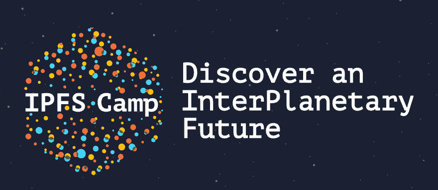
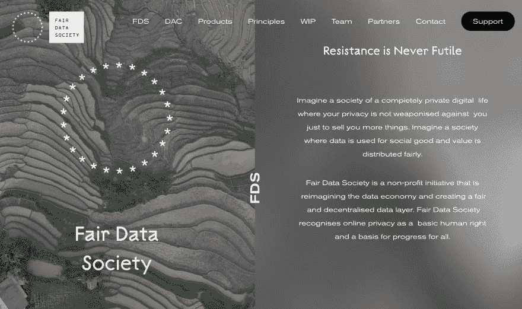

# 裂变碎片 1:每周链接综述

> 原文：<https://dev.to/fission/fission-fragments-1-weekly-links-roundup-2dof>

铀的裂变产生什么？

> 一个**铀** -235 原子吸收一个中子，分裂成两个新原子(**裂变**碎片)，释放出三个新中子和一些结合能。–[核裂变，维基百科](https://en.m.wikipedia.org/wiki/Nuclear_fission)

所以欢迎来到**裂变碎片# 1**——我们的每周链接综述。想要将它们直接发送到您的收件箱吗？[订阅](https://blog.fission.codes/fission-fragments-1/#subscribe)！如果你想实时获得这些链接，我们也倾向于从[我们的推特账户@fissioncodes](https://twitter.com/FISSIONCodes) 上发很多这样的链接。

我们涵盖了很多领域，从开源社区、许可和意识形态、公司和文化建设，当然还有围绕构建和设计软件、新项目和各种分散式 web 技术的很多内容。

### 裂变碎片#1

【Opera 如何使用 ENS 来分散网络:“如果你输入一个`.eth`名字，在它的 [ENS 记录](https://medium.com/the-ethereum-name-service/the-new-ens-manager-now-supports-eip1577-contenthash-82e2d6724fae)中有一个 [IPFS](https://ipfs.io/) 散列，IPFS 的内容将显示为一个正常的网站。”目前只支持安卓系统。你可以在桌面 Opera [中启用的加密钱包也需要一个 Android 应用](https://help.opera.com/en/how-to-use-operas-crypto-wallet-on-your-computer/)。

<figure>

<figcaption>6 月 27-30 日是[巴塞罗纳 IPFS 营](https://camp.ipfs.io/):“为分布式 web 的建设者设计的 3 天黑客撤退”。如果你要黑 IPFS 核心网，这是个好地方。</figcaption>

</figure>

本地第一软件(Local-first software):来自 Ink 和 Switch 的优秀长文，是几年来研发的成果，包括对“数据存储和共享的现有方法”的调查。我们对本地第一没有那么激进，但我们在他们描述的软件和数据的理想上绝对是一致的:

> 在这篇文章中，我们提出了“本地优先软件”:一套软件原则，使用户既能协作*又能拥有*。本地优先的理念包括离线工作和跨多种设备协作的能力，同时还提高数据的安全性、隐私性、长期保存和用户控制。

Via [@infominer33](https://twitter.com/infominer33) ，[项目页面](https://github.com/projectpages/project-pages)，一个面向协作科学的 Jekyll 模板，支持 Matlab、Jupyter 笔记本和其他图表、图形和数据可视化工具。感谢 **⧉infominer** 为[裂变不和服务器](https://fission.codes/discord)的链接做出如此巨大的贡献！

<figure> 

<figcaption>我们正在探索许多关于数据可移植性和数据伦理的话题(以及描述这些事情的正确措辞！)公平数据协会[和他们的](https://fairdatasociety.org/)[原则](https://docs.google.com/document/d/14-DM3M-cNCrq2Cn_7J8rRawhaoHOhlyXRPSQZ2thiuc/edit#heading=h.tyu66tcq1j2m)是这些主题的好读物。“反抗永远不会是徒劳的”的确如此！</figcaption>

</figure>

via[Mike Davidson @ Mike industries](https://twitter.com/mikeindustries/status/1130688769625952256)，德里克·雷默在[的一篇帖子中提到 Stripe 使用 Slack，但有意删除消息:](https://www.derrickreimer.com/essays/2019/05/17/im-walking-away-from-the-product-i-spent-a-year-building.html)

> Stripe 的一名工程师告诉我，他们小心翼翼地平衡了电子邮件、论坛和 Slack。他们认识到 Slack 不适合有意义的对话，所以他们自动删除超过几周的聊天消息，以阻止依赖它进行长期存档。在回顾中，团队成员经常反思他们是否为各种对话选择了正确的媒介(电子邮件、聊天或论坛)。

Toby @OyetokeT 写下[分叉代码沙箱，这样你就可以部署到 Heroku](https://dev.to/oyetoket/how-i-deployed-codesandbox-apps-to-heroku-ndo) 。这个主题，即能够在任何地方编码和部署，是我们密切关注的另一个主题。文章发表在 [DevTo](https://dev.to) 上，这是一个我们非常喜欢的开发者社区。你也可以在那里找到裂变。

Trent 参加了 ETHNewYork 以太坊黑客马拉松，发现了一些 IPFS 的项目。我们将开始采访开发这类应用的人。