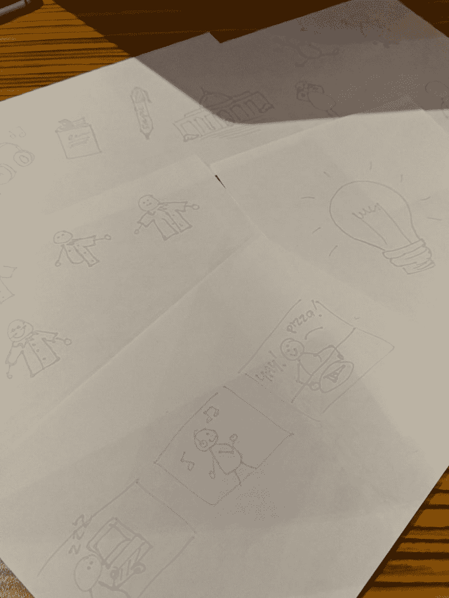
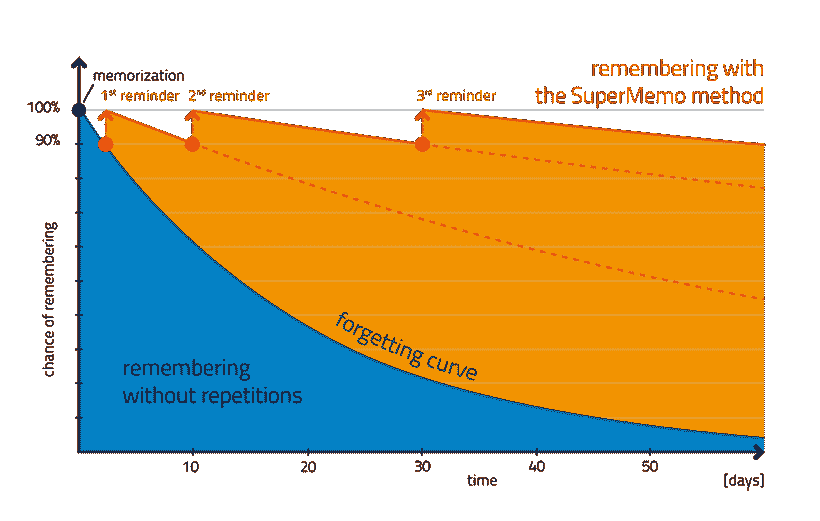

# 学习、记忆的五个策略，嗯，最后一个是什么？

> 原文：<https://dev.to/ocdalex/five-tactics-for-learning-memory-and-erm-what-was-that-last-one-26c4>

信不信由你，我不喜欢为了财富和名声而写博客。事实上，我写博客的主要原因是帮助我处理和保留我一直在研究的东西。在一本书里搜寻你不太记得的引文或你想复制的图表(就像我下面所做的)是一个很好的方法来刷新你几个月或几年前读过的东西的记忆。就好像那些让你写不完的关于旧书的文章的老师知道他们在做什么！

无论如何，这里有五个我认为有用的学习技巧，我希望我已经以一种让你容易回忆起来的方式展示了它们…

## 1。不要记笔记，要注意

在谈话、演示或研讨会期间做笔记显然是一种经典的学习方法，但永远不要逐字逐句地照搬演讲者的话。当你进行下去的时候，试着重新措辞，并加入你自己的想法。这将有助于你更好地理解这个意思，并让它留在你的记忆中。(如果你确实想要一份演讲的精确记录，大多数演讲者会在活动结束后发布笔记和幻灯片的链接。而且随时可以自己录。)

在会议或会面后(可能是几天后)抽出时间检查你的笔记，并尝试总结它们。将你记下的要点转换成另一种格式，比如待办事项列表或关于事件的博客。与同事分享和比较笔记。你对这些想法参与得越多，你就越容易将它们应用到相关的情况中。

## 2。随便涂鸦吧！

不要低估涂鸦的力量。一幅愚蠢的画可能看起来有点有趣或可能会分散注意力，但它可以是另一种实现想法的方式。最终，你从讲座或教程中学到的任何东西都将以一种完全不同的形式应用，从一行代码到一段对话。画画来表达想法…

> 莱克斯洛夫豪斯@ loft io今晚 [#TechNott](https://twitter.com/hashtag/TechNott) 抽奖！感谢快乐时光卡拉，我喜欢画画😊[@ graphic change](https://twitter.com/GraphicChange)[@ technottingham](https://twitter.com/technottingham)2019 年 3 月 11 日下午 20:4819

…帮助我们更好地在不同的环境中应用我们的知识。

涂鸦还能帮助那些视觉记忆力强的人回忆起一页笔记的“形状”，这反过来又能帮助我们记住信息。如果你喜欢，这些涂鸦可以是完全抽象的。你也可以用你的文字画画，用不同的大小或者非常规的对齐方式书写。给东西加下划线，在相关点之间画箭头……随便乱涂！

## 3。您可以做的其他事情(odle)

如果你是一个听觉型而不是视觉型的学习者([参见这里的 VAK 学习风格模型](https://www.mindtools.com/pages/article/vak-learning-styles.htm))，用声音涂鸦；就你想记住的事情编一首歌、一首诗或一个笑话。这些可能是你想与同事分享的东西，也可能不是，但重要的是将知识与记忆挂钩。古代讲故事的人使用押韵和旋律来使他们的故事更令人难忘，我们许多人仍然可以回忆起我们在学校学到的教育小调。

动觉型学习者——通过身体体验学习的人——将从道具和角色扮演中受益，这本质上是用一个想法涂鸦的另一种方式。不同项目方法的支持者已经开始使用乐高(其他建筑玩具也可用)来解释协作，因为像敏捷或 Gitflow 这样的抽象概念可能会让不理解图表的人留下印象。

无论你的主要学习方式是什么，你都应该和其他人一起尝试。同样，目标是变得善于将你学到的东西转移到不同的环境中。想象一下，你必须向具有不同学习风格的人解释你所学到的东西(在某些时候你不可避免地要这么做)。

你还应该考虑到不同的学习方式对不同的主题更有效。如果你想学习如何在会议上更有效地与陌生人交流，是读一本书还是做一些角色扮演更有意义？这可能会让你感到非常不安，但是要意识到这不是你天生的学习风格，然后试着用一种你更舒服的方式重新组织你学到的东西。

## 4。实际一点

如果你正在学习一个新的图书馆——或者甚至是一门新的语言——不要只是跟着“Hello World！”还有教程里的井字游戏例子。一旦你认为自己有能力(此时你可能还没有，但不要担心)，试着将你的知识应用到个人的副业项目中，最好是有实际用途或商业潜力的项目。也许现在是时候为你脑海中那个价值十亿美元的应用程序制作一个粗略的原型了！

学习新的编码技能的全部原因是为了解决现实世界的问题，而不是证明我们可以复制和粘贴。仅仅拥有知识是不够的；我们需要利用这些知识来克服挑战。这就是我们为客户提供价值的方式。

同时，要意识到[催款——克鲁格效应](https://thedecisionlab.com/bias/dunning-kruger-effect/),不要让自己认为，因为你的第一个应用成功了，你现在就是这项技术的大师了。看看那些在他们的领域里真正的大师们在做什么，并且谦逊地接受你还有很多东西需要学习。

## 5。回忆就像它过时了一样

不时地，重温你的旧项目。浏览代码，反思你当时做了什么，并考虑你现在会怎么做。如果你做的事情完全一样，那你学得还不够！这种怀旧的理想结局是，你想删掉每一行，从头再来。这并不意味着你上次失败了，只是意味着你现在已经好了很多(而且将来会更好)。

重温旧的工作，即使它被证明是非常整洁的，也是保留以前获得的技能的一个有用的策略。20 世纪 80 年代，Piotr Wozniak 创造了超级记忆系统，这是一种通过以递增的间隔(1 天、10 天、30 天、60 天等)重新呈现信息来促进学习的计算机软件:

基本上，如果你不复习，你今天学的东西明天就会忘记，几周或几个月后就会忘记。所以，把这篇文章加入书签，然后设置一些日历提醒，以后再来看。

同时去做一些关于主题的涂鸦！

* * *

*   标题图片涂鸦来自[荒谬的设计](https://absurd.design)
*   通过在 Twitter 上关注我，你不太可能学到任何有用的东西