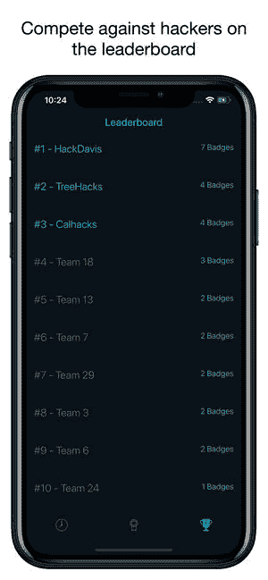
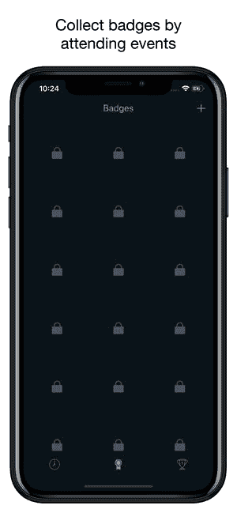
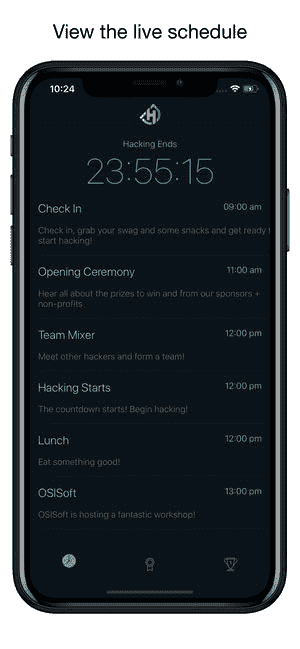
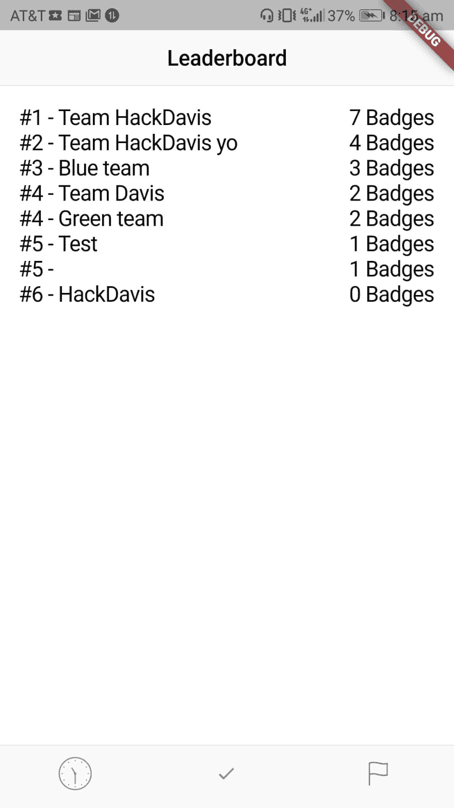
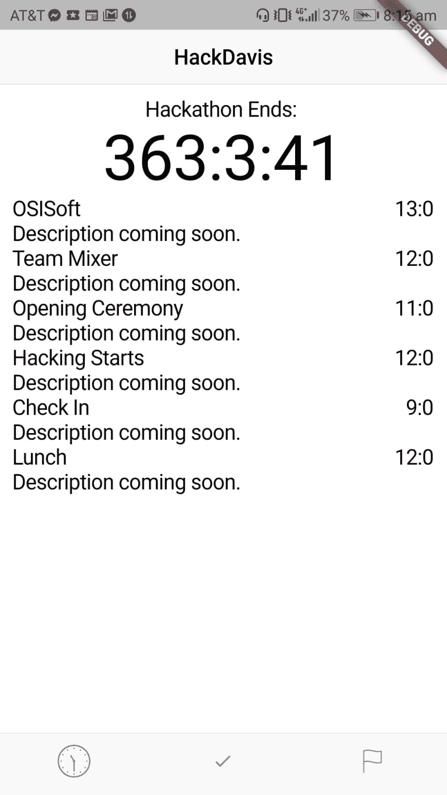
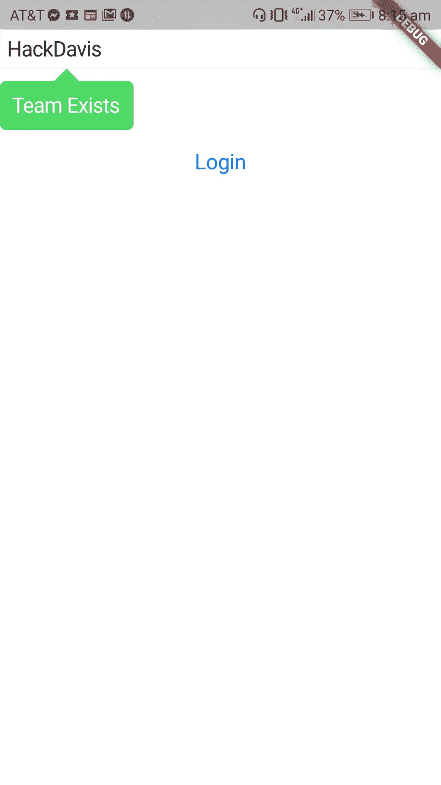
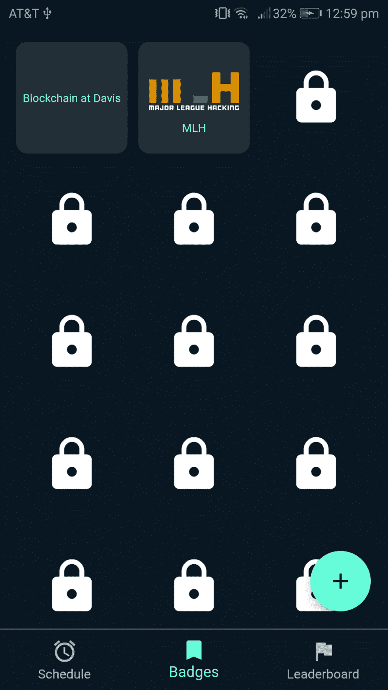
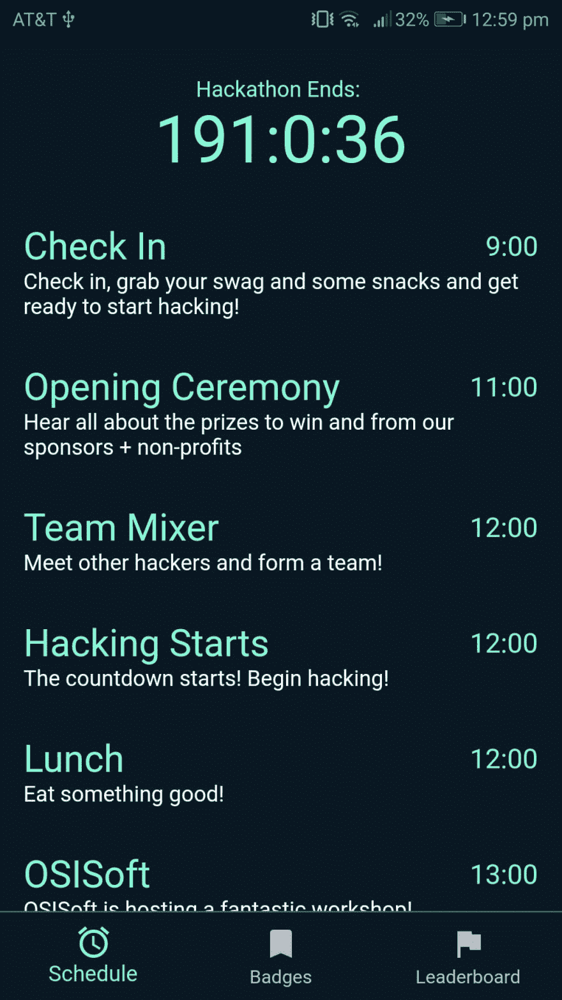
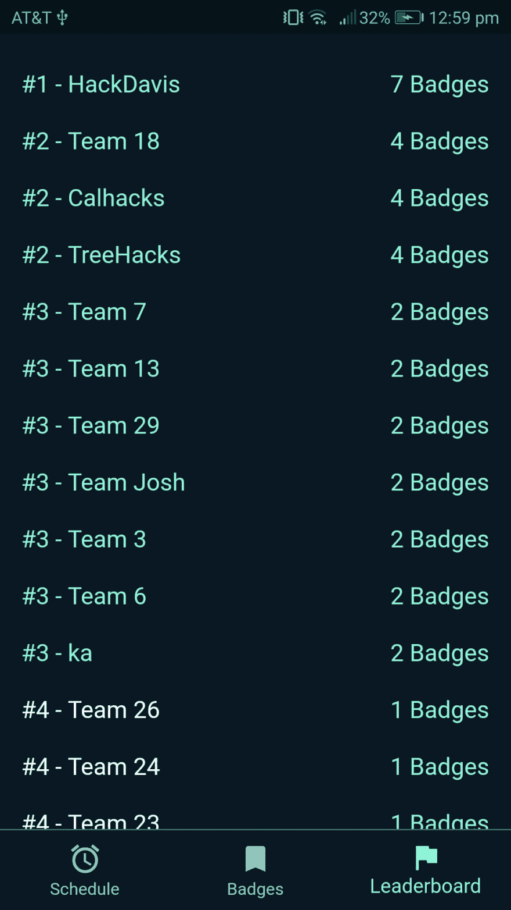
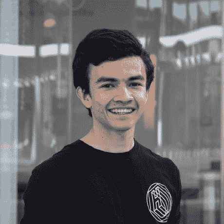

# 4 天内使用 Flutter and Parse 开发移动应用程序

> 原文：<https://dev.to/klanmiko/flutter-and-parse-1f71>

我是 HackDavis 的组织者，我的工作是编写软件:比如我们的网站 [https://hackdavis.io](https://hackdavis.io) ，我们的应用审查平台，以及各种脚本来自动化我们的一些工作流程。今年，我们希望开发一个移动应用程序，让参与者收集参加研讨会的徽章，并在排行榜上与其他团队竞争。另一名团队成员开始在 Swift 中构建 iOS 版本。进入我的困境:

# 查找 API

早在 2012 年，我曾经开发过一个安卓应用。

这是一个可怕的经历，3 个 Java 类只是为了做一个简单的列表视图。

我在寻找一种方法来快速构建这个 Android 应用程序，而不会陷入 Java API 文档和处理 Android Studio 和基于 XML 的布局。

我立刻想到了 React Native。在与 React 合作之前，我知道这将是一个可行的努力。然而，我通常使用 Vue，因为它感觉写起来更自然，而 React 的文档很糟糕，React Native 的文档更糟糕。

所以我寻找一个新的、闪亮的、快速的、移动的开发框架。就在那时，我发现了 https://flutter.io/。主要特点:

*   A e s t h e t i c
*   热的🔥再装
*   “本地性能”
*   用 Dart 写的？

Dart 本身看起来并不太难，看起来像是静态类型的 Javascript 但不像是 Typescript。

我们也在使用[解析](https://parseplatform.org/),因为 iOS 开发者认为它很酷。

继续吧。

# 为 Android 构建 iOS 应用

因此，我正在将一个 iOS 移植到 Android，我的近期计划是在 flutter 中使用来自 cupertino 库的小部件，因为它们已经融入了 iOS 设计。我想我需要重新着色大部分的界面来匹配下面的截图:

[](https://res.cloudinary.com/practicaldev/image/fetch/s--UjE_i21m--/c_limit%2Cf_auto%2Cfl_progressive%2Cq_auto%2Cw_880/https://d2mxuefqeaa7sj.cloudfront.net/s_FB0F2FA371DBD56354537F47EA2BE708A8A937CFE7EE09710E65EA8233F471BA_1550785226287_300x3jpg.jpg)
[](https://res.cloudinary.com/practicaldev/image/fetch/s--So8Gv7CS--/c_limit%2Cf_auto%2Cfl_progressive%2Cq_auto%2Cw_880/https://d2mxuefqeaa7sj.cloudfront.net/s_FB0F2FA371DBD56354537F47EA2BE708A8A937CFE7EE09710E65EA8233F471BA_1550785223520_300x2.jpg)
[](https://res.cloudinary.com/practicaldev/image/fetch/s--P21dTdjP--/c_limit%2Cf_auto%2Cfl_progressive%2Cq_auto%2Cw_880/https://d2mxuefqeaa7sj.cloudfront.net/s_FB0F2FA371DBD56354537F47EA2BE708A8A937CFE7EE09710E65EA8233F471BA_1550785219327_300x0w.jpg)

以下是我使用库比蒂诺图书馆所取得的成就:

[](https://res.cloudinary.com/practicaldev/image/fetch/s--o0g2_RFG--/c_limit%2Cf_auto%2Cfl_progressive%2Cq_auto%2Cw_880/https://d2mxuefqeaa7sj.cloudfront.net/s_FB0F2FA371DBD56354537F47EA2BE708A8A937CFE7EE09710E65EA8233F471BA_1550785902761_Screenshot_20190126-081541.jpg)
[](https://res.cloudinary.com/practicaldev/image/fetch/s--bwTsGhKt--/c_limit%2Cf_auto%2Cfl_progressive%2Cq_auto%2Cw_880/https://d2mxuefqeaa7sj.cloudfront.net/s_FB0F2FA371DBD56354537F47EA2BE708A8A937CFE7EE09710E65EA8233F471BA_1550785902718_Screenshot_20190126-081519.jpg)
[](https://res.cloudinary.com/practicaldev/image/fetch/s--MJBlHzGU--/c_limit%2Cf_auto%2Cfl_progressive%2Cq_auto%2Cw_880/https://d2mxuefqeaa7sj.cloudfront.net/s_FB0F2FA371DBD56354537F47EA2BE708A8A937CFE7EE09710E65EA8233F471BA_1550785902670_Screenshot_20190126-081505.jpg)

Flutter 在其库中提供了大量的小部件。我使用的一些工具包括用于设置屏幕的`CupertinoTabScaffold`、`CupertinoPageScaffold`，以及用于大多数文本元素的灵活布局的`Row, Column`和`Container`。登录屏幕上的绿色信息框是使用一个`CustomPaint`小部件绘制的箭头。

从 web 框架背景来看，很高兴看到在 Flutter 中有一个类似于`StatefulWidget`和`StatelessWidget`的概念。`Stateful`窗口小部件有生命周期挂钩和类似 React/RN 中的`setState`方法，而`Stateless`窗口小部件使用道具渲染。我使用这些概念来设置 hackathon 结束的计时器，并创建将在每个页面的列表中呈现的组件。

然后我需要设计 UI 的样式来匹配截图。

# 造型是不可能的

在 Flutter 中进行样式化是相当困难的，某些元素可以直接进行样式化来改变字体和颜色，但是并不是每个小部件都接受样式参数。此外，向元素添加填充意味着添加一个`Padding`小部件作为其父元素。这使得渲染函数很难阅读，尤其是对于多个嵌套的小部件。应用程序中使用的小部件示例如下:

```
class LeaderBoard extends StatelessWidget {
  final List<Team> teams;

  LeaderBoard(this.teams);
  @override
  Widget build(BuildContext context) {
    return Scaffold(
        body: Builder(
            builder: (context) => Container(
                padding: MediaQuery.of(context).padding,
                child: ListView(
                  padding: EdgeInsets.all(15.0),
                  children: teams
                      .map((e) => Padding(
                          padding: EdgeInsets.only(top: 10.0, bottom: 10.0),
                          child: Row(
                            mainAxisAlignment: MainAxisAlignment.spaceBetween,
                            children: <Widget>[
                              Flexible(
                                  child: Text(
                                "#${e.rank} - ${e.name}",
                                style: (e.rank <= 3
                                    ? Theme.of(context).textTheme.body1
                                    : Typography.whiteMountainView.body1),
                                textScaleFactor: 1.2,
                              )),
                              Container(
                                  margin: EdgeInsets.only(left: 50.0),
                                  child: Text(
                                    "${e.count} Badges",
                                    style: Theme.of(context).textTheme.body1,
                                    textScaleFactor: 1.2,
                                  ))
                            ],
                          )))
                      .toList(),
                ))));
  }
} 
```

如示例所示，render 方法中进行了大量配置，包括样式、设置文本缩放、在容器中包装组件和填充。这使得应用程序的样式变得很糟糕。此外，cupertino 库不像 material design 库那样有`Theme`小部件。我希望 flutter 团队能让样式变得更简单，比如将 CSS 规则应用于一整套小部件。

由于 cupertino 小部件不接受任何类型的风格或主题道具，我很难改变屏幕的背景颜色。这是我意识到:*我在 Android 上，我应该使用材料设计*。

将 cupertino 库换成 material 库后，我可以设计大部分组件的样式，过了一会儿，我有了类似这样的东西:

[](https://res.cloudinary.com/practicaldev/image/fetch/s--3D0cEx0u--/c_limit%2Cf_auto%2Cfl_progressive%2Cq_auto%2Cw_880/https://d2mxuefqeaa7sj.cloudfront.net/s_FB0F2FA371DBD56354537F47EA2BE708A8A937CFE7EE09710E65EA8233F471BA_1550787167179_Screenshot_20190202-125935.jpg)
[](https://res.cloudinary.com/practicaldev/image/fetch/s--0fllFAJi--/c_limit%2Cf_auto%2Cfl_progressive%2Cq_auto%2Cw_880/https://d2mxuefqeaa7sj.cloudfront.net/s_FB0F2FA371DBD56354537F47EA2BE708A8A937CFE7EE09710E65EA8233F471BA_1550787167343_Screenshot_20190202-125924.jpg)
[](https://res.cloudinary.com/practicaldev/image/fetch/s--1ybjrLsC--/c_limit%2Cf_auto%2Cfl_progressive%2Cq_auto%2Cw_880/https://d2mxuefqeaa7sj.cloudfront.net/s_FB0F2FA371DBD56354537F47EA2BE708A8A937CFE7EE09710E65EA8233F471BA_1550787167260_Screenshot_20190202-125939.jpg)

我删除了顶部的导航栏，因为它似乎是多余的，并添加了一个用于添加徽章代码的 FAB。为了实现底部的工具条，我还使用了带有一个`BottomNavigationBar`的`TabView`。通常`TabView`和标签控制器一起使用，但是标签控制器和底部工具条的呈现方式不同。我不得不自己使用一些状态变量来实现控制逻辑。

# 固定解析平台

Flutter 是新的，而 Parse 平台是旧的，已经停产，所以你可以想象很少有人同时使用两者。dart 没有官方的解析库。幸运的是，有一个针对 dart 的 flutter-parse-sdk 包，我可以将它用于这个项目。

它有缺陷，而且因为库太小，所以没有解决方法。

*   我使用“类”(数据库表)中的文件来存储徽章图像，SDK 在遇到文件时会抛出一个错误
*   我不能匿名登录
*   保存对用户的更改不会在数据库中更新

原生 Android 上的解析库得到了官方支持，并拥有我所有的特性，但 flutter - Android 桥仅用于进行方法调用。我需要用 Dart 表示对象，这样我就可以在 UI 中使用它。

所以我分叉了 SDK，自己实现了这些 bug 修复。过了一段时间，我能够让这个库为我的目的工作了，这些变化现在已经合并到 sdk 中了。

# [ 修复用户对象不保存，添加解析文件支持，匿名登录 #67](https://github.com/phillwiggins/flutter_parse_sdk/pull/67) 

[ ](https://github.com/klanmiko)  **[klanmiko](https://github.com/klanmiko)** commented on [Feb 02, 2019](https://github.com/phillwiggins/flutter_parse_sdk/pull/67)

嗨，菲尔，

我正在使用你的 sdk 为我们的黑客马拉松参与者开发一个应用程序。我浏览了一些我修复的问题，我认为为这个项目做点贡献是个好主意。以下是我的修改:

*   修复了由于访问 API 时缺少会话令牌而导致用户对象不与服务器同步的更改
*   通过为“AUTH_DATA”帖子数据提供唯一的 UUID，增加了匿名登录的功能。可以扩展，以允许在未来的 facebook 和 twitter 认证
*   增加了使用 url 和名称创建解析文件并将文件下载到临时存储的功能
*   修正了 ParseFile 初始化为 null _file 值的错误。

让我知道这些是否需要工作

[View on GitHub](https://github.com/phillwiggins/flutter_parse_sdk/pull/67)

# 为什么要杀我的 widgets？

我注意到的另一件事是，每次我在标签之间切换时，我会看到很多滞后。我意识到这是因为每次我在标签之间切换时，小部件都在重新构建，网络呼叫也在重新进行。为了解决这个问题，我添加了一个`AutomaticKeepAliveClientMixin`，这样标签视图在导航时就不会破坏这些视图。

但是这些视图仍然会被破坏，只有当我从屏幕 3 转到屏幕 1，然后再回到屏幕 2 时。我会看到内容闪烁。显然，虽然没有记录，但是如果 TabView 必须跳转到多个屏幕，它会破坏中间的任何屏幕，这意味着我的应用程序仍然必须重做网络请求来呈现。这导致了滞后。

与 React 一样，解决方案是提升状态。我最终让每个选项卡屏幕无状态，并使用 props 呈现列表数据，这意味着我的主要小部件很大，必须通过网络加载所有数据。如果这意味着应用程序将无延迟地渲染，这是可以的。

所以让我知道你的想法。你以前用过 Flutter 吗？你喜欢这个框架吗？您想了解更多关于 Dart 的信息吗？我很想听听其他开发者对 Flutter 和 Dart 的总体体验。我认为它可能是一种开发应用程序的好语言。