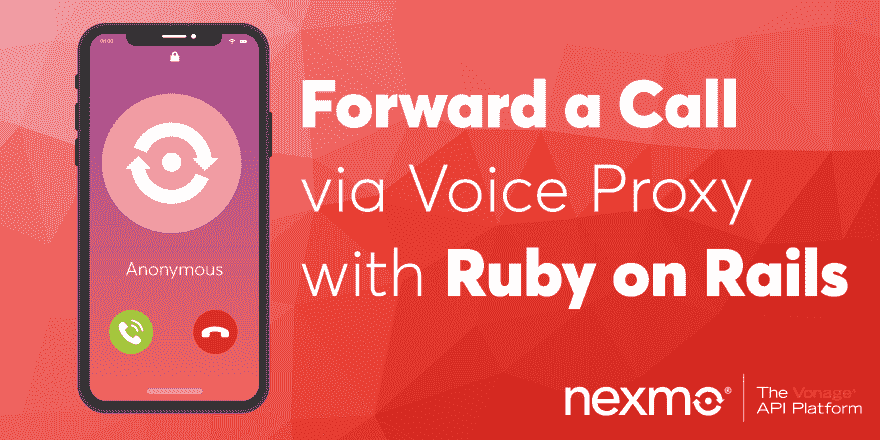

# 使用 Ruby on Rails 通过语音代理转发呼叫

> 原文：<https://dev.to/vonagedev/forward-a-call-via-voice-proxy-with-ruby-on-rails-39cm>

[](https://res.cloudinary.com/practicaldev/image/fetch/s--bcsoAMJ9--/c_limit%2Cf_auto%2Cfl_progressive%2Cq_auto%2Cw_880/https://www.nexmo.com/wp-content/uploads/2019/04/voice-proxy-ruby.png)

我们可能会在日常生活中使用应用程序，但尽管如此，打电话仍然是我们生活中不可或缺的一部分。每次我们通过电话做生意时，我们都会把自己的私人电话号码暴露给别人。这可能会给所有相关方带来隐私和安全风险。但是，通过使用语音代理，您可以缓解这个问题，并放心地打电话。

语音代理是一种通过中间电话号码将电话呼叫路由到最终目的地的方法。最终的电话号码被隐藏在中间号码的后面，从而保护了它的隐私。在本教程中，我们将逐步创建一个 Ruby on Rails 应用程序，使用 Nexmo Voice API 通过语音代理转发语音呼叫。

## 先决条件

要完成本教程，您需要一个 [Nexmo 帐户](https://dashboard.nexmo.com/sign-up)。如果您还没有帐户，请立即注册。

此外，您还需要:

*   [Ruby on Rails](https://rubyonrails.org/)
*   向外界公开我们的 Rails 应用程序

## 通过 Rails 语音代理转发语音呼叫

我们将完成以下任务，通过语音代理使用 Nexmo 语音 API 转发语音呼叫:

1.  创建 Rails 应用程序
2.  对外公开我们的应用程序，以便 Nexmo 可以与之通信
3.  设置我们的 Nexmo 帐户，购买一个 Nexmo 电话号码，并创建一个 Nexmo 语音应用程序
4.  创建 Rails 控制器、视图和路线

### 创建一个 Rails 应用

从命令行执行以下命令:

```
$ rails new forward-voice-proxy --database=postgresql 
```

Enter fullscreen mode Exit fullscreen mode

上述命令将创建一个新的 Rails 应用程序，将 PostgreSQL 作为其默认数据库。在您选择的代码编辑器中打开新的 Rails 应用程序，并将`dotenv-rails`和`nexmo`gem 添加到项目根目录下的`Gemfile`中:

```
# Gemfile

gem 'nexmo'
gem 'dotenv-rails` 
```

Enter fullscreen mode Exit fullscreen mode

我们现在准备将 gem 依赖项安装到我们的应用程序中。我们通过从终端运行`bundle install`来做到这一点。此时，我们也可以从终端运行`rake db:migrate`来设置数据库。在本教程中，我们不会使用数据库来保存数据，但是如果您愿意，可以将该特性添加到您自己的应用程序中。

此时，我们将设置 ngrok 以获取我们的外部可访问 URL，Nexmo 将使用它与我们的应用程序进行通信。

### 暴露应用程序

有几种方法可以让我们的本地开发服务器从外部访问，但是最简单的方法之一是使用 ngrok。你可以阅读[这篇文章](https://www.nexmo.com/blog/2017/07/04/local-development-nexmo-ngrok-tunnel-dr/)来获得关于 ngrok 如何工作的更详细的解释。然而，出于我们的目的，我们只需要让它运行并复制它提供给我们的 URL。

为了启动 ngrok，打开一个新的终端窗口，从命令行执行以下命令:

```
$ ngrok http 3000 
```

Enter fullscreen mode Exit fullscreen mode

现在，您将在终端窗口中看到一个 ngrok 日志记录界面。靠近界面顶部是以`Forwarding`开头的一行，包含两个 URL。第一个是外部可访问的 ngrok URL，以`ngrok.io`结尾，后跟`http://localhost:3000`，这是您的本地开发服务器。现在，当您或 Nexmo 联系到`ngrok.io` URL 时，它会将其转发到您的本地服务器。

确保将`ngrok.io` URL 复制到安全的地方。我们将在下一步设置 Nexmo 帐户、电话号码和语音应用程序时使用它。

### 用电话号码和语音应用程序创建一个 Nexmo 帐户

为了让我们的语音应用程序工作，我们需要一个 Nexmo 帐户，一个 Nexmo 提供的电话号码，一个 Nexmo 应用程序，最后，我们需要将我们的应用程序链接到我们的电话号码。

您可以免费创建一个 Nexmo 帐户，作为额外奖励，您的帐户将获得 2 欧元，以开始使用您的新应用程序。在您的网络浏览器中导航至[https://dashboard.nexmo.com/sign-up](https://dashboard.nexmo.com/sign-up)，并完成注册步骤。完成后，您将进入 Nexmo 控制面板。

从左侧菜单中，点击`Voice menu`项。您将在`APPLICATIONS`下看到以下四个选项:

[](https://res.cloudinary.com/practicaldev/image/fetch/s--Rss8Lq0g--/c_limit%2Cf_auto%2Cfl_progressive%2Cq_auto%2Cw_880/https://www.nexmo.com/wp-content/uploads/2019/04/voice-menu-options.png)

点击`Create an application`选项，您将被引导到一个页面，在这里您可以设置一个新的 Nexmo 应用程序。

用以下内容完成表格:

*   `Application name`文本字段输入`voice-proxy-forwarding-demo`
*   `Event URL`文本字段输入您的 ngrok URL: `https://[ngrok url here]/event`
*   `Answer URL`文本字段再次输入您的 ngrok URL:`https://[ngrok url here]/webhooks/answer`

完成后，点击蓝色的`Create Application`按钮。

现在，您已经创建了一个 Nexmo 语音应用程序。我们的下一步是购买一个 Nexmo 电话号码，并将其链接到该应用程序。

在 Nexmo 仪表板上，点击左侧菜单上的`Numbers`菜单项。您将看到出现三个选项:

[](https://res.cloudinary.com/practicaldev/image/fetch/s--cSQE6jWE--/c_limit%2Cf_auto%2Cfl_progressive%2Cq_auto%2Cw_880/https://www.nexmo.com/wp-content/uploads/2019/04/numbers-menu-options.png)

点击`Buy numbers`选项，你将被引导到一个页面，在这里你可以选择一个国家，功能，类型，以及你想要的四位数字。

[](https://res.cloudinary.com/practicaldev/image/fetch/s--J-A1q3kQ--/c_limit%2Cf_auto%2Cfl_progressive%2Cq_auto%2Cw_880/https://www.nexmo.com/wp-content/uploads/2019/04/buy-numbers-menu.png)

出于我们的目的:选择您当前所在的国家，以便您可以拨打本地电话；选择`Voice`选择功能，选择手机或座机类型。您不需要为`Number`文本字段输入任何内容。当你点击`Search`，你会看到一个电话号码列表。

点击橙色`Buy`按钮选择一个，在确认提示中再次点击橙色`Buy`按钮。

一旦你拥有了这个号码，你现在就可以将它链接到你的`voice-proxy-forwarding-demo`语音应用程序。为此，单击电话号码旁边的齿轮图标，您将看到以下菜单:

[](https://res.cloudinary.com/practicaldev/image/fetch/s--9-AeNxr2--/c_limit%2Cf_auto%2Cfl_progressive%2Cq_auto%2Cw_880/https://www.nexmo.com/wp-content/uploads/2019/04/edit-number-menu.png)

从下拉列表中选择`voice-proxy-forwarding-demo`应用程序，并点击蓝色`Ok`按钮。您的 Nexmo 电话号码现在已链接到您的语音应用程序，并准备好通过语音代理接受和转发呼入电话。

在准备运行我们的应用程序之前，我们的最后一步是定义我们的 Rails 控制器动作和路由。

### 创建 Rails 控制器和路线

继续在`/app/controllers/`中创建一个名为`call_controller.rb`的控制器文件。在控制器内部，我们将定义一个控制器动作和三个常量变量。该操作将包含 [Nexmo 呼叫控制对象(NCCO)](https://developer.nexmo.com/voice/voice-api/ncco-reference) 指令，通过语音代理将电话呼叫转移到我们的个人号码。这三个常量变量将分别保存我们的 ngrok URL、Nexmo 号码和个人号码。

```
# call_controller.rb

class CallController < ApplicationController
    BASE_URL = 'YOUR NGROK URL GOES HERE'
    NEXMO_NUMBER='YOUR NEXMO PROVISIONED NUMBER GOES HERE'
    PERSONAL_NUMBER = 'YOUR PERSONAL NUMBER GOES HERE'

    def answer
        render json: [
            {
                "action": "talk",
                "text": "Please wait while we forward your call"
              },
            {
                :action => 'connect',
                :eventUrl => [],
                :from => NEXMO_NUMBER,
                :endpoint => [
                    {  
                        :type => 'phone',
                        :number => PERSONAL_NUMBER
                    }
                ]
            }
        ]
    end
end 
```

Enter fullscreen mode Exit fullscreen mode

最后，我们需要在`routes.rb`中定义路由，这样我们的 Rails 应用程序就知道将 Nexmo `GET`请求定向到哪里。继续打开`/config/routes.rb`并添加以下内容:

```
# routes.rb

get '/webhooks/answer', to: 'call#answer' 
```

Enter fullscreen mode Exit fullscreen mode

您会注意到,`GET`请求的路径与我们在 Nexmo 仪表板中设置 Nexmo 语音应用程序时提供的 URL 相同。

我们的应用程序已经可以运行了！恭喜你！

### 运行应用程序

要运行你的应用程序，你只需要从命令行执行以下命令:

```
$ rails s 
```

Enter fullscreen mode Exit fullscreen mode

这将启动您的 Rails 服务器。在另一个终端窗口中，确保 ngrok 也在运行。现在，拨打您的 Nexmo 电话号码，您将听到您的应用程序对您说:“我们正在转接您的电话，请稍候”，然后您的电话将通过语音代理转接给您。

如果您希望您的应用程序在不宣布的情况下转发您的呼叫，该怎么办？你所需要做的就是从控制器的`#answer`路径中删除`talk` NCCO 指令。当你这样做的时候，你最终的控制器方法将如下所示:

```
# call_controller.rb

def answer
    render json: [
        {
            :action => 'connect',
            :eventUrl => [],
            :from => NEXMO_NUMBER,
            :endpoint => [
                {  
                    :type => 'phone',
                    :number => PERSONAL_NUMBER
                }
            ]
        }
    ]
end 
```

Enter fullscreen mode Exit fullscreen mode

## 进一步阅读

如果您有兴趣探索和阅读更多内容，请考虑以下内容:

*   [Nexmo 呼叫控制对象参考指南](https://developer.nexmo.com/voice/voice-api/ncco-reference)
*   [Nexmo 语音 API 概述](https://developer.nexmo.com/voice/voice-api/overview)
*   [如何使用 Ruby on Rails 处理呼入电话](https://www.nexmo.com/blog/2017/12/21/handle-inbound-phone-calls-ruby-rails-dr/)