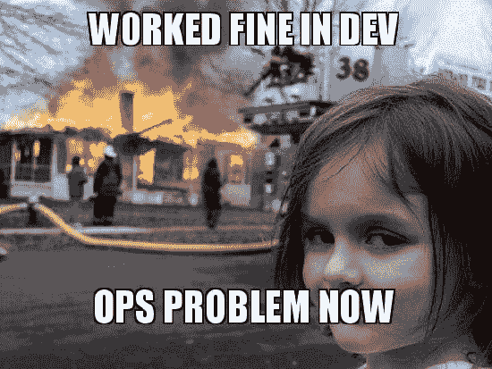

# 📍每个开发人员都应该担心的 REST API 的四个关键指标

> 原文：<https://dev.to/sochix/four-key-metrics-of-rest-api-every-developer-should-worry-about-12ie>

嗨，软件工程师，你有没有想过当你的应用被抛弃时会发生什么？你有没有遇到过这样的情况，当你的客户的要求和你的测试要求相差很大的时候？你还记得你所有的投诉客户都是用错误的*“内容类型”*发送请求的吗？

我第一次将应用程序性能监控(APM)连接到我的 REST API 时是这样的:*“哦，我该怎么处理这么多新数据？”*。什么是不好的，什么是好的？我应该担心 CPU 负载吗？或者请求也算？

要回答这些问题，您应该从客户端的角度考虑您的 REST API。当你的 API 运行顺畅时，你的客户并不关心 CPU 负载，但是如果你的 API 响应缓慢，他肯定会惊慌失措，这甚至会在 CPU 使用率较低时发生。因此，让我们一致认为，并非所有的指标都是有价值的。经过 10 多年开发 REST API 的经验，我总结出一条规则:**每个指标都应该是一个简单问题的答案，这个问题与您的业务和客户的体验有关。**

好的度量标准与您的业务相关并影响客户，例如:“客户在得到响应之前应该等待多长时间？”(例如，请求持续时间)，“我的应用程序现在服务于多少个客户端？”(例如，客户端请求的计数)，“客户端收到响应了吗？”(例如连接状态)。

另一方面，这是开发人员非常感兴趣的指标列表，但对您的客户端没有直接影响:“我的应用程序使用多少内存？”(例如内存消耗)，“我的应用执行了多少次 i/o 操作？”(例如，每分钟的 i/o 操作数)。所有这些指标与您的业务没有严格的联系，因为谁会在乎您的应用程序是否消耗了所有内存，但仍然在 10 毫秒内做出响应。

现在你已经知道了我的关键指标背后的哲学，在此基础上，我整理了一份你作为开发人员应该关注的关键 REST API 指标:

## 1。请求计数

请求计数是一个简单但非常有用的指标。利用这一指标，您可以回答接下来的重要业务问题:

*   有人在用我的 API 吗？(如果请求计数为零，则可能没有人)
*   我的 API 在工作吗？(如果请求计数为零，则它可能已损坏)
*   我的 API 受到了 DDoS 攻击吗？(如果最后一个小时的请求数远远高于平均水平)

## 2。响应代码

当我还是一个软件开发初学者时，我想知道为什么我们不能为每个请求发送 200 个代码？响应状态代码是理解请求发生了什么最简单的方法，无需读取和解码响应体。因此，在 REST API 中用适当的代码进行响应是非常重要的。使用响应状态代码，您可以回答以下问题:

*   客户端是否正确地调用了我的 REST API 方法？(例如，没有 4xx 代码)
*   我的 API 曾经崩溃过吗？(例如 5xx 代码)
*   我的 API 运行正常吗？(例如，只有 2xx 代码)

## 3。请求持续时间

请求持续时间的黄金标准是 200 毫秒，但老实说，这在现实世界中并不真实。根据我的经验，一些方法的调用可能需要 60 秒，但对客户端来说还是可以的。因此，您应该与客户协商请求持续时间的上限，并在 SLA(服务级别协议)中确定其值。有了这个指标，你就可以回答下一个有价值的业务问题:

*   我的 API 的响应速度比它应该的慢吗？(例如，所有响应的发送速度都快于阈值时间)

## 4。请求完成了吗

此度量描述连接状态。它与请求持续时间指标高度相关。有未完成的请求意味着您的客户机在响应到达之前已经关闭了连接。我想到了下一个问题:

*   我的客户总是收到回复吗？(如果有很多未完成的请求，那么这绝对是检查这个的一个理由)

## 总结

请求计数、响应时间、状态代码和连接状态是您应该关注的四个简单指标。我个人在过去的 3 年里一直在使用这些指标，并且没有停止使用的计划。

* * *

我在建造📊 [SLAO: Node.js +快递监控](https://slao.io)。注册免费试用！
还不确定？只要按🧡为这个职位。

*原贴[此处](https://slao.io/blog/posts/api-key-metrics/)T3】*