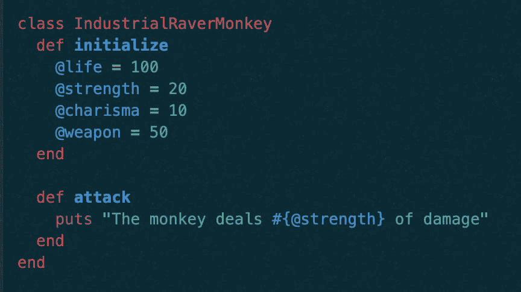

# 从红宝石到铁锈

> 原文：<https://dev.to/joshualoran/from-ruby-to-rust-1hgn>

我已经完成了软件工程训练营的一大半。我真不敢相信在过去的两个半月里我们学到了多少东西，我能在这个瓜里塞进多少信息。但是，如果你像我一样，你对软件工程充满热情，并在思考你在工程界的下一步可能是什么。在学习了 Ruby、Ruby on Rails、Javascript、HTML 和 CSS 之后，我开始了解这些语言的一些局限性以及它们的优势。

Ruby 是一种直观、易读、易于设置的语言。使用 Ruby on Rails，输入一个 generate scaffold 命令就可以启动一个后端服务器，从头开始输入可能需要一天多的时间，但只需要几秒钟。Ruby 在语法糖的基础上增加了语法糖，使输入代码变得愉快。比如等等…我这里不需要括号，那里也不需要打字，但是 ruby 是怎么知道…魔法的。Ruby 充满了神奇的幕后工作，这使得编程比大多数其他语言更容易、更直观。这种魔力是 Slant.co 将 ruby 列为新手开发者第五名的部分原因。为什么不先？因为 Ruby 的魔力有几个缺点。

从 Ruby 开始并且只知道 Ruby 的开发人员可能不理解指针、类型和/或数据结构之类的东西。此外，由于 Ruby 几乎严格地作为一种面向对象的语言运行，只使用 Ruby 的开发人员可能不会学习或理解许多其他的编程范例。Ruby 也有规模和资源消耗的限制，使得大型项目的工作效率大大降低，典型的例子是 Twitter [切换语言](https://blog.twitter.com/engineering/en_us/topics/infrastructure/2017/the-infrastructure-behind-twitter-scale.html)。因此...

这一切让我想到了一个问题。学习什么样的语言会有助于巩固更深层次的概念，让我成为一个更有用、更高效的开发人员？我想编写使用最少资源的高效代码。我想拥有 C++的强大功能，而不需要多年的学习曲线或复杂的语法。而且，我想享受用 Ruby 编写代码的乐趣和方便。我从一些更有经验的开发人员那里听说过 Rust，在我告诉他们我在寻找什么之后，他们给了我一些提示。

Rust 比 Ruby 更接近 C。但是，它有更好的内存安全性和管理。例如，指针不允许指向其他指针。在编译时，中间指针从等式中删除。只有当你明确地将类型定义为可变或不可变时，它们才是可变或不可变的。也没有自动垃圾收集器。相反，它使用 RAII(资源获取是初始化),提供确定性的资源管理，并在编译时防止悬空指针和其他形式的未定义行为。此外，语法和代码结构迫使开发人员编写最佳代码。

由于其内存安全和资源效率，slant.co 将 Rust 列为后端开发人员学习的第一语言，并发和元编程的第二语言。在 Stack Overflow 的[开发者调查](https://stackoverflow.com/insights/survey/2017#most-loved-dreaded-and-wanted.)中，Rust 还获得了最佳综合编译语言的第一名，以及 2017 年和 2018 年最受欢迎的编程语言。

开始使用 Rust 是相当容易和直接的。你可以在网上阅读《T1》这本书。这本书将带你了解从 Hello World 到构建 CLI，甚至是服务器设置的所有基础知识。从任何语言，甚至是神奇的 Ruby，到 Rust 并不太难，因为很多概念是相同的。你只需要学会如何更好地控制事物的运行。在 ruby 中，您可能会创建一个类似如下的对象:

在 Rust 中，同样的东西可能看起来像:

Rust 有一个很大的社区可以学习，并且有很好的文档记录。所以，随着你对这门语言研究的深入，你会有更多的信息和人可以学习。