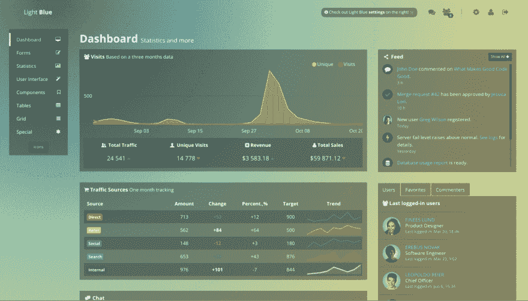
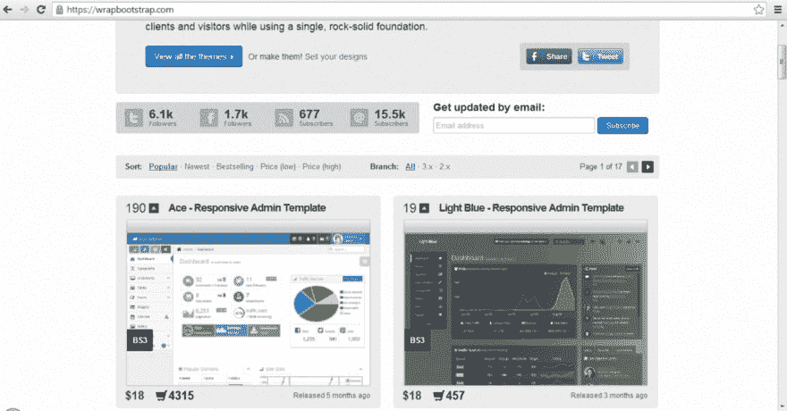
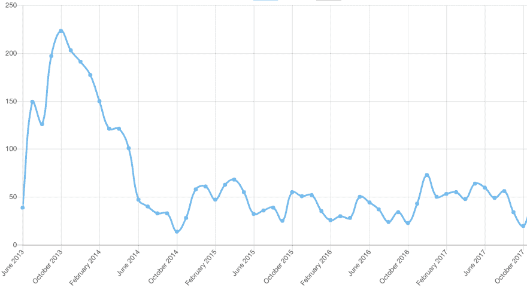
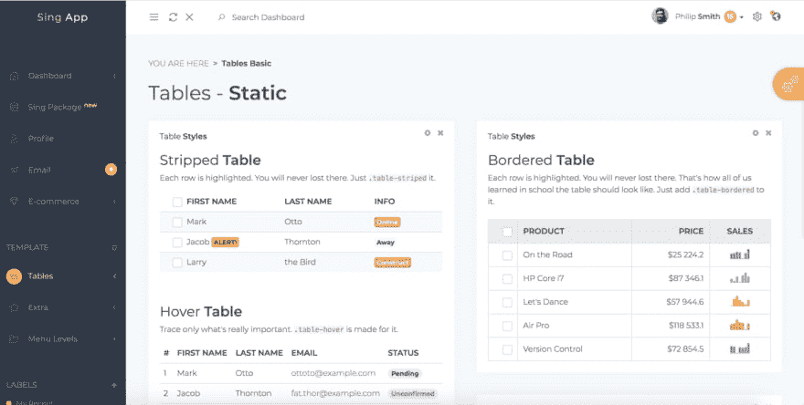
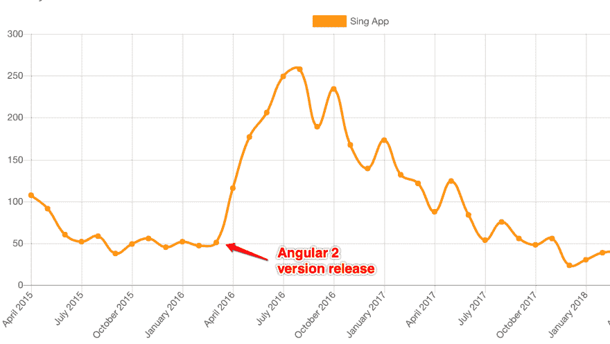
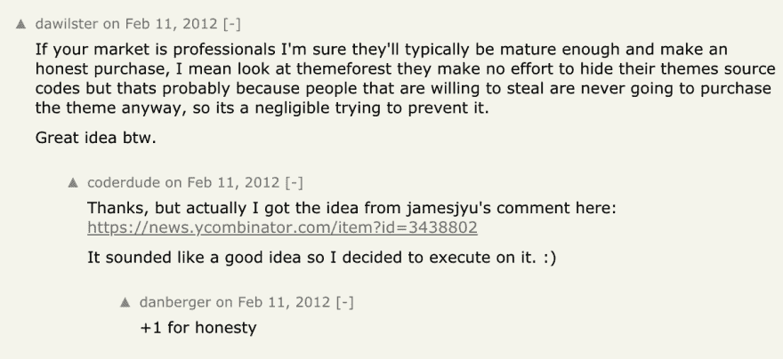
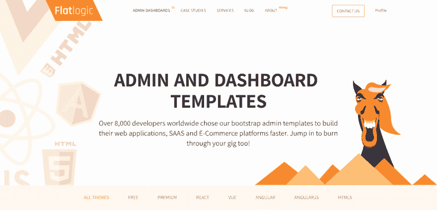

# 从在市场上销售管理模板到创建我们自己的平台。平面逻辑的故事

> 原文：<https://dev.to/flatlogic/from-selling-admin-templates-on-a-marketplace-to-creating-our-own-platform-a-story-of-flatlogic-2n5i>

去年，我们在 flatlogic.com 推出了一个网上商店，直接向客户销售我们的管理仪表板模板。直到最近，我们在第三方市场上销售了 8000 多份模板许可证，所以开放我们自己的平台对我们来说是一件重要的事情。达到这个里程碑引发了一些反思，我想在这篇文章中分享。

## 浅蓝色模板

这一切都始于 2013 年 6 月，当时我们最初将第一个名为浅蓝色的主题上传到 wrap bootstrap——当时可用的 bootstrap 市场之一。以今天的眼光来看，浅蓝色显然显得过时了；然而，像渐变背景和透明部件的基本功能已经到位。

这是 2013 年 6 月发布后的浅蓝色模板。
[T3】](https://res.cloudinary.com/practicaldev/image/fetch/s--fIrxIbmL--/c_limit%2Cf_auto%2Cfl_progressive%2Cq_auto%2Cw_880/https://flatlogic.com/blog/wp-content/uploads/2018/10/Snip20181023_20-e1540991261691.png)

这不是一个营销帖子，但我想说，浅蓝色确实是第一个带有渐变背景和透明小部件的管理仪表板模板。我相信模板开发人员有点害怕尝试这种设计，所以当时的大多数管理模板看起来都很相似:深色用于侧边栏，浅色用于内容区域。如果你看过所有这些小说电影，你可能已经看过他们如何在宇宙飞船上操作透明界面。所以在我们看来，这种设计趋势的出现只是时间问题。我们在透明设计上下了赌注，创造了浅蓝色，从长远来看，它证明了自己的成功。

最初对浅蓝色的反应非常好。在几个月的时间里，它占据了市场首页的首位，并获得了大量的销量。当我看到其他模板受到浅蓝色设计的启发时，我个人感到非常自豪。

一些模板开发者甚至更进一步，简单地复制了浅蓝色的设计，并开始在其他市场上销售。这当然对我们来说是不可接受的，所以我们必须了解什么是 DMCA 下架通知，以便处理这种情况。

在此期间，我们收到了许多开发咨询:浅蓝色是许多公司构建 web 应用程序的初始项目。就在那时，像 SC-Networks GmbH 这样的大企业找到了我们，希望在我们的模板之上构建他们的[自动化软件](https://flatlogic.com/case-studies/evalanche)。

最终的销售图表如下:

我倾向于把图表开始时的销售高峰归功于设计的新颖。市场上出现的透明类似物越多，我们的销量就越少。销售额逐渐下降到每月 50 英镑左右，并在过去四年中保持在这一水平。就技术而言，浅蓝色一直支持最新版本的 Bootstrap 和 Javascript 框架，因此它一定不是下降的原因。

我从这些统计数据中得出的唯一结论是，管理模板市场竞争非常激烈:一旦你发布了一些流行的功能，它就会在很短的时间内被竞争对手复制。因此，为了保持领先地位，人们必须不断为产品添加新功能。当然，我们用了第二个模板。

## 唱吧应用管理仪表板

就设计而言，浅蓝色是一个边缘模板。花哨的设计适合展览，但不适合日常使用。对于一个每天都在使用的应用程序，模板必须具有非常平滑和不引人注目的设计，集中在图表、文本、图形等内容上。

因此 Sing App 看起来很经典:深色的侧边栏和浅色的内容区。我们还提出了移动侧边栏的想法——只有当用户将鼠标悬停在侧边栏上时，它才变得可见；否则，它保持关闭。

最初的销售额一般，全年保持在 50 英镑/月的水平。然后谷歌宣布提前发布 Angular 2，于是我们决定不放过一个机会，乘风破浪！由于 Angular 生态系统非常不稳定，开发初始版本花了几个月的时间——谷歌每周发布一次突破性的变化。最后我们发货了，Sing App 是全球第一个支持 Angular 2 的管理模板。这极大地推动了我们的销售和集成需求。

许多大大小小的企业再次与我们联系，希望在 Sing App 上构建 web 应用。我们参与了许多很酷的项目，如[无人机数据分析平台](https://flatlogic.com/case-studies/optelos)和[预订管理系统](https://flatlogic.com/case-studies/rezbot)，其中 Sing App 充当了应用程序的主干。

流行持续了一年:其他模板作者也在追赶并发布 Angular 2 版本。我们继续支持和发布新版本，比如 React 和 Vue。此外，我们的团队参与了大量的集成项目，所以每个月有大约 100 个销售就足够了。直到我们意识到在第三方市场上销售不是一个可扩展的解决方案。

## 市场与自己的电子商务商店

在市场上销售显然有一个巨大的好处:不需要在营销上花费任何资源，这使得这成为没有营销技能的模板开发人员最喜欢的途径。就是这样。从卖方的角度来看，没有更多的好处。我试图搜索一些关于这个问题的文章，发现了一个[非常相似的分析](https://www.shipbob.com/blog/online-store-vs-marketplace-ecommerce-website-sell/)，作者强调了相同的观点。
现在让我们来看看不利方面。有很多。

首先，根据市场费用结构，我们必须从每 35 美元的购买中放弃 10 美元，这样我们只剩下 25 美元。因此，如果我们每月销售 100 台，这意味着我们每年至少要支付**12，000 美元作为营销成本**！我的意思是，来吧，我们可以把这笔钱投资到 google adwords 上，吸引同样多甚至更多的流量(当然，这只是理论上的)。
第二，我们不知道谁是我们的客户。为了收集反馈和创造更好的产品，我们不知道电子邮件或任何其他联系方式。

第三是品牌认知度。人们联系我们，说他们从 Wrapbootstrap 购买了我们的模板。他们甚至不知道我们公司的存在！我非常肯定他们不会为了买更多的产品而回到 Flatlogic，他们会回到市场。

当我们意识到所有这些要点时，最终的决定是显而易见的:我们需要从市场转移到我们自己的商店。当然，为了通过商店销售，我们必须 a)建立平台本身，b)吸引足够的流量来产生销售。我们觉得我们在这两个领域都有足够的专业知识，所以我们决定试一试，并在三个月内开发了整个平台，包括设计和适当的营销定位。

彻底转移模板的最后一个信号是，市场连续三个月没有支付。

## Wrapbootstrap 问题

从一开始，Wrapbootstrap 就没有专注于与其作者建立良好的关系。例如，我们自己的主题在被批准之前要经过几个月的审查。你可以谷歌一下 wrapbootstrap 的问题，发现很多开发者在各种论坛上抱怨这个市场。许多主题根本没有收到任何反馈。

Wrapbootstrap 的所有者詹姆斯·西蒙斯(James Simmons)似乎是一名开发者，正如詹姆斯自己所说，他是从 2012 年黑客新闻的[评论中获得 bootstrap marketplace 的想法的。](https://news.ycombinator.com/item?id=3579238)

我有一种感觉，詹姆斯对待他的市场更像是一个副业，而不是一个严肃的业务:在五年中没有增加新的功能。我认为 Wrapbootstrap 完美地抓住了潮流，在完美的时间创造了市场，就在 bootstrap 开始流行的时候。然而，詹姆斯未能将其发展成更大的公司，以充分利用这一机会。

从 2018 年 7 月到 9 月，Wrapbootstrap 的作者都没有获得报酬。此外，许多人试图通过电子邮件和电话联系詹姆斯，但他没有回应。经过三个月的沉默，他支付了所有的款项，但没有提供任何延迟的解释。对于大多数作者来说，这是压垮骆驼的最后一根稻草。像 Inspinia 和 SmartAdmin 这样的顶级主题转移到了一个新创建的市场。一些作者干脆关闭了他们的主题。对我们来说，这也是最后一面红旗。因为那时我们已经准备好了我们的平台，我们把模板移到了那里。

无论如何，我不能说这个市场只有负面的东西:我们已经成功地销售了我们的主题五年了，许多开发者发现了模板，许多模板创作者通过在那里销售主题谋生。

## 接下来是什么？

自 2018 年初以来，我们一直在努力确定我们的市场定位，并试图找到我们的技能和市场需求的完美结合。我们认为真正优质的主题供应商有一席之地，他们可以在质量而不是价格的基础上与 Themeforest 和其他市场竞争。因此，我们推出了自己的网上商店，直接向客户销售主题。

在我们内部进行的一个小型研究中，我们确定了一个成功模板的三个关键特征:a)设计质量，b)页面和组件的数量，c)长期支持和维护。所以秘方很明显，这就是为什么我们将在所有这些方向稳步增长，通过提供真正优质的产品和支持与我们的客户建立长期关系。当然，我们不可能从一开始就尽善尽美，所以另一个关键因素是接受和应用客户反馈的能力。这就是我们急切等待它的原因😉

更具体地说，在不久的将来，我们计划为我们的仪表板提供更多的页面:博客文章和列表、更多的电子商务页面、投资和资产管理仪表板、项目和联系人管理工具、问题跟踪器等。此外，将会有全新设计的全新产品，可能还会有一些 UI 套件。
*最初发布于*[https://flat logic . com/blog/from-selling-admin-templates-on-a-market place-to-creating-our-own-platform-a-story-of-flat logic/](https://flatlogic.com/blog/from-selling-admin-templates-on-a-marketplace-to-creating-our-own-platform-a-story-of-flatlogic/)