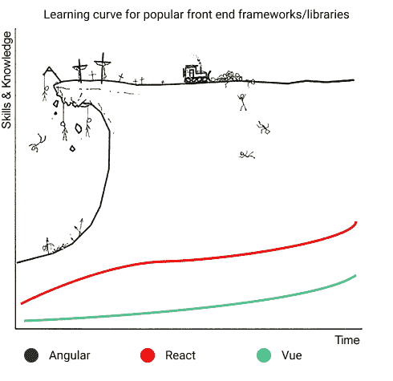
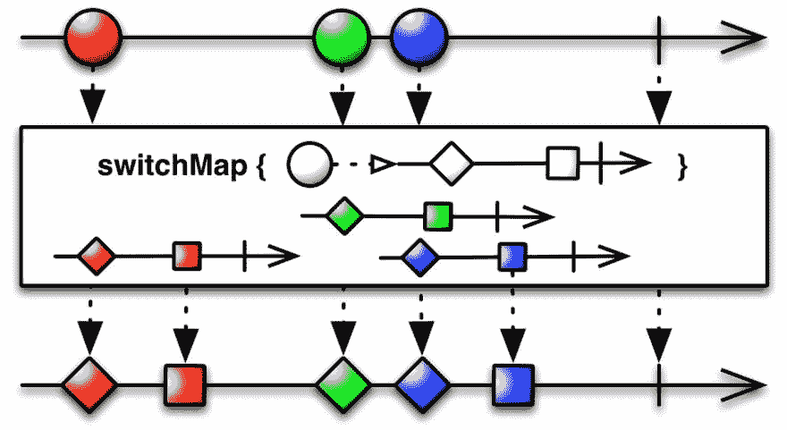
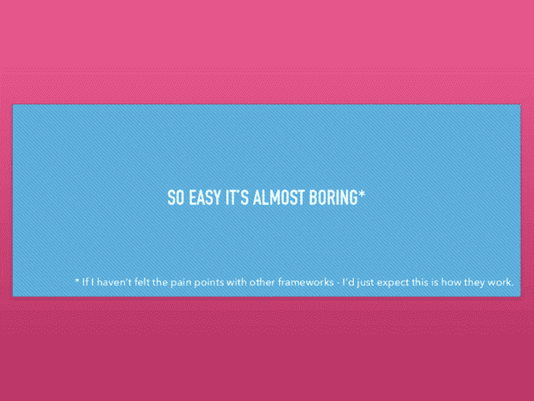

# 从 Vue 到 Angular

> 原文：<https://dev.to/codegram/from-vue-to-angular-4n9m>

*最初发表于 [Codegram 的博客](https://www.codegram.com/blog/from-vue-to-angular/)T3】*

最近每个人似乎都在转向 Vue。有大量关于从 React/Angular 迁移到 Vue 的文章。我吗？我正在做完全相反的事情。在 Vue 工作了 2 年左右，转到 Angular 是一个有趣的过程。

我在 2016 年末开始使用 Vue，就在 2.0 版本出来的时候，我几乎完全把它作为我选择的前端框架。在此之前，我几乎没有什么编码经验，只会一点 AngularJS、jQuery 和 vanilla JS。当时学习 Vue 的资源并不多，所以我基本上是通过阅读文档来学习的。这真是一次美好的经历。快乐时光。

几个月前，我开始在 Codegram 工作，那里的前端框架是有棱角的。我想，*哎，我现在有经验了，能有多难？*

### 学习曲线

[](https://res.cloudinary.com/practicaldev/image/fetch/s--S4GocjGJ--/c_limit%2Cf_auto%2Cfl_progressive%2Cq_auto%2Cw_880/https://lh3.googleusercontent.com/8MMeIGGVlgHaZGC8FHWqr8aWTbpfxlYF5umP2ipQJzx1gwogqSHgsYLugI7NQBt0Dl-twluTDkjkcQlnY-nBbEyTQIuTTJzs6TuJMu85mcGpPEwQjk_abpfoKHO89cFpgKUMYgA1) 
*嗯。真的很难。*

即使你有多年的前端开发经验，你也很可能只处理过 HTML、JavaScript 和 CSS。你可能对模块系统很熟悉，也可能用过一些构建工具，比如 Gulp 或 Webpack。

当你开始使用 Vue 时，你可以使用你已经知道的: *HTML* ， *JavaScript* ，和 *CSS* 。如果您喜欢其中任何一种，您可以使用 Pug、TypeScript 和 Stylus，但是默认情况下，您不需要学习其他任何东西。关于 Webpack 的知识会有所帮助，但是默认配置在大多数情况下会起作用。

另一方面，棱角分明会给你强加很多东西。除了框架本身，它有很多概念，比如模块、服务等等，你还需要学习一门新的语言( *TypeScript* 和 *RxJS* )。

的确，TypeScript 与其说是一种全新的语言，不如说是一种超集，如果您不使用严格的模式，类型检查基本上是可选的，但是如果您想要遵循最佳实践，它会增加相当多的开销，并大大降低开发速度。我觉得我用 Vue 轻松实现的一个功能，用 Angular 需要更长的时间。

### RxJS

RxJS 嵌入了 Angular 的工作方式，因此您需要遵循一种反应式编程模式。我真的很喜欢 RxJS，但是我有(现在仍然有)很多被动思考的问题。这当然是值得的，但是对那些没有反应式编程经验的人来说，把它强加到你的框架上会是一个相当大的阻碍。此外，有时这些小图表没有多大帮助:

[](https://res.cloudinary.com/practicaldev/image/fetch/s--BjtzXW5c--/c_limit%2Cf_auto%2Cfl_progressive%2Cq_auto%2Cw_880/https://lh3.googleusercontent.com/55mTdCCRTMk_19Wc--I6UHuMStUmXtisGLw3ZShLnAV1ojJFG9fs-ianmFy3uo_l9Ez8B4BtyTAY5z1dTyun997ItphYshPMhScV9PTlwry6rMOaXYvEFD0F60qgC7OGAfEGur2w) 
*我是说，加油*

通常，使用 Vue，组件会自动对状态变化做出反应，而无需我们担心。组件将被重新呈现，如果需要，计算的属性将被重新计算，等等。然而，有些事情需要手动触发。假设我们需要在每次路由参数改变时执行某种方法。使用 Vue，我们需要设置一个[观察器](https://vuejs.org/v2/guide/computed.html#Watchers)，就像这样:

```
watch: {
  '$route.params': function (params) {
    // do the thing
  }
} 
```

有了 Angular 和 RxJS，route params 是一个[可观察的](https://angular.io/api/router/ActivatedRoute)，所以你可以通过接入流(或映射，或任何非常酷的 RxJS 操作符)对变化做出反应

```
this.route.params.pipe(
  tap(params => {
    // do the thing
  })
); 
```

我更喜欢 Angular 的反应式方法，但我能理解强加 RxJS 不是 Vue 应该为你做的选择。有官方的 [RxJS 集成](https://github.com/vuejs/vue-rx)，这是我很期待尝试的东西。

### 模板系统

令我惊讶的是，尽管 Angular 和 Vue 在处理模板时使用了相同的方法(没有 JSX，只有一些绑定和指令的老式 HTML)，但最终的体验却完全不同。

所以，我需要学习使用 Vue 模板的东西只有`v-for`、`v-if`(和`v-else`)、`v-bind:attribute`(或简写`:attribute`)、`v-on:event`(或简写`@event`)。基本上，你需要把`v-`附加到任何你想做的事情上，它就会工作。

我必须学会使用 Angular 模板的东西:`*ngFor`、`*ngIf`、`[attribute]`、`(event)`，一些特定的属性与`[attr.whatever]`一起工作，还有用于双向绑定的`[(banana-in-the-box)]`(我必须承认我喜欢这个名字，这可能是目前为止我最喜欢 Angular 的部分)。还有`[ngClass]`和`[ngStyle]`，我知道它们不同于`[class]`或`[style]`，但我似乎永远记不起*如何*或*为什么*。

同样，如果你想做一个 *if/else* 结构，你需要添加一个额外的`ng-template`并做类似于
的事情

```
<button *ngIf="someCondition; else otherBtn">
  An action
</button>
<ng-template #otherBtn>
  <button>
    Another action
  </button>
</ng-template> 
```

如果您想在没有包装元素的情况下在每个箱子中显示一些商品，您需要首先在一个`ng-container`中设置条件，然后创建两个不同的`ng-template`。条件与模板完全分离，使得阅读更加困难:

```
<ng-container
  *ngIf="someCondition; then templateA; else templateA">
</ng-container>

<ng-template #templateA>
  <p>Some text</p>
  <button>An action</button>
</ng-template>
<ng-template #templateA>
  <p>Some other text</p>
  <button>A different action</button>
</ng-template> 
```

在 Vue 中，我发现它更干净，更容易理解:

```
<button v-if="someCondition">
  An action
</button>
<button v-else>
  Another action
</button> 
```

如果你不想要包装元素，只需使用`template` :
中的`v-if`

```
<template v-if="someCondition">
  <p>Some text</p>
  <button>An action</button>
<template v-else>
  <p>Some other text</p>
  <button>A different action</button>
</template> 
```

我相信 Angular 这样工作是有原因的，我并不是想暗示它是一个糟糕的框架，但是当你体验过 Vue 的简单方法时，即使是这样的小事也可能成为一个大的痛点。

* * *

我可以分享的普遍观点是，Angular 在从事大型项目和大型团队时大放异彩。Angular 已经为您做了许多决定，因此团队可以专注于重要的事情。然而，这也是任何其他框架都可以做到的。将 TypeScript 与 Vue 或 React 一起使用。遵循风格指南和文件夹结构( [Vue ESLint](https://github.com/vuejs/eslint-plugin-vue) 和 [Nuxt](https://nuxtjs.org) 可以帮你做到这一点)。遵循最佳实践。你可以创建一个不与 Angular 成比例的糟糕项目，就像你可以与 React 或 Vue 成比例一样。一个框架不会把你推入糟糕的模式，也不会把你从错误中拯救出来。

Vue 通常因创造了出色的开发体验而受到称赞，但最终，最好的框架是您最熟悉的框架。我将留给你们一张埃文·舒尔茨的幻灯片，它准确地表达了我对 Vue 的感受:

[](https://res.cloudinary.com/practicaldev/image/fetch/s--qDq4UVjW--/c_limit%2Cf_auto%2Cfl_progressive%2Cq_auto%2Cw_880/https://lh6.googleusercontent.com/mmuMlNqgDUkBa0YayAu0EfkhE3hDSK30sBMFrrpbOVCHoY7OY7w0k4JZKOw7nkeBIMBPZoVCKIFblEL0u8j9B0OUSo4grOh8nZQMEN16a-LLBMUOrEfF8mo9qeQB4BPLUCRUjBII)