# 从零到魔方求解机器人

> 原文：<https://dev.to/stevcooo/from-zero-to-rubiks-cube-solving-robot-2ccj>

*TL；DR:作为一个宠物项目，我在
不到一年的时间里制造了一个机器人，它可以在没有任何电子知识或经验的情况下解开魔方。*

#### 这一切是如何开始的

这一切都是从我为了好玩买了一个魔方开始的。当我还是个孩子的时候，我有好几个这样的问题，但是我从来没有解决过。我甚至记得我有一些解释如何解决它的论文，但我当时一点也不明白。所以，当我得到我的立方体，一年前，我把我的思想解决它，只能解决一边，也许设置匹配的角落，但就是这样，我不能解决下一个阶段(第二层)。然后我在网上找了一个教程《初学者的方法》。这是一步一步的教程如何解决任何魔方。一开始，这有点令人沮丧，直到我学会了符号，并能够理解这些步骤。下一步是学习步骤的顺序和算法，最后，我能够解决我的立方体。这是我连续几天，也许一周的精神锻炼。在我掌握了“初学者的方法”之后，我能够在大约 2.5 分钟内解决这个立方体。在那之后乐趣就没了，你知道你能解出立方体，除非你需要消磨一些时间，否则它就不再有趣了。

[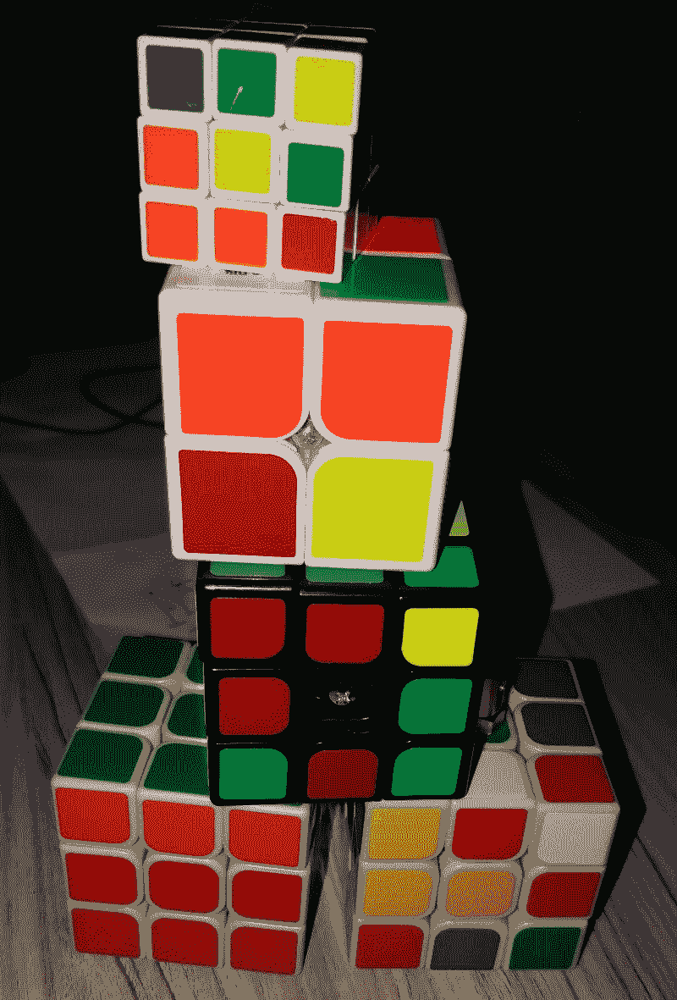](https://res.cloudinary.com/practicaldev/image/fetch/s--udxaJ0oX--/c_limit%2Cf_auto%2Cfl_progressive%2Cq_auto%2Cw_880/https://cdn-images-1.medium.com/max/800/1%2AQ3yAfYbiDSFdpNuRqPP5-w.jpeg)

<figcaption>My unsolved cubes</figcaption>

#### 算法挑战——用代码表示立方体

下一阶段是做一个可以解魔方的程序，并不是说以前没有开发过，但我认为这对我来说是一个很好的练习。由于“初学者方法”是一种简单的算法，应该以给定的顺序应用于立方体，所以应该很容易开发一个程序来实现这一点。第一个挑战是使用 OOP 中的对象很好地表示立方体。我选择了使用测试驱动开发(TDD ),我从来没有后悔过。编写一个复杂的软件需要大量关注细节，需要跟踪每一个算法，没有 TDD 这是不可能完成的，尤其是当你不是每天都开发它的时候，因为它是一个宠物项目，你只花一小部分空闲时间在上面。没有测试，你肯定会在 2 周的开发后迷失，而且你永远不会知道你的任何改变是否破坏了什么，直到你将所有的步骤应用到立方体，这是耗时和令人疲惫的。

[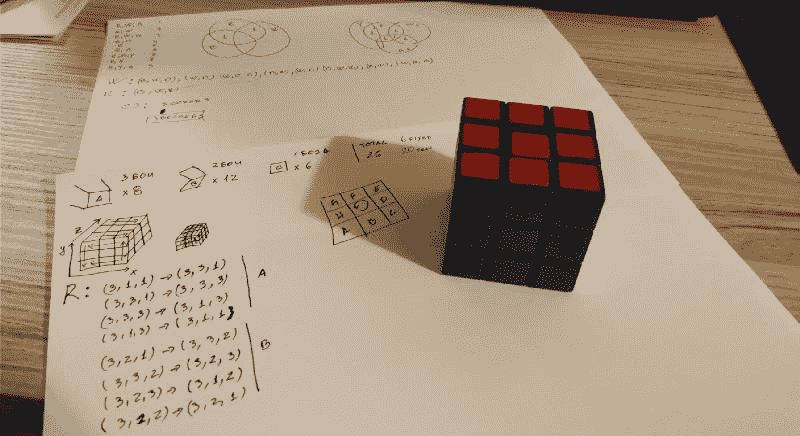](https://res.cloudinary.com/practicaldev/image/fetch/s--LkYtZlQA--/c_limit%2Cf_auto%2Cfl_progressive%2Cq_auto%2Cw_880/https://cdn-images-1.medium.com/max/800/1%2Am9qiPzqCKpEDmJA5pFlK4A.jpeg)

<figcaption>Mapping cube rotations</figcaption>

在几个单元测试和对象之后，我能够制作第一个控制台应用程序，在那里我可以直观地看到我的应用程序是如何进展的，从忙乱到解决立方体变化。当我完成算法并通过所有单元测试时，应用程序能够定义一个已解决的立方体，对其进行加扰，并使用“初学者方法”解决它，这都是在大约 200 个步骤中完成的。我非常惊讶和自豪，不是因为我做了以前没有做过的事情，而是因为我完全靠自己完成了，我的宠物项目已经启动并运行了。

#### 树莓派

拥有一个解决立方体的算法，并且只作为一个控制台
应用程序工作，这并不有趣。它是如此抽象，它解决了抽象环境中的一个实际问题。你看不到/感受不到实际的求解过程，你只能定义一个代表立方体形成/组合的矩阵，算法会给你一组旋转，你应该执行这些旋转来求解立方体。对我来说，下一步是制造一个能解决魔方的机器人。它应该做的唯一事情是将算法输出的步骤应用于物理立方体。我从来没有建造过机器人或者给机器人编程，我不知道应该从哪里开始。我的想法是有一个马达，它可以在立方体上旋转，这是我想到的最简单的模型。在网上搜索了一下，我发现了步进电机。

> 步进电机是一种 DC 电机，它以离散的步进方式工作。这是一个
> 同步无刷电机，一个完整的旋转分为几个步骤。

太好了，这正是我需要的。我需要能旋转 90 度的东西。但是等等，为了能够控制步进电机，你需要 Arduino 或 Raspberry PI。我在这方面毫无经验。我从未接触过 Arduino 或 Raspberry Pi，它对我来说是一个完全神秘的世界。于是，我决定买树莓派和 Arduino，就是为了探索一下，看看能不能有所作为。一个月后，它被送到了我家，我开始了我电脑经历的全新篇章。

[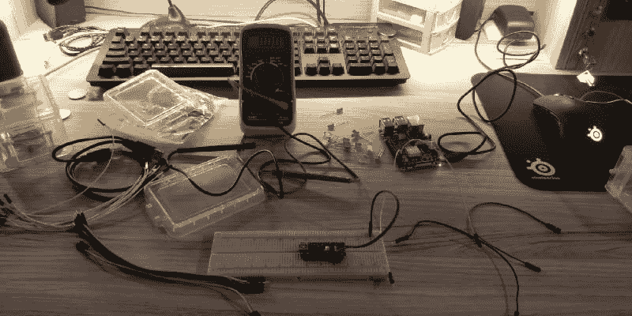](https://res.cloudinary.com/practicaldev/image/fetch/s--vMb47das--/c_limit%2Cf_auto%2Cfl_progressive%2Cq_auto%2Cw_880/https://cdn-images-1.medium.com/max/800/1%2A-7bEvuytK7BpjWVsuTOdew.jpeg)

<figcaption>Playing around with Arduino Nano and Raspberry Pi for the first time</figcaption>

过了一段时间，我决定继续用树莓派。这对我来说更容易，因为它比 Arduino 工作在更高的水平上，而且它有一个你可以使用的操作系统。我从来没有用过树莓派，对我来说这是一个完全未知的世界。所以，我的树莓派之旅才刚刚开始。我在 YouTube 上看了几个教程，以获得一些该领域的基本知识。人生第一次用 Python 写剧本。显然，你可以用 Python 做很多事情，有很多库可以帮助你编写 Raspberry Pi pins。我写了一个示例 Python 脚本，可以打开和关闭 LED，我很高兴像一个小孩子。我小时候玩 LED 和电池，当然很有趣，但是现在我可以用代码控制 LED 了。太神奇了。在那之后，许多想法在你的大脑中浮动，你可以自动化或编程你的许多日常任务/例程。但是我坚持我的第一个想法，能够控制步进电机在给定的方向上旋转 90 度。当我搜索时，我发现有几种类型的步进电机。我不确定我需要哪一个，所以我买了最便宜的一个(28 byj-48v 4 相 DC 齿轮步进电机)。只是为了测试一下。一个月后，它被送到了我家，我开始探索它。当然，您需要一个驱动器(ULN2003 驱动板)来处理您的输入并相应地控制步进电机。我在网上找到了一些易于使用和实现的脚本。几个小时后，我能够控制我的步进电机，并通过编程角度的数量和方向来控制运动。

[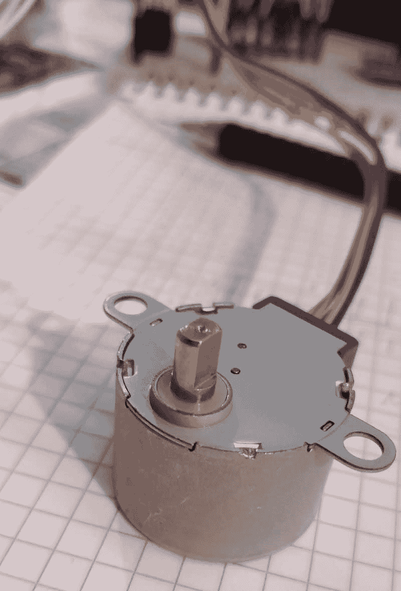](https://res.cloudinary.com/practicaldev/image/fetch/s--jYWHKK6W--/c_limit%2Cf_auto%2Cfl_progressive%2Cq_auto%2Cw_880/https://cdn-images-1.medium.com/max/800/1%2AF5gw01ICtGsOUFKzqgg4WQ.jpeg)

<figcaption>28BYJ-48 motor</figcaption>

我太高兴了。马达似乎很强劲，扭矩很大。我确信，如果我有 6 个马达，立方体的每一边一个，我将能够控制/解决立方体，因为我有计算所需步骤的算法。我为他们订购了 6 个新的步进电机和 6 个驱动器，一个月后，他们被送到了，我开始把它们连接到我的树莓 Pi 上。为了节省一些引脚，我在用 Arduino Nano 做实验。我把我的 Arduino Nano 编程为多路复用器。我有 6 个应该运行的电机，但在给定的时刻只有一个会被激活。

按照这种逻辑，我能够使用我的 Raspberry 的 3 个引脚来控制 Arduino Nano 的 8 个输出(我只需要 6 个)中的哪一个将是活动的(2 =8)。但是在和这个人相处了一天之后，我放弃了这个想法。幸运的是，树莓上有足够的引脚将所有 6 个电机直接连接到它。我把步进电机驱动器连接到树莓派上。每个驱动器有 4 个信号+ 2 个电源引脚。在玩了一段时间后，所有的 6 个马达都连接好了，我可以控制它们中的哪一个旋转，旋转多长时间和向哪个方向旋转。太好了！现在我可以控制 6 个马达，立方体的每一边一个。我只想提一下，我在测试时发射了 2 或 3 个马达，我认为这是开发过程的一部分，不用担心，除了你需要等待一个月才能从全球速卖通收到新马达。

[https://www.youtube.com/embed/fOVS4aL_0OQ](https://www.youtube.com/embed/fOVS4aL_0OQ)

<figcaption>第一次玩 Arduino Nano 和树莓派</figcaption>

#### API 和映射

现在，我将所有 6 个电机都连接到树莓派上，我可以控制它们了。太好了。现在，我需要一些服务来为我提供应该应用于多维数据集的步骤列表。我开发了一个简单的 API 服务，它将返回一系列求解步骤。使用 Python 的 Raspberry 应该能够连接到这个 API 服务，该服务将返回求解立方体所需的步骤列表。但是要从 API 中获得一些结果，您应该以某种方式传递立方体的当前状态，这样算法就可以进行计算并通过服务返回它们。现在，我需要一个 web 界面来映射立方体的当前状态。我用 JavaScript 开发了一个简单的网站，你可以在那里映射你的魔方，根据你的状态，算法会计算步骤并存储它们，所以当你从 Python 调用 API 时，它会返回步骤给你。该网站现在得到了增强，它提供了在网上解决你的家庭立方体所需的步骤。(这里有一些关于网站和使用方法的截图)。现在，我有了一个网站，可以绘制我的立方体和一个计算求解步骤的服务，并且我的 API 可以在一个列表中返回这些步骤，可以在 Raspberry Python 代码中使用这些步骤来控制电机。

#### 木制时代

将所有 6 个步进电机连接起来并运行，接下来要做的是构建一个框架，将所有电机和立方体固定在一起，以便相应地旋转立方体的侧面。简单的想法，只是我需要找到一种方法来连接步进电机轴与立方体的每一边的中心。看我第一次连接的截图。我用一个螺丝和一种环氧树脂化合物来建造连接轴和立方体中心的东西。现在剩下的是构建一个框架。我做了一个木制立方体，将电机和立方体放在中间。我做到了，我有了我的第一个机器人结构，我连接了它，它工作了。不应该这样，但是的，这是一件事。它可以旋转，但不是我想要的。我想是因为框架不够精确，立方体没有保持在绝对的中心位置，马达也不能精确地旋转 90 度。有时候是，但大多数情况下不是。如果一边旋转了 85 度，另一边就不能旋转了，因为前一边挡住了它的去路。我有一点失望，也许不止一点，但仍然，永不放弃。

[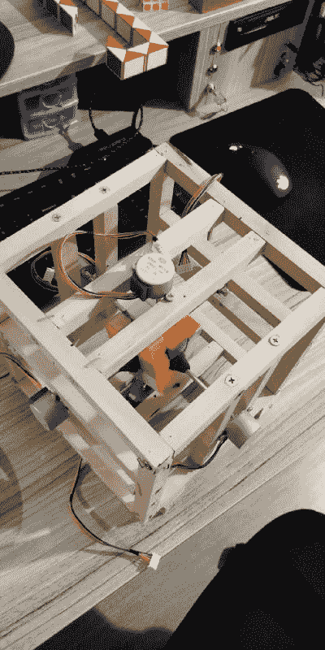](https://res.cloudinary.com/practicaldev/image/fetch/s--j2km2hVs--/c_limit%2Cf_auto%2Cfl_progressive%2Cq_auto%2Cw_880/https://cdn-images-1.medium.com/max/400/1%2AM8hJBF0lhVU-LwCVlQJ7ow.jpeg)

<figcaption>The first wooden case part 1</figcaption>

[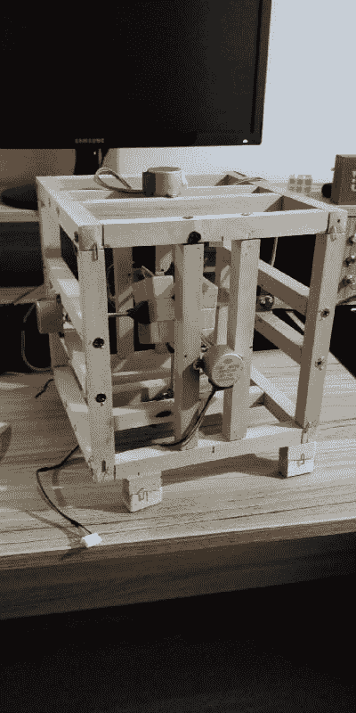](https://res.cloudinary.com/practicaldev/image/fetch/s--orWj_Z4Z--/c_limit%2Cf_auto%2Cfl_progressive%2Cq_auto%2Cw_880/https://cdn-images-1.medium.com/max/400/1%2Ajxglm9AxlVD7zSJrlo7tgw.jpeg)

<figcaption>The first wooden case part 2</figcaption>

[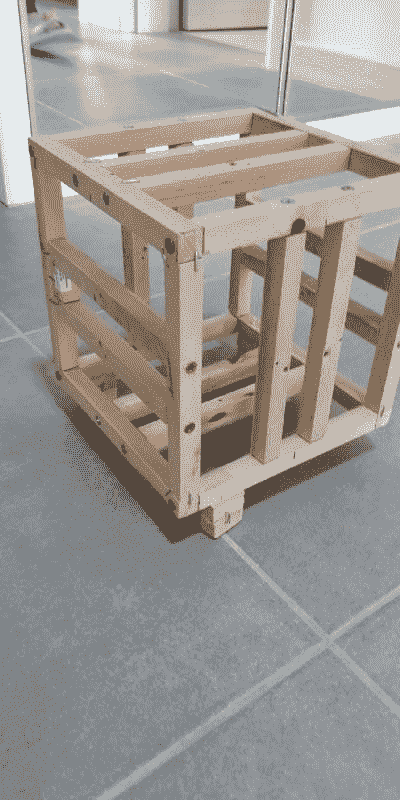](https://res.cloudinary.com/practicaldev/image/fetch/s--Fc__xhVQ--/c_limit%2Cf_auto%2Cfl_progressive%2Cq_auto%2Cw_880/https://cdn-images-1.medium.com/max/400/1%2AvIoDRxF5qRgMyFlU6x1Cdg.jpeg)

<figcaption>The first wooden case part 3</figcaption>

#### 木制时代||

下一步是找到立方体和步进电机轴之间更好的连接。我在全球速卖通身上找到了一些有用的东西。我立即订购了它。12 个，以防万一。因为我改变了轴和立方体之间的连接，我决定做一个新的木制框架，这样会更精确和更小。我也这样做了，我的木工手艺越来越好了(不要问我妻子我在我们的公寓里搞得一团糟)。

连接器来了，我用新的木架把它们和轴以及立方体中心连接起来。应该就是这个了。但事实并非如此。老样子，老样子。它有一点改善，但还不够。现在旋转角度在 85 到 90 度之间，但是由于步进电机的扭矩很小(在开始时，似乎足够了)，你无法预测会发生什么。你没有任何来自电机的反馈，你只给它发送一个命令做 90 度旋转，但你不知道它是否做 90 或 80 甚至 0 度半径。我的意思是你可以直观地看到它，但覆盆子没有任何想法(也许在未来我可以扩展这个项目，使用相机作为反馈传感器，但也许)。

[https://www.youtube.com/embed/tiNWicCCbQs](https://www.youtube.com/embed/tiNWicCCbQs)

<figcaption>Second wooden case</figcaption>

#### 有机玻璃时代

好了，现在我在轴和立方体之间有了一个新的连接，但是我的木框不够精确。我需要更精确的东西。我在我的镇上找到了一家当地商店，那里有一台激光切割机，可以将我的设计应用到有机玻璃上。我安装了 Adobe Illustrator，并开始为我的机器人设计新的框架。几个小时后，它被设计出来并准备生产。我联系了公司，把我的设计发给他们，他们在两天内就完成了。我太高兴了。我拿起我的新有机玻璃框架，附上我的步进电机和立方体。测试时间到了。我在我的网站上绘制了我的立方体，运行 API 调用，它收到了大约 200 步，并开始旋转侧面。这很棒，但是仅仅在前 3-4 轮，我就遇到了同样的问题。旋转不完全是 90 度。现在一切都取决于步进电机的旋转扭矩。我有点失望，几乎对我的魔方解决机器人失去了想法和希望。

[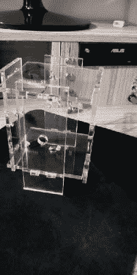](https://res.cloudinary.com/practicaldev/image/fetch/s--wmeM6UTJ--/c_limit%2Cf_auto%2Cfl_progressive%2Cq_auto%2Cw_880/https://cdn-images-1.medium.com/max/200/1%2A0EW5-k-KqBRp31Y7x6DuEw.jpeg)

<figcaption>plexiglass case img 1</figcaption>

[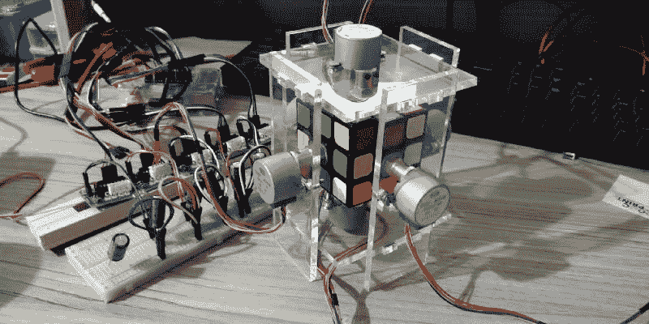](https://res.cloudinary.com/practicaldev/image/fetch/s--_kt4jNZw--/c_limit%2Cf_auto%2Cfl_progressive%2Cq_auto%2Cw_880/https://cdn-images-1.medium.com/max/800/1%2AB6ZC8jAI86_8a81uVdzs8Q.jpeg)

<figcaption>plexiglass case img 2</figcaption>

<figcaption>plexiglass case img 3</figcaption>

[https://www.youtube.com/embed/H_ACvtJAXy8](https://www.youtube.com/embed/H_ACvtJAXy8)

<figcaption>Rubik’s cube in a plexiglass case</figcaption>

#### Nema17

经过再次研究，我为我的机器人找到了希望。我发现很多移动机器(数控机床)都使用 NEMA 标准电机。我发现 Nema17 步进电机可以完成这项工作。我以前见过这种步进电机，但一开始它们对我来说很贵。现在他们似乎是我项目的唯一希望。我订购了其中一个只是为了测试它，当然，他们使用不同的驱动程序，所以我买了一个新的驱动程序(他们很便宜)。根据一些 YouTube 视频，我需要在电源和步进电机驱动器之间使用一个电容器，这是我以前没有考虑过的。我买了几个，也很便宜。一个月后 Nema17 步进电机到货，我测试了一下。我对它的强大感到惊讶。我立刻又订购了 5 个，这样我就可以在立方体的每一面都贴上一个。同样，一个月后，我有了 6 个 Nema17 步进电机和 6 个新驱动器，以及 6 个电容器。现在我需要一些电源来提供足够的电力。以前我使用一个简单的 DC 适配器，但这还不够。在与我的一位同事交谈后，他建议使用台式电脑电源。它有足够的电力供应 6 个马达没有问题。我家里本来就有备用电源，就用了。

[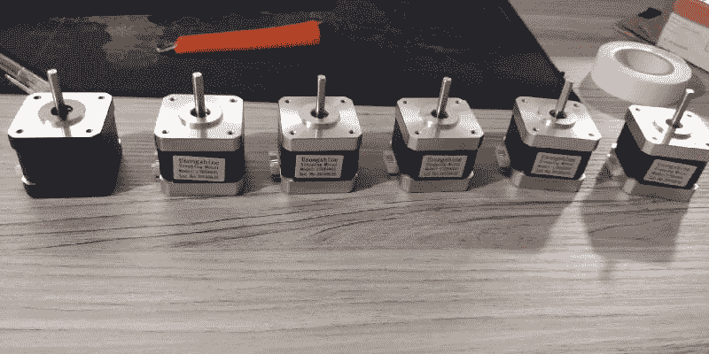](https://res.cloudinary.com/practicaldev/image/fetch/s--rwUvZXKy--/c_limit%2Cf_auto%2Cfl_progressive%2Cq_auto%2Cw_880/https://cdn-images-1.medium.com/max/800/1%2AgvjudxaVpaQSGI2NkoOSdg.jpeg)

<figcaption>NEMA 17 Step motors</figcaption>

现在，所有 6 个电机都连接到电源，我需要一个新的框架(再次)，因为 Nema17 电机有不同的尺寸，需要一个全新的框架。这次我甚至没有考虑用木框，马上设计了新的有机玻璃印花，并订购了。过了一两天，我有了新的镜架。我连接了所有的东西，它工作了！！！终于！我太高兴了；我的魔方被机器人解开了。找到了。现在是凌晨 2 点，我像一个小孩子一样兴奋，我需要解决我桌子上所有电线的问题，但在我破坏任何事情之前，我决定去睡觉，因为 10 个月后我第一次看到我的机器人解决立方体。

[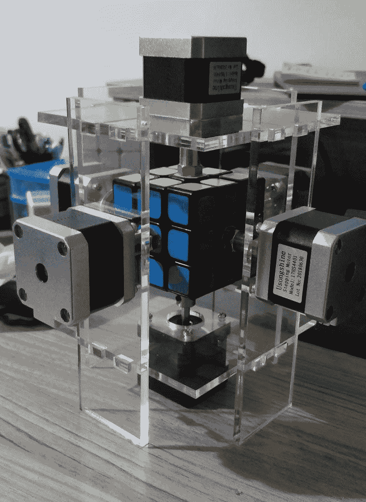](https://res.cloudinary.com/practicaldev/image/fetch/s--614pH5we--/c_limit%2Cf_auto%2Cfl_progressive%2Cq_auto%2Cw_880/https://cdn-images-1.medium.com/max/800/1%2AqcsexS71kCY0ilYsZipFtQ.jpeg)

<figcaption>New plexiglass case with NEMA 17</figcaption>

#### 焊接和 PCB 设计

因为我有 6 个驱动器连接到我的 Raspberry Pi，每个驱动器都有 3 个控制引脚，1 个方向引脚，1 个步进引脚，1 个接地引脚，2 个 plover 引脚，4 个从驱动器引出的引脚连接到 Nema17 步进电机，所以我的原型板上有大约 80 根跳线，一片混乱！当我看着它时，我脑海中的第一个想法是“如果其中一根跳线出来，它可能会烧坏一些驱动器或电机”，我不想这样。为了避免这种危险，我买了一个 PCB 原型板，并开始在上面焊接元件。这清理了混乱。现在，我有了一个定制的 PCB 板，所有的东西都连接在一起并正常工作。

[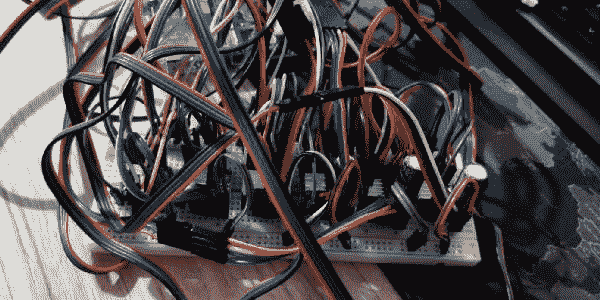](https://res.cloudinary.com/practicaldev/image/fetch/s--n_3DTaWP--/c_limit%2Cf_auto%2Cfl_progressive%2Cq_auto%2Cw_880/https://cdn-images-1.medium.com/max/600/1%2AAhKx-HDcpx71gRsALzCsIA.jpeg)

<figcaption>~80 wires in the protoboard</figcaption>

[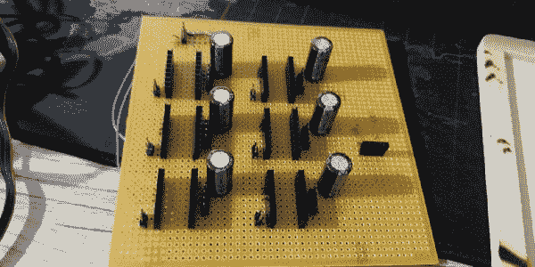](https://res.cloudinary.com/practicaldev/image/fetch/s--qnWxrsth--/c_limit%2Cf_auto%2Cfl_progressive%2Cq_auto%2Cw_880/https://cdn-images-1.medium.com/max/600/1%2A5UNqFlZoMzuQd8SVNCFKEA.jpeg) 

<figcaption>去 PCB 板</figcaption>

#### 让我们给用户一些反馈

在我有了一个可以处理大约 200 次旋转来解决立方体的工作机器人之后，用户(观察者)不知道什么时候会结束。这只是一个简单的 90 度旋转，直到你看到解决立方体。我有一个小显示器，用来显示一个递减计数器，这样观察者就知道在解出立方体之前还有多少步。

[https://www.youtube.com/embed/P-DITcE-pOw](https://www.youtube.com/embed/P-DITcE-pOw)

<figcaption>Solving the cube using the Beginners method with step down counter</figcaption>

#### 利用机器人

用 200 步左右的时间解决这个立方体很好，但是速度不快。初学者的方法对于学习如何解立方体是很好的，但是它是最慢的算法。现在我需要能更快解出魔方的东西。在互联网上做了一点研究后，我发现了 F2L 算法，它可以在 23 步内解决任何立方体。真好。我唯一需要的是在我的应用程序中实现并使用这些代码。所以，我做了。我用 Kociemba 实现[http://kociemba.org/cube.htm](http://kociemba.org/cube.htm)。它工作得很好，我只是用 C#实现了它，并在我的服务中使用了它。现在这个立方体在 23-25 个步骤中被解决了。

[https://www.youtube.com/embed/hinvKkamiUI](https://www.youtube.com/embed/hinvKkamiUI)

<figcaption>Full cube solve with Kociemba (F2L) algorithm</figcaption>

#### 吸取教训

我花了将近一年的时间在这个项目上，这是我做的最长的宠物项目。在过去，我有许多宠物项目，从简单的网站到各种全栈网站和几个移动应用程序。我已经尝试了很多技术和开发栈，但是没有什么能像这个一样吸引我的注意力。也许是因为在这个项目中，我第一次在我的运营商中尝试了开发的所有层面，从硬件到软件，从基本布线和电压调整到 API 服务器调用。如果你看到了博客的这一部分，你已经注意到我在开发过程中失败的次数比成功的次数多，但是这个过程中的小成就/里程碑是让你保持渴望的原因。我从不放弃，但是能够做到这一点，无论你的目标是什么，把它分成几个里程碑，这样你会更快地从你已经完成的事情中获得满足感，这是给你下一个小目标的动力。任何宠物项目都是耗时的，但要以一种你在开发过程中会感到有趣的方式来做，与你的家人或同事分享你的一些成就，他们会给你一些反馈并鼓励你下一步的行动。我从亲近的人那里收到的反馈中得到了一些改进的想法。学习新事物最简单的方法是当你乐在其中的时候。

[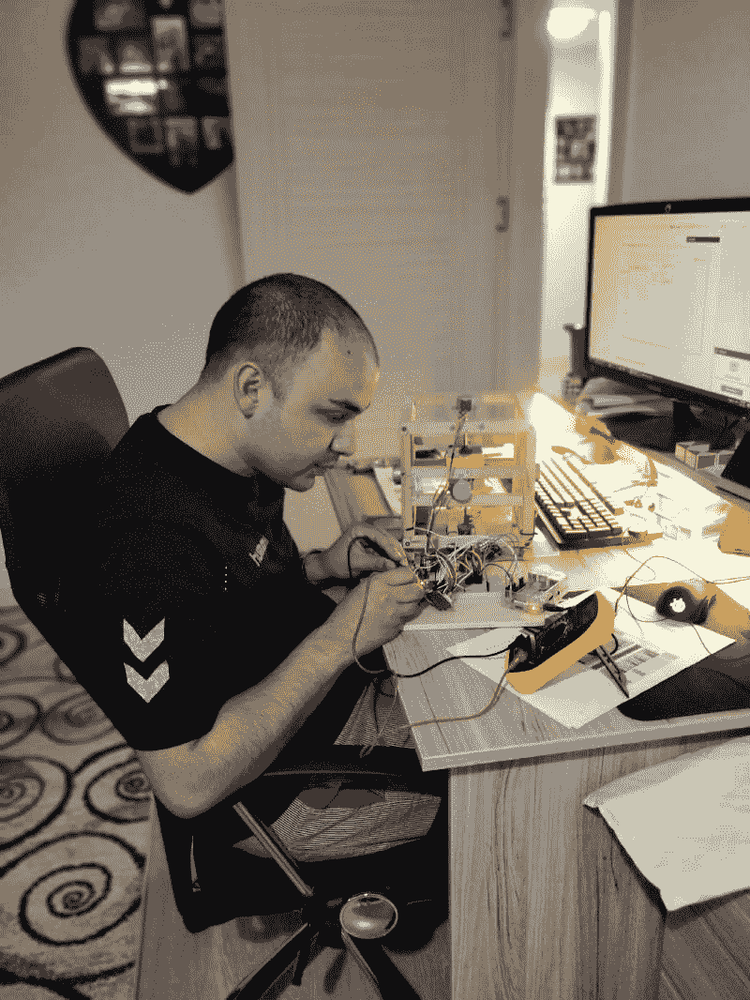](https://res.cloudinary.com/practicaldev/image/fetch/s--OOL22J6J--/c_limit%2Cf_auto%2Cfl_progressive%2Cq_auto%2Cw_880/https://cdn-images-1.medium.com/max/800/1%2A3mFuYG-X1qGdx63bduZ7Jw.jpeg)

<figcaption>The making of</figcaption>

如果你有任何问题或建议，请不要犹豫与我联系，我愿意尽我所能帮助你。如果你想从我的项目中得到一些代码和平或者任何帮助，请让我知道。

我开发的帮助你解开魔方的网站可以在以下链接找到[http://rubiks.kostoski.com/](http://rubiks.kostoski.com/)。

*最后，如果你觉得这篇文章有用，请随意分享+给它
*👏️，这样其他人也能找到它！**