# UX 基础

> 原文：<https://dev.to/jellene4eva/fundamentals-of-ux-5hn0>

<small>*封面照片由[哈尔·盖特伍德](https://unsplash.com/@halgatewood?utm_source=ghost&utm_medium=referral&utm_campaign=api-credit) / [Unsplash](https://unsplash.com/?utm_source=ghost&utm_medium=referral&utm_campaign=api-credit)*</small>

UX(用户体验)是“为什么”和“如何”这个问题的答案。为什么要有这个功能？为什么按钮是红色的？如何查看我的设置？为什么这么慢？

大多数时候我们把 UX 和 UI(用户界面)联系在一起。但是 UI 只是大局中的一小部分。用户也可以是程序员或物理设备的客户。UX 设计的主要目标是为用户创造一个无摩擦的体验。

UX 设计师通常是设计和开发之间的敏捷开发周期中不可或缺的一部分，将好的设计、软件开发和商业目标连接成一个健康而集中的包。软件开发后端或前端可以受益于 UX 知识。

> 设计师是企业和用户之间的桥梁，这是我们的优势之一。**——**迭戈·马佐[【2】](https://medium.com/strategic-design-lab/what-a-strategic-designer-does-b942f295379)

UX 集体的人问社区作为一个 UX 设计师需要什么技能。以下是他们认为成为 UX 设计专家所需的 5 项技能:

*   ***视觉设计:*** 你知道基本的设计模式和格式塔原理吗？
*   ***商业对齐技巧:*** 能否沟通你的设计工作的商业价值，并将其与公司的整体目标捆绑在一起？
*   ***调研:*** 能否通过战略(你解决的是正确的问题吗)&战术调研(你设计的是正确的解决方案吗)从客户和用户那里收集可操作的见解？
*   ***组织&沟通*** :在信息架构和内容方面，你能有效地传达你的信息吗？
*   ***技术:*** 你能把你视觉设计的东西编码出来吗？做一个简单的原型？

今天我们来看看 UX 设计的视觉部分。这些是我们作为软件开发人员可以遵循的一些法律和原则，以提高我们应用程序的可用性。

1.  ***格式塔理论***
    ‌User's 倾向于通过扫描进行视觉归类，而不是阅读

2.  ***雅各布定律* ‌**
    ‌User 更喜欢工作方式相同的网站

3.  ***费茨定律* ‌**
    ‌Increase 大小的重要动作按钮

4.  ***希克斯定律* ‌**
    ‌Less 选项更好

5.  ***米勒定律* ‌**
    ‌We 一次最多只能有效记住 7 个元素

6.  ***赋予进度效果***
    ‌Progress 栏让用户完成任务

7.  ***多尔蒂阈值* ‌**
    ‌Things 需要发生< 400ms 才能保持注意广度

8.  ***手势设计* ‌**
    ‌Mobile 首先设计

‌

* * *

‌

## 格式塔理论

格式塔理论是 19 世纪 90 年代的一个心理学概念，它探索了人们如何感知信息，并使用它们来构建良好的导航、可理解的文本和有效的颜色选择，这对产品的可用性有很大的影响。

现代 UX 模式以这样或那样的方式使用格式塔理论的原则。通过了解影响视觉感知的因素，你可以设计 UI 来降低用户从软件中感知到的误解程度。[【3】](https://tubikstudio.com/gestalt-theory-for-efficient-ux-principle-of-similarity/)

‌

### #1:图底原理

图形-背景原理表明，如果整个视野是均匀的，并且有一个不同颜色的图形，**有一种将该图形定位在前面**的趋势。

这在“卡”系统设计中最为明显，我们在白盒中插入重要的字段，将它们放在最前面。一般来说，我们不想超过 2-3 层前景-背景，否则它会变得太“高”。

> 空白是一个主动的元素，而不是被动的背景 _—扬·奇乔德 _[【8】](https://www.smashingmagazine.com/2014/05/design-principles-space-figure-ground-relationship/)

[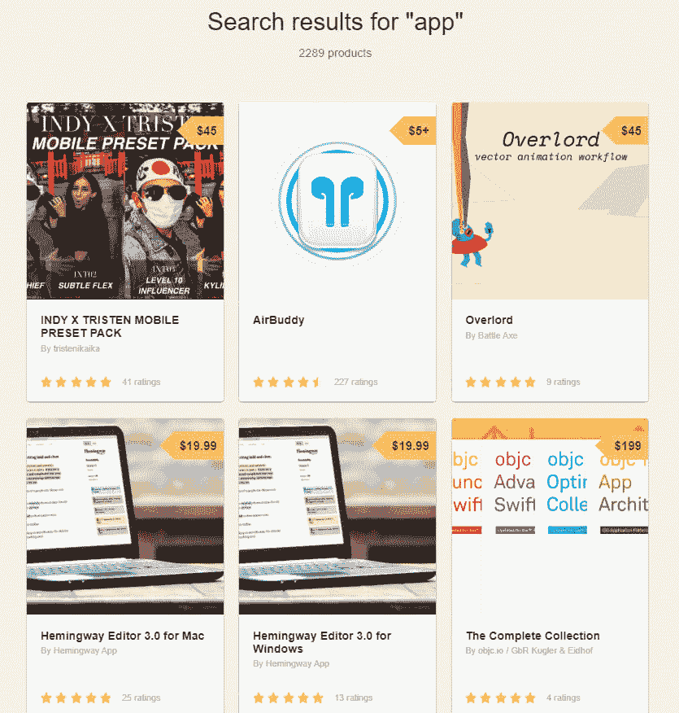](https://res.cloudinary.com/practicaldev/image/fetch/s--mKJ5ciLq--/c_limit%2Cf_auto%2Cfl_progressive%2Cq_auto%2Cw_880/https://cdn.filestackcontent.com/1PQ59BxRtSp2apHoKPJg) 
*白色卡片使其从背景中脱颖而出。[来源](https://gumroad.com/discover?query=app)*

我还想说的是，对行动号召(CTA)按钮使用单独的颜色也能突出它的重要性。它表现出更积极的行动。这种效应也被称为[T3【冯·雷斯托夫】T5 效应。](https://en.wikipedia.org/wiki/Von_Restorff_effect)

[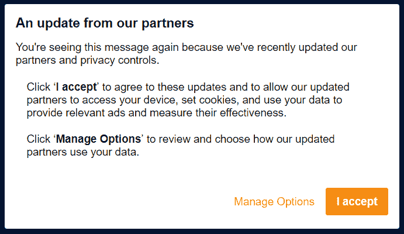](https://res.cloudinary.com/practicaldev/image/fetch/s--0rOv-k90--/c_limit%2Cf_auto%2Cfl_progressive%2Cq_auto%2Cw_880/https://cdn.filestackcontent.com/mXvjPyTHTNSq9OR6Qq7d) 
*【接受】按钮通常是彩色的，以突出显示。[来源](https://www.tumblr.com/dashboard)*

‌

### #2:相似原理

相似性原则表明，当事物看起来相似时，我们倾向于将它们归为一类。

[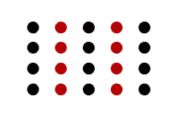](https://res.cloudinary.com/practicaldev/image/fetch/s--ZbtUY6Y8--/c_limit%2Cf_auto%2Cfl_progressive%2Cq_auto%2Cw_880/https://cdn.filestackcontent.com/Hzom6V9TDhr2rYKMgQCg) 
*当物品具有相同的颜色时，我们倾向于将其组合在一起。[来源](http://vanseodesign.com/web-design/gestalt-principles-of-perception/)*

我们可以在聊天框中使用它来区分谁在说话。利用颜色来区分所有权是利用这一原则的简单方法。

 
*你可以清楚地看到蓝色的语音是你自己的。[来源](https://www.sketchappsources.com/free-source/2649-facebook-like-chatbox-sketch-freebie-resource.html)*

‌

### #3:邻近原则

邻近原则表明**靠得很近的事物看起来像是形成了一个群体**。

[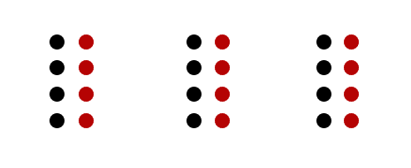](https://res.cloudinary.com/practicaldev/image/fetch/s--oAQ6vM4f--/c_limit%2Cf_auto%2Cfl_progressive%2Cq_auto%2Cw_880/https://cdn.filestackcontent.com/Lo4U1zRSZy7cABsKNuPo) 
*我们本能地根据群体间的距离远近将他们分组。[来源](http://vanseodesign.com/web-design/gestalt-principles-of-perception/)*

[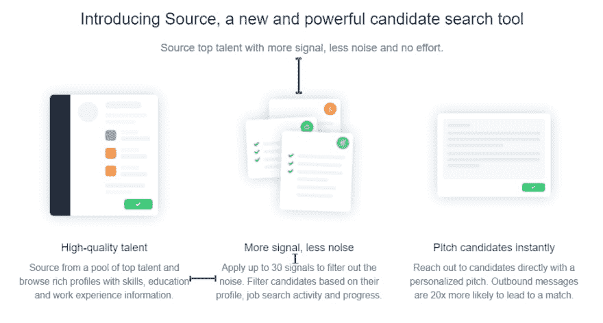](https://res.cloudinary.com/practicaldev/image/fetch/s--uBZbUsdr--/c_limit%2Cf_auto%2Cfl_progressive%2Cq_auto%2Cw_880/https://cdn.filestackcontent.com/HkD2pEsQJ2sL6PKZsw5W) 
*元素之间的距离将它们组合成单独的项目。[来源](https://angel.co)*

元素之间的空白非常强大。它就像一个带有不可见线条的表格，但比在网格格式中使用线条来分隔元素要干净得多。

‌

### #4:共同命运原则

共同命运的原则表明**当物体以相同的方式行动或移动时，我们感觉它们被组合在一起**。

*[via GIPHY](https://giphy.com/gifs/animations-ui-mobile-7tZp9KvLm5GKs)*

[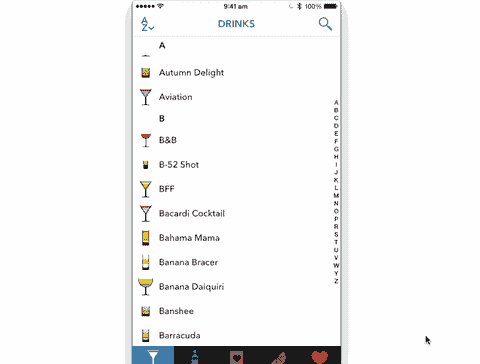](https://i.giphy.com/media/wU5e48vZIVRNS/giphy.gif)
*[via GIPHY](https://giphy.com/gifs/top-ios-ipad-wU5e48vZIVRNS)*

使用动画，我们可以指示一个新的页面，或弹出菜单。如果将它们一起移动到页面中，这是引入新 UI 元素的好方法。

‌

### #5:连续性原则

连续性原则表明，排列在一条线上的**元素被认为比没有排列在一条线上的元素更相关。**

[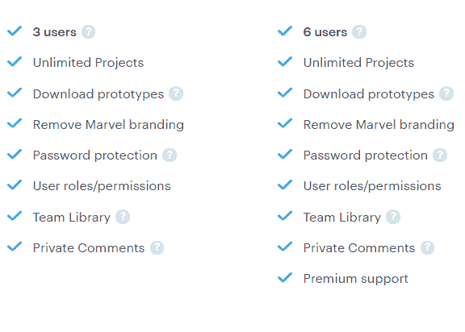](https://res.cloudinary.com/practicaldev/image/fetch/s--w2_qjRm---/c_limit%2Cf_auto%2Cfl_progressive%2Cq_auto%2Cw_880/https://cdn.filestackcontent.com/zqlCY4eBRkq0qTr9OqSV) 
*我们根据对齐分组项。[来源](https://marvelapp.com/pricing)*

 
*水平对齐也表示加号按钮用于在某处添加博客。[来源](https://www.tumblr.com/dashboard)*

除了指示群组之外，将页面中的元素对齐在一起有助于给人一种团结的感觉。作为人类，我们发现对称和有序令人愉悦，甚至在潜意识层面。

‌

### #6:闭合原理

闭合原理表明，当作品中的元素以这样一种方式排列时，我们可以填充缺失的信息，即观众认为“信息可以被连接起来”

 
*通知徽章暗示我们拥有与该链接相关联的物品数量。[来源](https://www.telerik.com/support/kb/winforms/buttons/details/notification-button)*

 
*我们可以猜测下面的动作按钮与房产税有关，而不是房租。[来源](https://dribbble.com/shots/2766291-Invoice-Notifications-Bank-app-mockups/attachments/563703)*

图标和徽章是很好的例子，用户通常可以将图标的含义与它可能触发的功能联系起来。

‌

### #7:简单原则

这一原则意味着，当个体感知世界时，他们会消除复杂性和陌生感，这样他们就能以最简单的形式观察现实。[【4】](https://en.wikipedia.org/wiki/Gestalt_psychology)[【5】](http://vanseodesign.com/web-design/gestalt-principles-of-perception/)

我认为这意味着页面中元素的一般组成。当用户浏览页面时，他们会看到大块的区域，这样他们就可以轻松导航。

 
*余烬的登陆页面被分割成几个部分。[来源](https://www.emberjs.com/)*

我们可以在 Ember 的登录页面中看到，页面中有明显分开的部分。每一部分都有自己的原理把它绑在一起，但在更大的范围内，它们也互相连接。

‌

### #8 过往经验原则

这个原则意味着，如果元素在过去经常在一起，它们往往会被组合在一起。

用绿色来表示*正*，用红色来表示*负*，是一种立即将联想投射到行动上的方法。

 
*红色通常意味着不可逆的伤害。[来源](https://ux.stackexchange.com/questions/49991/should-yes-delete-it-be-red-or-green)*

这也可以用**密切相关的认知负荷**来解释:如果用户能够从他们已经理解的东西中辨别出一种模式，那么他们就更容易识别和学习新的东西。[【第六期】](https://blog.marvelapp.com/psychology-principles-every-uiux-designer-needs-know/)

[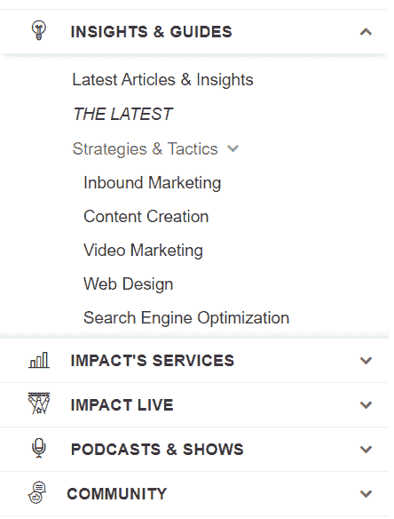](https://res.cloudinary.com/practicaldev/image/fetch/s--lMsYgQyH--/c_limit%2Cf_auto%2Cfl_progressive%2Cq_auto%2Cw_880/https://cdn.filestackcontent.com/iGY33wsDSKqQuHhNkvO6) 
*箭头所指的可扩展内容。[来源](https://www.impactbnd.com/blog/laws-of-ux-infographic)*

从人字形箭头，我们认识到这似乎是一个盒子，可以切换到扩展。我们可以重用这样的模式，让用户立即知道如何使用应用程序。这和下一点很像——雅各布定律。

‌

* * *

‌

## 雅各布定律

雅各布定律是雅各布·尼尔森创造的。它指出用户更喜欢你的网站和他们已经知道的其他网站一样的工作方式。[【11】](https://lawsofux.com/jakobs-law)

[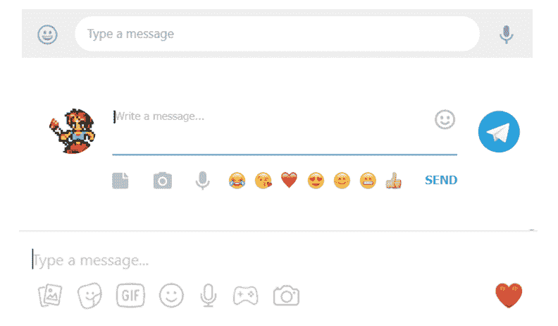](https://res.cloudinary.com/practicaldev/image/fetch/s--i7NRSSAP--/c_limit%2Cf_auto%2Cfl_progressive%2Cq_auto%2Cw_880/https://cdn.filestackcontent.com/KHWAY26WQlycz0LNju0F) 
*输入为 Whatsapp、Telegram 和脸书 messenger*

我们都很熟悉聊天应用。用户希望他们的聊天应用程序是底部的一个盒子，有一个文本框，还有一些插入表情符号的选项。它可以是完全不同的语言，但用户仍然知道在哪里可以找到它。

‌

* * *

‌

## 费茨定律

费茨定律是一个人将指针移动到所需按钮(例如 CTA)所需的时间量**随着**尺寸**的增大和**距离**[【9】](https://www.interaction-design.org/literature/topics/fitts-law)的缩短而减少**。

换句话说，动作按钮应该做得更大，并且用户的任务/注意区域和任务相关按钮之间的距离应该保持尽可能短。

[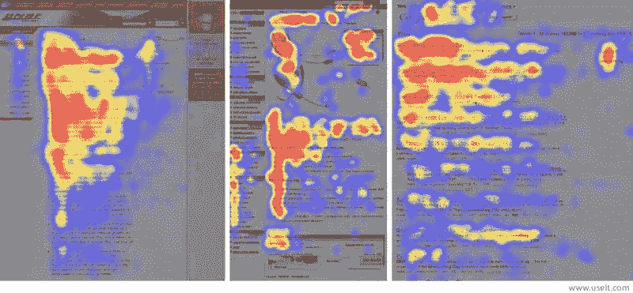](https://res.cloudinary.com/practicaldev/image/fetch/s--li8y7gQt--/c_limit%2Cf_auto%2Cfl_progressive%2Cq_auto%2Cw_880/https://cdn.filestackcontent.com/Hvke0a3CRoCVihXzMd6e) 
*用户眼球运动热图。[来源](https://www.researchgate.net/figure/The-F-Pattern-heat-map-in-reading-webpages-Nielsen-2006b_fig1_321859889)*

研究表明，用户从左上角开始以“F”模式浏览网站，并在 50 毫秒内形成对网站的看法[【10】](https://www.researchgate.net/figure/The-F-Pattern-heat-map-in-reading-webpages-Nielsen-2006b_fig1_321859889)。

 
*一切都在左上方。撰写是最大的按钮。[来源](https://mail.google.com/mail/u/0/#inbox)*

谷歌通过将 Gmail 最突出的功能放在左上角的一个白色大按钮上来完成这项工作。右边是电子邮件列表。用户会立即发现 gmail 提供的最重要的功能。此外，许多过滤按钮彼此靠近。

‌

* * *

‌

## 希克斯定律

希克斯定律是指一个人做决定所需的时间**会随着他们拥有的**更少**的可能选择而减少**。

 
*亚马逊网络服务 UI 通过减少每页选项来改善。[来源](https://aws.amazon.com/products/)*

我们可以看到亚马逊如何通过将他们的服务分成更小的组来极大地改善他们的用户界面，从而减少了每页可选择的选项。

这个概念的另一个商业相关应用是定价。当有太多定价选择时，用户会感到困惑，无法做出决定。选择较少会增加做决定的时间。

[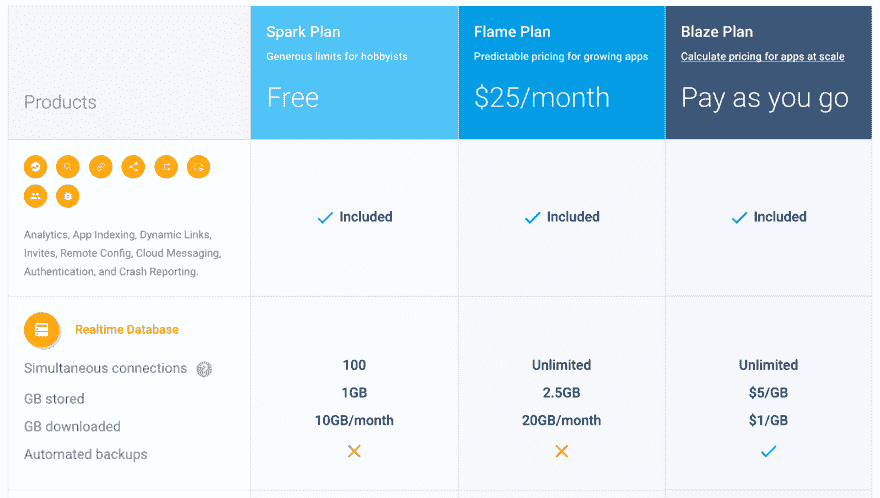](https://res.cloudinary.com/practicaldev/image/fetch/s--D0WDVm0C--/c_limit%2Cf_auto%2Cfl_progressive%2Cq_auto%2Cw_880/https://cdn.filestackcontent.com/HfbFZe9dTOOLGCRgj6f9)
*Firebase 的服务只有 3 层定价。[来源](https://firebase.google.com/pricing/)*

‌

* * *

‌

## 米勒定律

米勒定律指出，人们可以在工作记忆中记住多达 7 个不同的元素，任何更多的元素都会增加错误的百分比。

 
*谷歌日历一次在页面上显示大约 7 个项目。*

我们可以将页面上的项目数量减少到大约 7 个。如果太少，试着把它分成 7 个或更少的小块。副标题、图层、边框是划分信息的一些方式。

将验证码限制在 7 个字符以内也是一个好主意。

 
*汽保代号*

我想，如果你必须在 3 秒钟内填写 20 个字符的验证码，那会很烦人。

‌

* * *

‌

## 赋予进步效果

研究员 Joseph C. Nunes 记录了这样一种效应，即被人为推进目标的人表现出更大的毅力去实现目标。[【13】](http://citeseerx.ist.psu.edu/viewdoc/download?doi=10.1.1.545.2322&rep=rep1&type=pdf)

[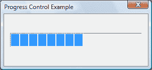](https://res.cloudinary.com/practicaldev/image/fetch/s--LlYyGiiA--/c_limit%2Cf_auto%2Cfl_progressive%2Cq_auto%2Cw_880/https://cdn.filestackcontent.com/eeXFYTcPQKW8iDQcw33Q) 
*经典的 windows 进度条。[来源](https://docs.microsoft.com/en-us/windows/desktop/controls/progress-bar-control)*

我相信每个人都知道进度条。但是你知道吗，许多应用程序不得不插入一个假的进度条，让用户感觉更好。[【14】](https://news.ycombinator.com/item?id=16289380)

实际的进度条可能更难在异步函数中复制，但是有一个地方进度条可以提供很大的帮助——向导。

[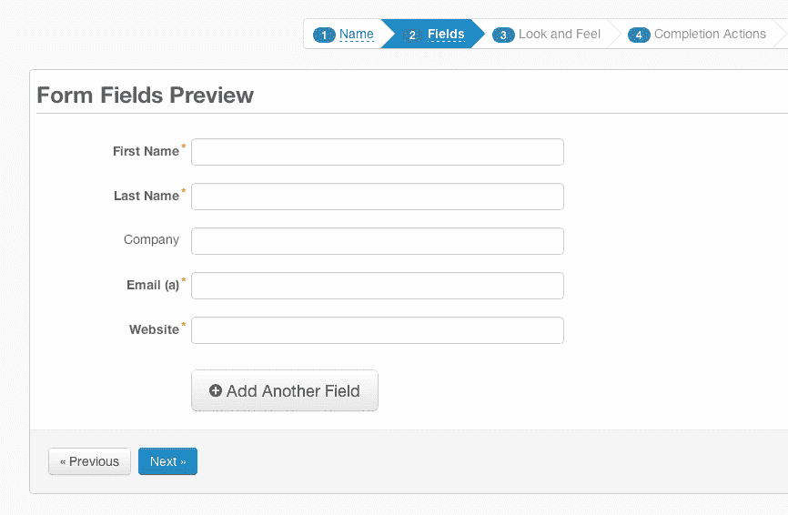](https://res.cloudinary.com/practicaldev/image/fetch/s--QSlb28rz--/c_limit%2Cf_auto%2Cfl_progressive%2Cq_auto%2Cw_880/https://cdn.filestackcontent.com/b8yf5LWPTtqAe8Uacokj)
*sales force 表单使用进度条来指导用户。[来源](https://www.pardot.com/wp-content/help/uploads/2010/10/Screen-Shot-2013-01-14-at-2.29.03-PM.png)*

向导打破了平淡无奇的数据输入过程，它也给用户一种进步的感觉，让他们感觉像是在前进。

‌

* * *

‌

## 多尔蒂的门槛

在快速互联网时代，最大的罪过就是拥有一个缓慢的应用程序。Walter J. Doherty 在 1982 年发表了一篇研究论文，将计算机响应时间的**要求设定为< 400ms** 。[【15】](https://lawsofux.com/doherty-threshold)任何比这更慢的，系统都被认为是慢的。

除了明显的系统优化，我们还可以采用一些策略来降低用户的速度。

我们以前探索过进度条，它可以提供即时的反馈。

另一种方法是在后台运行进程。例如，删除一封电子邮件可能会立即从屏幕上删除该项目，但实际的`DELETE`呼叫可以在后台运行，这样用户会感觉很快。

[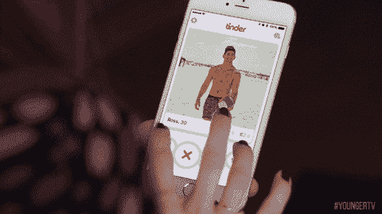](https://i.giphy.com/media/26AHumw7ezGDRpYmk/giphy.gif)
*[via GIPHY](https://media.giphy.com/media/26AHumw7ezGDRpYmk/giphy.gif)*

‌

* * *

‌

## 手势设计

2019 年有近 50 亿手机用户[【16】](https://www.statista.com/statistics/274774/forecast-of-mobile-phone-users-worldwide/)，这相当于全球近 70%的人使用手机。所有最新的网络应用程序都有响应式设计，以适应手机屏幕。但是，我们在设计它的时候考虑到了移动吗？

以下是一些让手机用户更容易使用的方法:

1.  假设用户将使用他们的拇指，而不是手写笔
2.  在屏幕底部有重要的按钮
3.  允许滑动来做动作
4.  胖手指用的大按钮
5.  为右手优化(抱歉，左撇子，你们只占总人口的 10%)
6.  允许切换显示密码，打字错误在手机上很常见
7.  确保键盘抬起时输入字段可见。

 
*照片由[乔治亚·德·洛茨](https://unsplash.com/@georgiadelotz?utm_source=ghost&utm_medium=referral&utm_campaign=api-credit) / [Unsplash](https://unsplash.com/?utm_source=ghost&utm_medium=referral&utm_campaign=api-credit)*

‌

* * *

‌

## 优秀奖

1.  特斯勒定律(Tesler ' s Law)-对于任何系统来说，都有一定的复杂性，这是无法减少的。[【12】](https://lawsofux.com/teslers-law)
2.  蔡加尼克效应(Zeigarnik Effect)——人们倾向于记住曾经追求过但没有完成的目标。[【17】](https://medium.com/coffee-and-junk/design-psychology-zeigarnik-effect-a53688b7f6d1)

‌

* * *

‌

## 如何把这个应用到软件开发中？

有了所有这些关于用户行为的信息，只有我们在开发中实现和使用它，它才会起作用。我们如何做到这一点？

*   与你在按钮上使用的颜色保持一致
*   为重要的元素保留强烈的颜色，其他的都可以弱化
*   将你的信息分成一个更小的层次
*   提供即时的视觉反馈
*   每个部分最多 7 个项目
*   桌面的重要项目放在左上角，手机放在右下角
*   随意追随其他网站的行为
*   保持一切一致
*   使用你开发的软件

面向开发者的软件呢？开发者也是用户。他们的反应相似。

*   使用一致的 API
*   公开高级函数，而不是文件中的每个低级函数
*   将你的库分成更小的模块
*   给出即时和人类可读的错误信息
*   在库文件的顶部包含文档
*   遵循与其他流行库类似的行为
*   使用您开发的库

现在，打破你刚刚学到的所有规则，因为设计从来不是一成不变的。快乐 UX 设计！

## ‌References

[1][https://uxdesign . cc/what-it-take-to-be-an-experience-design-expert-EBA 0e 0d 588 EB](https://uxdesign.cc/what-does-it-take-to-become-an-experience-design-expert-eba0e0d588eb)‌

‌[2】[https://medium . com/strategic-design-lab/what-a-strategic-designer-does-b942 f 295379](https://medium.com/strategic-design-lab/what-a-strategic-designer-does-b942f295379)‌

‌[3】[https://tubikstudio . com/gestalt-theory-for-efficient-UX-UXdoi = 10 . 1 . 1 . 545 . 2322&rep = rep 1&type = pdf](https://tubikstudio.com/gestalt-theory-for-efficient-ux-principle-of-similarity/)‌

‌[14[https://news.ycombinator.com/item?id=16289380](https://news.ycombinator.com/item?id=16289380)‌

‌[15】[https://lawsofux.com/doherty-threshold](https://lawsofux.com/doherty-threshold)‌

‌[16】[https://www . statista . com/statistics/274774/forecast-of-mobile-phone-users-world wide/【全球】](https://www.statista.com/statistics/274774/forecast-of-mobile-phone-users-worldwide/)

## 进一步阅读

[1][https://logogeek.uk/logo-design/gestalt-theory/](https://logogeek.uk/logo-design/gestalt-theory/)‌

‌[2[https://www.usertesting.com/blog/gestalt-principles/](https://www.usertesting.com/blog/gestalt-principles/)‌

【3】[http://www.scholarpedia.org/article/Gestalt_principles](http://www.scholarpedia.org/article/Gestalt_principles)

【4】[https://www . smashingmagazine . com/2014/03/design-principles-visual-perception-and-the-principles-of-of-gestalt/](https://www.smashingmagazine.com/2014/03/design-principles-visual-perception-and-the-principles-of-gestalt/)