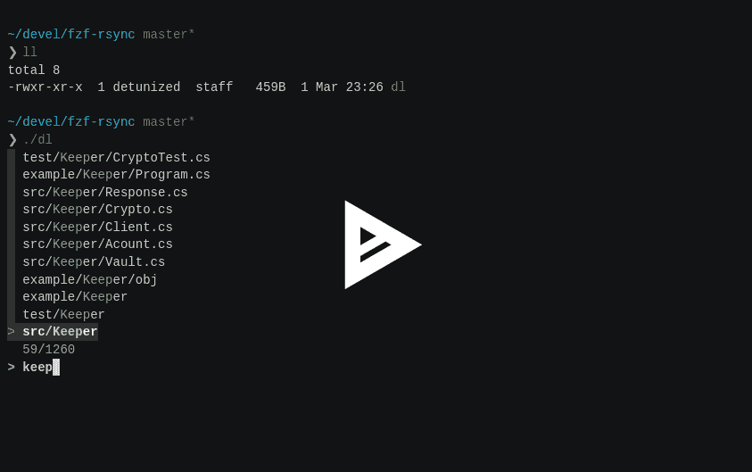

# 用 rsync 在终端中模糊搜索和下载文件

> 原文：<https://dev.to/detunized/fuzzy-search-and-download-files-with-rsync-in-the-terminal-a1m>

我经常使用`rsync`**。我用它来将文件复制到 USB 驱动器、虚拟机或 Docker 容器，在家里的计算机之间共享文件，将东西备份到远程机器或简单地复制到本地 Dropbox 文件夹。大多数时候，我从几个远程文件夹下载文件到我的电脑上。**

 **我在终端里做我所有的文件操作。我发现这比在某种 GUI 文件管理器中点击更快更方便。事实上，我在这方面很笨拙，以至于我经常会把一些重要的东西移到不属于它的地方。很多年前，当我还是一名年轻的初级开发人员时，我将网络共享上的一个重要项目移到了一个兄弟文件夹中。我只想把鼠标放在键盘的另一边，然后我用左手抓住了它。哦，那是一场大灾难:人们跑来跑去寻找项目文件夹，以为我们被黑了。10 分钟后我找到了。

为了不重复过去那些严重的错误，这些天我只是坚持使用命令行。命令行的问题是，它不是很直观。尤其是对于远程系统。`zsh`中的本地文件完成非常好。而一旦搭配上 [`fzf`](https://github.com/junegunn/fzf) 这样的模糊匹配器，在终端里做几乎任何文件操作都成了一件乐事。

几年来，我依赖于`rsync`的`zsh`远程路径自动完成。它的效果几乎和本地文件一样好。只需键入一些字符，按 TAB 键，它会自动为您补全文件名。如果名称不明确，将会弹出一个匹配列表，您可以使用箭头键选择一个名称。非常标准的 shell 体验。

但是有一个问题。由于这是一个远程系统，自动完成需要一两秒钟。很烦。另外，它只在当前目录下自动完成，我必须多次按 TAB 键才能得到完整的路径。而且我一次只能下载一个文件或文件夹。这里有一个演示。看着它有多慢很痛苦:

[](https://asciinema.org/a/EIc6s9XzvncvUAl7DYgVuWLvp?autoplay=1)

哪里有问题，哪里就有解决的办法。以及它通常是如何在命令行中发生的，解决方案是一个 Bash 脚本:

```
#!/bin/bash
set -eo pipefail

HOST=${DL_HOST:-dev.somehost.to}
DIR=${DL_DIR:-files}

if [[ "$1" == "-h" || "$1" == "--help" ]]; then echo "USAGE: dl [dir [host]]"
    exit fi

if [[ "$1" != "" ]]; then DIR="$1"

    if [[ "$2" != "" ]]; then HOST="$2"
    fi
fi REMOTE="$HOST:$DIR/"

rsync -a "$REMOTE" \
    | ruby -ne 'puts $_.split(/\s+/, 5).last' \
    | fzf -m --height 50% \
    | rsync -avP --no-relative --files-from - "$REMOTE" . 
```

它是这样工作的:

[](https://asciinema.org/a/BwmSUZ7lK0mCk9Ot7797QNqQv?autoplay=1)

首先，它使用`rsync`列出远程文件夹中的所有文件，格式类似于`ls -l` :

```
drwxr-xr-x          4,096 2019/03/01 23:23:25 src
-rw-r--r--            261 2019/02/20 23:11:49 src/PasswordManagerAccess.csproj
drwxr-xr-x          4,096 2019/03/01 23:23:25 src/Common
-rw-r--r--            379 2019/02/20 23:11:49 src/Common/BaseException.cs
-rw-r--r--            906 2019/03/01 23:23:25 src/Common/ClientException.cs
-rw-r--r--          3,454 2019/03/01 23:23:25 src/Common/Crypto.cs
-rw-r--r--            241 2019/02/20 23:11:49 src/Common/ExposeInternals.cs
-rw-r--r--          6,868 2019/03/01 23:23:25 src/Common/Extensions.cs
-rw-r--r--          1,178 2019/02/20 23:11:49 src/Common/HttpClient.cs
-rw-r--r--            487 2019/02/20 23:11:49 src/Common/IHttpClient.cs
-rw-r--r--          7,267 2019/02/20 23:11:49 src/Common/JsonHttpClient.cs
... 
```

该脚本提取第 5 列和它可能包含的所有空格。其结果进入`fzf`进行交互选择。一旦完成，它现在最终会通过管道进入另一个`rsync`实例，该实例在标准输入(`--files-from -`)上接收文件列表。相当酷。额外的好处:现在我可以轻松地选择多个文件。

该脚本从命令行参数或环境变量中选择获取远程文件夹名称和主机。我决定将最常用的路径硬编码，以将我的 RSI 推后几年。

*原载于[detunized.net](https://detunized.net/posts/2019-03-01-fuzzy-search-and-download-files-with-rsync-in-the-terminal/)T3】***