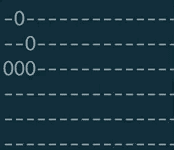

# 纯脚本的生活游戏

> 原文：<https://dev.to/riccardoodone/game-of-life-in-purescript-2ec4>

你可以继续在这里阅读或者[跳转到我的博客](https://odone.io/posts/2019-06-03-game-of-life.html)来获得完整的体验，包括美妙的粉色、蓝色和白色调色板。

* * *

示例运行

[](https://res.cloudinary.com/practicaldev/image/fetch/s--NIW8gFvk--/c_limit%2Cf_auto%2Cfl_progressive%2Cq_66%2Cw_880/https://thepracticaldev.s3.amazonaws.com/i/9291nq5hj5nomvxp7zie.gif)

代码

```
module Main where

import Prelude
import Effect (Effect)
import Effect.Console (log)
import Data.Tuple (Tuple(..))
import Data.Array.NonEmpty as NEA
import Data.Array as A
import Data.Foldable (elem, length)
import Data.String.Common as S
import Effect.Timer as T
import Control.MonadZero (guard)

maxX :: Int
maxX = 80

maxY :: Int
maxY = 10

type Y = Int
type X = Int
type Pos = Tuple Y X

-- Alive cells
type Board = Array Pos

block :: Board
block =
  [ Tuple 0 0
  , Tuple 0 1
  , Tuple 1 0
  , Tuple 1 1
  ]

blinker :: Board
blinker =
  [ Tuple 0 1
  , Tuple 1 1
  , Tuple 2 1
  ]

glider :: Board
glider =
  [ Tuple 0 1
  , Tuple 1 2
  , Tuple 2 0
  , Tuple 2 1
  , Tuple 2 2
  ]

showBoard :: Board -> String
showBoard board =
  S.joinWith "\n" $ map showRow $ A.groupBy haveSameY $ A.sort allPositions
  where
        haveSameY :: Pos -> Pos -> Boolean
        haveSameY (Tuple y1 _) (Tuple y2 _) = y1 == y2

        showRow :: NEA.NonEmptyArray Pos -> String
        showRow fs = S.joinWith "" $ NEA.toArray $ map (\f -> if elem f board then "O" else "X") fs

nextGeneration :: Board -> Board
nextGeneration board = do
    p <- allPositions
    guard $ willLive p board
    pure p

allPositions :: Board
allPositions = do
    y <- A.range 0 maxY
    x <- A.range 0 maxX
    pure $ Tuple y x

willLive :: Pos -> Board -> Boolean
willLive p board =
    case Tuple (aliveNeighbors p board) (isAlive board p) of
         Tuple 0 true -> false
         Tuple 1 true -> false
         Tuple 2 true -> true
         Tuple 3 _ -> true
         _ -> false

aliveNeighbors :: Pos -> Board -> Int
aliveNeighbors p board =
    length $ A.filter (isAlive board) $ neighbors p

isAlive :: Board -> Pos -> Boolean
isAlive board p =
    elem p board

neighbors :: Pos -> Array Pos
neighbors p1@(Tuple y1 x1) = do
     y2 <- A.range (y1 - 1) (y1 + 1)
     x2 <- A.range (x1 - 1) (x1 + 1)
     let p2 = Tuple y2 x2
     guard $ p1 /= p2
     pure p2

loop :: Board -> Effect Unit
loop board = do
    log "\x1B[2J\x1B[0f" -- clear terminal
    log $ showBoard board
    log ""
    _ <- T.setTimeout 2000 (loop $ nextGeneration board)
    pure unit

main :: Effect Unit
main = do
    -- loop block
    -- loop blinker
    loop glider
    pure unit 
```

Enter fullscreen mode Exit fullscreen mode

* * *

从我个人的电子邮件中获取最新内容。用你的想法回复。让我们互相学习。订阅我的 [PinkLetter](https://odone.io#newsletter) ！