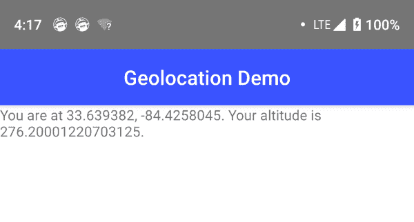

# 获取 NativeScript 中的位置

> 原文：<https://dev.to/raymondcamden/getting-location-in-nativescript-1jkn>

当我准备乘 8 个多小时的飞机去阿姆斯特丹参加 [NativeScript 开发者日](https://nativescriptdevday.org/)时，我想做一个快速的 NativeScript 演示会很不错。几天前我想到，在学习 Cordova 和 Ionic 时，我做的一件事是构建一堆简单的演示，使用各种插件作为学习生态系统的方法。我决定尽最大努力用 NativeScript 重复这个过程。接下来是我将要写的两篇文章中的第一篇，讨论如何将地理定位与 NativeScript 结合使用。这只是一个简单的介绍，而下一个将是一个稍微复杂的例子。

首先，我想先提出一个小小的警告。当我搜索地理定位和本地脚本时，我找到了这里:[位置](https://docs.nativescript.org/angular/ng-hardware-access/location)。这里的文件有一些问题，在我看来，你应该避免它们。(我计划在这次旅行中有机会的时候提交一份关于这个问题的 bug 报告！)相反，我会在 https://github.com/NativeScript/nativescript-geolocation 的[查看插件的核心文档。](https://github.com/NativeScript/nativescript-geolocation)

假设您已经创建了一个 NativeScript 项目，您将希望从添加插件开始:

```
tns plugin add nativescript-geolocation 
```

Enter fullscreen mode Exit fullscreen mode

好的，这很简单。使用这个插件很简单，但是你必须处理权限以及检索数据时的错误。在我看来，主要的自述文件并没有很好地在一个完整的例子中展示这一点(尽管在一点上有更多的内容)，所以我不得不猜测一点来弄清楚它，但是这里是我想出的一般“流程”:

```
Geolocation.enableLocationRequest(true)
.then(() => {
    Geolocation.isEnabled().then(isLocationEnabled => {
        if(!isLocationEnabled) {
            // potentially do more then just end here...
            return;
        }

        // MUST pass empty object!!
        Geolocation.getCurrentLocation({})
        .then(result => {
        })
        .catch(e => {
            console.log('loc error', e);
        });
    });
});
} 
```

Enter fullscreen mode Exit fullscreen mode

代码从一般的位置访问开始。在我的 Android 上，这导致了第一次提示，但没有第二次。然后`isEnabled`调用将返回真或假，你的应用程序如何处理这取决于你的应用程序。

接下来，您将实际获得位置。非常重要的一点是，即使你对默认值没有意见，你也必须传递一个空对象！如果你什么都没通过，那么这个请求就永远不会被提出。对我来说，这似乎是一个小问题，但解决起来很容易。

一旦完成，您的结果变量包括纬度和经度，海拔，等等。医生在这方面做得很好。

那么，一个完整的，简单的，演示怎么样？我使用的是 [NativeScript-Vue](https://nativescript-vue.org/) 但是显然类似的代码在 Angular 中也能工作，只是没那么酷。我在一个组件中构建了所有东西:

```
<template>
    <Page class="page">
        <ActionBar class="action-bar">
            <Label class="action-bar-title" text="Geolocation Demo"></Label>
        </ActionBar>

        <StackLayout>
            <Label v-if="needLocation" text="Looking up your location..." />
            <Label v-if="locationFailure" text="Sorry, I failed! :(" />
            <Label v-if="location" :text="locationDescription" textWrap="true" />
        </StackLayout>

    </Page>
</template>

<script>
import * as Geolocation from 'nativescript-geolocation';

export default {
    data() {
        return {
            needLocation:true,
            locationFailure:false,
            location:null
        }
    },
    computed: {
        locationDescription() {
            return `You are at ${this.location.latitude}, ${this.location.longitude}. Your altitude is ${this.location.altitude}.`;
        }
    },
    created() {

        Geolocation.enableLocationRequest(true)
        .then(() => {
            Geolocation.isEnabled().then(isLocationEnabled => {
                console.log('result is '+isLocationEnabled);
                if(!isLocationEnabled) {
                    this.needLocation = false;
                    this.locationFailure = true;
                    // potentially do more then just end here...
                    return;
                }

                // MUST pass empty object!!
                Geolocation.getCurrentLocation({})
                .then(result => {
                    console.log('loc result', result);
                    this.needLocation = false;
                    this.location = result;
                })
                .catch(e => {
                    console.log('loc error', e);
                });
            });
        });
    }
};
</script>

<style scoped lang="scss">
    // Start custom common variables
    @import '../app-variables';
    // End custom common variables
</style> 
```

Enter fullscreen mode Exit fullscreen mode

我的应用程序 UI 由三个标签组成，每个标签用于表示应用程序的不同状态。初始标签充当各种“加载”消息，一旦检索到位置或抛出错误，它就会消失。第二个标签处理显示错误，最后一个标签指向显示结果的计算属性。

在我的`created`事件中，我得到了基于上述大纲的代码。请求许可，确保我已获得许可，然后请求我的位置。一旦我得到它，我可以简单地存储它，我的 Vue 计算属性将很好地呈现结果。这里有一个例子。

[](https://res.cloudinary.com/practicaldev/image/fetch/s--ZPkQFPlU--/c_limit%2Cf_auto%2Cfl_progressive%2Cq_auto%2Cw_880/https://static.raymondcamden.cimg/2019/04/geo1.png)

仅此而已。在我的下一篇文章中，我会更深入地探讨这个问题。这个插件有一些你可能已经从 web API 中熟悉的有用的方法，但是它还有更多，包括一个内置的超级有用的距离 API。一如既往，如果你有任何问题，请在下面留言告诉我！