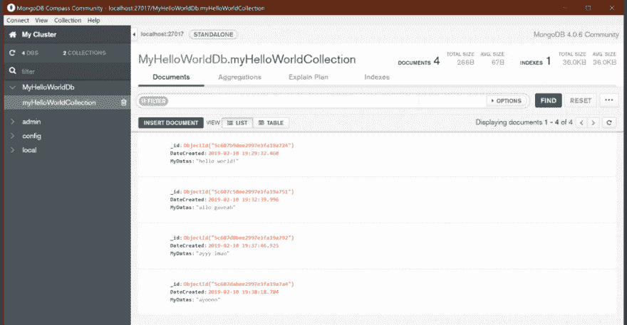

# 开始使用 MongoDb。网络核心

> 原文：<https://dev.to/kritner/getting-started-on-mongodb-withnet-core-1m4n>

### MongoDb 入门。网络核心

<figcaption>Photo by [rawpixel](https://unsplash.com/@rawpixel?utm_source=medium&utm_medium=referral) on [Unsplash](https://unsplash.com?utm_source=medium&utm_medium=referral)</figcaption>

来自一个严格的关系数据库世界，NoSql 风格的数据库似乎总是有点可怕！我最近有机会第一次使用 MongoDb，我很惊讶它是如此容易上手！

### 什么是 NoSql 数据库？

来自[维基百科](https://en.wikipedia.org/wiki/NoSQL):

> 一个 **NoSQL** (最初指“非 [SQL](https://en.wikipedia.org/wiki/SQL) 或“非关系”)[【1】](https://en.wikipedia.org/wiki/NoSQL#cite_note-1)[数据库](https://en.wikipedia.org/wiki/Database)提供了一种机制，用于[存储](https://en.wikipedia.org/wiki/Computer_data_storage)和[检索](https://en.wikipedia.org/wiki/Data_retrieval)以不同于[关系数据库](https://en.wikipedia.org/wiki/Relational_database)中使用的表格关系的方式建模的数据。这种数据库自 20 世纪 60 年代末就已经存在，但直到 21 世纪初，由 Web 2.0 公司的需求引发的流行浪潮才获得了“NoSQL”的绰号。[【3】](https://en.wikipedia.org/wiki/NoSQL#cite_note-3)[【4】](https://en.wikipedia.org/wiki/NoSQL#cite_note-4)[【5】](https://en.wikipedia.org/wiki/NoSQL#cite_note-5)NoSQL 数据库越来越多地用于[大数据](https://en.wikipedia.org/wiki/Big_data)[实时 web](https://en.wikipedia.org/wiki/Real-time_web) 应用。[【6】](https://en.wikipedia.org/wiki/NoSQL#cite_note-6)NoSQL 系统有时也被称为“不仅仅是 SQL ”,以强调它们可能支持类似于 [SQL](https://en.wikipedia.org/wiki/SQL) 的查询语言，或者在[多语言持久性](https://en.wikipedia.org/wiki/Polyglot_persistence)架构中与 SQL 数据库并存。

传统上，对于关系数据库，您努力使数据尽可能规范化；或多或少带有外键关系的表。对于 NoSql 数据库，围绕保持数据结构所做的大量“设计”似乎没有必要——在许多情况下，您可以简单地将整个对象存储在一个文档中。

### 为什么是 MongoDb？

老实说，我对 NoSql 风格的数据库知之甚少。我知道我需要存储潜在的大量不同“模式”的 json 对象，并且我需要找到一种快速完成它的方法。MongoDb 是我听说过的，还有其他几个被扔出来的:Cassandra，Raven，Redis，Couch 等。其中有几个是无法立即获得的，因为它们似乎只在 linux 上可用——至少粗略地看了一下。其他人很难找到可以与之交互的信息或包。网芯。幸运的是，MongoDb 增加了一个社区，安装在 windows 上，还有一个基于. net 标准的 NuGet 包，可以与。网芯—售出！

### 安装

关于如何在 Windows 上安装和运行 MongoDb 的简单教程，可以在这里找到:

[在 Windows 上安装 MongoDB 社区版- MongoDB 手册](https://docs.mongodb.com/manual/tutorial/install-mongodb-on-windows/)

### 样本代码为。网络核心

既然数据库已经安装好了，我们现在可以继续使用传统的 hello world 应用程序来探索新事物了！

#### 新申请

让我们用。net core (SDK 找到了[这里是](https://dotnet.microsoft.com/download))使用命令:

```
dotnet new console -n Kritner.MongoDb.GettingStarted.ConsoleApp 
```

[](https://res.cloudinary.com/practicaldev/image/fetch/s--xdr7jJLl--/c_limit%2Cf_auto%2Cfl_progressive%2Cq_auto%2Cw_880/https://cdn-images-1.medium.com/max/1024/1%2AT8fD_hg_1lAfWysuo0a_Tw.png)

#### MongoDB。驱动程序 NuGet 包

接下来，我们需要一个 NuGet 包，让我们能够轻松地使用 MongoDb:

[MongoDB。驱动程序 2.7.3](https://www.nuget.org/packages/MongoDB.Driver/)

#### 代码

现在剩下的就是写一点 c#代码来试用 MongoDb！

```
public class MyHelloWorldMongoThing
{
 public DateTime DateCreated { get; set; } = DateTime.Now;
 public string MyDatas { get; set; }
}

class Program
{
 static void Main(string[] args)
 {
  Console.WriteLine("What would you like to enter for MyDatas?");

  // Get some input from user
  var myDatas = Console.ReadLine();

  // Create an object with the data that was entered
  var obj = new MyHelloWorldMongoThing()
  {
   MyDatas = myDatas
  };

  // get a mongoclient using the default connection string
  var mongo = new MongoClient();

  // get (and create if doesn't exist) a database from the mongoclient
  var db = mongo.GetDatabase("MyHelloWorldDb");

  // get a collection of MyHelloWorldMongoThings (and create if it doesn't exist)
  // Using an empty filter so that everything is considered in the filter.
  var collection = db.GetCollection<MyHelloWorldMongoThing>("myHelloWorldCollection");

  // Count the items in the collection prior to insert
  var count = collection.CountDocuments(new 
FilterDefinitionBuilder<MyHelloWorldMongoThing>().Empty);
  Console.WriteLine($"Number of items in the collection after insert: {count}");

  // Add the entered item to the collection
  collection.InsertOne(obj);

  // Count the items in the collection post insert
  count = collection.CountDocuments(new FilterDefinitionBuilder<MyHelloWorldMongoThing>().Empty);
 Console.WriteLine($"Number of items in the collection after insert: {count}");
 }
} 
```

运行时可能是这样的(注意，我已经运行了几次，因为它是持久数据，所以每次运行时计数都会增加):

[](https://res.cloudinary.com/practicaldev/image/fetch/s--r_h29zaR--/c_limit%2Cf_auto%2Cfl_progressive%2Cq_auto%2Cw_880/https://cdn-images-1.medium.com/max/1024/1%2A3R5G7zcpF0uP-S_xwOlFIg.png)

#### 审核已创建的数据

现在我们已经插入了数据，我们可以使用 c#查询这些数据，或者使用安装中附带的一些 mongo 工具查看这些数据——比如 mongo shell 或 compass。

以下是 compass 的数据示例:

[](https://res.cloudinary.com/practicaldev/image/fetch/s--9pWGzLRI--/c_limit%2Cf_auto%2Cfl_progressive%2Cq_auto%2Cw_880/https://cdn-images-1.medium.com/max/1024/1%2A56zln-22P9AnKZLYa-gSkw.png)

从上面可以看到我们通过控制台应用程序插入的文档存在，它们存在于通过代码自动创建的数据库和集合中。

### 包装完毕

希望以上有助于说明开始使用 MongoDb 是非常简单的。请注意，上面没有考虑任何与安全相关的问题，所以如果您正在使用 MongoDb，请确保将这一点考虑在内。

我使用关系数据库已经很长时间了，以至于 NoSql 看起来很吓人，但是开始使用它比我预期的要容易得多！

以下帖子的代码可在以下位置找到:

克里特纳博客。MongoDb.GettingStarted