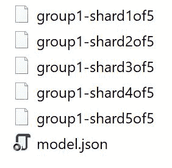

# TensorFlow.js 入门

> 原文：<https://dev.to/yashints/getting-started-on-tensorflow-js-4n5>

如果你像我一样，一直想知道什么是机器学习(又名 ML)并避开所有那些数学术语，这是一个令人兴奋的时刻，因为`TensorFlow.js`来拯救我们了。

你可以在这里找到这篇文章的代码。

## [T1】简介](#intro)

我做前端开发已经很多年了，但也对机器学习和人工智能很好奇。然而，我从来没有机会深入研究它，因为我一直很忙，大多数机器学习框架都是用我没有接触过的语言编写的。

事情已经发生了变化，人们现在在移动设备或浏览器中使用机器学习。`TensorFlow.js`是允许我们在浏览器或`Node.js`中创建、训练和部署 ML 模型的库之一。老实说，我真的对此感到兴奋，因为它允许我玩模型和神经网络，而不需要去非常低的水平或学习一种新的语言🤯。

不要误解我，我不害怕学习一门新的语言，事实上这是我的爱好之一。但是由于我一直忙于许多不同的任务，根本没有时间深入那个领域。

这个库的好处是你不需要有 ML 的先验知识，你只需要处理一些高级 API，这些 API 已经为你简化了很多概念，所以你可以专注于部署模型和解决问题，而不是重新发明轮子🔥。

但是有更多的选择为我们打开了很多机会。基本上你可以:

*   导入预先训练的模型并使用它(预测或部署它)
*   导入预训练模型(Keras 或 Python ),并使用数据集对其进行训练
*   创建、培训、预测和部署隐私友好型模型(数据永远不会离开应用程序)
*   可能还有更多我不知道的🤷‍.

## 核心概念

在我们深入研究如何使用它之前，我们需要熟悉一些基本概念，以便达成共识。

**张量**

`TensorFlow.js`中数据的中心单位是张量:一组形成一维或多维数组的数值。一个`Tensor`实例有一个 shape 属性，它定义了数组`shape`(即数组的每个维度中有多少个值)。

**变量**

变量用张量值初始化。然而，与张量不同，它们的值是可变的。

**操作(Ops)**

张量允许您存储数据，而运算(ops)允许您操作数据。`TensorFlow.js`提供多种适合线性代数和机器学习的运算，可以在张量上执行。因为张量是不可变的，这些 op 不改变它们的值；相反，ops 返回新的张量。

**模型和图层**

从概念上讲，模型是一个给定一些输入就会产生一些期望输出的函数。在`TensorFlow.js`中，有两种方法可以创建模型。您可以直接使用 ops 来表示模型所做的工作。

或者你可以使用高级 API `tf.model`从层中构建一个模型，这是深度学习中一个流行的抽象。

**警告:**因为`TensorFlow.js`使用 GPU 加速数学运算，所以在处理张量和变量时，有必要管理 GPU 内存。为此，它提供了两个函数:`dispose`和`tf.tidy`。我们稍后将深入探讨这些问题。

## 如何使用预先训练好的模型

你可以使用高度流行的 [Keras](https://keras.io/) Python 库中预先训练好的模型来进行预测。这意味着你不需要成为数据科学家就能使用模型，甚至构建强大的 ML 驱动的应用程序。

幸运的是，通过`TensorFlow.js`可以看到许多现成的模型。为此，你需要使用`TensorFlow.js converter`，它是一个开源库，将预先训练好的模型加载到`TenserFlow.js`可以理解的格式中。

**注意:**为此你需要了解一点点 [Python](https://www.python.org/) 并在本地安装它。

您将需要执行两个操作来获得一个现成的模型。首先在本地保存模型，然后运行转换器对其进行转换。但我发现了一种更简单的方法，不需要进行转换。转换逻辑已经在`tensorflowjs` Python 包中实现了😁所以我要用它。

### 保存模型

我们来看一个例子，假设我们想要导入 *MobileNet* 网络(用于检测图像中的对象)并将其保存在本地。首先按照这里的[说明安装先决条件](https://www.tensorflow.org/install/pip)。

然后我们可以编写下面的代码将模型保存到本地:

```
from keras.applications import mobilenet
import tensorflowjs as tfjs

mobilenet = mobilenet.MobileNet()

save_path = "output\\mobilenet"
tfjs.converters.save_keras_model(mobilenet, save_path) 
```

Enter fullscreen mode Exit fullscreen mode

َAfter 运行这个，你应该在`output`文件夹中有一个`mobilenet`文件夹，它包含以下文件:

[](https://res.cloudinary.com/practicaldev/image/fetch/s--Nkf0vrY3--/c_limit%2Cf_auto%2Cfl_progressive%2Cq_auto%2Cw_880/https://thepracticaldev.s3.amazonaws.com/i/jos29ra52jurp2693cgq.JPG)

猜猜看，您已经准备好使用它来编写您的第一个`TensorFlow.js`应用程序了。

如果你热衷于使用 CLI 命令来转换模型，看看这个教程。

## 在你的应用中使用模型

在我的例子中，我使用了 [Angular](https://angular.io/) ,但是可以随意使用你喜欢的任何框架，甚至是普通的 JS🙃。

### 创建 app

我已经安装了 Angular CLI，所以我将打开一个命令提示符并创建一个新的应用程序:

```
ng new mobilenet

cd mobilenet 
```

Enter fullscreen mode Exit fullscreen mode

### 安装 TensorFlow.js

这将需要一些时间(创建应用程序并安装所有 npm 软件包)。完成后添加`TensorFlow.js`包:

```
npm install @tensorflow/tfjs --save 
```

Enter fullscreen mode Exit fullscreen mode

完成后，将您保存的模型的内容复制到您的资产文件夹中，并使用您选择的编辑器( [VS 代码](https://code.visualstudio.com/))打开该文件夹😁).

您还需要有用于预测目的的影像类。所以在项目中的某个地方创建一个文件，并将这个文件的内容添加到其中。我已经把它放在我的资产文件夹里了。

### 导入模型并使用

打开您的`app.component.ts`文件并添加导入语句:

```
import * as tf from '@tensorflow/tfjs';
import { IMAGENET_CLASSES } from '../assets/imagenet-classes'; 
```

Enter fullscreen mode Exit fullscreen mode

我们将需要一些变量来保存我们的数据和一些对我们必须使用的 HTML 元素的引用:

```
model: tf.Model;
classes: any[];
imageData: ImageData;

@ViewChild('chosenImage') img: ElementRef;
@ViewChild('fileUpload') fileUpload: ElementRef; 
```

Enter fullscreen mode Exit fullscreen mode

模型将拥有我们的模型，类用于我们的预测结果，而`imageData`用于将我们的文件上传到它的文件中，并在页面上以图像的形式显示出来。

和两个全局变量，图像大小是模型被训练的大小，以及我们想要从预测结果中挑选的预测数量(因为它是一个数组):

```
const IMAGE_SIZE = 224;
const TOPK_PREDICTIONS = 5; 
```

Enter fullscreen mode Exit fullscreen mode

是时候添加一个方法来加载模型并在`ngOnInit` :
中调用它了

```
ngOnInit() {
  this.loadModel();
}

async loadModel() {
  this.model = await tf.loadModel('/assets/model.json');
} 
```

Enter fullscreen mode Exit fullscreen mode

我们将需要一个文件上传和我们的 HTML 图像，所以让我们添加它们:

```
<div class="container">
  <h2>
    Using MobileNet neural network in Angular
  </h2>
  <div class="upload" [hidden]="!model">
    Upload an image:
    <input
      #fileUpload
      type="file"
      id="files"
      name="files[]"
      (change)="fileChangeEvent($event)"
    />
  </div>
  <div>
    
    <div class="predictions">
      <div
        *ngFor="let class of classes"
        class="row"
      >
        <div class="col-sm-6">
          {{class.className}}
        </div>
        <div class="col-sm-6">
          {{class.probability.toFixed(3)}}
        </div>
      </div>
    </div>
  </div>
</div> 
```

Enter fullscreen mode Exit fullscreen mode

和一点 CSS 来美化它:

```
.container {
  padding: 200px;

  .sample-image {
    margin: 20px;
  }

  .predictions {
    margin-top: 20px;
    width: 100%;
  }
} 
```

Enter fullscreen mode Exit fullscreen mode

HTML 中的预测部分将包含预测结果，我们假设它存储在一个名为`classes`的变量中。

现在让我们回到我们的`TypeScript`文件并添加预测代码。让我们首先为我们的文件输入创建一个处理程序，这将触发我们的预测逻辑:

```
fileChangeEvent(event: any) {
  const file = event.target.files[0];
  if (!file || !file.type.match('image.*')) {
    return;
  }

  this.classes = [];

  const reader = new FileReader();
  reader.onload = e => {
    this.img.nativeElement.src = e.target['result'];
    this.predict(this.img.nativeElement);
  };

  reader.readAsDataURL(file);
} 
```

Enter fullscreen mode Exit fullscreen mode

我们在这个方法中所做的就是读取选定的文件，将其作为页面上图像的源，这样就可以看到哪个图像被选中，并调用 predict 方法。我们已经在`onload`事件处理程序中异步调用了它，因为必须先读取文件。

现在让我们编写预测代码:

```
async predict(imageData: ImageData): Promise<any> {
  this.fileUpload.nativeElement.value = '';
  const startTime = performance.now();
  const logits = tf.tidy(() => {
    // tf.fromPixels() returns a Tensor from an image element.
    const img = tf.fromPixels(imageData).toFloat();

    const offset = tf.scalar(127.5);
    // Normalize the image from [0, 255] to [-1, 1].
    const normalized = img.sub(offset).div(offset);

    // Reshape to a single-element batch so we can pass it to predict.
    const batched = normalized.reshape([1, IMAGE_SIZE, IMAGE_SIZE, 3]);

    // Make a prediction through mobilenet.
    return this.model.predict(batched);
  });

  // Convert logits to probabilities and class names.
  this.classes = await this.getTopKClasses(logits, TOPK_PREDICTIONS);
  const totalTime = performance.now() - startTime;
  console.log(`Done in ${Math.floor(totalTime)}ms`);
} 
```

Enter fullscreen mode Exit fullscreen mode

如果你第一眼看不懂这里的代码，完全没问题。因为我们已经导入了模型，所以我们必须对它的内部结构有所了解。

首先，我使用前面提到的`tidy`函数来确保我们没有任何内存泄漏。

然后，我将把图像转换成这个模型中所期望的浮点数据类型。

一旦完成，我们需要将数据从[0，255]范围归一化到[-1，1]。`scalar`操作用提供的值创建一个张量。

最后，我们需要将我们的输入整形为[1，IMAGE_SIZE，IMAGE_SIZE，3]张量，并调用 predict。

一旦我们得到了结果，我们必须从结果中提取出顶部的`x`类，所以让我们实现它:

```
async getTopKClasses(logits, topK): Promise<any[]> {
  const values = await logits.data();

  const valuesAndIndices = [];
  for (let i = 0; i < values.length; i++) {
    valuesAndIndices.push({ value: values[i], index: i });
  }
  valuesAndIndices.sort((a, b) => {
    return b.value - a.value;
  });
  const topkValues = new Float32Array(topK);
  const topkIndices = new Int32Array(topK);
  for (let i = 0; i < topK; i++) {
    topkValues[i] = valuesAndIndices[i].value;
    topkIndices[i] = valuesAndIndices[i].index;
  }

  const topClassesAndProbs = [];
  for (let i = 0; i < topkIndices.length; i++) {
    topClassesAndProbs.push({
      className: IMAGENET_CLASSES[topkIndices[i]],
      probability: topkValues[i]
    });
  }
  return topClassesAndProbs;
} 
```

Enter fullscreen mode Exit fullscreen mode

好的，记住我们调用这个方法的结果是以一个`logit`的形状预测。Logits 通常是一个`Tensor`或者一个数组或者一个类型化数组。

所以基本上我们通过等待`data`方法得到结果。然后我们创建一个新的数组，使用数组输出的值和索引。

在此基础上，我们根据形成的数组计算结果类。同样，你不需要理解代码是做什么的，在高层次上，它只是将结果映射到我们之前从 GitHub 库中获得的一个类。

## 运行 app

你现在可以运行应用程序，进入`localhost:4200`并上传一张图片，看看你会得到什么样的预测😎。

[https://www.youtube.com/embed/kyx1v2Ds3FY](https://www.youtube.com/embed/kyx1v2Ds3FY)

这就是入门的简单之处。希望你喜欢这个指南，我可以激励你去看看。

同样，你可以在这里找到这篇文章的代码。