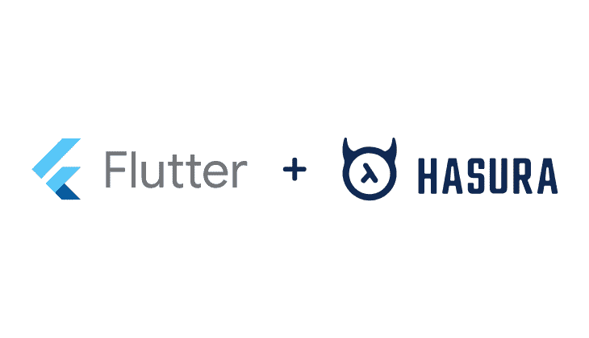
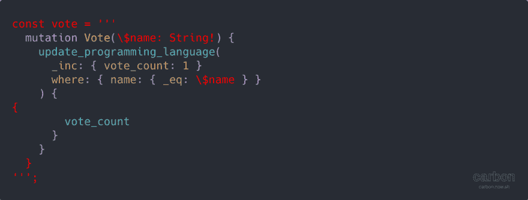
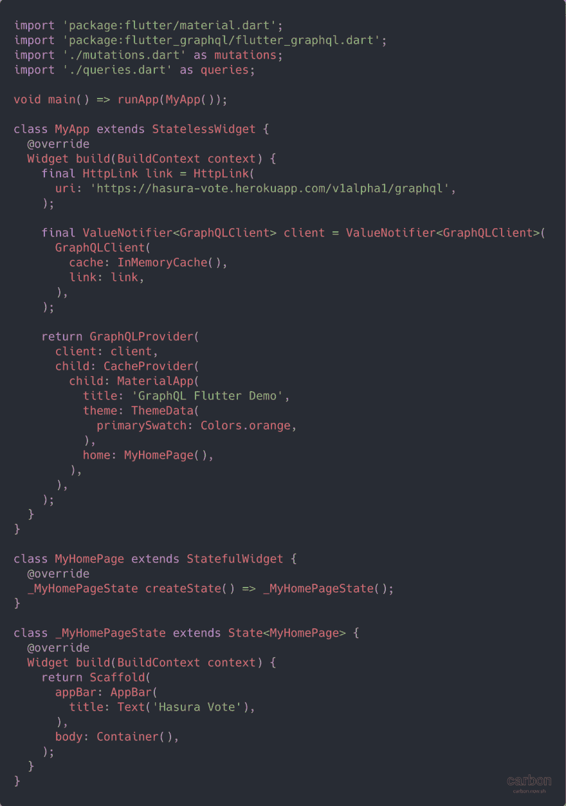
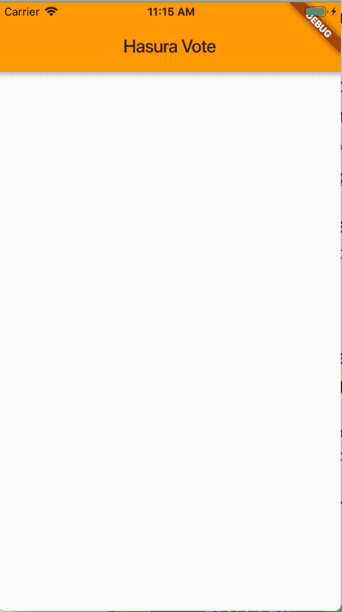
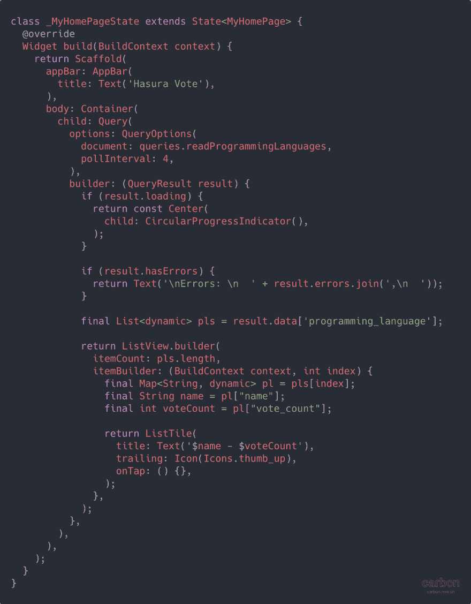
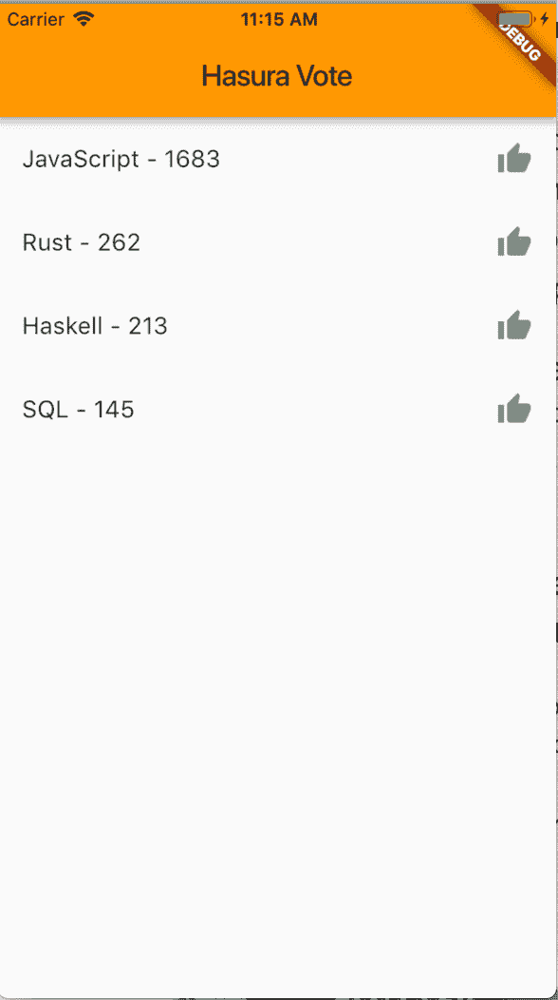
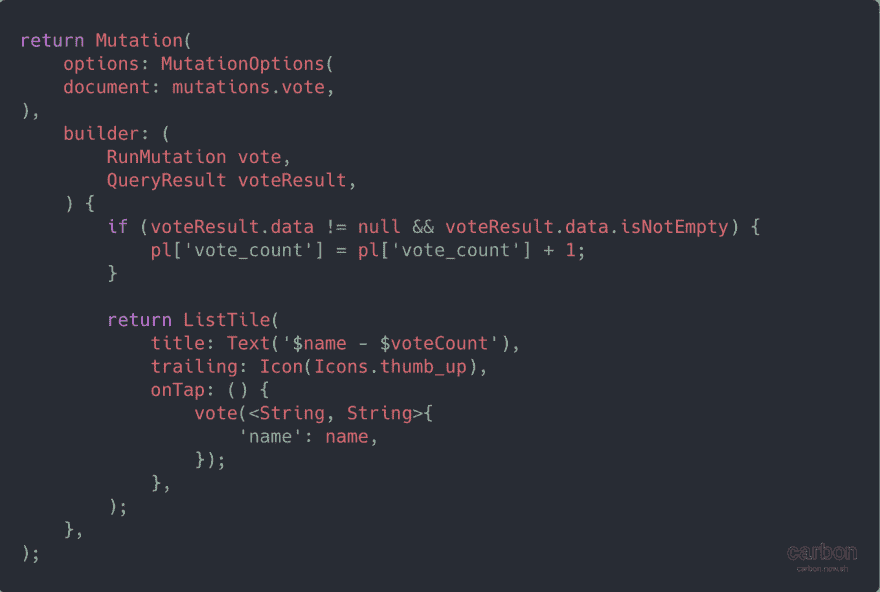

# Hasura 和 Flutter 入门

> 原文：<https://dev.to/hasurahq/getting-started-with-hasura-and-flutter-oil>

[](https://res.cloudinary.com/practicaldev/image/fetch/s---7KaqD3R--/c_limit%2Cf_auto%2Cfl_progressive%2Cq_auto%2Cw_880/https://blog.hasura.io/conteimg/2019/04/Flutter_page_1-2.png)

*本教程由[于君·詹](https://twitter.com/thezjy1)撰写，并作为 [Hasura 技术作者计划](https://blog.hasura.io/the-hasura-technical-writer-program/)的一部分发布，该计划旨在支持为开源 Hasura GraphQL 引擎编写指南和教程的作者。*

对于那些还不熟悉 Flutter 的人来说，Flutter 是 Google 创建的一个开源移动应用开发框架，它允许你从单个代码库在 iOS 和 Android 上构建漂亮的原生应用。就像 Hasura 一样，Flutter 有许多很棒的特性，可以改善开发者和用户的体验。举两个例子:热重载帮助你快速迭代不同的设计，而不会丢失你的应用程序的状态。skia(Chrome 使用的 2D 图形引擎)和所有内置的小部件提供了高性能、漂亮和可定制的用户界面。

Hasura 和 Flutter 是构建 3 因子应用程序的绝佳搭档。在本教程中，我将向您展示如何开始使用这个强大的二人组。我们将把我上一篇教程中的投票应用移植到 iOS 和 Android 上。主要目标是向您展示如何将 Hasura 集成到 Flutter 应用程序中，所以我们只打算实现基本的投票功能。

## 先决条件

你需要了解 Hasura 和一点点 Flutter 才能开始。既然你正在读这篇文章，我假设你已经熟悉了 Hasura。对于 Flutter，我推荐通过[官方文档](https://flutter.dev/docs/get-started/install)来学习如何用 Flutter 安装和构建一个简单的演示 app。

## 先做第一件事

创建一个新的颤振项目非常简单。运行`flutter create hasura_vote_flutter`就可以了。我们首先需要添加一个 GraphQL 库。信不信由你，这可能是本教程最棘手的部分。由于 Flutter 还处于早期阶段，所以还没有像 Apollo 或 Relay 这样成熟的 web 库。我选择了 [flutter-graphql](https://github.com/snowballdigital/flutter-graphql) ，只是因为它适合这个项目。我期望随着时间的推移，一个伟大的 Flutter graph QL 库会出现。顺便说一句，我们所有人都可以帮助实现这一目标！

回到正题。打开`pubspec.yaml`，添加依赖:

```
dependencies:
  flutter:
    sdk: flutter

  cupertino_icons: ^0.1.2

  flutter_graphql: ^1.0.0-rc.3 
```

Enter fullscreen mode Exit fullscreen mode

如果你使用的是官方文档推荐的 ide，这个包会自动安装。否则，只需在命令行中运行`flutter packages get`即可。

## 准备 GraphQL 文档

无论使用哪种 GraphQL 库，过程都是相似的。你写了一些 GraphQL 文档，这个库帮助你发送它们并得到一些结果。在`lib`文件夹中创建两个文件`queries.dart`和`mutations.dart`作为你的`main.dart`文件。然后复制并粘贴我们上次教程中的两个文档。

`queries.dart`:

[](https://res.cloudinary.com/practicaldev/image/fetch/s--sPOKU4Dg--/c_limit%2Cf_auto%2Cfl_progressive%2Cq_auto%2Cw_880/https://blog.hasura.io/conteimg/2019/04/queries-2.png)

`mutations.dart`:

[](https://res.cloudinary.com/practicaldev/image/fetch/s--ydbupF_V--/c_limit%2Cf_auto%2Cfl_progressive%2Cq_auto%2Cw_880/https://blog.hasura.io/conteimg/2019/04/mutations-2.png)

这可能看起来有点多余。但是随着 GraphQL 惊人的生态系统继续发展，我预计未来 Flutter 和 Web 之间会有更多的代码共享。

## 勾搭客户端

自动生成的`main.dart`包括一个简单的计数器应用程序。运行它以确保一切正常。然后用下面的代码替换它:

[](https://res.cloudinary.com/practicaldev/image/fetch/s--cc5efg9k--/c_limit%2Cf_auto%2Cfl_progressive%2Cq_auto%2Cw_880/https://blog.hasura.io/conteimg/2019/04/dart-2.png)

[](https://res.cloudinary.com/practicaldev/image/fetch/s--2FWsb9NJ--/c_limit%2Cf_auto%2Cfl_progressive%2Cq_auto%2Cw_880/https://blog.hasura.io/conteimg/2019/04/hasura_vote.png)

干净多了！让我们首先关注`MyApp`小部件，它初始化我们的 GraphQL 客户端。在这个项目中我们不需要认证，所以一个简单的 HttpLink 就可以了。这里的 URI 与上一个教程中的一样。如果您部署了自己的版本，请使用您的 URI。然后，我们将`GraphQLProvider`放在小部件树的顶部，以便在子部件中使用`Query`和`Mutation`小部件。

## 添加查询

由于 Flutter 从 React 中获得灵感，提供了树状结构来构建 UI，所以添加 GraphQL 数据的工作流程与 Apollo React 非常相似。只需用一个`Query`小部件包装孩子:

[](https://res.cloudinary.com/practicaldev/image/fetch/s--lcv_1c5E--/c_limit%2Cf_auto%2Cfl_progressive%2Cq_auto%2Cw_880/https://blog.hasura.io/conteimg/2019/04/query-1.png)

这没什么奇怪的。我们连接了`ReadProgrammingLanguages`查询，并使用该数据构建一个列表。点击保存，你应该看到列表出现在你的开发设备中。但是由于我们还没有添加`Vote`突变，单击列表项将不会有任何作用。更重要的是，因为这个`flutter-graphql`的订阅 API 还不稳定，所以我们使用轮询来实现实时性。访问[网页版](https://hasura-vote.now.sh/)并做一些改变，你应该会在你的 Flutter 应用上看到实时更新。

[](https://res.cloudinary.com/practicaldev/image/fetch/s--qM1_Ejf5--/c_limit%2Cf_auto%2Cfl_progressive%2Cq_auto%2Cw_880/https://blog.hasura.io/conteimg/2019/04/list.png)

## 添加突变

最后，让我们添加`Vote`突变，使我们的应用程序功能齐全。把`_MyHomePageState`的`return`部分改成这样:

[](https://res.cloudinary.com/practicaldev/image/fetch/s---dICYM-O--/c_limit%2Cf_auto%2Cfl_progressive%2Cq_auto%2Cw_880/https://blog.hasura.io/conteimg/2019/04/mutation-1.png)

我们使用我们准备好的变异进行投票，并在结果出来时手动更新数据。在这个阶段，应用程序应该可以正常工作。尝试使用它，并查看 Flutter 应用程序和 Web 应用程序上的变化。

## 包装完毕

好的开发人员工具简化了常见的任务，但也提供了在需要时进行定制的方法。对我来说，Flutter 和 Hasura 是这种品质的两个最好的例子。在本教程中，我们构建了一个相当简单的实时投票应用程序。利用 Hasura 和 Flutter 的力量，你可以构建出无限的令人惊叹的应用程序。

## 关于作者

于君·詹是一位生活在中国的全栈式 web 开发人员。目前，他正在用 Flutter、React 和 Hasura 开发一款跨平台应用。他喜欢在业余时间散步和游泳。你可以通过他的电子邮件地址([thezjy@gmail.com](mailto:thezjy@gmail.com))或推特账号([https://twitter.com/thezjy1](https://twitter.com/thezjy1))联系他。