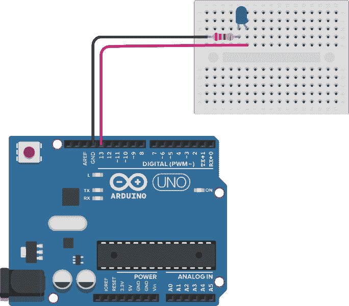

# JavaScript 和物联网入门

> 原文：<https://dev.to/vorillaz/getting-started-with-javascript-and-iot-3pel>

在过去的几年里，物联网生态系统一直在蓬勃发展。我们正面临一个网络和移动开发的新时代，因为我们可以使用微控制器、3D 打印机、无人机和智能设备创造全新的体验、界面或产品。

像 Arduino Uno 这样的廉价、可广泛获取的开源硬件和开发板受到了很多关注，因为开始原型制作和修补它们非常容易。

## JavaScript 和 IoT

如果您对物联网世界感兴趣，并且您正在从事 web 工作，您可能会发现自己很难开始嵌入式开发。通常，为了控制 Arduino 系列的电路板，您必须熟悉 C/C++。幸运的是，虽然你可以使用 JavaScript 和 Arduino Uno 一起使用 Johnny-Five。

## 强尼-五

Johnny-Five 是一个 JavaScript 机器人&物联网平台，最初由 Bocoup 开发。它允许我们使用 JavaScript 来控制微控制器，方法是将 JavaScript 编译成本机字节码，或者使用主机通过 WiFi 或串行 USB 通信从外部控制目标设备。它支持 40 种不同的板，并具有用于外部模块和附加硬件组件的强大 API。

## 将 Johnny-Five 与 Arduino Uno 配合使用

Johnny-Five 使用 Firmdata 协议从主机与 Arduino 通信。我们可以使用串行 USB 电缆将主机直接连接到 Arduino。值得注意的是，Johnny-Five 实际上可以与不同的 Arduino 板一起工作，我选择了 Arduino Uno，因为它是最受欢迎的板之一，广泛可用，并受到生动的社区的支持。

## 硬件组件

出于本教程的目的，我们将尝试闪烁 LED 灯，这是物联网的“Hello world”示例。您将需要一些组件:

*   Arduino Uno 或 Genuino Uno 板

*   一块试验板

*   几根跳线

*   一些发光二极管

*   一些 220 欧姆的电阻

## 设置 Arduino IDE

将设备连接到主机需要 Arduino IDE。你可以从[这里](https://www.arduino.cc/en/main/software)下载并安装 Arduino IDE。使用串行 USB 电缆将 Arduino 板连接到您的主机。在 Arduino IDE 上打开，转到*工具>端口*并确保正确的板卡 Arduino Uno 连接到正确的端口(tty.usbmodem.*用于 Mac 或 Linux，cu.usbmodem*用于 Windows)。
现在我们需要安装 Firmadata 协议来控制电路板。

*   在 IDE 上打开**文件>实例> Firmata >标准 Firmata** 。
*   单击上传/箭头按钮。
*   等到 IDE 消息窗口显示**“上传完成”**。

## 接线

该板有一组用于连接外部模块的通用输入和输出引脚。每个插针都标有一个数字，这样您就可以很容易地识别哪些正在使用。还有两个 5V 输出引脚和两个标记为 GND 的引脚，我们可以使用它们直接从电路板为原型供电。布线如下所示:

[](https://res.cloudinary.com/practicaldev/image/fetch/s--dQGkrN9Y--/c_limit%2Cf_auto%2Cfl_progressive%2Cq_auto%2Cw_880/https://thepracticaldev.s3.amazonaws.com/i/s6rksiwhwh9823ni507e.png)

使用跳线，我们将第 13 个*引脚与 LED 阳极(LED 的较长引脚)相连，并将接地引脚与同样与 LED 相连的电阻器相连。led 具有高能效，需要的电流很低，因此我们可以直接从电路板上为其中一些 led 供电，而无需任何外部电源。*

## 用强尼五号闪烁一个 LED

现在让我们转到编码部分。安装 Johnny-Five 模块并创建入口点`npm i --save johnny-five && touch led.js`。
在 led.js 文件中，使用您最喜欢的代码编辑器
添加以下代码片段

```
const jfive = require('johnny-five');
// Init the board
const board = new jfive.Board();

board.on('ready', function () {
  // Use the Led class for the 13th pin
  const led = new jfive.Led(13);
  // Blink the LED every half a second
  led.blink(500);
}); 
```

使用`node blink.js`运行脚本。LED 应该开始闪烁。恭喜您，您已经开始了进入物联网世界的旅程！

## 鸣谢

这个例子是为了向嵌入式开发的新手展示一个幼稚的例子。Johnny-Five 是一个很好的工作框架。还有其他的解决方案，比如[赛昂人](https://cylonjs.com)库。
此外，正如我之前提到的，在 Arduino Uno 上使用 Johnny-Five 有点模糊，我们实际上是在远程控制电路板。尽管如此，你只需要花很少的钱就可以开始开发和原型制作。
在接下来的教程中，我将尝试介绍不同主板的开发，如 Raspberry Pi Zero 或 Espruino，它们允许我们以更灵活、更有趣的方式控制硬件。

*这篇文章最初是发布在我的[博客](https://www.vorillaz.com)上的。*