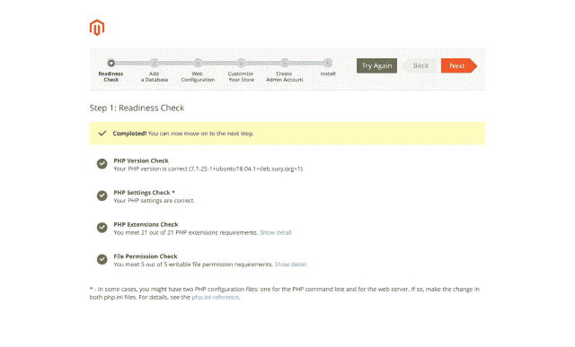
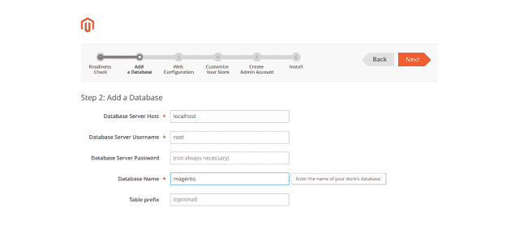
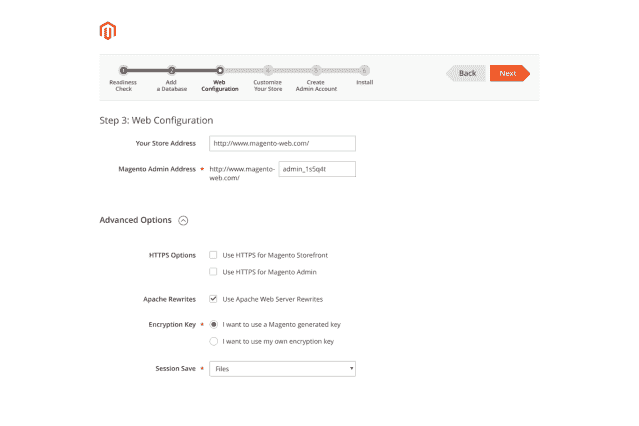
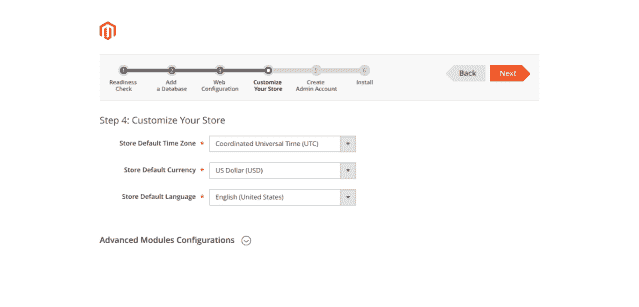
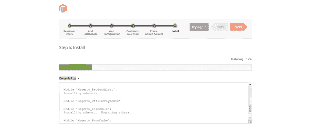

# Magento 2 入门

> 原文：<https://dev.to/tirthbodawala/getting-started-with-magento-2-5a15>

## 什么是 Magento？

Magento 是领先的电子商务平台，用于基于开源技术的在线商店，为在线商家提供灵活的购物车系统，以及对其在线商店的外观、内容和功能的控制。

Magento 提供强大的营销、搜索引擎优化和目录管理工具。

Magento 2 于 2015 年发布，是该平台的一次更新，它采用了最新的开发实践，作为未来功能和增长的基础。

### 特性

*   网站管理功能。
*   结账、付款和运输。
*   搜索引擎优化
*   分析和报告。
*   营销推广和工具。
*   订单管理。
*   客服。
*   客户账户。

### 安装 Magento 2 的要求

*   Web 服务器:Apache 2.4 或 Nginx 1.8.x
*   PHP 7.1.x
*   数据库:MySQL 5.6 以上，MariaDB 10.0 以上，Percona 5.7
*   php_xdebug2.2.0 或更高版本:仅推荐用于开发环境。
*   需要的 PHP 扩展: [intl](http://php.net/manual/en/book.intl.php) ， [mbstring](http://php.net/manual/en/book.mbstring.php) ， [mcrypt](http://php.net/manual/en/book.mcrypt.php) ， [mhash](http://php.net/manual/en/book.mhash.php) ， [openssl](http://php.net/manual/en/book.openssl.php) ， [PDO_MySQL](http://php.net/manual/en/ref.pdo-mysql.php) ， [SimpleXML](http://php.net/manual/en/book.simplexml.php) ， [soap](http://php.net/manual/en/book.soap.php) ， [xml](http://php.net/manual/en/book.xml.php) ， [xsl](http://php.net/manual/en/book.xsl.php) ， [zip](http://php.net/manual/en/book.zip.php)

## 使用 Nginx 在 Ubuntu 上安装 Magento 2

### 第一步:

通过在终端运行以下命令安装 nginx。

```
apt-get -y install nginx 
```

### 第二步:

安装并配置 **php-fpm**

#### 步骤 2.1:

安装 **php-fpm** 和 **php** ** -cli**。

```
apt-get -y install php7.1-fpm php7.1-cli 
```

该命令安装 PHP 7.1.X 的最新可用版本。有关支持的 PHP 版本，请参见 [Magento 2.2.x 技术堆栈要求](https://devdocs.magento.com/guides/v2.2/install-gde/system-requirements-tech.html)。

#### 步骤 2.2:

打开**PHP**T2。编辑器中的 ini 文件。

```
vim /etc/php/7.1/fpm/php.ini vim /etc/php/7.1/cli/php.ini 
```

#### 步骤 2.3:

编辑这两个文件以匹配下面的行，保存并退出编辑器。

```
memory_limit = 2G 
max_execution_time = 1800 
zlib.output_compression = On 
```

#### 步骤 2.4:

重启 **php** ** -fpm**服务。

```
systemctl restart php7.1-fpm 
```

### 第三步:

配置 Nginx。

#### 步骤 3.1:

运行该行为您的 Magento 站点创建一个新的虚拟主机。

```
vim /etc/nginx/sites-available/magento 
```

#### 步骤 3.2:

进行以下配置。

```
upstream fastcgi_backend {         
    server unix:/run/php/php7.1-fpm.sock; 
} 
server {
     listen 80;
     server_name www.magento-dev.com;
     set $MAGE_ROOT /workspace/magento2;
     include /workspace/magento2/nginx.conf.sample; 
} 
```

将您的域名与您在安装 Magento 时选择的基本 URL 匹配，然后保存并退出编辑器。

#### 步骤 3.3:

通过创建符号链接来激活主机。

```
ln -s /etc/nginx/sites-available/magento /etc/nginx/sites-enabled 
```

#### 步骤 3.4:

运行命令重启 nginx。

```
systemctl restart nginx 
```

#### 步骤 3.5:

将网站 url 添加到主机文件。

```
vim /etc/hosts 127.0.0.1 www.magento-dev.com 
```

现在，在网络浏览器上尝试您网站的 URL，亲自验证该网站。它将打开 Magento 安装向导，如图所示。你也可以通过完成安装向导的所有步骤来安装 Magento。这是安装 Magento 的另一种方法。

[](https://res.cloudinary.com/practicaldev/image/fetch/s--NDgQN99B--/c_limit%2Cf_auto%2Cfl_progressive%2Cq_auto%2Cw_880/https://i1.wp.com/www.atyantik.com/wp-content/uploads/2018/12/1.png%3Fresize%3D640%252C289%26ssl%3D1)

如图所示，完成 web 设置向导需要 6 个步骤。

<figure>[](https://res.cloudinary.com/practicaldev/image/fetch/s--h5IgEgJV--/c_limit%2Cf_auto%2Cfl_progressive%2Cq_auto%2Cw_880/https://i0.wp.com/www.atyantik.com/wp-content/uploads/2018/12/2.png%3Fw%3D640%26ssl%3D1) 

<figcaption>第一步:准备情况检查
</figcaption>

</figure>

<figure>[](https://res.cloudinary.com/practicaldev/image/fetch/s--q_Ih9ClC--/c_limit%2Cf_auto%2Cfl_progressive%2Cq_auto%2Cw_880/https://i1.wp.com/www.atyantik.com/wp-content/uploads/2018/12/3-1.png%3Ffit%3D640%252C304%26ssl%3D1) 

<figcaption>第二步:数据库配置</figcaption>

</figure>

<figure>[](https://res.cloudinary.com/practicaldev/image/fetch/s--koT7dUq0--/c_limit%2Cf_auto%2Cfl_progressive%2Cq_auto%2Cw_880/https://i2.wp.com/www.atyantik.com/wp-content/uploads/2018/12/4-1.png%3Ffit%3D640%252C426%26ssl%3D1) 

<figcaption>第三步:网页配置</figcaption>

</figure>

<figure>[](https://res.cloudinary.com/practicaldev/image/fetch/s--Wa15x2JV--/c_limit%2Cf_auto%2Cfl_progressive%2Cq_auto%2Cw_880/https://i0.wp.com/www.atyantik.com/wp-content/uploads/2018/12/5-1.png%3Ffit%3D640%252C308%26ssl%3D1) 

<figcaption>第四步:店铺定制</figcaption>

</figure>

<figure>[](https://res.cloudinary.com/practicaldev/image/fetch/s--5p2Mpw0s--/c_limit%2Cf_auto%2Cfl_progressive%2Cq_auto%2Cw_880/https://i0.wp.com/www.atyantik.com/wp-content/uploads/2018/12/6-1.png%3Ffit%3D640%252C288%26ssl%3D1) 

<figcaption>第五步:创建管理员账号</figcaption>

</figure>

<figure>[](https://res.cloudinary.com/practicaldev/image/fetch/s--_B-g4OQ9--/c_limit%2Cf_auto%2Cfl_progressive%2Cq_auto%2Cw_880/https://i0.wp.com/www.atyantik.com/wp-content/uploads/2018/12/7-1.png%3Ffit%3D640%252C267%26ssl%3D1) 

<figcaption>第六步:安装</figcaption>

</figure>

### 第四步:

安装和配置 Magento2 命令行。

#### 步骤 4.1:

运行以下命令更改到 docroot 目录。

```
cd /workspace 
```

#### 步骤 4.2:

[下载](https://magento.com/tech-resources/download)并提取 Magento 2，命名为 **magento2。**

#### 步骤 4.3:

输入以下行来设置目录所有权和文件权限。

```
cd /workspace/magento2 
find var vendor pub/static pub/media app/etc -type f -exec chmod g+w {} \; 
find var vendor pub/static pub/media app/etc -type d -exec chmod g+ws {} \; 
chown -R :www-data
chmod u+x bin/magento 
```

#### 步骤 4.4:

全局安装 Composer。

```
curl -sS https://getcomposer.org/installer | sudo php -- --install-dir=/usr/bin --filename=composer 
```

#### 第 4.5 步:

更新 Magento 依赖项。

```
cd /workspace/magento2
composer install -v 
```

#### 第 4.6 步:

运行下面的命令行来安装 Magento。

```
cd /workspace/magento2/bin 
./magento setup:install --base-url=http://www.magento-dev.com/ --db-host=localhost --db-name=magento --db-user=magento --db-password=magento --admin-firstname=admin --admin-lastname=admin --admin-email=admin@admin.com --admin-user=admin --admin-password=admin123 --language=en_US --currency=USD --timezone=America/Chicago --use-rewrites=1 
```

最后但同样重要的是，切换到开发人员模式继续 nginx 配置。

```
cd /workspace/magento2/bin 
./magento deploy:mode:set developer 
```

您的 Magento 商店设置现已完成。进入浏览器，打开网址，你就可以看到你的商店。

[](https://res.cloudinary.com/practicaldev/image/fetch/s--qDJQ0C4l--/c_limit%2Cf_auto%2Cfl_progressive%2Cq_auto%2Cw_880/https://i1.wp.com/www.atyantik.com/wp-content/uploads/2018/12/8.png%3Ffit%3D640%252C318%26ssl%3D1)

Magento 2 入门的帖子[首先出现在 yantik Technologies](https://www.atyantik.com/getting-started-with-magento-2/) 的[上。](https://www.atyantik.com)