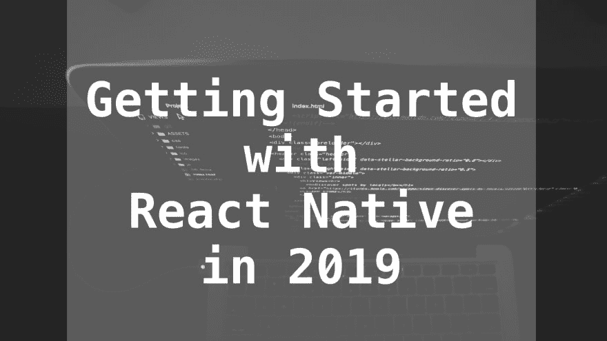
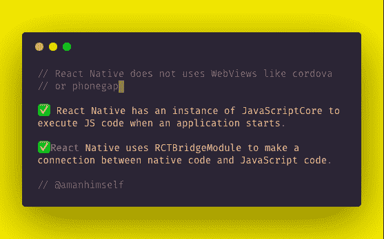
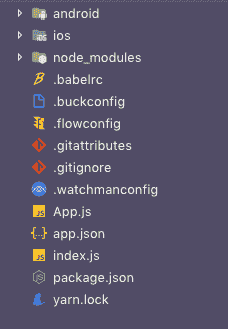
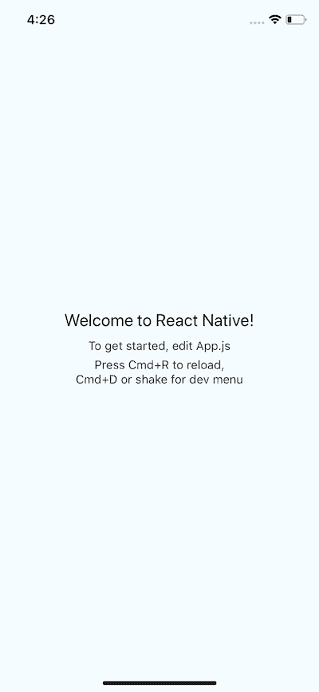
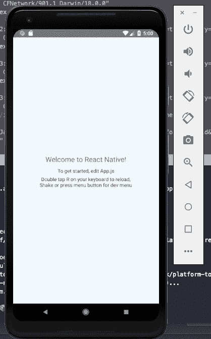
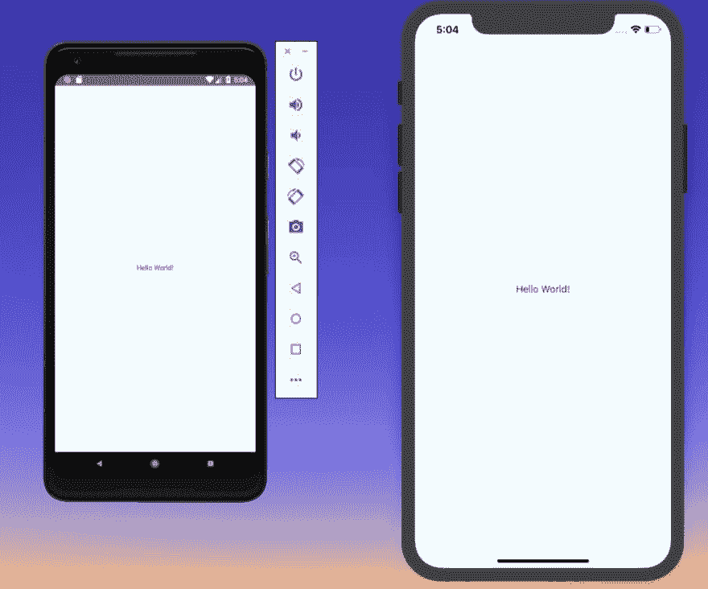
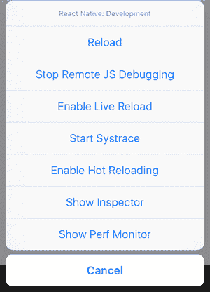
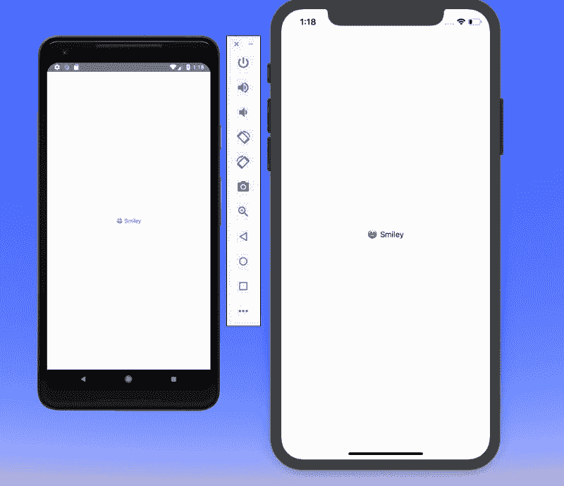

# 2019 年 React Native 入门:打造你的第一款应用

> 原文：<https://dev.to/amanhimself/getting-started-with-react-native-in-2019-build-your-first-app-542d>

[](https://res.cloudinary.com/practicaldev/image/fetch/s---11yvLdd--/c_limit%2Cf_auto%2Cfl_progressive%2Cq_auto%2Cw_880/https://cdn-images-1.medium.com/max/2000/1%2AiRa2rw_Xx-y1k43ThbxgRw.jpeg)

*免责声明:请注意，本文最初发表于 2019 年 1 月 4 日[此处](https://hackernoon.com/getting-started-with-react-native-in-2019-build-your-first-app-a41ebc0617e2)。*

我们生活在一个各种移动设备的世界，主要由两个平台主导，iOS 和 Android。这是一场两匹马的竞赛，我相信我们都同意这一点。然而，构建一个移动应用程序并不是一件容易的事情。

对于 iOS，你使用 Objective-C 或 Swift 编写代码，而对于 Android，你会发现自己使用 Java。除了用于创建可以在两个平台上运行的手机的不同编程语言之外，这两个手机平台的工具链也完全不同。

许多现代开发人员使用一套特定的技术来构建 web 应用程序:HTML、CSS 和 JavaScript。有不同的框架属于通常称为混合应用程序的类别。您可以使用几乎一套源代码为 iOS 和 Android 平台开发应用程序。

近年来，混合框架已经从 web 视图发展到使用本地 API。这种开发移动应用程序的跨平台方法有其优缺点。优点包括耗时少、成本低，缺点包括性能问题。

跨平台开发的一个很好的选择是 React Native。由脸书以及其他公司如 Tesla、沃尔玛、Uber Eats、Instagram、Discord、Wix 等开发和使用。React Native 基于脸书的网络图书馆 ReactJS。

## 你打算学什么？

在本教程中，您将学习以下内容:

*   什么是 React Native？
*   设置开发环境
*   使用 React 本机 CLI
*   运行 React 本机应用程序
*   App.js 是什么？
*   热重装
*   学徒制
*   构建您的第一个 React 原生应用
*   了解不同的用户界面组件
*   查看组件
*   样式表对象
*   文本组件
*   用 FlatList 创建列表
*   React Native 的学习路径

## 什么是 React Native？

简而言之，React Native 允许您构建外观、感觉和执行更像本机应用程序的移动应用程序。它使用与常规 iOS 和 Android 应用相同的基本 UI 构建模块。您只需使用 JavaScript 和 React 将这些构件放在一起。对开发人员来说，一件好事是他们可以使用几乎相同的概念来构建 web 应用程序。

如果您熟悉 Reactjs 或者来自前端开发背景，React 使用一个虚拟 DOM 作为真实 DOM 的影子。当一个元素发生变化时，虚拟 DOM 使用对应于每个元素的节点将这种变化反映在真实 DOM 上。

然而，在 React Native 中，除了 iOS 和 Android 等平台提供的原生组件之外，没有 DOM。此处没有 web 视图。React Native 有一个 [JavaScriptCore](https://facebook.github.io/react-native/docs/javascript-environment.html) 的实例，用于在应用启动时执行 JS 代码。React Native 使用 RCTBridgeModule 在本机代码和 JavaScript 代码之间建立连接。

简单来说，React Native 将 React 带到了移动应用开发中。它的目标不是写一次代码就能在任何平台上运行。这里的主要目标是一次学习，随处书写。这是一个重要的区别。React Native 仍然相对较新，在我写这篇文章的时候，它还在它的版本`0.57`中。

[](https://res.cloudinary.com/practicaldev/image/fetch/s--C9j3aocb--/c_limit%2Cf_auto%2Cfl_progressive%2Cq_auto%2Cw_880/https://cdn-images-1.medium.com/max/800/1%2AEa-6Srtp9ykLmHNp5y-4fQ.png)

## 前提条件:设置开发环境

为了深入 React Native 的生态系统，我们需要首先安装一些东西。让我们来看看其中的一个。

### Nodejs &守夜人

React Native 使用 JavaScript 运行时 Node.js 来构建您的 JavaScript 代码。如果你还没有安装 Node.js，是时候从它的官方网站[这里](https://nodejs.org/en/)获取了。我推荐安装 LTS(长期支持)`10.x.x`版本，这也是我个人使用的版本。

Watchman 是脸书开发的一个工具，用于观察文件的变化。强烈建议您安装它以获得更好的性能。对于 Mac 用户，你将需要`homebrew` macOS 包来安装 watchman: `brew install watchman`。

对于 Windows 用户，没有 watchman，所以你可以跳过这一步，但你需要有 Nodejs 和 python2，因为 React Native 的最新版本需要它。

最后，每个人(不管你用的是什么操作系统)都需要安装 Java SE 开发工具包(JDK)，这个工具包可以在[这里](https://www.oracle.com/technetwork/java/javase/downloads/jdk8-downloads-2133151.html)找到。确保您安装的版本至少是`>= 8`或更高。

原生 SDK
对于 macOS 开发者，可以安装免费开发 iOS 应用的 Xcode。

如果你想为 Android 开发，如果你是新手，设置它的开发环境可能会有点乏味。你将安装 [Android Studio](https://developer.android.com/studio/index.html) ,这是一个完全免费的工具，以其母语开发 Android 应用程序。你将为这个过程安装一个实用程序列表，然后第一次设置路径变量，所以我建议通过确切的链接[这里](https://facebook.github.io/react-native/docs/getting-started)是脸书提供的官方设置说明。

## 反应原生 CLI

一旦您完成了开发环境设置过程和必要的工具，您现在就可以深呼吸了。我们将开始构建我们的第一个 REACT 原生应用。为了开始，我们还需要一个工具。使用 npm(一个包管理器，您使用 Node.js 安装它)您现在将安装 react-native-cli。打开您的终端并运行以下命令。

```
npm install -g react-native-cli 
```

这个 CLI 工具用于构建一个包含构建和运行 React 本机应用程序所需的一切的启动项目。将此 CLI 工具作为全局模块安装。

要验证安装过程是否成功，您可以运行以下命令，它会向您输出 CLI 工具的当前版本。

```
react-native --version

## output
react-native-cli: 2.0.1 
```

## 运行 React 原生 App

首先，我们需要使用刚刚安装的 CLI 工具创建一个项目目录。打开您的终端并运行以下命令。

```
react-native init EmojiDictRN 
```

你想叫它什么都可以。这个过程完成后，遍历项目目录。您将会看到一组如下所示的文件。

[](https://res.cloudinary.com/practicaldev/image/fetch/s--XM2sHFum--/c_limit%2Cf_auto%2Cfl_progressive%2Cq_auto%2Cw_880/https://cdn-images-1.medium.com/max/800/1%2AQ0M1ohq6xC1H7VXDTBpEiA.png)

从上面开始，现在让我们简要地看一下对我们理解非常重要的文件或目录:

*   App.js 任何 React 原生应用中的第一个文件，是应用开发过程的入口点。无论你在这个文件中写了什么，它都会显示在移动设备上。
*   node_modules/是一个包含用于开发和运行该应用程序的所有依赖项(或包)的文件夹。
*   `index.js`是在设备或模拟器上触发应用程序的入口点
*   ios 是包含 Xcode 项目和为 iOS 设备引导此应用程序所需的代码的文件夹
*   android 是包含 android 相关代码的文件夹，用于为 Android 设备引导该应用程序
*   从现在开始，你可以忽略其他文件。

## 运行应用程序

react-native-cli 工具附带了一些默认的代码片段。要查看它的运行情况，您必须使用终端运行该应用程序。为此，我将使用一个 iOS 模拟器和一个 Android 模拟器。Windows 开发者可以忽略 iOS 部分。

请注意，我们没有对应用程序的源代码进行任何更改。要运行这个应用程序，我们需要首先触发下面的命令。

```
npm start 
```

这将启动 metro bundler 来查看项目中`.js`文件的任何文件更改。当您为`iOS`或`Android`构建项目时，请确保该命令在单独的终端窗口或标签中运行。

### 运行在 iOS 上

要在 iOS 模拟器上运行具有任何当前内容的应用程序，您可以在第二个终端窗口中运行以下命令。

```
react-native run-ios 
```

此命令构建您的应用程序，并在 iOS 模拟器上启动它。当第一次为任何 React 原生应用程序构建必要的 iOS 文件时，此过程会消耗大量时间。当过程完成时，它还会为您打开一个如下所示的模拟器设备。

[](https://res.cloudinary.com/practicaldev/image/fetch/s--Yzimge0F--/c_limit%2Cf_auto%2Cfl_progressive%2Cq_auto%2Cw_880/https://cdn-images-1.medium.com/max/800/1%2ADAShIjBe_a2yNNawkC6cNw.png)

这个 iOS 模拟器是当前 Xcode 版本的默认版本。但是，您可以通过添加标志来运行任何 sim 设备。通过运行命令:`xcrun simctl list devices`您可以检查哪些设备可以作为模拟器使用。

[](https://res.cloudinary.com/practicaldev/image/fetch/s--HnuzqnAH--/c_limit%2Cf_auto%2Cfl_progressive%2Cq_auto%2Cw_880/https://cdn-images-1.medium.com/max/800/1%2AVeZj8AI0mA_LMyEqGw9lUg.png)

上图中列出的每个设备的最后一个`Booted`或`Shutdown`告诉您哪些设备当前正在运行。要为另一个设备生成并运行，可以运行以下命令。

```
react-native run-ios --simulator="iPhone 8 Plus" 
```

其中`"iPhone 8 Plus"`是您可以通过我提到的最后一个命令查找的值。

### 运行在安卓系统上

你需要一个 Android 设备来运行你的 React 原生 Android 应用。这可以是一个物理的 Android 设备，或者更常见的是，你可以使用一个 Android 虚拟设备，它允许你在你的计算机上模拟一个 Android 设备。

如果你想在真实的设备上运行它，你可以遵循这里的一整套指令。要在 Android 模拟器上运行，请打开 Android Studio，并选择“打开现有项目/文件夹”选项。一旦项目被打开并被编入索引，您将会在右上角看到一个与下图一模一样的图标。

[](https://res.cloudinary.com/practicaldev/image/fetch/s--wgNIyJxI--/c_limit%2Cf_auto%2Cfl_progressive%2Cq_auto%2Cw_880/https://cdn-images-1.medium.com/max/800/1%2A-qXxDE18Dz9uQp5J76vnUg.png)

这是启用 Android 虚拟设备(AVD)的一个选项。如果你刚刚安装了 Android Studio，你可能需要创建一个新的 AVD。虚拟设备运行后，您可以从终端窗口运行命令`react-native run-android`来打开应用程序。

[](https://res.cloudinary.com/practicaldev/image/fetch/s--iKnZnTNL--/c_limit%2Cf_auto%2Cfl_progressive%2Cq_auto%2Cw_880/https://cdn-images-1.medium.com/max/800/1%2A0LUZsqEWNoQVwZVvQjtzbg.png)

## 如何修改 App.js？

要在两台设备上查看应用程序的运行情况，让我们用下面的代码修改`App.js`。

```
import React, { Component } from 'react';
import { Platform, StyleSheet, Text, View } from 'react-native';

export default class App extends Component {
    render() {
        return (
            <View style={styles.container}>
                <Text style={styles.instructions}>Hello World!</Text>
            </View>
        );
    }
}

const styles = StyleSheet.create({
    container: {
        flex: 1,
        justifyContent: 'center',
        alignItems: 'center',
        backgroundColor: '#F5FCFF'
    },
    instructions: {
        textAlign: 'center',
        color: '#333333',
        marginBottom: 5
    }
}); 
```

在 iOS 上按下`Cmd + R`，在 Android 上双击`R`，就可以看到以下修改的结果。

[](https://res.cloudinary.com/practicaldev/image/fetch/s--e5-ZOZKK--/c_limit%2Cf_auto%2Cfl_progressive%2Cq_auto%2Cw_880/https://cdn-images-1.medium.com/max/1000/1%2Ar0z57xfMMVAnhVboDFyghw.png)

## 启用热重装

react 本机应用程序中的热重新加载功能有助于显示 UI 中发生的任何更新，无论您何时在 react 本机应用程序代码中保存任何内容。启用此功能时，您不必在 iOS 上按下`Cmd + R`并在 Android 上再次双击`R`来查看您刚刚在 UI 上所做的更改。

[](https://res.cloudinary.com/practicaldev/image/fetch/s--Sx_EAC_I--/c_limit%2Cf_auto%2Cfl_progressive%2Cq_auto%2Cw_880/https://cdn-images-1.medium.com/max/800/1%2AuZXfYtm9pPH8FX1ZFRzvyQ.png)

要启用此功能，您只需根据您的操作系统按下`Ctrl + M/Cmd + M`，并从如上所示的弹出菜单中选择启用热重装。

## 什么是学徒制？

呈现这个 App 组件的文件是根目录中的`index.js`,它有以下代码。

```
 /** @format */

import { AppRegistry } from 'react-native';
import App from './App';
import { name as appName } from './app.json';

AppRegistry.registerComponent(appName, () => App); 
```

`AppRegistry`是运行 React 本机应用程序的入口点。应用组件或应用中的任何其他根组件都应该使用`AppRegistry.registerComponent`进行注册，这样本地系统就可以加载应用的捆绑包，并通过启动`AppRegistry.runApplication`来运行应用。

你可以在这里阅读更多关于`AppRegistry`的详细信息[。](https://facebook.github.io/react-native/docs/appregistry.html)

## 宝贝步骤:先反应原生 App

在本节中，您将构建您的第一个 React 本机应用程序。首先，我们已经使用 cli 工具生成了一个 React 本地项目。现在你唯一需要理解的是什么是组件？

组件是您在 React 本机应用程序的屏幕上看到的可视元素。React 本机核心提供了几个组件供您使用。为了更好地理解这一点，我们可以将这些组件分为六大类:

*   基本或核心组件，如视图、文本、图像、滚动视图、文本输入、样式表
*   列表组件，如 FlatList 和 SectionList
*   用户界面或表单控件组件，如选择器、滑块、按钮、开关
*   特定于 iOS 的组件，如 ActionSheetIOS、SegmentedControlIOS、AlertIOS、PushNotificationsIOS
*   Android 特定组件，如 DatePickerAndroid、TimePickerAndroid、
*   ViewPagerAndroid，ToastAndroid，PermissionsAndroid
*   其他/杂项组件，如提醒、动画、照相机滚动、尺寸、剪贴板、状态栏、链接、键盘、活动指示器、WebView 和模式

详细介绍它们超出了本文的范围，而且一开始学习起来会很乏味。相反，我们将使用基于项目的方法来学习您的方法。React Native core 中有更多可用的组件和 API，您可以查看官方文档，有时您会需要这样做。

## 我们在建造什么？

您将构建一个小型应用程序，以便熟悉基本组件。下图中显示的应用程序将是最终结果。

[](https://res.cloudinary.com/practicaldev/image/fetch/s--pJqd7LV2--/c_limit%2Cf_auto%2Cfl_progressive%2Cq_auto%2Cw_880/https://cdn-images-1.medium.com/max/800/1%2AdKe0pfmB74jfoGTVp9nNmg.png)

上面只是一个直接来自组件状态的文本列表。在项目的根目录下创建一个新的`src/components`目录，在`components/`中创建一个名为`EmojiDict.js`的新文件，代码如下。

```
import React, { Component } from 'react';
import { View, Text, StyleSheet } from 'react-native';

class EmojiDict extends Component {
    state = {
        '😃': '😃 Smiley',
        '🚀': '🚀 Rocket',
        '⚛️': '⚛️ Atom Symbol'
    };

    render() {
        return (
            <View style={styles.container}>
                <Text>{this.state['😃']}</Text>
            </View>
        );
    }
}

const styles = StyleSheet.create({
    container: {
        flex: 1,
        justifyContent: 'center',
        alignItems: 'center'
    }
});

export default EmojiDict;
view raw 
```

因此，我们必须修改`App.js`文件以显示该组件的结果。

```
import React, { Component } from 'react';

import EmojiDict from './src/components/EmojiDict';

export default class App extends Component {
    render() {
        return <EmojiDict />;
    }
} 
```

现在，如果你看一下模拟器屏幕，你会看到以下结果。

[](https://res.cloudinary.com/practicaldev/image/fetch/s--QAdISS0l--/c_limit%2Cf_auto%2Cfl_progressive%2Cq_auto%2Cw_880/https://cdn-images-1.medium.com/max/800/1%2Ap8x7i3e3jIUvn-KpntKwng.png)

这是怎么回事？先看一下`EmojiDict`文件。我们从 React Native 导入基本组件。我们首先声明一个`View`组件，这是 React 本地文件中的基本构建块。它映射到基本的原生 iOS (UIView)和 Android (View)组件，因此得名。你可以认为这个组件仅仅是 HTML 中的 div 元素，所有其他的元素都放在里面。因此，视图组件可以包含嵌套组件。

View 组件通过 CSS 放置一个支持带有`flexbox`等样式的布局样式的容器元素。我们通过样式表提供样式来查看。因此，可以说视图组件主要用于子元素的样式和布局。

React Native 中的样式表提供了一个 API 来在组件文件中创建样式。它像上面一样接受一个 JavaScript 对象，并从中返回一个新的样式表对象。像 web 开发一样，React Native 中没有类或 id。使用`StyleSheet.create()`方法创建一个新的样式对象。

我们通过创建对象来定义样式的方式是首选方式。它不仅有助于您组织样式并使它们保持独立，而且以这种方式定义的这些样式也只通过本机渲染桥发送一次。

文本组件在许多方面与视图组件相似，只是它专门用于显示文本。此外，与视图组件一样，它支持样式化。现在，我们使用 flexbox 来设计视图组件中的任何内容的样式并使其居中。Flexbox 是一种算法，用于指定组件的布局，使其子组件遵循相同的模式。假设我们将其修改如下:

```
render() {
        return (
            <View style={styles.container}>
                <Text>{this.state['😃']}</Text>
                <Text>{this.state['🚀']}</Text>
            </View>
        );
    } 
```

刷新模拟器时，您将获得以下结果。

[](https://res.cloudinary.com/practicaldev/image/fetch/s--xheAN7KR--/c_limit%2Cf_auto%2Cfl_progressive%2Cq_auto%2Cw_880/https://cdn-images-1.medium.com/max/800/1%2ADqJex2fRcRlI9FSuouaD8g.png)

我们创建表情列表的方式并不是一种实用的方法来处理数据，无论它是来自第三方 API 还是由组件的状态管理，并像我们上面做的那样将其呈现为列表。让我们把简单的观点转换成`FlatList`。

```
<FlatList
    contentContainerStyle={styles.container}
    data={[
        { key: '😃', value: '😃 Smiley' },
        { key: '🚀', value: '🚀 Rocket' },
        { key: '⚛️', value: '⚛️ Atom Symbol' }
    ]}
    renderItem={({ item }) => <Text>{item.value}</Text>} /> 
```

FlatList 是跨平台的，默认以垂直方式显示数据项列表。它需要两个道具:`data`和`renderItem`。`data`是名单的信息来源。`renderItem`从源中获取一个项目，并返回一个格式化的组件进行呈现。可以应用于 FlatList 组件的样式是由接受 Stylesheet 对象值的 prop contentContainerStyle 完成的。上面是最简单的 flatlist 版本。而且 React Native 中的 FlatList 支持拉刷新交互和横向显示模式。

[](https://res.cloudinary.com/practicaldev/image/fetch/s--pJqd7LV2--/c_limit%2Cf_auto%2Cfl_progressive%2Cq_auto%2Cw_880/https://cdn-images-1.medium.com/max/800/1%2AdKe0pfmB74jfoGTVp9nNmg.png)

这就完成了我们的第一个 React 原生应用。我敢肯定，你可能已经学到了一两件事。它只是一个基本的组件，呈现一个项目列表。

## 更多关于学习反应原生

由于缺乏最新的资源，或者你在 React Native 上找不到太多的资源，我强烈建议你坚持边做边学，尽可能多地获得这个领域的实践经验。当我开始学习 React Native 时，我确实很挣扎，我来自一个 Web 开发背景。

下面是我认为你可以做的来推进 React 本地开发。

## 从基础开始

本文只是简单地向您概述了 React 原生应用程序开发过程中的内容以及幕后的工作方式。我经常遇到(特别是通过 [#100DaysOfCode](https://twitter.com/_100DaysOfCOde) campaign)开发人员，他们很难学习一个新的框架，几乎没有特定编程语言的背景。我的建议是，在你开始大工程之前，先从基础做起。将概念作为曲线的每个特定组成部分来学习，确保尽可能多地应用它们，并构建小东西。

例如，今天在本文中学习了使用 FlatList 组件。尝试用自己的数据集创建一个列表，或者在互联网上找到一个模拟/伪造的数据集，并尝试用它构建一个小应用程序。永远记住你创建第一个 Hello World 程序时的感觉。你还记得那种成就感吗？

在深入研究状态管理库(如 Redux 和 Mobx)或持久化数据、使用第三方 API、使用 TypeScript 或 Flow 等的复杂性之前，先采取小步骤，构建小东西。这些只是工具，你不需要在第一天就了解它们(但我不是说你必须永远不了解它们。这里的关键词是它们是工具)。如果您是 JavaScript 新手，请确保您清楚 ES6 的基本特性，如类、箭头函数等。然后，您必须大致了解基本的 ReactJS 概念，如属性、状态和无状态组件。

总而言之，看一看:

*   ES6 功能
*   ReactJS 组件 API
*   为 React Native 设置开发环境
*   flex box(flex box)的缩写形式

## 前进的道路

一旦你头脑中有了清晰的基本概念，并且已经玩了一会儿，获得了一些实践经验，是时候进一步发展了。开始构建更大的应用程序，像真正的应用程序一样工作或行为，并与实时数据进行交互。这里有一个清单，你可以在旅途中学习进步。

*   用`AsyncStorage`离线存储数据
*   使用第三方 API
*   地图
*   闪屏
*   航行
*   Redux(用于状态管理)
*   还原传奇和坚持
*   测试和 TDD
*   推送通知
*   用户界面动画
*   构建并发布您的应用程序
*   连续交货或 CI

请注意，这些只是让您开始的宽泛主题。在这个过程中，你会学到很多其他的东西。不要被这个打击到。

## 个人挑战:你想从中获得什么？

也许你想成为一名专业的 React 本地开发人员，并在一个使用这种技术框架的组织中工作，或者你想为你的客户/顾客开发应用程序。以这种方式设定你自己的个人挑战是一种很好的学习方式。给自己一个承诺，并为之努力。在手机或商店中查找您想要克隆或添加额外功能的应用程序，或者了解用户界面。

不要被你犯的错误或你得到的错误的数量压倒。整天在互联网上感到沮丧和抱怨是很容易的，但是要明白这并不能解决你的问题或者让你成为一个更好的开发者。所有这些都是你旅程的一部分。不断提醒自己。

结论
如果您正在开始 React 本地开发，让我们一起来做吧。我在[推特](https://twitter.com/amanhimself)上有空

我经常写关于 web 技术的文章，但是我主要关心的是在 React Native 上提供内容。你可以在 Medium 上关注我，也可以[订阅下面的](https://tinyletter.com/amanhimself)我的每周时事通讯，直接在你的收件箱里收到我所有的教程📧