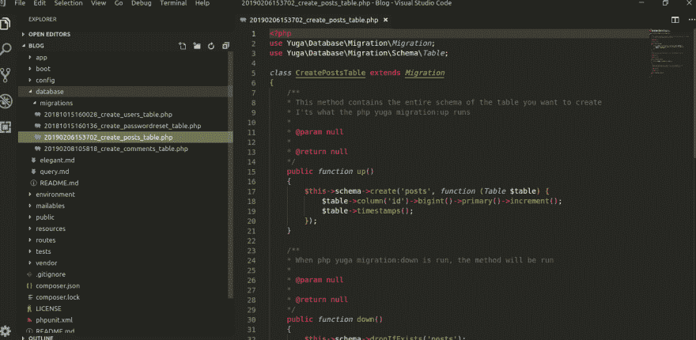
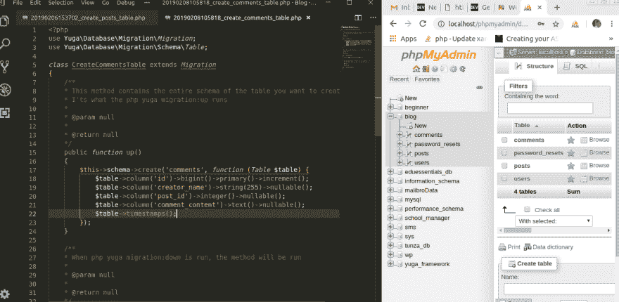
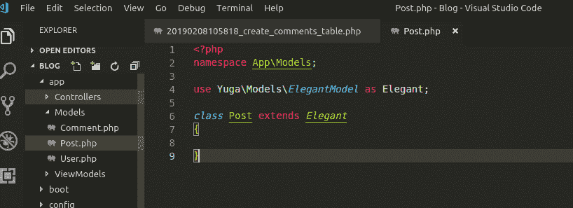
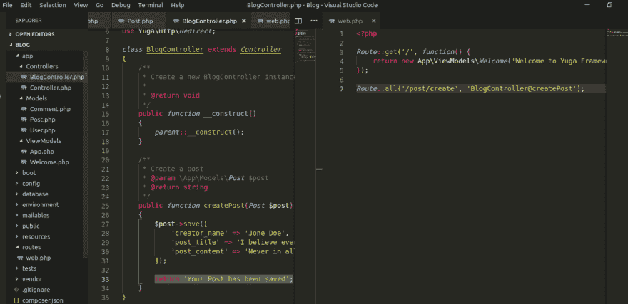
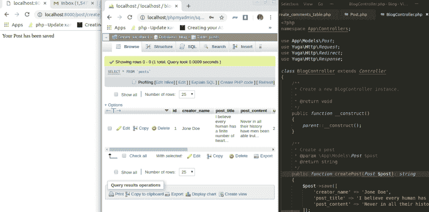

# yuga 入门-框架第 2 部分

> 原文：<https://dev.to/hsemix/getting-started-with-yuga-framework-part-2-40b8>

在今天的教程中，我将带你经历构建一个真正的博客应用程序所需的步骤，我相信你还记得我们的第一部分是建立一个环境。让我们先列出我们需要做的事情:

*   我们需要一个数据库
*   我们需要一张帖子表
*   我们需要一个评论表
*   我们需要一个提交帖子的表格(将在第 3 部分讨论)
*   我们需要一个页面来显示所有的职位(第 3 部分)
*   我们需要一个帖子评论机制(第 3 部分)
*   我们需要保存一个帖子/评论(现在我们将使用一个相当原始的方法)
*   我们需要在数据库中查询帖子和他们的评论

好吧，让我们结束这一切，好吗？

## 首先我们需要连接到一个数据库

宇迦集成了三个数据库驱动程序，默认的是 mysql，要改变我们的应用程序连接的数据库，我们需要定位一个文件`(environment/.env)`。这是保存大部分框架配置的文件。让我们将我们的数据库命名为`blog`
[](https://res.cloudinary.com/practicaldev/image/fetch/s--SIDVNYRY--/c_limit%2Cf_auto%2Cfl_progressive%2Cq_auto%2Cw_880/https://thepracticaldev.s3.amazonaws.com/i/dw08mpvvhnii4eqyu5xb.png)

## 现在让我们在数据库中创建表格

为了创建博客表，我们将使用 yuga 的迁移命令`php yuga migration:make`。
我们现在有两个表格，分别是**帖子**和**评论**

在终端中打开项目，然后键入

```
php yuga migration:make posts 
```

对注释做同样的操作，此时，你的数据库目录应该是这样的
[](https://res.cloudinary.com/practicaldev/image/fetch/s--EfH34ysl--/c_limit%2Cf_auto%2Cfl_progressive%2Cq_auto%2Cw_880/https://thepracticaldev.s3.amazonaws.com/i/xyzi2u7rxtb4kz8c5mt5.png)

### 让我们运行创建这两个表的命令

在我们在前面创建的数据库中创建表之前，我们需要弄清楚哪些字段需要转到每个表，即帖子和评论

*   帖子表
    *   身份证明（identification）
    *   创建者 _ 姓名
    *   帖子 _ 标题
    *   帖子 _ 内容
    *   创建日期
    *   更新数据
*   注释表
    *   身份证明（identification）
    *   创建者姓名，
    *   post_id
    *   评论 _ 内容
    *   创建日期
    *   更新数据

让我们将这些字段及其适当的数据类型放入我们刚刚创建的迁移中

现在，在您的终端中，输入以下命令

```
php yuga migration:up 
```

这个命令将创建表格，现在我们应该有下面的
[](https://res.cloudinary.com/practicaldev/image/fetch/s--xxWwd8LH--/c_limit%2Cf_auto%2Cfl_progressive%2Cq_auto%2Cw_880/https://thepracticaldev.s3.amazonaws.com/i/4cnrk27fs747ofqnsj8g.png)

## 模型为帖子表和评论表

现在我们已经创建了我们的表，我们需要一种方法以一种完美的方式与它们通信，幸运的是，yuga 附带了一个用于数据库操作的 **ORM** ，所以让我们创建 Post 模型和 Comment 模型。
注意:因为我们的表是**Post**和 **comments** ，这说明虽然我们的模型将分别是 **Post** 和 **Comment** 因为 yuga 转换了模型的类名并且**复数**和**小写**它，这就是它作为表(但可定制)。

这就是我们将用来**保存**和**从表中检索**数据的东西(**模型**

让我们再次使用 yuga 命令来完成这个任务，

```
php yuga make:model Post

php yuga make:model Comment 
```

[](https://res.cloudinary.com/practicaldev/image/fetch/s--x3prQCfN--/c_limit%2Cf_auto%2Cfl_progressive%2Cq_auto%2Cw_880/https://thepracticaldev.s3.amazonaws.com/i/dzglebkhvhs243fe5q9c.png)

## 保存我们发文表中的数据

为了与我们的表进行交互，我们需要一个最终代表我们调用控制器的路由。在控制器中，我们编写了将帖子保存到数据库的逻辑。
我们使用`php yuga make:controller BlogController`命令创建一个控制器。

让我们打开创建的控制器并创建一个名为`createPost`的方法。

现在让我们打开`routes/web.php`文件来创建我们的路线。这个文件有一个路由`/`，现在让我们添加另一个路由`/post/create`，我们将使用它来创建我们的博客文章。

```
// routes/web.php

Route::all('/post/create', 'BlogController@createPost'); 
```

[](https://res.cloudinary.com/practicaldev/image/fetch/s--0h_EBxEi--/c_limit%2Cf_auto%2Cfl_progressive%2Cq_auto%2Cw_880/https://thepracticaldev.s3.amazonaws.com/i/hkwy5aa8e7p71e0xjlus.png)

在控制器中

```
// app/Controllers/BlogController.php

public function createPost(Post $post): string
{
    $post->save([
        'creator_name' => 'Jone Doe',
        'post_title' => 'I believe every human has a finite number of heartbeats. I don\'t intend to waste any of mine.',
        'post_content' => 'Never in all their history have men been able truly to conceive of the world as one: a single sphere, a globe, having the qualities of a globe, a round earth in which all the directions eventually meet, in which there is no center because every point, or none, is center — an equal earth which all men occupy as equals. The airman\'s earth, if free men make it, will be truly round: a globe in practice, not in theory.',
    ]);
    return 'Your Post has been saved';
} 
```

当您访问[http://localhost:8000/post/create](http://localhost:8000/post/create)时，您必须得到以下结果

[](https://res.cloudinary.com/practicaldev/image/fetch/s--0alWUTaa--/c_limit%2Cf_auto%2Cfl_progressive%2Cq_auto%2Cw_880/https://thepracticaldev.s3.amazonaws.com/i/y8rixr7gpicnbpdov5ds.png)