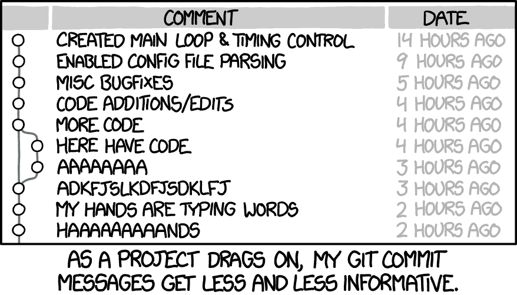
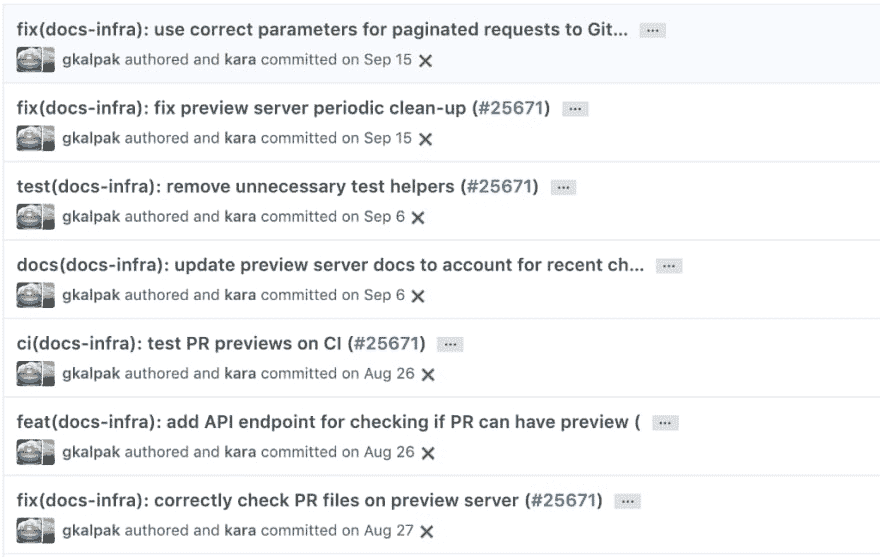

# Git 提交消息

> 原文：<https://dev.to/aibolik/git-commit-message-41c1>

很久以前我就想写这篇文章了，但是现在我才找到时间写它。我想涵盖每一个活跃的开发人员每天都要面对的事情，可能是每天 1 次到 10 次、20 次、30 次。所以我将讨论 **Git 提交消息**。

可能有很多文章涉及这个话题，无论如何我不想强迫我的观点应该如何处理，而是分享我从*看到这个领域的问题*、*寻找一些解决方案*和*在实践中应用它们*中获得的一些实践。

知识的主要来源是一家公司的[文章，该公司在 AngularJS 库中练习编写提交消息。这是他们的](https://anvilabs.co/blog/writing-practical-commit-messages/) [Git 提交消息约定](https://docs.google.com/document/d/1QrDFcIiPjSLDn3EL15IJygNPiHORgU1_OOAqWjiDU5Y/edit)。我会补充一些要点，并总结他们的信息。

### 识别问题

<figure>[](https://res.cloudinary.com/practicaldev/image/fetch/s--F-1T5ae1--/c_limit%2Cf_auto%2Cfl_progressive%2Cq_auto%2Cw_880/https://cdn-images-1.medium.com/max/878/1%2ARRAWy_etG4K1H-DSZ2W1fQ.png) 

<figcaption>*最差提交消息*</figcaption>

</figure>

如果你搜索*最差提交消息*，你可以找到很多例子。我希望你不要，但只要看看这里的。这些变化并不意味着已经做了什么。

<figure>[](https://res.cloudinary.com/practicaldev/image/fetch/s--BI6ut4T3--/c_limit%2Cf_auto%2Cfl_progressive%2Cq_auto%2Cw_880/https://cdn-images-1.medium.com/max/1024/1%2AaVH1MOHzgpBlTxftxW1lEw.png) 

<figcaption>*来自 Angular 项目的提交消息示例*</figcaption>

</figure>

但也有一些更好的消息，那些有意义的事情已经做了。然而，有时在它们中没有*上下文*——在那里应用了变更。当然，您可以看看发生了什么变化，但是只读取一行难道不比检查一堆发生变化的行更快吗？

所以，肯定有问题。我将分享一些我的建议，然后是一些我采纳了一些实践和修改了一些的资源。

### 采用了惯例

#### 使用编辑器，而不是 CLI

这可能很明显同时有点耗时，但是在一些编辑器中编写确实比在 CLI 中的`git commit -m "..."`之后在一行中编写更容易。

将其设置为您最喜欢的编辑器，但是请记住，一些视觉丰富的编辑器(如 VSCode)可能会有一些有用的插件，这些插件会提示一些最佳实践。

要更改 git 的默认编辑器配置，请编写以下命令:

`git config --global core.editor "code --wait"`

这将把 VSCode 设置为提交消息的默认编辑器。

> 注意:您应该将 VSCode 配置为从 CLI 运行。

另外，在 VSCode 中，您还会在`COMMIT_MSG`中看到作为注释的暂存文件，这些文件在原始提交中会被忽略。此外，还有一个内置插件，当你的提交消息太长时会显示出来。

#### 构建你的第一行

您可能已经看到了提交消息的一些结构。我建议你看一看 [AngularJS Git 提交消息约定](https://docs.google.com/document/d/1QrDFcIiPjSLDn3EL15IJygNPiHORgU1_OOAqWjiDU5Y/edit)。以下是主题行的要点:

*   您的提交消息应该由 3 部分组成

`<type>(<scope>): <subject>`

*   `<type>` -所做更改的类型。应该是以下之一:

    *   `feat` -一些功能开发
    *   `fix` -错误修复
    *   `docs` -文件的变更
    *   `style` -格式变更
    *   没有修复 bug 或实现特性的变更。简单重构
    *   `test` -测试的变更或新测试的增加
    *   `chore` -不影响代码的任何其他变更
*   `<scope>` -在这里你定义变化的范围。比如:featureA、buildConfig 或者任何你能想到的范围。

*   `<subject>` -撰写主题有不同的方法，但主要规则如下:

    *   使用祈使句和现在时。“修”不是“修”，“加”不是“加”。顺便说一下，Git 也将这种约定用于它自己的预格式化消息(“合并拉请求……”)。
    *   第一个字母不要大写
    *   不要添加点(。)在主题的末尾

起初可能很难保持这种风格，但你会习惯的。如果你在记住所有这些方面有困难，你可以使用图书馆来帮你。看一看[commit ize](http://commitizen.github.io/cz-cli/)。

> 有时，你可能想要更多类型的改变。在这种情况下，您可以随意添加更多，只要确保与团队协调并在某个地方记录即可。

#### 必要时添加消息正文和页脚

在某些情况下，您可能希望在提交消息中留下更多线索。为此，请使用消息体。它通常位于主题行之后，并由一个空行隔开。还应该遵循动词使用祈使时态的规则。

页脚通常被忽略，但在某些情况下，添加一些元信息会很有用。您可以使用它来提及*重大变更，并在您的问题跟踪器中列出它关闭的问题。例如:_ 关闭#132、#123* 。

以下是 AngularJS 项目的例子:

```
feat($browser): onUrlChange event (popstate/hashchange/polling)

Added new event to $browser:
- forward popstate event if available
- forward hashchange event if popstate not available
- do polling when neither popstate nor hashchange available

Breaks $browser.onHashChange, which was removed (use onUrlChange instead) 
```

Enter fullscreen mode Exit fullscreen mode

```
fix($compile): couple of unit tests for IE9

Older IEs serialize html uppercased, but IE9 does not...
Would be better to expect case insensitive, unfortunately jasmine does
not allow to user regexps for throw expectations.

Closes #392
Breaks foo.bar api, foo.baz should be used instea 
```

Enter fullscreen mode Exit fullscreen mode

### 结论

这些大多是建议，而不是严格的政策。您可能希望根据自己的需要调整这些实践。最后，它是你的项目，你的存储库，你的代码——建立你自己的指导方针并坚持下去。如果这篇文章是有帮助的，我达到了我的目标。感谢阅读！

#### 资源

*   [AnviLabs:编写实用的提交消息](https://anvilabs.co/blog/writing-practical-commit-messages/)
*   [AngularJS Git 提交消息约定](https://docs.google.com/document/d/1QrDFcIiPjSLDn3EL15IJygNPiHORgU1_OOAqWjiDU5Y/edit)
*   [Reddit 关于最坏提交消息的话题](https://www.reddit.com/r/ProgrammerHumor/comments/375fjr/whats_the_most_humorous_commit_message_youve_ever/)
*   [提交](http://commitizen.github.io/cz-cli/)
*   [关于 Git 提交消息的说明](https://tbaggery.com/2008/04/19/a-note-about-git-commit-messages.html)
*   [编写 Git 提交消息](http://365git.tumblr.com/post/3308646748/writing-git-commit-messages)