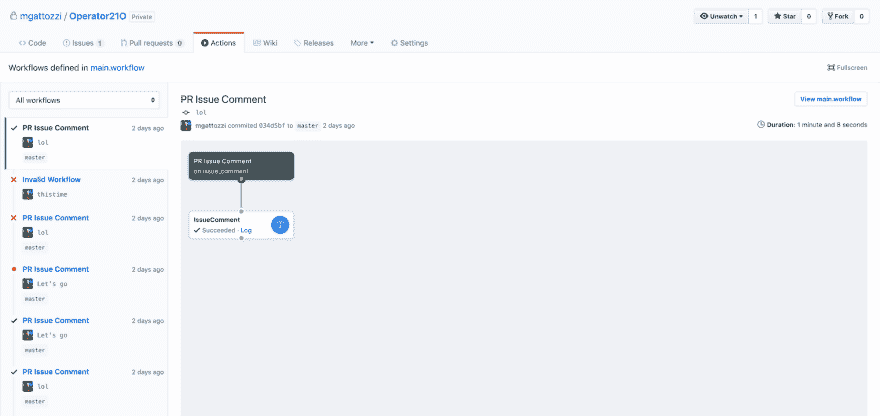
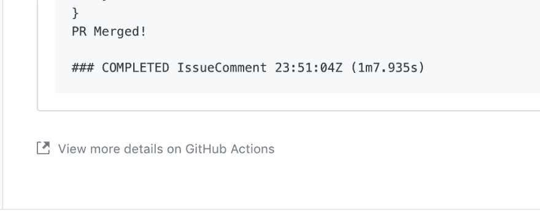

# GitHub Actions:介绍和第一印象

> 原文：<https://dev.to/mgattozzi/github-actions-an-introductory-look-and-first-impressions-299m>

[](https://res.cloudinary.com/practicaldev/image/fetch/s--NobEKqmR--/c_limit%2Cf_auto%2Cfl_progressive%2Cq_auto%2Cw_880/https://mgattozzi.com/conteimg/2018/12/Screen-Shot-2018-12-04-at-18.25.10.png)

我最近有幸获得了 GitHub 的 Actions 测试版。什么是 GitHub Actions？据该网站称，“通过 GitHub Actions，你可以自动完成从创意到生产的工作流程”。本质上，我们通过旋转 Docker 容器并运行它来运行响应 GitHub webhooks 的代码。这意味着我们几乎可以自动化您能想到的任何事情:

*   当你改变某个文件的版本号时，在 GitHub 中标记 release，构建静态二进制文件，并将它们推送到标记中
*   当某人的 PR 被合并，并且分支在你的回购上时，删除该分支
*   如果您将一个新的提交推送到 master，创建一个 Docker 容器，并将其标记为 latest，然后将其推送到容器注册中心。

这些只是你可以做的几件事。事实上，只要稍微知道如何使用 GitHub API、他们的 webhooks 和你自己的服务器，你就可以做到这一点。然而，并不是每个人都有这样做的基础设施或负担得起(应该注意的是，截至 2018 年 12 月 4 日，你只能使用私人回购行动，这是要花钱的，所以谁知道这是否会改变)。我个人希望 GitHub 能让开源代码免费，以降低 DevOps 的准入门槛和自动化程度。

这对 GitHub 目前的行动意味着什么？在您的代码中，您可以访问 webhooks、关于 repo 的详细信息、作用于 repo 以与 API 交互的 API 令牌，并且能够将多个操作链接在一起，还可以访问链接的操作之间的状态变化。这意味着您不需要设置整个服务器来运行操作。GitHub 会为您做这件事，并为您提供您需要的信息，以便您能够真正地为您的回购自动化决策。这样你就可以花更少的时间手工做事情，花更多的时间实际编码。

我将回顾一下我做过的一件小事，然后回顾一下我的体验，记住这是测试版软件，然后是一些最终结论。希望这能给你一个超越 [Hello World 示例](https://developer.github.com/actions/creating-github-actions/creating-a-new-action/)的起点。我们开始吧！

## 生锈的容器

任何关注我的人都知道我广泛使用 Rust，所以我也用它来编写我的回购工作流，但不要担心我所涵盖的内容仍然与您决定在 GitHub Actions 中使用的任何语言相关！真的，我想让你从这一部分中挑选一些:

*   了解 GitHub API
*   了解如何用动作设置容器(即环境变量)
*   理解行动的局限性

让我们看看我得到了什么工作。我一直想做一个像 Rust 的 bors 一样的自动化管理机器人。我把我的[称为](https://github.com/thearesia)，事实上这也是我开始写 [github-rs](https://github.com/mgattozzi/github-rs) 的最初原因。不可否认，我让这个项目停滞不前，因为我不喜欢维护，喜欢做奇怪的新东西。我创建了一个名为 Operator21O 的回购程序，以尼尔的同名角色命名:自动机(很容易成为我今年的前 3 名游戏之一，也是有史以来的前 10 名)。

到目前为止，它所做的是，如果一个所有者、组织成员或合作者在 PR 上说“r+”，它将自动合并它。对此有些警告；如果合并不是绿色的，它还没有被实现来处理。如果 Travis 仍在运行或合作者用他们的公关审查阻止了它，它将是红色的。不过那也没关系！这是一个伟大的第一步，仅此一点就给了我们很多工作和学习的机会！

让我们首先来看看 repo 根目录下的`.github`文件夹中的工作流文件:

```
workflow "PR Issue Comment" {
  resolves = "IssueComment"
  on = "issue_comment"
}

action "IssueComment" {
  uses = "./operator_issue_comment"
  secrets = ["GITHUB_TOKEN"]
} 
```

这是什么话？我们已经创建了一个名为`main.workflow`的文件，上面的文本就在其中。我们有一种叫做`PR Issue Comment`的工作流，我就是这样命名的。我们说它解决了`IssueComment`。这可以是我们实际上想要触发的一系列动作，但是我们在这里只使用一个。然后我们指定在哪个 GitHub webhook 上触发这个工作流。在这种情况下，我们说，“如果它是一个`issue_comment`事件，运行这个工作流。”整洁！工作流是我们的触发器，动作是随后发生的事情。我们这里只有一个动作，但是您可以将多个动作链接在一起，因此构建一个容器可以是一个动作，如果构建成功，下一个动作会将它推送到容器注册表中。

来看看我在这里写的动作。我把它命名为`IssueComment`。用途部分[可以是各种东西](https://developer.github.com/actions/creating-workflows/workflow-configuration-options/#using-a-dockerfile-image-in-an-action)；注册表中的容器，或者，在我的情况下，因为我想喂饱我的工作流，repo 中 docker 文件的路径。秘密字段可以包含秘密。[有关于如何处理这个](https://developer.github.com/actions/creating-workflows/storing-secrets/)的文件，但目前没有将其用于生产是它目前的状态。我在后来的文档中发现了这一点(我将在以后的综述中全面介绍)，但是如果您想将 API 请求的`GITHUB_TOKEN`作为 ENV 变量访问，您必须首先在 action 中指定它。

很好，我们有了工作流文件，让我们来看看我写的代码。下面是整个文件:

```
#[macro_use]
extern crate serde_derive;
extern crate serde;
extern crate serde_json;
extern crate reqwest;
extern crate http;

use std::{fs, env, process::exit, error::Error};
use reqwest::header;
use http::StatusCode;
fn main() {
    if let Err(e) = run() {
        eprintln!("{}", e);
        exit(1);
    }
}

fn run() -> Result<(), Box<Error>> {
    let event = serde_json::from_str::<IssueCommentEvent>(
        &fs::read_to_string(env::var("GITHUB_EVENT_PATH")?)?
    )?;

    let mut headers = header::HeaderMap::new();
    headers.insert(header::ACCEPT, header::HeaderValue::from_static("application/vnd.github.v3+json"));
    let client = reqwest::Client::builder()
        .build()?;

    let aa = &*event.issue.author_association;
    if aa == "COLLABORATOR" || aa == "OWNER" || aa == "MEMBER" {
        let cb = &*event.comment.body;
        if cb.contains("r+") {
            let hurl = &*event.issue.html_url;
            if hurl.contains("pull") {
                let rurl = &*event.issue.repository_url;
                let num = event.issue.number;
                let result = client
                    .put(&format!("{}/pulls/{}/merge", rurl,num))
                    .bearer_auth(&env::var("GITHUB_TOKEN")?)
                    .send()?
                    .status();

                if result == StatusCode::OK {
                    println!("PR Merged!");
                } else {
                    eprintln!("Unable to merge PR!");
                    exit(1);
                }
            } else {
                eprintln!("Can't r+ on an issue only a PR");
            }
        } else if cb.contains("r-") {
        }
    }
    Ok(())
}

#[derive(Serialize, Deserialize, Debug)]
struct Comment {
  author_association: String,
  body: String,
  created_at: String,
  html_url: String,
  id: i64,
  issue_url: String,
  node_id: String,
  updated_at: String,
  url: String,
  user: User,
}

#[derive(Serialize, Deserialize, Debug)]
struct Issue {
  assignee: Option<String>,
  assignees: Vec<String>,
  author_association: String,
  body: String,
  closed_at: Option<String>,
  comments: i64,
  comments_url: String,
  created_at: String,
  events_url: String,
  html_url: String,
  id: i64,
  labels: Vec<String>,
  labels_url: String,
  locked: bool,
  milestone: Option<String>,
  node_id: String,
  number: i64,
  repository_url: String,
  state: String,
  title: String,
  updated_at: String,
  url: String,
  user: User,
}

#[derive(Serialize, Deserialize, Debug)]
struct Repository {
  archive_url: String,
  archived: bool,
  assignees_url: String,
  blobs_url: String,
  branches_url: String,
  clone_url: String,
  collaborators_url: String,
  comments_url: String,
  commits_url: String,
  compare_url: String,
  contents_url: String,
  contributors_url: String,
  created_at: String,
  default_branch: String,
  deployments_url: String,
  description: String,
  downloads_url: String,
  events_url: String,
  fork: bool,
  forks: i64,
  forks_count: i64,
  forks_url: String,
  full_name: String,
  git_commits_url: String,
  git_refs_url: String,
  git_tags_url: String,
  git_url: String,
  has_downloads: bool,
  has_issues: bool,
  has_pages: bool,
  has_projects: bool,
  has_wiki: bool,
  homepage: Option<String>,
  hooks_url: String,
  html_url: String,
  id: i64,
  issue_comment_url: String,
  issue_events_url: String,
  issues_url: String,
  keys_url: String,
  labels_url: String,
  language: String,
  languages_url: String,
  license: Option<String>,
  merges_url: String,
  milestones_url: String,
  mirror_url: Option<String>,
  name: String,
  node_id: String,
  notifications_url: String,
  open_issues: i64,
  open_issues_count: i64,
  owner: User,
  private: bool,
  pulls_url: String,
  pushed_at: String,
  releases_url: String,
  size: i64,
  ssh_url: String,
  stargazers_count: i64,
  stargazers_url: String,
  statuses_url: String,
  subscribers_url: String,
  subscription_url: String,
  svn_url: String,
  tags_url: String,
  teams_url: String,
  trees_url: String,
  updated_at: String,
  url: String,
  watchers: i64,
  watchers_count: i64,
}

#[derive(Serialize, Deserialize, Debug)]
struct IssueCommentEvent {
  action: String,
  comment: Comment,
  issue: Issue,
  repository: Repository,
  sender: User,
}

#[derive(Serialize, Deserialize, Debug)]
struct User {
  avatar_url: String,
  events_url: String,
  followers_url: String,
  following_url: String,
  gists_url: String,
  gravatar_id: String,
  html_url: String,
  id: i64,
  login: String,
  node_id: String,
  organizations_url: String,
  received_events_url: String,
  repos_url: String,
  site_admin: bool,
  starred_url: String,
  subscriptions_url: String,
  #[serde(rename = "type")]
  _type: String,
  url: String,
} 
```

其中大部分只是反序列化代码的`struct`定义。我们关心的是这些`struct`代表了问题评论的网络钩子。顺便提一下，如果你不熟悉 GitHub 的 API，每个公关和问题都是一个问题。这就是为什么，比方说，如果你在一个新的回购中开了一个问题，这个问题编号为 1。如果你打开一个 PR，它的号码是 2。这一点很重要！

让我们来看看代码的开头:

```
#[macro_use]
extern crate serde_derive;
extern crate serde;
extern crate serde_json;
extern crate reqwest;
extern crate http;

use std::{fs, env, process::exit, error::Error};
use reqwest::header;
use http::StatusCode;
fn main() {
    if let Err(e) = run() {
        eprintln!("{}", e);
        exit(1);
    }
} 
```

这可能是我将写的最后一点非 Rust 2018 版代码，因为我想确保这在 stable 上工作，最新版本将于本周发布，这使其成为默认版本。在这里，我们进口一些外部板条箱。`serde`用于 JSON 的反序列化，`reqwest`用于简单的 http 请求，`http`用于 Rust 中各种 http 库中使用的所有类型。

我们用 use 语句导入一些类型和模块，然后使用我们的`main`函数。我们说，当我们从我们的`run`函数得到一个`Result`类型时，如果它是一个错误，在`stderr`上打印出来，然后用一个非零状态码退出！大部分代码都是标准的样板文件，我们希望编写这些文件来确保我们能够处理错误，并为我们的 Rust 程序打印出结果，但是我不假设谁正在阅读这篇文章。

现在我们已经完成了设置和键入代码，让我们来看看实际的逻辑。

```
fn run() -> Result<(), Box<Error>> {
    let event = serde_json::from_str::<IssueCommentEvent>(
        &fs::read_to_string(env::var("GITHUB_EVENT_PATH")?)?
    )?;

    let mut headers = header::HeaderMap::new();
    headers.insert(header::ACCEPT, header::HeaderValue::from_static("application/vnd.github.v3+json"));
    let client = reqwest::Client::builder()
        .build()?;

    let aa = &*event.issue.author_association;
    if aa == "COLLABORATOR" || aa == "OWNER" || aa == "MEMBER" {
        let cb = &*event.comment.body;
        if cb.contains("r+") {
            let hurl = &*event.issue.html_url;
            if hurl.contains("pull") {
                let rurl = &*event.issue.repository_url;
                let num = event.issue.number;
                let result = client
                    .put(&format!("{}/pulls/{}/merge", rurl,num))
                    .bearer_auth(&env::var("GITHUB_TOKEN")?)
                    .send()?
                    .status();

                if result == StatusCode::OK {
                    println!("PR Merged!");
                } else {
                    eprintln!("Unable to merge PR!");
                    exit(1);
                }
            } else {
                eprintln!("Can't r+ on an issue only a PR");
            }
        } else if cb.contains("r-") {
        }
    }
    Ok(())
} 
```

`run`有一个函数签名，上面写着“我会做一些事情，但为了表示一切顺利，返回一个单元类型(`()`)，但如果出错，它会将任何实现标准库的`Error`特征的类型返回给我”。这为我们处理各种板条箱的错误提供了灵活性。如果他们做对了，他们就会实现这个特性！

好的，接下来实际上是读取 webhook 文件。GitHub 将其存储在一个名为`GITHUB_EVENT_PATH`的 ENV 变量中。所以我们在这里查询它。`?`基本上是说，“如果这个函数的`Result`是一个错误，返回这个函数的错误，否则给我你从`Result`得到的值。”然后我们用它从磁盘中读取文件，并再次使用`?`说，“如果你不能读取抛出一个错误，否则给我文件的内容。”然后我们使用`from_str`将它反序列化为我们之前制作的`IssueCommentEvent`类型。如果这有效，那么`?`打开该值并将其存储在`event`中！

接下来，我们为这个程序中我们将向 API 发出的任何请求设置一些默认头，以创建将发出请求的`Client`。我们设置了一个头，告诉 GitHub API 我们只想使用`v3` REST API，而不是`GraphQL`版本。

接下来，我们引用一个名为`author_association`的字段，并将其存储在`aa`中。这主要是为了在这里进行比较而使用的一个较短的变量名，但也是为了让我不需要在每一个带`"`的字符串前面加上`&`，因此也就有了`&*`，但这完全是另一篇独立的博文。可以说，我们这样做是为了获取我们需要的价值。

然后我们想要检查它们是`OWNER`、`COLLABORATOR`还是`MEMBER`。我们不只是想要没有提交权限的人来合并东西，尽管有了`MEMBER`，粒度可以让他们没有写权限。然后我们检查评论中是否包含`r+`。然后我们检查`html_url`(是的，我知道我把它缩短为`hurl`，这是我有时对代码的感觉)看看它是否有`pull`。还记得我说过它们都是隐藏的问题吗？我们需要使用`html_url`来确定它是对拉取请求的评论还是对问题跟踪器中的问题的评论。`issue_url`不做这种区分。如果它是 PR 上的一个公共项，那么我们设置一个请求，用我们作为秘密添加的令牌在 PR 上进行合并。如果它工作，我们打印出来，如果它没有，我们打印出来，它没有，并退出一个非零退出代码。未来的工作将为此创建一个错误类型，并将其发送到顶层。

那么它实际运行时是什么样子的呢？

[](https://res.cloudinary.com/practicaldev/image/fetch/s--wIns9uQt--/c_limit%2Cf_auto%2Cfl_progressive%2Cq_auto%2Cw_880/https://mgattozzi.com/conteimg/2018/12/Screen-Shot-2018-12-04-at-18.21.20.png)

从日志文件中:

[](https://res.cloudinary.com/practicaldev/image/fetch/s--Ce1sTHjL--/c_limit%2Cf_auto%2Cfl_progressive%2Cq_auto%2Cw_880/https://mgattozzi.com/conteimg/2018/12/Screen-Shot-2018-12-02-at-18.53.31.png)

有用！希望这给了你一点如何让它工作的入门知识！

## 好的、坏的、丑的

让我们从坏的/丑陋的开始，因为我喜欢将消极保持在最低限度，而且我总的来说非常喜欢行动。这是一个测试版，所以我只希望它会随着时间的推移变得更好:

*   启动时间慢:启动一个容器可能需要半分钟。我认为 GitHub 会从使用像 [`firecracker`](https://github.com/firecracker-microvm/firecracker) 这样的东西中受益匪浅
*   构建、推送、运行、调试周期漫长而痛苦。如果有什么方法可以在本地模拟这种情况来减少这种情况，我绝对会喜欢的
*   没有流日志:我只能看到运行后的日志
*   动作选项卡似乎有点不稳定，感觉它可以有 3 个独立的子选项卡。这个很难描述，除非你用它。
*   医生们时好时坏。总的来说，它们很好，我用过的其他包/API 没有这么好的文档。然而，我更喜欢 JSON 有效负载的模式定义和示例。我有三个事件类型的例子中没有出现空字段。我觉得行动医生还有很长的路要走。你什么也做不了，这还不算太糟糕，但是你会四处乱跳，试图把事情搞清楚。例如，`GITHUB_TOKEN`看起来像是环境的一部分，如果你查看存储机密文档，但是直到你查看关于可用环境变量的文档，你才发现你必须将它添加到动作定义中才能访问它。如果你按顺序阅读文档，这没问题，但是我没有，所以我遇到了这个问题。重申这一点是好的，尽管是多余的。
*   能够在特性分支上测试工作流，这样我就不会一直被推着去做`master`了。如果已经是这样的话，我需要试验一下，但是如果是这样的话，医生根本不会提到它。
*   我很乐意看到这可以免费开源，但这需要钱，所以我真的不知道我们是否会看到。再说一次，目前仍仅限于私人回购。

这就是我真正的问题，我相信随着时间的推移，这些会变得更好。让我们来看看好的方面，因为行动总的来说令人印象深刻:

*   无服务器环境中的任意代码执行。仅仅是输入这些词就让我做噩梦，但是 GitHub 成功地将这些内容引入他们的产品，这给我留下了深刻的印象
*   我不必运行我自己的基础设施，这很好
*   视觉上能够看到动作是如何连接的是很棒的
*   能够将秘密存储到回购本身中并从操作中访问它们是很棒的，这有一种 GitOps 的氛围，我非常喜欢这种氛围
*   无论你想用什么语言，只要带一个 docker 文件或容器就行了
*   使用容器的缓存版本来减少重新构建的需要，仅在需要时才重新构建
*   共享工作流就像将文件解压缩到您的目录中一样简单。我想看到这就像从 Actions 应用程序商店中提取发布内容一样简单，以便在回购中使用
*   任意代码执行。说真的，这太酷了，你现在可以在一个地方管理一切。

让我印象深刻。我很兴奋地想看看还能做些什么。

## 结论

我们讨论了如何以更高级的方式开始使用 GitHub Actions，以及我对此事的想法。我希望看到更多的人看到这一点，因为它真的很酷。对于那些已经拥有它的人，祝你黑客生涯愉快！