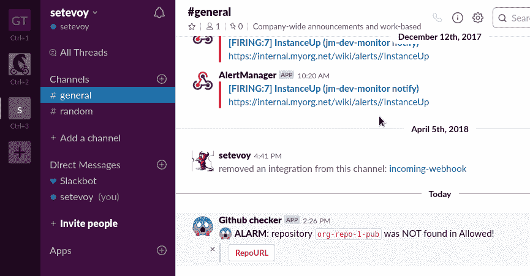

# Go:检查 Github 中的公共存储库列表。去切片比较。第一次 Golang 体验。

> 原文：<https://dev.to/setevoy/go-checking-public-repositories-list-in-github-go-slices-comparison-the-first-golang-experience-1ddm>

[](https://res.cloudinary.com/practicaldev/image/fetch/s--cxvuWL-R--/c_limit%2Cf_auto%2Cfl_progressive%2Cq_auto%2Cw_880/https://rtfm.co.ua/wp-content/uploads/2018/04/golang-color-icon2.png) 任务是编写一个工具，它将由一个 cron 从一个 Jenkin 的工作中启动，并将检查 Github 中一个组织的公共存储库列表。

Docker-image 构建和 Jenkins 作业在 [Jenkins:检查 Github 组织的公共存储库列表的作业](https://rtfm.co.ua/en/jenkins-a-job-to-check-a-github-organizations-public-repositories-list/)帖子中有描述。

然后，它必须将收到的存储库列表与预定义的允许存储库列表进行比较，如果它们不相等，则向空闲通道发送警报。

这样做的目的是为了防止开发人员不小心创建了一个公共存储库而不是私有存储库，或者将私有存储库更改为公共存储库，并获得关于此类问题的通知。

它可以用`bash`和`curl`编写，或者用`urllib`编写 Python 并直接使用 Github API，但我想获得一些围棋经验，所以我会使用它。

事实上——这是我第一个自己写的 Golang 代码，我用得不多，甚至不知道它的语法，但会尝试使用一些现有的 C/Python 知识，添加一些逻辑，当然还有谷歌的帮助，写一些可行的东西。

要使用 API Github，将使用 [`go-github`](https://github.com/google/go-github) 包。

我们开始吧。

添加导入，该功能是用 [`vim-go`](https://rtfm.co.ua/vim-prevrashhaem-redaktor-v-ide-plaginy-i-vot-eto-vot-vsyo/) 插件自动创建的:

```
import (
    "fmt"
    "github.com/google/go-github/github"
)

func main() {
    fmt.Println("vim-go")
} 
```

添加`$GOPATH` :

```
$ sudo mkdir /usr/local/go
$ sudo chown setevoy:setevoy /usr/local/go/
$ export GOPATH=/usr/local/go && export GOBIN=/usr/local/go/bin 
```

安装包:

```
$ go get
/home/setevoy/Scripts/Go/GTHB
./gitrepos.go:5:2: imported and not used: "github.com/google/go-github/github" 
```

### 从 Github 获取存储库列表

从包的[自述文件](https://github.com/google/go-github/blob/master/README.md)中复制并粘贴第一个例子，一个组织名称将从`$GITHUB_ORG_NAME`中取出，让我们试着得到一些东西。

设置变量:

```
$ export GITHUB_ORG_NAME="rtfmorg" 
```

和代码:

```
package main
import (
    "context"
    "fmt"
    "github.com/google/go-github/github"
)

func main() {
    client := github.NewClient(nil)
    opt := &github.RepositoryListByOrgOptions{Type: "public"}
    repos, _, _ := client.Repositories.ListByOrg(context.Background(), os.Getenv("GITHUB_ORG_NAME"), opt)
    fmt.Printf(repos)
} 
```

在最初的例子中，组织名称是硬编码的，但这里我们将从一个变量中获取，该变量将在 Jenkin 的作业中使用 [`os.Getenv`](https://golang.org/pkg/os/#Getenv) 进行设置。

添加`context`和`os`进口。

运行代码:

```
$ go run go-github-public-repos-checker.go
command-line-arguments
./go-github-public-repos-checker.go:17:15: cannot use repos (type []*github.Repository) as type string in argument to fmt.Printf 
```

呃…

好吧。

我原以为`client.Repositories.ListByOrg`会返回实际列表——仅仅是因为*列表中的*:-)

检查我们在`repos`对象中有什么数据类型。使用`reflect` :

```
package main
import (
    "os"
    "context"
    "fmt"
    "reflect"
    "github.com/google/go-github/github"
)
func main() {
    client := github.NewClient(nil)
    opt := &github.RepositoryListByOrgOptions{Type: "public"}
    repos, _, _ := client.Repositories.ListByOrg(context.Background(), os.Getenv("GITHUB_ORG_NAME"), opt)
    fmt.Println(reflect.TypeOf(repos).String())
} 
```

运行:

```
$ go run go-github-public-repos-checker.go
[]*github.Repository 
```

好……真的是 list ( `[]`)，显然指向了一个结构——`github.Repository`。

让我们检查一下`go doc` :

```
$ go doc github.Repository
type Repository struct {
ID               *int64           `json:"id,omitempty"`
NodeID           *string          `json:"node_id,omitempty"`
Owner            *User            `json:"owner,omitempty"`
Name             *string          `json:"name,omitempty"`
FullName         *string          `json:"full_name,omitempty"`
Description      *string          `json:"description,omitempty"`
... 
```

是的——这是结构，我们也看到了它的所有领域。

要禁用导入且未使用的 Go 的*:【反射】*消息–将其设置为`_reflect` :

```
package main
import (
    "os"
    "context"
    "fmt"
    _"reflect"
    "github.com/google/go-github/github"
)
func main() {
    client := github.NewClient(nil)
    opt := &github.RepositoryListByOrgOptions{Type: "public"}
    repos, _, _ := client.Repositories.ListByOrg(context.Background(), os.Getenv("GITHUB_ORG_NAME"), opt)
    for _, repo := range repos {
        fmt.Printf("Repo: %s\n", *repo.Name)
    }
} 
```

在这里，我们从`repos`列表中获取一个元素的 ID 和它的值。

也可以添加 ID:

```
...
    for id, repo := range repos {
        fmt.Printf("%d Repo: %s\n", id, *repo.Name)
    }
... 
```

```
$ go run go-github-public-repos-checker.go
0 Repo: org-repo-1-pub
1 Repo: org-repo-2-pub 
```

### 比较 Go 中的列表

现在需要添加另一个列表来保存 Github 中的库列表。

允许成为公共存储库将在由空格分隔的列表视图中从 Jenkins 传递:

```
$ export ALLOWED_REPOS="1 2" 
```

#### 尝试一号

创建`string`类型的`allowedRepos`，并在其中保存允许的公共存储库列表:

```
...
    allowedRepos := []string{os.Getenv("ALLOWED_REPOS")}
    for id, repo := range repos {
        fmt.Printf("%d Repo: %s\n", id, *repo.Name)
    }
    fmt.Printf("Allowed repos: %s\n", allowedRepos) 
... 
```

但是有一个问题，是我后来开始比较列表时遇到的。很快就会看到。

运行代码:

```
$ go run go-github-public-repos-checker.go
0 Repo: org-repo-1-pub
1 Repo: org-repo-2-pub
Allowed repos: [1 2] 
```

好的——它起作用了。

现在需要检查两个存储库列表——`repos`和来自 Github 和`allowedRepos`的存储库。

第一个解决方案如下:

```
...
    allowedRepos := []string{os.Getenv("ALLOWED_REPOS")}
    fmt.Printf("Allowed repos: %s\n", allowedRepos)
    for id, repo := range repos {
        for _, i := range allowedRepos {
            if i == *repo.Name {
                fmt.Printf("Index: %d, repo %s found in Allowed as %s\n", id, *repo.Name, i)
            } else {
                fmt.Printf("ALARM: repo %s was NOT found in Allowed!\n", *repo.Name)
            }
        }
    }
... 
```

运行:

```
$ go run go-github-public-repos-checker.go
Allowed repos: [1 2]
ALARM: repo org-repo-1-pub was NOT found in Allowed!
ALARM: repo org-repo-2-pub was NOT found in Allowed! 
```

看起来有用吗？

名称为 *1* 和 *2* 的存储库！= *org-repo-1-pub* 和 *org-repo-2-pub* 。

但是，当我进行“回溯检查”时，也就是当我用真实的名字设置`$ALLOWED_REPOS`以获得 OK 结果:
时，可能对一些读者来说已经很明显的问题出现了

```
$ export ALLOWED_REPOS="org-repo-1-pub org-repo-2-pub" 
```

检查:

```
$ go run go-github-public-repos-checker.go
Allowed repos: [org-repo-1-pub org-repo-2-pub]
ALARM: repo org-repo-1-pub was NOT found in Allowed!
ALARM: repo org-repo-2-pub was NOT found in Allowed! 
```

*又为什么*？

因为在`allowedRepos`中，我们没有链表，也就是[切片并运行](https://blog.golang.org/go-slices-usage-and-internals)——只有一个字符串。

让我们添加`i`变量的输出和索引号:

```
...
    for r_id, repo := range repos {
        for a_id, i := range allowedRepos {
            fmt.Printf("ID: %d Type: %T Value: %s\n", a_id, allowedRepos, i)
            if i == *repo.Name {
                fmt.Printf("Index: %d, repo %s found in Allowed as %s\n", r_id, *repo.Name, i)
            } else {
                fmt.Printf("ALARM: repo %s was NOT found in Allowed!\n", *repo.Name)
            }
        }
    }
... 
```

检查:

```
$ go run go-github-public-repos-checker.go
Allowed repos: [org-repo-1-pub org-repo-2-pub]
ID: 0 Type: []string Value: org-repo-1-pub org-repo-2-pub
ALARM: repo org-repo-1-pub was NOT found in Allowed!
ID: 0 Type: []string Value: org-repo-1-pub org-repo-2-pub
ALARM: repo org-repo-2-pub was NOT found in Allowed! 
```

`allowedRepos`实际上是一个列表，但是只有一个 *0* 元素，它保存了"*org-repo-1-pub org-repo-2-pub*"值。

#### 第二次尝试

要使这个工作——需要将`allowedRepos`转换成一个真实的列表。

让我们使用 [`strings`](https://golang.org/pkg/strings/) 包:

```
...
    // allowedRepos := []string{os.Getenv("ALLOWED_REPOS")}                                                                                                                                                     
    allowedRepos := strings.Fields(os.Getenv("ALLOWED_REPOS"))
    fmt.Printf("Allowed repos: %s\n", allowedRepos)

    for r_id, repo := range repos {
        for a_id, i := range allowedRepos {
            fmt.Printf("ID: %d Type: %T Value: %s\n", a_id, allowedRepos, i)
            if i == *repo.Name {
                fmt.Printf("Index: %d, repo %s found in Allowed as %s\n", r_id, *repo.Name, i)
            } else {
                fmt.Printf("ALARM: repo %s was NOT found in Allowed!\n", *repo.Name)
            }
        }
    }
... 
```

`allowedRepos`现在会被 [`strings.Fields()`](https://golang.org/pkg/strings/#Fields) 填满。

检查结果:

```
$ go run go-github-public-repos-checker.go
Allowed repos: [org-repo-1-pub org-repo-2-pub]
ID: 0 Type: []string Value: org-repo-1-pub
Index: 0, repo org-repo-1-pub found in Allowed as org-repo-1-pub
ID: 1 Type: []string Value: org-repo-2-pub
ALARM: repo org-repo-1-pub was NOT found in Allowed!
ID: 0 Type: []string Value: org-repo-1-pub
ALARM: repo org-repo-2-pub was NOT found in Allowed!
ID: 1 Type: []string Value: org-repo-2-pub
Index: 1, repo org-repo-2-pub found in Allowed as org-repo-2-pub 
```

好的——现在好多了，但这也不会起作用，因为每个`repos`的元素与每个`allowedRepos`的元素进行比较，会产生一些“假阳性”结果。

#### 尝试三次

让我们重写它，现在让我们尝试使用一个`repo`的索引从`allowedRepos` :
中选择一个元素

```
...
    for r_id, repo := range repos {
        fmt.Printf("%d %s\n", r_id, *repo.Name)
        if *repo.Name != allowedRepos[r_id] {
            fmt.Printf("ALARM: repo %s was NOT found in Allowed!\n", *repo.Name)
        } else {
            fmt.Printf("Repo %s found in Allowed\n", *repo.Name)
        }
    }
... 
```

也就是说，我们从`repos`获取一个元素的 ID，然后用相同的 ID 检查`allowedRepos`的元素。

运行:

```
$ go run go-github-public-repos-checker.go
Allowed repos: [org-repo-1-pub org-repo-2-pub]
0 org-repo-1-pub
Repo org-repo-1-pub found in Allowed
1 org-repo-2-pub
Repo org-repo-2-pub found in Allowed 
```

不错！

但是另一个问题现在可能会发生…

如果两个列表中的顺序不同，该怎么办？

设置代替:

```
$ export ALLOWED_REPOS="org-repo-1-pub org-repo-2-pub" 
```

逆序存储库名称:

```
$ export ALLOWED_REPOS="org-repo-2-pub org-repo-1-pub" 
```

检查:

```
$ go run go-github-public-repos-checker.go
Allowed repos: [org-repo-2-pub org-repo-1-pub]
0 org-repo-1-pub
ALARM: repo org-repo-1-pub was NOT found in Allowed!
1 org-repo-2-pub
ALARM: repo org-repo-2-pub was NOT found in Allowed! 
```

哦！

#### 尝试次数四

下一个想法是使用`reflect`模块及其 [`DeepEqual()`](https://golang.org/pkg/reflect/#DeepEqual) 函数。

再添加一个名为`actualRepos`的列表，将取自 Github 的库与 [`append`](https://tour.golang.org/moretypes/15) 一起添加，然后比较它们:

```
...
    allowedRepos := strings.Fields(os.Getenv("ALLOWED_REPOS"))
    var actualRepos []string
    for _,  repo := range repos {
        actualRepos = append(actualRepos, *repo.Name)
    }
    fmt.Printf("Allowed: %s\n", allowedRepos)
    fmt.Printf("Actual: %s\n", actualRepos)
    fmt.Println("Slice equal: ", reflect.DeepEqual(allowedRepos, actualRepos))
... 
```

运行:

```
$ go run go-github-public-repos-checker.go
Allowed: [org-repo-2-pub org-repo-1-pub]
Actual: [org-repo-1-pub org-repo-2-pub]
Slice equal:  false 
```

还是不行…尽管如果恢复订单，它会起作用:

```
$ export ALLOWED_REPOS="org-repo-1-pub org-repo-2-pub"
$ go run go-github-public-repos-checker.go
Allowed: [org-repo-1-pub org-repo-2-pub]
Actual: [org-repo-1-pub org-repo-2-pub]
Slice equal:  true 
```

因此，需要返回到循环的变体，但要检查整个`allowedRepos`列表中`repo`的值，只有当它不存在时才创建一个警报。

#### 尝试五次

接下来的解决方案是:创建一个专用函数，该函数将检查循环中的所有`allowedRepos`元素，如果找到值，将返回`true`，否则返回`false`。然后，我们可以在`main()`的循环中使用它。

让我们试试。

创建一个`isAllowedRepo()`函数，它将接受两个参数——要检查的存储库名称和允许的存储库列表，并将返回一个布尔值:

```
...
func isAllowedRepo(repoName string, allowedRepos []string) bool {
    for _, i := range allowedRepos {
        if i == repoName {
            return true
        }
    }
    return false
}
... 
```

然后在`main()`中–对所有`repos`的元素运行一个循环，将它们一个接一个地传递给`isAllowedRepo()`，然后打印一个结果:

```
...
    for _, repo := range repos {
        fmt.Printf("Checking %s\n", *repo.Name)
        fmt.Println(isAllowedRepo(*repo.Name, allowedRepos))
    }
... 
```

我们来测试一下。

首先，按初始顺序恢复允许的存储库列表:

```
$ export ALLOWED_REPOS="org-repo-1-pub org-repo-2-pub"
go run go-github-public-repos-checker.go
Checking org-repo-1-pub
true
Checking org-repo-2-pub
true 
```

很好！

并颠倒顺序:

```
$ export ALLOWED_REPOS="org-repo-2-pub org-repo-1-pub"
$ go run go-github-public-repos-checker.go
Checking org-repo-1-pub
true
Checking org-repo-2-pub
true 
```

仍然有效…

现在删除一个允许的存储库:

```
$ export ALLOWED_REPOS="org-repo-2-pub"
go run go-github-public-repos-checker.go
Checking org-repo-1-pub
false
Checking org-repo-2-pub
true 
```

太好了！

现在，当我们得到`false`时，我们可以发出警报。

全部代码。留下“原样”只是为了历史:

```
package main
import (
    "os"
    "context"
    "fmt"
    _"reflect"
    "strings"
    "github.com/google/go-github/github"
)
func isAllowedRepo(repoName string, allowedRepos []string) bool {
    for _, i := range allowedRepos {
        if i == repoName {
            return true
        }
    }
    return false
}
func main() {
    client := github.NewClient(nil)
    opt := &github.RepositoryListByOrgOptions{Type: "public"}
    repos, _, _ := client.Repositories.ListByOrg(context.Background(), os.Getenv("GITHUB_ORG_NAME"), opt)
    // allowedRepos := []string{os.Getenv("ALLOWED_REPOS")}
    allowedRepos := strings.Fields(os.Getenv("ALLOWED_REPOS"))
//  var actualRepos []string
/*
    for _,  repo := range repos {
        actualRepos = append(actualRepos, *repo.Name)
    }
    fmt.Printf("Allowed: %s\n", allowedRepos)
    fmt.Printf("Actual: %s\n", actualRepos)
    fmt.Println("Slice equal: ", reflect.DeepEqual(allowedRepos, actualRepos))
*/
    for _, repo := range repos {
        fmt.Printf("Checking %s\n", *repo.Name)
        fmt.Println(isAllowedRepo(*repo.Name, allowedRepos))
    }
/*
    for r_id, repo := range repos {
        for _, i := range allowedRepos {
            fmt.Printf("Checking %s and %s\n", *repo.Name, i)
            if i == *repo.Name {
                fmt.Printf("Index: %d, repo %s found in Allowed as %s\n", r_id, *repo.Name, i)
                break
            } else {
                fmt.Printf("ALARM: repo %s was NOT found in Allowed!\n", *repo.Name)
            }
        }
    }
*/
/*
    for r_id, repo := range repos {
        fmt.Printf("%d %s\n", r_id, *repo.Name)
        if *repo.Name != allowedRepos[r_id] {
            fmt.Printf("ALARM: repo %s was NOT found in Allowed!\n", *repo.Name)
        } else {
            fmt.Printf("Repo %s found in Allowed\n", *repo.Name)
        }
    }
*/
/*
    for r_id, repo := range repos {
        for a_id, i := range allowedRepos {
            fmt.Printf("ID: %d Type: %T Value: %s\n", a_id, allowedRepos, i)
            if i == *repo.Name {
                fmt.Printf("Index: %d, repo %s found in Allowed as %s\n", r_id, *repo.Name, i)
            } else {
                fmt.Printf("ALARM: repo %s was NOT found in Allowed!\n", *repo.Name)
            }
        }
    }
*/
} 
```

### 戈朗懈

最后，添加一个延迟通知。

这里用 [`ashwanthkumar/slack-go-webhook`](https://github.com/ashwanthkumar/slack-go-webhook) 。

配置 Slack 的 WebHook，获取它的 URL。

添加一个新的`sendSlackAlarm()`函数，它将接受两个参数——存储库名称及其 URL:

```
...
func sendSlackAlarm(repoName string, repoUrl string) {
    webhookUrl := os.Getenv("SLACK_URL")
    text := fmt.Sprintf(":scream: ALARM: repository *%s* was NOT found in Allowed!", repoName)
    attachment := slack.Attachment{}
    attachment.AddAction(slack.Action{Type: "button", Text: "RepoURL", Url: repoUrl, Style: "danger"}) 
    payload := slack.Payload{
        Username:    "Github checker",
        Text:        text,
        Channel:     os.Getenv("SLACK_CHANNEL"),
        IconEmoji:   ":scream:",
        Attachments: []slack.Attachment{attachment},
    }
    err := slack.Send(webhookUrl, "", payload)
    if len(err) > 0 {
        fmt.Printf("error: %s\n", err)
    }
}
... 
```

如果`isAllowedRepo()`返回`false` :
，则将`sendSlackAlarm()`执行加到`main()`

```
...
    for _, repo := range repos {
        fmt.Printf("\nChecking %s\n", *repo.Name)
        if isAllowedRepo(*repo.Name, allowedRepos) {
            fmt.Printf("OK: repo %s found in Allowed\n", *repo.Name)
        } else {
            fmt.Printf("ALARM: repo %s was NOT found in Allowed!\n", *repo.Name)
            sendSlackAlarm(*repo.Name, *repo.HTMLURL)
        }
    }
... 
```

`repo.HTMLURL`我们从`go doc github.Repository`中发现。

添加`$SLACK_URL`和`$SLACK_CHANNEL`环境变量:

```
$ export SLACK_URL="https://hooks.slack.com/services/T1641GRB9/BA***WRE"
$ export SLACK_CHANNEL="#general" 
```

按相反顺序恢复完整的存储库列表:

```
$ export ALLOWED_REPOS="org-repo-2-pub org-repo-1-pub" 
```

检查:

```
$ go run go-github-public-repos-checker.go
Checking org-repo-1-pub
OK: repo org-repo-1-pub found in Allowed
Checking org-repo-2-pub
OK: repo org-repo-2-pub found in Allowed 
```

好吧…

允许删除一个:

```
$ export ALLOWED_REPOS="org-repo-2-pub" 
```

再次检查:

```
$ go run go-github-public-repos-checker.go
Checking org-repo-1-pub
ALARM: repo org-repo-1-pub was NOT found in Allowed!
Checking org-repo-2-pub
OK: repo org-repo-2-pub found in Allowed 
```

和时差通知:

[](https://rtfm.co.ua/wp-content/uploads/2019/04/Screenshot_20190413_142710.png)

完成了。

该脚本可在[*setevoy-tools*](https://github.com/setevoy2/setevoy-tools/blob/master/go-github-public-repos-checker/go-github-public-repos-checker.go)Github 资源库中获得。

### 类似的帖子

*   <small>04/08/2019</small> [Atom:有用插件](https://dev.to/setevoy/atom-useful-plugins-179b) <small>(0)</small>
*   <small>02/12/2019</small> [Golang:无法识别的导入路径“math/bits”(导入路径不以主机名开头)](https://rtfm.co.ua/golang-unrecognized-import-path-math-bits-import-path-does-not-begin-with-hostname/) <small>(0)</small>
*   <small>2019 年 4 月 2 日</small>[【golang:执行中】【儿基会】、【2】【CLI】](https://rtfm.co.ua/golang-go-in-practice-zametki-na-polyax-chast-2-cli-prilozhenie-na-go/)