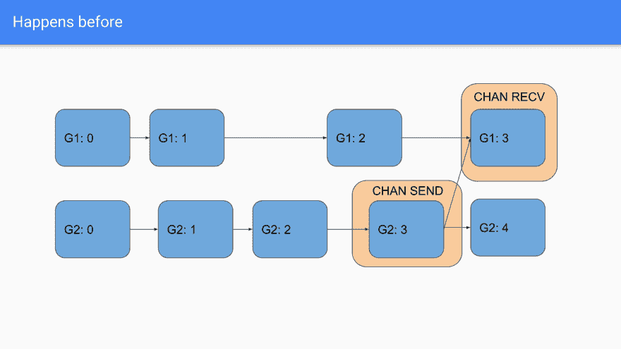
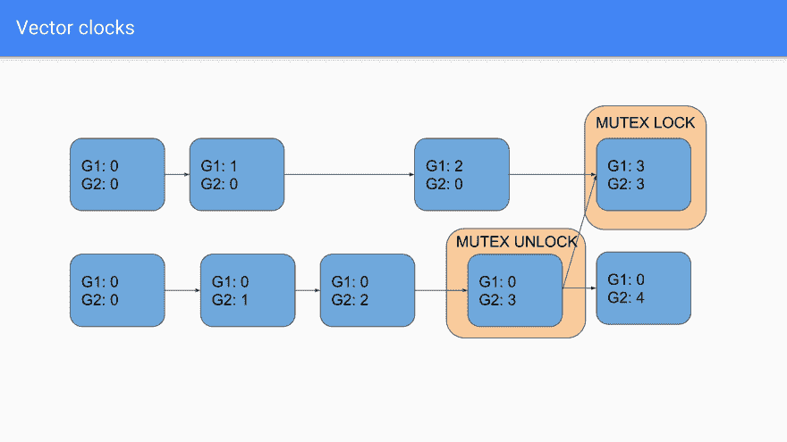
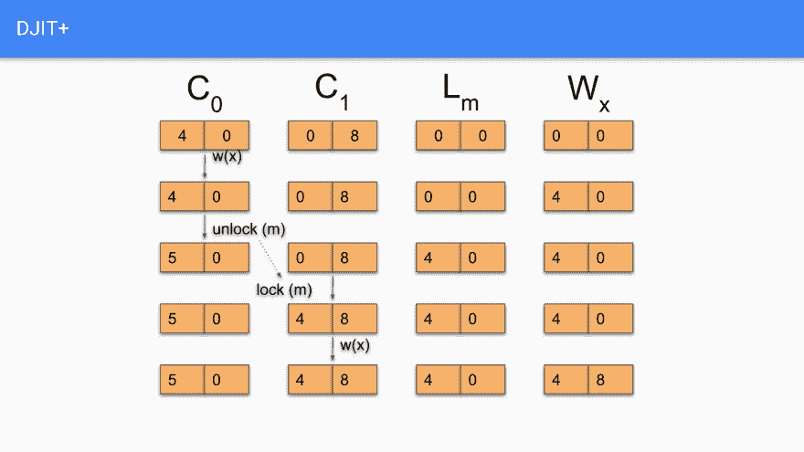
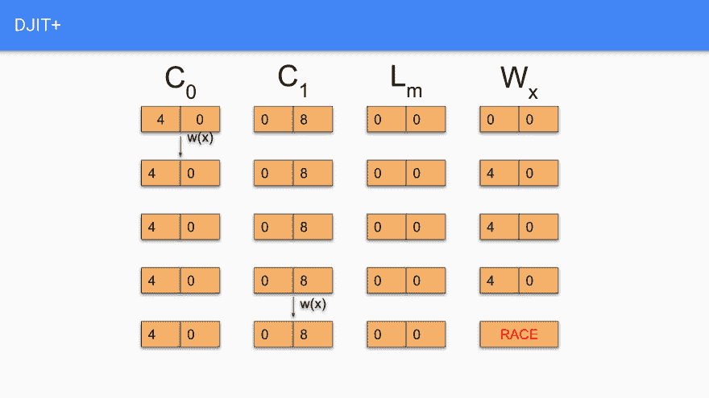
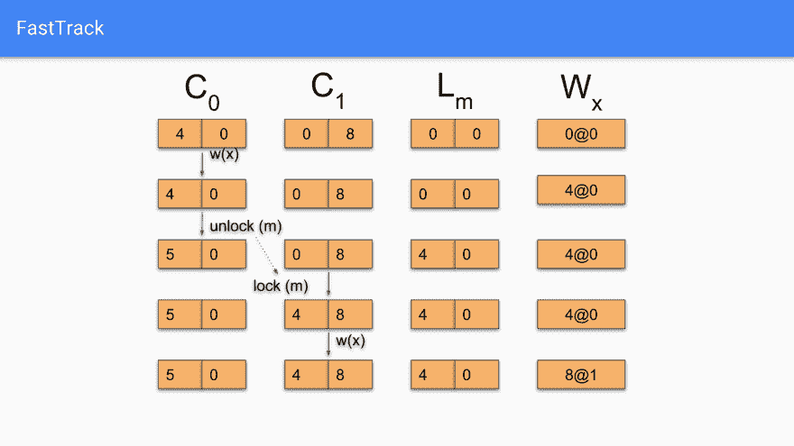
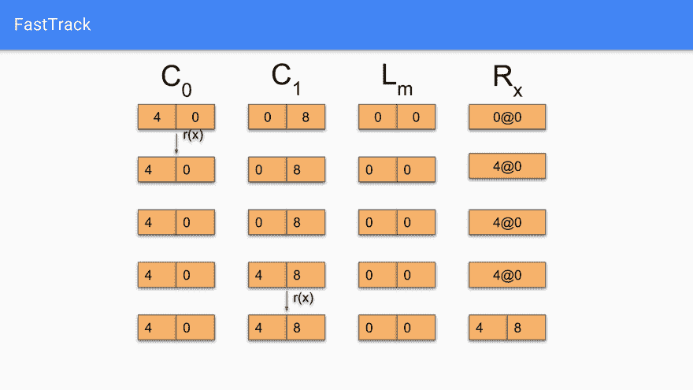
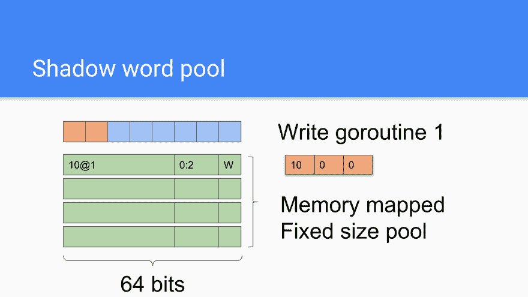
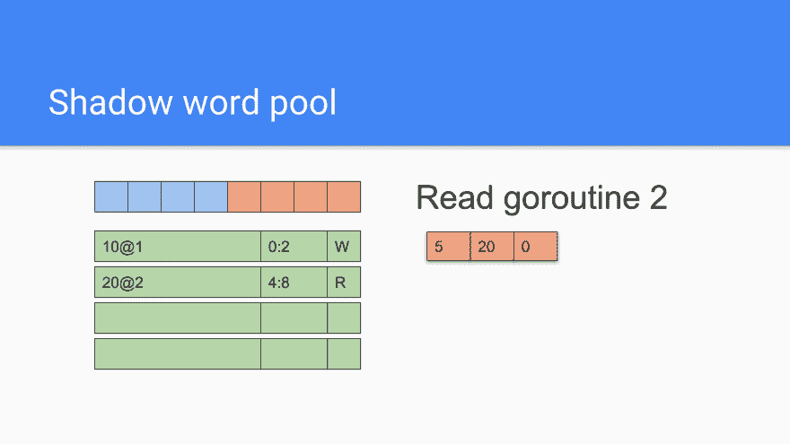
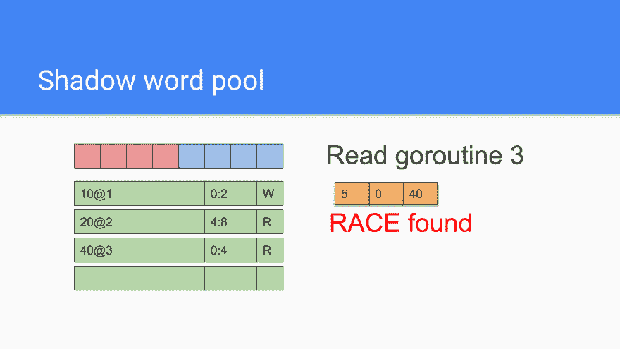

# Golang 种族检测

> 原文：<https://dev.to/nmiculinic/golang-race-detection-3j5h>

竞争条件是非常讨厌的错误。难以追踪、复制和隔离；通常发生在不寻常的情况下，并经常导致难以调试的问题。因此，最好及早预防和检测它们。幸运的是，有一个现成的算法可以应对这一挑战——thread sanitizer v2，这是一个在 Go、Rust、C & C++中支持编译器的久经考验的库。

首先，让我们展示一个典型的竞争条件。我们有一个简单的全局计数变量:

```
var Cnt int 
```

我们计算事件发生的次数，无论是计算 HTTP 请求，喜欢或 tinder 匹配的数量都是无关紧要的。相关的是我们如何去做。我们调用函数`Run` :

```
fun Run(amount int) {
  for i := 0; i < amount; i++ {
    Cnt++
  }
} 
```

但这还不是全部。我们从多个 goroutines 调用它:

```
func main() {
    wg := &sync.WaitGroup{}
    for i := 0; i < 10; i++ {
        wg.Add(1)
        go func() {
      defer wg.Done()
            Run(1000)
        }()
    }
  wg.Wait(); 
  fmt.Println(Cnt)
} 
```

我们期望我们的结果是`10000`。然而，这不太可能发生在多核多线程系统上。您很可能得到像`5234`第一次运行、`1243`第二次运行、甚至`1521`最后一次运行这样的结果，而没有任何确定性或可重复性。这是典型的数据赛跑！

让我们不要停留在这个玩具例子上。相反，让我们评估一些具有严重后果的著名的真实世界的竞态条件。

# 著名的例子

## DirtyCOW

这是 Linux 内核中的一个竞争条件。它涉及一个棘手的内存页面相互作用，`mmap`和`madvise`系统调用，允许特权升级利用。也就是说，您可以`mmap` root 拥有的文件写时复制，这是一个有效的操作(对这个`mmap`ed 区域的每一次写入都不应写入底层文件)，然而在某些情况下，写入会传播到底层文件，尽管我们是一个非特权用户。

进一步的[信息](https://dirtycow.ninja/)

## Therac-25

另一个著名的例子是 Therac-25 放疗机。它在机器设置和显示器设置之间有一个竞争条件。如果用户键入指令太快，并很快改变它们，机器可能会以最大辐射剂量结束，同时向操作者显示错误信息。这导致了多起事故和死亡案例。
进一步的[信息](https://hownot2code.com/2016/10/22/killer-bug-therac-25-quick-and-dirty/)

# 定义

在继续之前，让我们简单地重复一下所需的定义:

**竞态条件** -竞态条件是指当设备或系统试图同时执行两个或更多操作时出现的不良情况，但由于设备或系统的性质，这些操作必须按照正确的顺序正确执行

由于一般的竞争条件范围，并且需要领域知识理解什么是*正确的*行为，对于这篇文章的其余部分，我们将重点关注数据竞争，更狭窄和客观的定义。

**数据竞争** -对一个内存位置的并发访问，其中一个是写操作

**并发访问**——是一种事件顺序未知的访问。没有关系

发生在关系需要进一步解释之前。每个 goroutine 都有自己的逻辑时钟。它在每次操作时递增。在每个 goroutine 中，都有严格排序，事件按顺序发生(或者至少我们观察到它们好像是按顺序发生的，各种编译器优化/无序执行可能会干扰它们)。在 goroutines 之间，没有顺序，除非它们之间同步。

在下图中，您可以看到它的可视化描述。`happens before`用箭头突出显示关系。我想提醒一下`happens before`关系是传递的。

[](https://res.cloudinary.com/practicaldev/image/fetch/s--4yC3Q3PW--/c_limit%2Cf_auto%2Cfl_progressive%2Cq_auto%2Cw_880/https://i.imgur.com/xEPLaT2.png)

# 常见错误

我们来观察一下围棋程序中的几个常见错误。这些例子在其他主要语言中有类似的对等物，因为我很喜欢它，所以它在 Go 中。

## 在循环计数器上赛跑

```
func main() {
    var wg sync.WaitGroup
    wg.Add(5)
    for i := 0; i < 5; i++ {
        go func() {
            fmt.Println(i) // Not the 'i' you are looking for.
            wg.Done()
        }()
    }
    wg.Wait()
} 
```

试试看。根据事件的顺序，您可能会得到`0 4 4 4 4`作为输出。当然不是你所期望的输出。修复非常简单:

```
func main() {
    var wg sync.WaitGroup
    wg.Add(5)
    for i := 0; i < 5; i++ {
        go func(j int) {
            fmt.Println(j)
            wg.Done()
        }(i)
    }
    wg.Wait()
} 
```

## 未受保护的全局

这个类似于介绍性的例子:

```
var Cnt int
func Inc(amount int) {
    Cnt += amount
}

func main() {
    go Inc(10)
    go Int(100)
} 
```

解决方案是同步访问全局`Cnt`变量，因为增量操作不是原子的(除非来自`sync/atomic`包)。

因此我们使用一个互斥:

```
var Cnt int
var m = &sync.Mutex{}
func Inc(amount int) {
    m.Lock()
    defer m.Unlock()
    Cnt += amount
} 
```

或者原子变量:

```
var Cnt int64
func Inc(amount int64) {
    atomic.AddInt64(&Cnt, amount)
} 
```

## 违反围棋记忆模式

Go memory [model](https://golang.org/ref/mem) 指定了编译器对你的保证。如果你违反合同，你就要倒霉了。编译器可以随意优化你的代码，或者用它做一些不可预知的事情。

```
var a string
var done bool

func setup() {
    a = "hello, world"
    done = true
}
func main() {
    go setup()
    for !done {
    }
    fmt.Print(a)
} 
```

在这个例子中，go 的内存模型不保证在一个 goroutine 中完成的写入对其他 go routine 可见，因为它们之间没有同步。编译器也可以自由优化:

```
for !done {} 
```

到一个更简单的构造中，而不是每次迭代都加载 done 变量。此外，无法保证 CPU 内核和 L1 缓存之间的内存缓冲区会在对 done 变量的并发读取之间刷新。这都是因为无序执行的复杂性和跨架构的各种内存保证。例如，x86 在汇编代码上比 ARM 架构有更强的内存保证。

## 同步原语

在 Go 中，我们有以下同步原语:

*   通道，即发送和接收是一个同步点
*   同步包
    *   互斥（体）…
    *   原子学

要了解更多细节，请查阅这些信息，它们不是围棋或种族检测的独有概念。重要的一点是它们发生在程序代码排序之前。

# 检测竞争条件

在 Go 中，这只是用`-race`编译器标志完成的。我们甚至可以用它来运行我们的测试，并在任何竞争条件下失败:

```
go install -race
go build -race
go test -race 
```

正如开始所说，它使用 ThreadSanitizer 库。您应该预计运行时速度会降低 2-20 倍，内存消耗会增加 5-10 倍。其他要求是支持 CGO 和 64 位操作系统。它可靠地检测竞争条件，没有误报。在使用过程中，在 chrome 中发现了 1000 多个错误，在 go 的标准库中发现了 100 多个错误，在其他项目中发现了更多错误。

标志的作用是给你的代码添加额外的指令。比如这个简单的函数:

```
func Inc(x *int) {
*x++
} 
```

Get 编译成:

```
movq "".x+8(SP), AX
incq (AX) 
```

然而，当打开`-race`时，你得到一堆汇编[代码](https://go.godbolt.org/z/IWw4hk)，有趣的是:

```
...
call runtime.raceread(SB)
...
call runtime.racewrite(SB)
... 
```

也就是说，编译器为每个可并发访问的内存位置增加了读写障碍。编译器很聪明，不会检测局部变量，因为这会导致相当大的性能损失。

# 算法

首先是坏消息:

```
Determining if an arbitrary program contains potential data races is NP-hard. 
```

[奈策&米勒 1990](//ftp://ftp.cs.wisc.edu/paradyn/technical_papers/RaceComplexity-ICPP1989pdf)

因此，我们的算法应该有一些折衷。ˍ

首先，我们如何以及何时收集数据。我们的选择要么是动态分析，要么是静态分析。静态分析的主要缺点是正确的源代码注释需要时间。使用这种动态方法是因为除了打开它之外，它不需要额外的程序员干预。数据可以在运行中收集，也可以丢弃在某个地方进行事后分析。出于性能考虑，ThreadSanitizer 使用动态方法。否则，我们可能会堆积大量不必要的数据。

动态竞争检测有多种方法，基于纯粹的先发生、基于锁集和混合模型。ThreadSanitizer 使用之前发生的纯。现在我们来看 3 种算法，每一种都发生在动态竞争检测之前，每一种都是对上一种的改进。我们将看到 ThreadSanitizer 是如何发展的，并从其卑微的起源了解它是如何工作的:

### 矢量时钟

首先，我们来解释一下矢量时钟的概念。不是每个 goroutine 只记得它的逻辑时钟，我们记得上次我们从另一个 goroutine 听到的逻辑时钟。

[](https://res.cloudinary.com/practicaldev/image/fetch/s--_Oa2sSMI--/c_limit%2Cf_auto%2Cfl_progressive%2Cq_auto%2Cw_880/https://i.imgur.com/2o0o1iD.png)

向量时钟是偏序集，如果两个事件有严格的`greater`或`less`关系，那么它们之间存在`happens before`关系。否则，它们是并发的。

### djyt+

DJIT+是矢量时钟的一个应用，用于纯粹发生在数据竞争检测器之前。

我们记住矢量时钟是为了:

*   每个锁$m$释放$$L_m= (t_0，\ldots，t_n)$$
*   位置 x $$R_x = (t_0，\ldots，t_n)$$上的最后一次内存读取
*   位置 x $$W_x = (t_0，\ldots，t_n)$$上的最后一次内存写入
*   Goroutine 矢量时钟，$$C_x = (t_0，\ldots，t_n)$$

让我们看一个没有比赛的例子:

每一行代表我们的比赛检测器看到的单个事件。首先，我们从 goroutine 0 写入位置$x$,它在$W_x$中被记住。之后，我们释放锁$m$并且在$L_m$中更新 goroutine 0 字段，这是我们的锁释放向量时钟。通过获取锁，我们最大化了$L_m$和$C_1$的元素向量时钟，因为我们知道锁的锁发生在锁的释放之后。我们执行写入 goroutine 1，并检查我们自己的向量时钟是否与$W_x$和$R_x$并发。这是严格规定的，所以一切都很好。

[](https://res.cloudinary.com/practicaldev/image/fetch/s--UB3YjMR1--/c_limit%2Cf_auto%2Cfl_progressive%2Cq_auto%2Cw_880/https://i.imgur.com/ViF4lqV.png)

现在是同一个例子，但是没有 goroutine 同步。没有锁的锁定和释放。比较 goroutine 1 矢量时钟时，$(0，8)$与最后一次写入$W_x = (4，0)$是并发的。因此，我们发现了数据竞争。这是需要理解的最重要的概念，rest 就是优化。

[](https://res.cloudinary.com/practicaldev/image/fetch/s--hsTBxVoq--/c_limit%2Cf_auto%2Cfl_progressive%2Cq_auto%2Cw_880/https://i.imgur.com/bmMF549.png)

### 快速通道

快速通道引入了第一个优化。完整的细节我推荐阅读原始的[论文](https://users.soe.ucsc.edu/~cormac/papers/pldi09.pdf)，写得相当好！

我们观察到以下性质。如果写入时没有数据争用，则每次写入都是连续的。也就是说，记住最后一次写入 goroutine 和该 goroutine 的逻辑时钟就足够了。因此，我们创建了影子字，代表最后一次内存写入、逻辑时钟和 goroutine id。格式`<logical clock>@<goroutine id>`

[](https://res.cloudinary.com/practicaldev/image/fetch/s--u8OnALm3--/c_limit%2Cf_auto%2Cfl_progressive%2Cq_auto%2Cw_880/https://i.imgur.com/o0hWwby.png)

对于 reads，这是一个有点不同的故事。只要读和写是严格有序的，那么拥有多个并发读是完全有效的。因此，只要单个 goroutine 读取数据，我们就利用影子字读取表示，并在并发读取场景中回退昂贵的全向量时钟:

[](https://res.cloudinary.com/practicaldev/image/fetch/s--0IHaulS0--/c_limit%2Cf_auto%2Cfl_progressive%2Cq_auto%2Cw_880/https://i.imgur.com/T2HzXjC.png)

### ThreadSanitizer v2

线程消毒进一步改善了快速跟踪。我们为每个 8 字节的四字字保留一个固定大小的影子字池，而不是有单独的$R_x$和$W_x$。也就是说，我们用部分阴影字来近似全矢量时钟。当影子词库满时，我们随机驱逐一个条目。

通过引入这种折衷，我们可以追踪速度和性能的假阴性。我们的固定影子词池是内存映射的，因此与更昂贵的哈希表或可变大小的数组访问相比，允许通过添加和字节移位进行廉价的访问。

让我们看一个例子。每个影子字为 8 字节宽，由 goroutine 逻辑时钟、goroutine id、写/读标志和我们正在读/写的 8 字节字中的位置组成。

[](https://res.cloudinary.com/practicaldev/image/fetch/s--u9eBOqGE--/c_limit%2Cf_auto%2Cfl_progressive%2Cq_auto%2Cw_880/https://i.imgur.com/JOUZF4u.png)

目前一切都很好。我们再做一次手术吧。

[](https://res.cloudinary.com/practicaldev/image/fetch/s--uH9aB2vO--/c_limit%2Cf_auto%2Cfl_progressive%2Cq_auto%2Cw_880/https://i.imgur.com/hh6Z4oX.png)

现在我们来介绍一个数据竞赛。goroutine 1 的 goroutine 3 向量时钟是 5，这小于池中写入的`10@1`影子字。因此，我们肯定发生了一场数据竞赛。(我们假设每个 goroutine 的事件按顺序到达，否则，我们无法确定`10@1`条目是否为 goroutine 3。大于或小于 goroutine 3 的当前矢量时钟条目。这是通过算法设计和实现来实现的。)
[](https://res.cloudinary.com/practicaldev/image/fetch/s--_LiaDrqZ--/c_limit%2Cf_auto%2Cfl_progressive%2Cq_auto%2Cw_880/https://i.imgur.com/MjBviJ8.png)

# 总结

总结本文，我们介绍了逻辑时钟和向量时钟的基础知识，它们在数据竞争检测器之前如何使用，我们将其构建到 go 的`-race`中使用的 ThreadSanitizer v2。

我们观察了算法设计中的权衡，它以较高的假阴性率换取速度，然而，它禁止假阳性。这种属性建立了信任，有了这种信任，我们当然知道，如果它对我们尖叫，我们就有了比赛，而不是算法中的一些奇怪的边缘情况。没有古怪的比赛测试，只有真正的阳性报道。

虽然，在我这里只有一个数据竞争检测器；很容易规避。例如，下面的代码将通过数据竞争检测器，尽管在并发设置中有严重错误:

```
var Cnt int64

func Run(amount int) {
    for i := 0; i < amount; i++ {
        val := atomic.LoadInt64(&Cnt)
        val ++  // incrementing Cnt isn't atomic, we just load and store the value atomically.
        atomic.StoreInt64(&Cnt, val)
    }
} 
```

# 参考文献

*   [幻灯片](https://docs.google.com/presentation/d/19mLkWBlniCXHxG-DobTSpX_Z-xJZOxMOYMsmxqNjcGs/)
*   [https://golang.org/doc/articles/race_detector.html](https://golang.org/doc/articles/race_detector.html)
*   [比赛检测器选项](https://golang.org/doc/articles/race_detector.html#Options)
*   [https://github . com/Google/sanitiners/wiki/threadsanitineralgorithm](https://github.com/google/sanitizers/wiki/ThreadSanitizerAlgorithm)
*   [围棋记忆模式](https://golang.org/ref/mem)
*   [“在引擎盖下试驾”由 Kavya Joshi 主讲](https://www.youtube.com/watch?v=5erqWdlhQLA)
*   [https://blog.golang.org/race-detector](https://blog.golang.org/race-detector)
*   [https://danluu.com/concurrency-bugs/](https://danluu.com/concurrency-bugs/)
*   [thread sanitizer–实践中的数据竞争检测谷歌论文](https://static.googleusercontent.com/media/research.google.com/en//pubs/archive/35604.pdf)
*   [快速跟踪:高效精确的动态竞争检测](https://users.soe.ucsc.edu/~cormac/papers/pldi09.pdf)
*   【Linux 内核和用户空间的 address sanitizer/thread sanitizer。
*   [DJIT+算法](https://dl.acm.org/citation.cfm?id=1228969)多速率:多线程 C++程序中高效的动态数据竞争检测
*   [关于共享内存并行程序执行的事件排序的复杂性(Netzer，Miller，1990)](//ftp://ftp.cs.wisc.edu/paradyn/technical_papers/RaceComplexity-ICPP1989pdf)