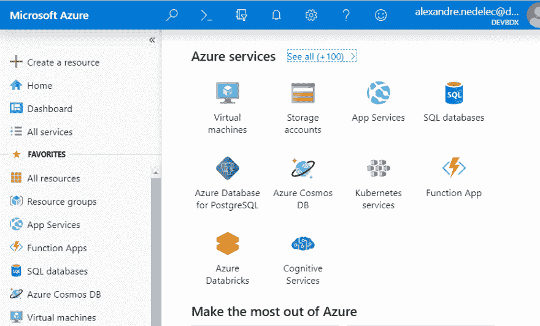
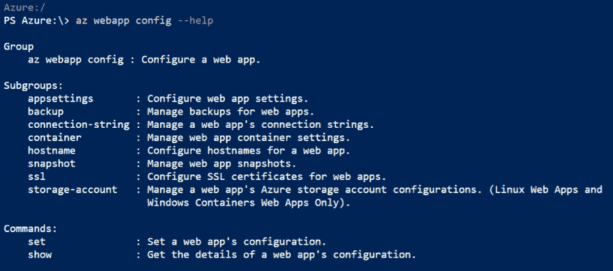
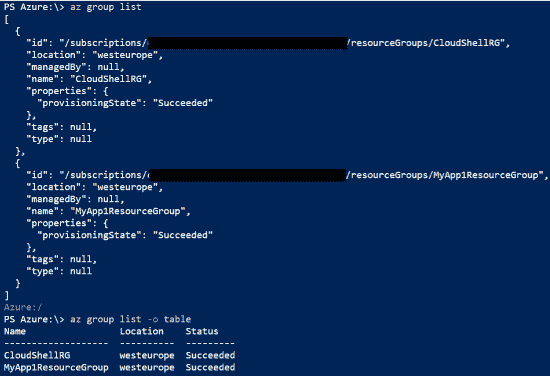
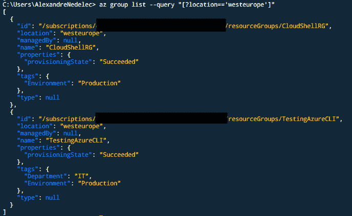
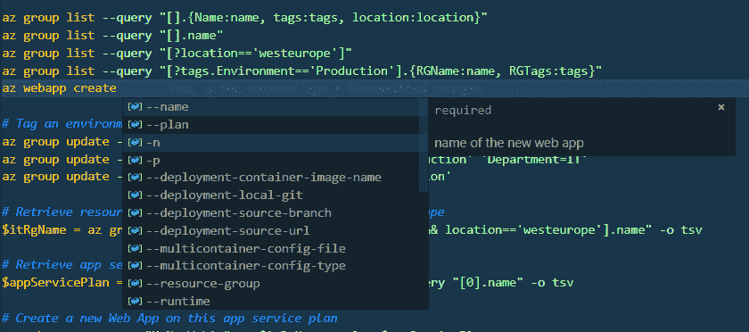
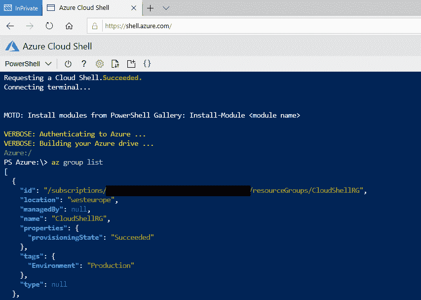
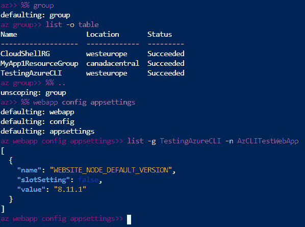

# 再见 Azure 门户，欢迎 Azure CLI

> 原文：<https://dev.to/techwatching/good-bye-azure-portal-welcome-azure-cli-oo2>

在这篇关于 Azure CLI 的文章中，我们将讨论:

*   管理 Azure 资源
*   Azure CLI 语法
*   深入了解 Azure CLI
*   在哪里使用 Azure CLI
*   Azure CLI 交互模式

Azure CLI 可以按照本页面上[的说明进行安装。](https://docs.microsoft.com/en-us/cli/azure/install-azure-cli?view=azure-cli-latest)

## 1 -管理 Azure 资源

Azure 资源可以通过不同的方式进行管理，但主要的有 [Azure Portal](https://portal.azure.com) 、 [Azure PowerShell](https://docs.microsoft.com/en-us/powershell/azure/) 和 [Azure CLI](https://docs.microsoft.com/en-us/cli/azure) 。如果你是 Azure 的新手，或者你正在创建你不熟悉的资源，有一个 GUI 来理解你在做什么总是很好的，Azure Portal 是正确的选择。

[](https://res.cloudinary.com/practicaldev/image/fetch/s--YO_3CQrB--/c_limit%2Cf_auto%2Cfl_progressive%2Cq_auto%2Cw_880/https://techwatching.dev/posimg/azurecli_portal_1.png)

然而，在门户中处理资源、从一个窗格移动到另一个窗格以总是执行相同类型的操作会很快变得有点麻烦。因此，如果你想更有效率，或者如果你更喜欢命令行，你会发现 Azure CLI 或 Azure PowerShell 是 Azure Portal 的非常好的替代品。两者都是跨平台工具(PowerShell Core 运行在 Windows、MacOS 和 Linux 上👍)并提供相同的功能来管理 Azure 资源。

直到最近，当我不使用 Azure Portal 时，我更倾向于使用 Azure PowerShell 而不是 Azure CLI，可能是因为我经常找到用 PowerShell 编写的我想做的事情的示例。但事实上，Azure PowerShell 中有很多命令，即使有了自动完成功能，我也不太擅长记住它们。所以我无法停止使用 Azure Portal😕。然而，最近当我开始发现 Azure CLI 的强大时，我终于回到了命令行:这是一个非常好用的工具，这是我接下来将尝试向您展示的。

## 2 - Azure CLI 语法

Azure CLI 语法很容易理解。例如，命令`az webapp list`将列出您当前登录的订阅中的 web 应用程序。

实际上，Azure CLI 命令具有以下结构:

*   代表 Azure 服务的**命令组**,它可以是子组的组合
*   一个**命令**，这是您想要在 group / Azure 服务上执行的操作
*   **参数**可选，是参数名称和值的列表

要在您的终端中登录您的 Azure 帐户，您必须执行 Azure CLI 命令`az login`，其中`az`是命令组，`login`是与组/服务`az`(意指 Azure)相关的命令。

在我们之前的例子中，`az webapp list`:

*   `az webapp`是由`az`及其子组`webapp`组成的指挥组吗
*   `list`是命令
*   这里没有争论

我们可以在这个命令中添加一些参数，比如`--resource-group`参数(或`-g`)来只列出特定资源组中的 WebApps，这样就变成了`az webapp list --resource-group 'myResourceGroupName'`

一些参数是全局可用的参数，这意味着可以用于每个命令。这就是显示命令帮助信息的`--help`参数的情况。下面的示例显示了使用`--help`参数可以更好地理解 Azure CLI 命令的结构。

[](https://res.cloudinary.com/practicaldev/image/fetch/s--icZ1jmHn--/c_limit%2Cf_auto%2Cfl_progressive%2Cq_auto%2Cw_880/https://techwatching.dev/posimg/azurecli_console_1.png)

一旦习惯了 Azure CLI 语法，它就比 Azure Portal 方便得多，你不必搜索你需要使用的 Azure PowerShell 命令。你只需要在你想工作的 Azure 服务中寻找可用的子组和命令(不要忘记使用`--help`)，你将很快完成工作。

## 3 -在 Azure CLI 中深度潜水

### 命令输出

[](https://res.cloudinary.com/practicaldev/image/fetch/s--8KOIvJmn--/c_limit%2Cf_auto%2Cfl_progressive%2Cq_auto%2Cw_880/https://techwatching.dev/posimg/azurecli_console_2.png)

默认情况下，Azure CLI 命令的输出格式是 json，但是通过指定输出参数(`--output`或`-o`)也可以使用其他格式，比如:`az group list -o table`。

[](https://res.cloudinary.com/practicaldev/image/fetch/s--uN85f-dQ--/c_limit%2Cf_auto%2Cfl_progressive%2Cq_auto%2Cw_880/https://techwatching.dev/posimg/azurecli_console_3.png)

💎可以使用`az configure`命令配置默认输出格式。此命令还允许您配置其他设置，例如为您的命令配置默认资源组。

### 使用变量

无论您选择在 Bash 还是 PowerShell 中运行命令，您都可以在 Azure CLI 中使用变量，只有创建变量的语法会根据您使用的命令行 Shell 而改变。

> 本文中的示例使用 PowerShell 语法。

```
$rgName = 'TestingAzureCLI'

# Create a new resource group
az group create -n $rgName -l westeurope

# Create an App Service plan with the Free tier
az appservice plan create -n $webAppName -g $rgName --sku FREE

# Show the App Service plan just created 
az appservice plan show -n $webAppName -g $rgName 

# Store the result of the show query in a PowerShell variable
$servicePlan = az appservice plan show -n $webAppName -g $rgName 
```

Enter fullscreen mode Exit fullscreen mode

### JMESPath

如果你不知道[jme path](http://jmespath.org/)，它是一种用于 JSON 的查询语言，允许从 JSON 文档或 Azure CLI 上下文中的 CLI 输出中提取和转换元素。

为了使用 JMESPath，您必须在 CLI 命令中添加参数`--query`，后跟您的 JMESPath 查询。让我们看一些例子。

对我的订阅执行的查询`az group list`返回以下 json :

```
[
  {
    "id": "/subscriptions/ ********-**** - ****-**** - ************ /resourceGroups/CloudShellRG",
    "location": "westeurope",
    "managedBy": null,
    "name": "CloudShellRG",
    "properties": {
      "provisioningState": "Succeeded"
    },
    "tags": {
      "Environment": "Production"
    },
    "type": null
  },
  {
    "id": "/subscriptions/ ********-**** - ****-**** - ************ /resourceGroups/MyApp1ResourceGroup",
    "location": "canadacentral",
    "managedBy": null,
    "name": "MyApp1ResourceGroup",
    "properties": {
      "provisioningState": "Succeeded"
    },
    "tags": {
      "Department": "RH",
      "Environment": "Dev"
    },
    "type": null
  },
  {
    "id": "/subscriptions/ ********-**** - ****-**** - ************ /resourceGroups/TestingAzureCLI",
    "location": "westeurope",
    "managedBy": null,
    "name": "TestingAzureCLI",
    "properties": {
      "provisioningState": "Succeeded"
    },
    "tags": {
      "Department": "IT",
      "Environment": "Production"
    },
    "type": null
  }
] 
```

Enter fullscreen mode Exit fullscreen mode

以下是一些更精确地查询资源组的 CLI 命令:

*   仅选择带有`az group list --query '[].name'` [](https://res.cloudinary.com/practicaldev/image/fetch/s--oRKTTnkH--/c_limit%2Cf_auto%2Cfl_progressive%2Cq_auto%2Cw_880/https://techwatching.dev/posimg/azurecli_jmespath_2.png) 的资源组名称

*   用`az group list --query "[?location=='westeurope']"` [](https://res.cloudinary.com/practicaldev/image/fetch/s--sOcCmqMS--/c_limit%2Cf_auto%2Cfl_progressive%2Cq_auto%2Cw_880/https://techwatching.dev/posimg/azurecli_jmespath_1.png) 过滤西欧的资源组

*   使用值为 Production 的环境标记过滤资源组，选择并重命名名称，并使用`az group list --query "[?tags.Environment=='Production'].{RGName:name, RGTags:tags}"` [](https://res.cloudinary.com/practicaldev/image/fetch/s--tNIJnOca--/c_limit%2Cf_auto%2Cfl_progressive%2Cq_auto%2Cw_880/https://techwatching.dev/posimg/azurecli_jmespath_3.png) 标记属性

💎JMESPath 不是 Azure CLI 独有的东西，它被用于不同的其他项目或工具，如 [AWS CLI](https://docs.aws.amazon.com/cli/latest/userguide/cli-usage-output.html#controlling-output-filter) 。

### 混合输出，变量和 JMESPath

一旦你理解了如何在 Azure CLI 中使用变量、命令输出和 JMESPath，你就可以用 CLI 命令混合管理 Azure 资源，这些 CLI 命令使用以前的 CLI 命令的结果，可以生成强大的脚本😃

假设我们想在位于西欧的订阅的现有应用服务计划中为 IT 部门创建一个 Web 应用。我们可以这样做:

```
# Retrieve resource group name of IT Department in West Europe
$itRgName = az group list --query "[?tags.Department=='IT' && location=='westeurope'].name" -o tsv

# Retrieve app service plan name in this resource group
$appServicePlan = az appservice plan list -g $itRgName --query "[0].name" -o tsv

# Create a new Web App on this app service plan
az webapp create -n "MyNewWebAp" -g $itRgName --plan $appServicePlan

# List all Web App in this resource group
az webapp list -g $itRgName --query "[].name" 
```

Enter fullscreen mode Exit fullscreen mode

这只是一个简单的例子，但你可以很容易地想象 Azure CLI 为你提供的所有可能性。

## 4 -在哪里使用 Azure CLI

所有这些都很棒，但我们还没有真正讨论我们可以在哪里使用 Azure CLI，让我们现在就开始吧！

### Bash vs PowerShell

我们简单地提到过你可以在 Bash 或者 PowerShell 中运行 Azure CLI，事实上你也可以在 Windows 命令提示符中运行它。尽管 Azure CLI 最初被设计成面向 bash 的，但它在 PowerShell 中工作得很好，所以它也是一个完美的有效选择。你选择什么命令行 shell 真的取决于你自己！

并且不要认为您将被限制于使用一种或另一种 shell，这取决于您正在工作的平台，因为 PowerShell 和 Bash 都可以在任何平台上使用(PowerShell 核心是跨平台的，Bash 可以通过 Linux 的 Windows 子系统在 Windows 中使用)。因此，我建议你使用你最熟悉的 shell 来使用 Azure CLI。

关于自动补全，简单提一下:目前只有 bash 支持 tab 补全，微软目前不打算增加对 PowerShell 的支持，但是对社区贡献开放。这没什么大不了的，但知道这一点很好，在这个问题上有一个 GitHub 问题。如果你没有使用 bash，并且 tab 补全对你真的很重要，那么 [Azure CLI 交互模式](https://docs.microsoft.com/en-us/cli/azure/interactive-azure-cli?view=azure-cli-latest)就是你正在寻找的(我们将在本文后面讨论)！

### Visual Studio 代码中的 Azure CLI

至于大多数 Azure 组件，在 vs 代码中有一个 Azure CLI 的扩展:Azure CLI Tools。

[](https://res.cloudinary.com/practicaldev/image/fetch/s--CoMPv5SL--/c_limit%2Cf_auto%2Cfl_progressive%2Cq_auto%2Cw_880/https://techwatching.dev/posimg/azurecli_vscode_1.png)

有了这个扩展，你可以创建 Azure CLI 剪贴簿，这些剪贴簿是带有`.azcli`扩展名的文件，你可以在其中智能感知你编写的 CLI 命令。

[](https://res.cloudinary.com/practicaldev/image/fetch/s--T3BO8gYx--/c_limit%2Cf_auto%2Cfl_progressive%2Cq_auto%2Cw_880/https://techwatching.dev/posimg/azurecli_vscode_3.png)

它还允许您在集成终端中运行命令，或者在并排编辑器中运行命令并显示其输出，如下面的屏幕截图所示。

[](https://res.cloudinary.com/practicaldev/image/fetch/s--8JA4JRDY--/c_limit%2Cf_auto%2Cfl_progressive%2Cq_auto%2Cw_880/https://techwatching.dev/posimg/azurecli_vscode_2.png)

### 蔚蓝色的云壳

我没有谈到 Azure CLI 的安装，但你可以在微软文档中找到你需要的一切。事实上，Azure Cloud Shell 为您提供了一种无需安装任何东西即可使用 Azure CLI 的方式。

如果我们引用文档:

> Azure 云外壳是一个交互式的、浏览器可访问的外壳，用于管理 Azure 资源

具体来说，你打开一个浏览器，进入[https://shell.azure.com](https://shell.azure.com)，登录你的 Azure 订阅，你就可以访问一个 shell (PowerShell 或 Bash)，它可以通过 Azure CLI 与你的订阅的所有资源进行交互。

[](https://res.cloudinary.com/practicaldev/image/fetch/s--fnpkI3pD--/c_limit%2Cf_auto%2Cfl_progressive%2Cq_auto%2Cw_880/https://techwatching.dev/posimg/azurecli_cloudshell_1.png)

Cloud Shell 本身是免费的，但是需要安装 Azure 文件共享，所以你会有固定的存储成本(非常低)。

Azure 云壳也可以通过 [Azure 账户扩展](https://marketplace.visualstudio.com/items?itemName=ms-vscode.azure-account)在 Azure 门户或者直接在你的 vs 代码集成终端中获得。

## 5 - Azure CLI 交互模式

我提到 Azure CLI 交互模式是一种自动完成的方式。事实上，它远不止这些，因为它还为您提供了命令描述、示例、资源名称的补全、上一个命令的 JMESPath...

要进入交互模式，你必须在终端输入`az interactive`。然后，您可以键入带有自动完成功能的 CLI 命令、您正在使用的命令的描述以及示例。此外，当您键入命令时，您会看到关于该命令参数的帮助。

[](https://res.cloudinary.com/practicaldev/image/fetch/s--ZIE1zH5K--/c_limit%2Cf_auto%2Cfl_progressive%2Cq_auto%2Cw_880/https://techwatching.dev/posimg/azurecli_interactive_1.png)

需要注意的一点是，您键入的命令仅限于一个命令组。默认情况下，它的作用域是`az`组，因此您不必在命令前键入`az`关键字。所以默认情况下，它只为你节省了两个字符，因为你将写`group list`而不是`az group list`。但是您可以将范围设置为 any 子组，如下例所示。

[](https://res.cloudinary.com/practicaldev/image/fetch/s--ad0yOzbW--/c_limit%2Cf_auto%2Cfl_progressive%2Cq_auto%2Cw_880/https://techwatching.dev/posimg/azurecli_interactive_2.png)

使用交互模式可以做的另一件非常好的事情是使用 JMESPath 语法查询前面命令的结果。假设我刚刚在交互模式下执行了命令`group list`。如果我想在这个命令的结果中只选择名字，我可以只输入`"?? [*].name"`。

[](https://res.cloudinary.com/practicaldev/image/fetch/s--HuN7rmsX--/c_limit%2Cf_auto%2Cfl_progressive%2Cq_auto%2Cw_880/https://techwatching.dev/posimg/azurecli_interactive_3.png)

正如您在上面的示例中所看到的，您甚至可以在前一个命令中使用 JMESPath 查询作为下一个命令的参数。这里我们列出了 TestingAzureCLI 组的所有资源。

💎在[https://shell.azure.com/](https://shell.azure.com/)上使用 Azure 交互模式有时会有点慢，所以如果你遇到这种情况，我建议你使用 vs 代码集成终端(如果你想使用 Azure 云 Shell)或任何你想要的终端(如果你安装了 Azure CLI)而不是浏览器。

💎如果你喜欢交互式 CLI，你也可以看看 [AzBrowse](https://github.com/lawrencegripper/azbrowse) 这是一个不错的社区项目。

## 得出结论

即使这篇文章的标题建议对 Azure Portal 说再见，当你开始使用 Azure CLI 时，你不会真的完全停止使用 Azure Portal。你总是需要一个 GUI 来完成一些任务或者更好的可视化事物。然而，你可能会减少使用 Azure Portal 的频率，因为你会发现自己使用 Azure CLI 会更有效率，并且会喜欢能够编写所有✨.的脚本

关于 Azure CLI 还有很多要说的，但那已经是一篇很长的文章了，所以最好的事情是你自己尝试一下！